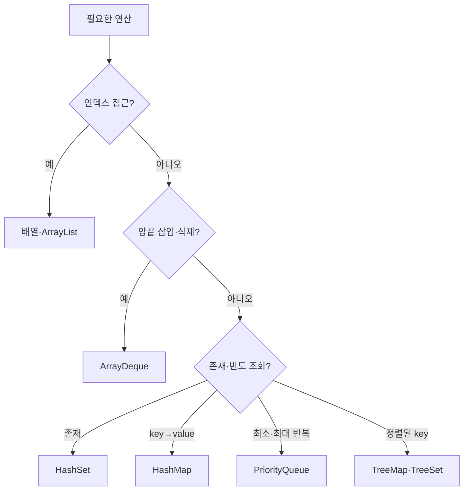
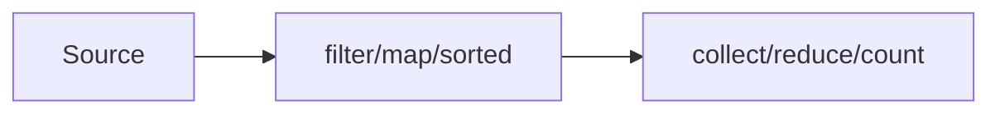

# Java 컬렉션, Stream, Collector, Comparator

## 1. 자료구조 선택



## 2. ArrayList

```java
List<Integer> list = new ArrayList<>();

list.add(10);
list.add(20);
list.add(1, 15);
int value = list.get(0);
list.set(0, 99);
int removed = list.remove(list.size() - 1);
boolean exists = list.contains(20);
int size = list.size();
```

| 연산 | 복잡도 |
|---|---:|
| 끝 추가 | 분할 상환 `O(1)` |
| 인덱스 조회/수정 | `O(1)` |
| 중간 삽입/삭제 | `O(N)` |
| 값 검색 | `O(N)` |

`remove(1)`은 인덱스 1을 삭제한다. 값 `1`을 삭제하려면 다음처럼 쓴다.

```java
list.remove(Integer.valueOf(1));
```

### 배열, `ArrayList`, `LinkedList` 비교

세 자료구조는 저장 방식부터 다르다.

```text
배열·ArrayList: 원소가 인덱스 순서대로 배열에 저장됨

index       0      1      2      3
          [ 10 ][ 20 ][ 30 ][ 40 ]

LinkedList: 값과 이전·다음 노드의 참조를 가진 노드가 연결됨

null ← [10] ⇄ [20] ⇄ [30] ⇄ [40] → null
```

Java의 `ArrayList`는 크기를 자동으로 관리하는 **배열 기반 리스트**이고,
`LinkedList`는 이전 노드와 다음 노드를 모두 가리키는 **이중 연결 리스트**다.

| 연산 | 기본 배열 | `ArrayList` | `LinkedList` |
|---|---:|---:|---:|
| 크기 확인 | `O(1)` | `O(1)` | `O(1)` |
| 인덱스 조회·수정 | `O(1)` | `O(1)` | `O(N)` |
| 값 검색 | `O(N)` | `O(N)` | `O(N)` |
| 끝 추가 | 직접 크기 관리 | 분할 상환 `O(1)` | `O(1)` |
| 앞 추가 | `O(N)` | `O(N)` | `O(1)` |
| 마지막 삭제 | 논리적으로 `O(1)` | `O(1)` | `O(1)` |
| 앞 삭제 | `O(N)` | `O(N)` | `O(1)` |
| 인덱스로 중간 삽입·삭제 | `O(N)` | `O(N)` | `O(N)` |
| 위치를 이미 아는 노드의 삽입·삭제 | 해당 없음 | `O(N)` | `O(1)` |
| 전체 순회 | `O(N)` | `O(N)` | `O(N)` |

기본 배열은 길이가 고정되어 있으므로 엄밀히 말해 추가·삭제 연산을 제공하지 않는다.
표의 배열 복잡도는 사용 중인 원소 개수를 별도로 관리하면서 직접 삽입·삭제한다고 가정한 값이다.

#### 배열과 `ArrayList`의 인덱스 접근이 `O(1)`인 이유

배열은 시작 위치와 인덱스를 이용해 원하는 원소의 위치를 바로 계산할 수 있다.

```text
원소 위치 = 배열 시작 위치 + 인덱스 × 원소 한 칸의 크기
```

```java
int[] array = {10, 20, 30};
int arrayValue = array[2]; // O(1)

List<Integer> arrayList = new ArrayList<>(List.of(10, 20, 30));
int listValue = arrayList.get(2); // O(1)
```

`ArrayList`도 내부 배열의 해당 인덱스를 바로 조회한다. 반면 `LinkedList`는 노드의 연결을
따라가야 하므로 `get(index)`와 `set(index, value)`가 `O(N)`이다.

```text
get(2): head → [10] → [20] → [30]
                                  ↑ index 2
```

반복문에서 `LinkedList.get(i)`를 사용하면 특히 주의한다.

```java
// get(i)가 매번 O(N)이므로 전체가 O(N²)이 될 수 있다.
for (int i = 0; i < linkedList.size(); i++) {
    System.out.println(linkedList.get(i));
}

// Iterator를 사용하는 향상된 for문 순회는 전체 O(N)이다.
for (int value : linkedList) {
    System.out.println(value);
}
```

#### `ArrayList.add()`가 분할 상환 `O(1)`인 이유

내부 배열에 빈 공간이 있으면 다음 칸에 바로 저장하므로 `O(1)`이다.
공간이 부족할 때만 더 큰 배열을 만들고 기존 원소를 모두 복사하므로 그 한 번은 `O(N)`이다.

```text
빈 공간 있음: [10][20][  ][  ] → 다음 칸에 바로 추가

공간 부족:    [10][20]
                  ↓ 전체 복사 O(N)
              [10][20][  ][  ]
```

용량을 매번 한 칸만 늘리지 않고 기하급수적으로 늘리기 때문에 확장은 가끔 발생한다.
정확한 증가 비율은 구현 세부사항이며 코드에서 의존하면 안 된다.

```text
복사 비용의 합: 1 + 2 + 4 + 8 + ... < 2N
N번 추가의 전체 비용: O(N)
추가 한 번의 평균 비용: O(N) / N = 분할 상환 O(1)
```

따라서 끝 추가의 복잡도는 다음처럼 구분한다.

```text
일반적인 한 번: O(1)
배열 확장이 발생한 한 번: O(N)
여러 번의 추가를 평균 낸 비용: 분할 상환 O(1)
```

#### 중간 삽입·삭제가 배열 기반에서 `O(N)`인 이유

배열이나 `ArrayList`의 중간에 삽입하려면 뒤쪽 원소들을 한 칸씩 이동해야 한다.

```text
[10][20][30][40]의 index 1에 15 삽입

[10][20][30][40]
        └───────→ 뒤 원소 이동
[10][15][20][30][40]
```

삭제할 때도 빈칸을 없애기 위해 뒤 원소들을 앞으로 당겨야 한다. 최악에는 거의 모든 원소를
이동하므로 `O(N)`이다. Java 구현은 이런 이동에 내부적으로 배열 복사를 활용할 수 있지만,
이동하는 원소 수가 `N`에 비례한다는 점은 같다.

#### 연결 리스트의 삽입·삭제가 `O(1)`이라는 말의 조건

연결 리스트는 **대상 노드의 위치를 이미 알고 있을 때만** 연결 변경이 `O(1)`이다.

```text
삭제할 [20] 노드를 이미 알고 있음

[10] ⇄ [20] ⇄ [30]  →  [10] ⇄ [30]
```

하지만 인덱스만 주어졌다면 먼저 그 노드를 찾아가야 한다.

```java
linkedList.remove(500);
```

```text
노드 탐색 O(N) + 연결 변경 O(1) = 전체 O(N)
```

따라서 다음 연산은 `LinkedList`에서도 `O(N)`이다.

```java
linkedList.get(index);
linkedList.set(index, value);
linkedList.add(index, value);
linkedList.remove(index);
```

Java의 `LinkedList`는 내부 노드를 외부에 직접 제공하지 않는다. 이미 원하는 위치까지 이동한
`ListIterator`를 가지고 있다면 그 위치의 삽입·삭제는 `O(1)`이지만, 반복자를 해당 위치까지
이동하는 비용은 별도로 계산해야 한다.

#### 시간 복잡도가 같아도 배열이 더 가벼운 이유

`int[]`는 프리미티브 값을 배열 안에 직접 저장한다.

```text
int[]: [10][20][30]
```

`ArrayList<Integer>`는 내부 `Object[]`에 `Integer` 객체를 가리키는 참조를 저장한다.
`LinkedList<Integer>`는 여기에 각 노드 객체와 이전·다음 참조까지 필요하다.

```text
ArrayList<Integer>: [참조][참조][참조]
                       ↓     ↓     ↓
                      10    20    30

LinkedList<Integer>: [이전 참조 | 값 참조 | 다음 참조] × N
```

그래서 세 자료구조의 순회가 모두 `O(N)`이어도 실제 메모리 사용량과 실행 시간은 다를 수 있다.

- `int[]`는 박싱이 없고 메모리 밀도가 높다.
- `ArrayList<Integer>`는 `Integer` 박싱과 참조 접근 비용이 있다.
- `LinkedList<Integer>`는 노드 객체와 두 연결 참조가 추가로 필요하다.
- 배열 기반 구조는 인접한 원소를 연속적으로 읽어 캐시 효율이 좋은 편이다.

#### 코딩테스트에서의 선택 기준

| 필요한 기능 | 우선 고려할 자료구조 |
|---|---|
| 크기가 고정된 값, 좌표, DP, 방문 배열 | 기본 배열 |
| 인덱스 접근과 끝 추가 | `ArrayList` |
| 스택·큐·양끝 삽입과 삭제 | `ArrayDeque` |
| 중간 노드 자체를 직접 연결·분리하는 문제 | 직접 구현한 연결 리스트 |

Java의 `LinkedList`는 `List`와 `Deque`를 모두 구현하지만, 코딩테스트의 일반적인 스택·큐
용도에는 다음 절의 `ArrayDeque`가 보통 더 적합하다. 연결 리스트처럼 양끝 연산이 빠르면서
노드 객체와 연결 참조가 필요 없기 때문이다.

## 3. ArrayDeque

스택과 큐 모두에 권장한다.

```java
Deque<Integer> deque = new ArrayDeque<>();

deque.addFirst(1);
deque.addLast(2);
int front = deque.peekFirst();
int back = deque.peekLast();
int removedFront = deque.removeFirst();
int removedBack = deque.removeLast();
```

큐:

```java
deque.offerLast(value);
Integer current = deque.pollFirst();
```

스택:

```java
deque.addLast(value);
Integer top = deque.pollLast();
```

`ArrayDeque`는 `null`을 허용하지 않는다. 빈 덱에서 `poll`/`peek`는 `null`, `remove`/`get`은 예외를 발생시킨다.

## 4. HashSet과 TreeSet

```java
Set<Integer> set = new HashSet<>();

set.add(3);
set.remove(3);
boolean exists = set.contains(3);
int size = set.size();
```

`HashSet`의 추가·삭제·조회는 평균 `O(1)`이고 순서를 보장하지 않는다.

```java
NavigableSet<Integer> sorted = new TreeSet<>();
sorted.add(10);
sorted.add(30);

Integer lower = sorted.lower(20);   // < 20
Integer floor = sorted.floor(20);   // <= 20
Integer ceiling = sorted.ceiling(20); // >= 20
Integer higher = sorted.higher(20); // > 20
```

`TreeSet`은 정렬을 유지하며 주요 연산이 `O(log N)`이다.

## 5. HashMap

```java
Map<String, Integer> count = new HashMap<>();

count.put("apple", 1);
int value = count.get("apple");
int missingSafe = count.getOrDefault("banana", 0);
boolean keyExists = count.containsKey("apple");
count.remove("apple");
```

빈도 계산:

```java
count.put(word, count.getOrDefault(word, 0) + 1);
```

```java
count.merge(word, 1, Integer::sum);
```

그룹 만들기:

```java
Map<String, List<String>> groups = new HashMap<>();
groups.computeIfAbsent(key, ignored -> new ArrayList<>())
        .add(value);
```

순회:

```java
for (Map.Entry<String, Integer> entry : count.entrySet()) {
    String key = entry.getKey();
    int frequency = entry.getValue();
}
```

평균 조회·삽입·삭제 `O(1)`. 순회 순서에 의존하면 안 된다.

## 6. TreeMap

```java
NavigableMap<Integer, String> map = new TreeMap<>();
map.put(10, "a");
map.put(30, "b");

Map.Entry<Integer, String> floor = map.floorEntry(20);
Map.Entry<Integer, String> ceiling = map.ceilingEntry(20);
```

키 정렬과 근접 키 쿼리가 필요할 때 쓴다. 연산은 `O(log N)`.

## 7. PriorityQueue

Java의 기본 `PriorityQueue`는 최소 힙이다.

```java
PriorityQueue<Integer> minHeap = new PriorityQueue<>();
minHeap.offer(3);
minHeap.offer(1);
minHeap.offer(2);

int min = minHeap.peek(); // 1
int removed = minHeap.poll();
```

최대 힙:

```java
PriorityQueue<Integer> maxHeap = new PriorityQueue<>(
        Comparator.reverseOrder()
);
```

주요 복잡도:

| 연산 | 복잡도 |
|---|---:|
| `offer`, `poll` | `O(log N)` |
| `peek`, `size` | `O(1)` |
| `contains`, `remove(Object)` | `O(N)` |

반복자로 순회할 때 정렬 순서를 보장하지 않는다. 정렬 순서가 필요하면 반복해서 `poll()`한다.

## 8. Comparator 기본

Comparator가 음수를 반환하면 첫 번째 인자가 앞에 온다.

```java
Comparator<Integer> ascending = Integer::compare;
Comparator<Integer> descending = (a, b) -> Integer.compare(b, a);
```

객체 다중 기준:

```java
record Person(String name, int age, int score) { }

Comparator<Person> order = Comparator
        .comparingInt(Person::score)
        .reversed()
        .thenComparingInt(Person::age)
        .thenComparing(Person::name);
```

해석:

```text
score 내림차순
→ 같으면 age 오름차순
→ 같으면 name 사전순
```

`reversed()`가 체인 전체에 적용되는 위치를 주의한다.

```java
Comparator<Person> byScoreDescThenAgeAsc =
        Comparator.comparingInt(Person::score)
                .reversed()
                .thenComparingInt(Person::age);
```

## 9. Comparable과 Comparator

- `Comparable<T>`: 타입 자체의 자연 순서 하나를 정의한다.
- `Comparator<T>`: 문제마다 필요한 외부 정렬 기준을 정의한다.

코딩테스트에서는 정렬 기준이 문제별로 달라 `Comparator`가 더 자주 편리하다.

## 10. Stream 처리 구조

Stream은 데이터 저장소가 아니라 연산 파이프라인이다.



- 중간 연산: 새 Stream 반환, 지연 실행
- 최종 연산: 결과 생성, 파이프라인 실행

```java
List<Integer> result = numbers.stream()
        .filter(x -> x % 2 == 0)
        .map(x -> x * x)
        .sorted()
        .toList();
```

## 11. 자주 쓰는 Stream 연산

```java
long count = values.stream().filter(predicate).count();

boolean any = values.stream().anyMatch(predicate);
boolean all = values.stream().allMatch(predicate);

int sum = values.stream()
        .mapToInt(Integer::intValue)
        .sum();

int max = values.stream()
        .mapToInt(Integer::intValue)
        .max()
        .orElse(0);
```

배열:

```java
int sum = Arrays.stream(array).sum();

int[] doubled = Arrays.stream(array)
        .map(x -> x * 2)
        .toArray();
```

`Stream<Integer>`보다 `IntStream`이 박싱을 줄인다.

## 12. reduce

여러 값을 하나로 합친다.

```java
int sum = values.stream()
        .reduce(0, Integer::sum);

int product = values.stream()
        .reduce(1, (a, b) -> a * b);
```

결합 연산은 병렬 처리까지 고려하면 결합 법칙을 만족해야 한다. 코딩테스트에서는 단순 반복문이 상태와 오버플로를 더 명확히 보여주는 경우가 많다.

## 13. Collectors

### 리스트와 집합

```java
List<String> list = stream.collect(Collectors.toList());
Set<String> set = stream.collect(Collectors.toSet());
```

Java 16+의 `stream.toList()`가 반환하는 리스트는 수정 불가능하다. 수정해야 하면 다음처럼 만든다.

```java
List<String> mutable = stream.collect(
        Collectors.toCollection(ArrayList::new)
);
```

### joining

스트림의 문자열을 하나의 문자열로 연결한다.

```java
List<String> words = List.of("apple", "banana", "cherry");

String joined = words.stream()
        .collect(Collectors.joining(",", "[", "]"));

System.out.println(joined); // [apple,banana,cherry]
```

세 인자는 다음 역할을 한다.

```java
Collectors.joining(
        ",", // delimiter: 원소 사이의 구분자
        "[", // prefix: 전체 결과의 시작
        "]"  // suffix: 전체 결과의 끝
)
```

```text
prefix + 첫 원소 + delimiter + 다음 원소 + ... + suffix

"[" + "apple" + "," + "banana" + "," + "cherry" + "]"
= "[apple,banana,cherry]"
```

구분자는 원소 **사이**에만 들어가므로 첫 원소 앞이나 마지막 원소 뒤에는 붙지 않는다.
내부 동작은 개념적으로 `StringJoiner`를 사용하는 다음 코드와 비슷하다.

```java
StringJoiner joiner = new StringJoiner(",", "[", "]");

for (String word : words) {
    joiner.add(word);
}

String joined = joiner.toString();
```

`collect()` 관점에서는 결과 컨테이너를 만들고, 각 문자열을 누적하고, 병렬 처리된 부분 결과가
있다면 결합한 뒤 최종 `String`으로 변환한다.

```text
StringJoiner 생성 → 각 원소 add → 부분 결과 merge → toString
```

오버로드별 결과:

```java
String noDelimiter = words.stream()
        .collect(Collectors.joining());
// applebananacherry

String delimiterOnly = words.stream()
        .collect(Collectors.joining(", "));
// apple, banana, cherry

String withWrapper = words.stream()
        .collect(Collectors.joining(", ", "[", "]"));
// [apple, banana, cherry]
```

빈 스트림에서는 원소와 구분자 없이 접두사와 접미사만 남는다.

```java
String empty = Stream.<String>empty()
        .collect(Collectors.joining(",", "[", "]"));
// []

String single = Stream.of("apple")
        .collect(Collectors.joining(",", "[", "]"));
// [apple]
```

`joining()`은 `CharSequence` 계열의 원소를 연결하므로 숫자나 객체라면 먼저 문자열로 변환한다.

```java
String joinedNumbers = numbers.stream()
        .map(String::valueOf)
        .collect(Collectors.joining(", ", "[", "]"));
```

이미 문자열 컬렉션만 있고 중간 연산이 필요 없다면 `String.join()`도 사용할 수 있다.

```java
String joined = String.join(", ", words);
```

필터링이나 변환을 함께 수행할 때는 `Collectors.joining()`이 자연스럽다.

```java
String result = words.stream()
        .filter(word -> word.length() >= 6)
        .map(String::toUpperCase)
        .collect(Collectors.joining(", ", "[", "]"));
// [BANANA, CHERRY]
```

### groupingBy

임의의 기준으로 원소를 여러 그룹으로 분류한다. 첫 번째 인자인 분류 함수가 각 원소에서
`Map`의 키를 만든다.

```java
List<String> words = List.of("a", "to", "be", "cat", "dog");

Map<Integer, List<String>> byLength = words.stream()
        .collect(Collectors.groupingBy(String::length));
```

```text
"a"   → key 1
"to"  → key 2
"be"  → key 2
"cat" → key 3
"dog" → key 3

결과:
1 → ["a"]
2 → ["to", "be"]
3 → ["cat", "dog"]
```

`String::length`는 `word -> word.length()`와 같다. 기본 `groupingBy(classifier)`는 개념적으로
각 키에 해당하는 원소를 리스트로 모으는 다음 코드와 비슷하다.

```java
Map<Integer, List<String>> byLength = new HashMap<>();

for (String word : words) {
    int key = word.length();

    byLength.computeIfAbsent(
            key,
            ignored -> new ArrayList<>()
    ).add(word);
}
```

#### downstream Collector

두 번째 인자인 downstream Collector는 각 그룹 안의 원소를 어떻게 처리할지 결정한다.

```java
Collectors.groupingBy(
        classifier, // 원소에서 그룹의 key 생성
        downstream  // 각 그룹의 원소를 처리
)
```

두 번째 인자를 생략한 형태는 사실상 `Collectors.toList()`를 사용한 것과 같다.

```java
Collectors.groupingBy(
        String::length,
        Collectors.toList()
)
```

단어별 빈도:

```java
Map<String, Long> frequency = words.stream()
        .collect(Collectors.groupingBy(
                Function.identity(),
                Collectors.counting()
        ));
```

`Function.identity()`는 입력값을 그대로 돌려주는 `word -> word`와 같다.
`counting()`의 결과는 `Long`이므로 결과 타입도 `Map<String, Long>`이다.

```text
["apple", "banana", "apple", "apple"]

apple  → 3L
banana → 1L
```

길이별 단어 개수:

```java
Map<Integer, Long> countByLength = words.stream()
        .collect(Collectors.groupingBy(
                String::length,
                Collectors.counting()
        ));
```

길이별 중복 없는 단어:

```java
Map<Integer, Set<String>> uniqueByLength = words.stream()
        .collect(Collectors.groupingBy(
                String::length,
                Collectors.toSet()
        ));
```

그룹 안의 값을 변환한 뒤 모으려면 `mapping()`을 downstream으로 사용한다.

```java
Map<Integer, List<String>> upperByLength = words.stream()
        .collect(Collectors.groupingBy(
                String::length,
                Collectors.mapping(
                        String::toUpperCase,
                        Collectors.toList()
                )
        ));
```

```text
길이로 분류 → 그룹 안에서 대문자로 변환 → List로 수집
```

### partitioningBy

조건 결과가 참 또는 거짓인 두 그룹으로만 나눌 때 사용한다.

```java
List<Integer> numbers = List.of(1, 2, 3, 4, 5, 6);

Map<Boolean, List<Integer>> parity = numbers.stream()
        .collect(Collectors.partitioningBy(x -> x % 2 == 0));
```

```text
false → [1, 3, 5]
true  → [2, 4, 6]
```

`partitioningBy()`는 한쪽에 원소가 없더라도 `true`와 `false` 키를 모두 만든다.

```java
List<Integer> evens = List.of(2, 4, 6);

Map<Boolean, List<Integer>> result = evens.stream()
        .collect(Collectors.partitioningBy(x -> x % 2 == 0));

// false → []
// true  → [2, 4, 6]
```

`groupingBy(x -> x % 2 == 0)`도 비슷해 보이지만 원소가 없는 그룹의 키는 만들어지지 않을 수 있다.
조건이 정확히 두 그룹이라면 `partitioningBy()`가 의도를 더 명확히 나타낸다.

downstream Collector를 이용해 참·거짓 그룹별 집계도 할 수 있다.

```java
Map<Boolean, Long> countByParity = numbers.stream()
        .collect(Collectors.partitioningBy(
                x -> x % 2 == 0,
                Collectors.counting()
        ));

// false → 3L
// true  → 3L
```

### toMap

각 스트림 원소에서 키와 값을 만들어 키마다 최종 값 하나를 저장한다.

```java
Map<String, Integer> lengthByWord = words.stream()
        .collect(Collectors.toMap(
                Function.identity(),
                String::length,
                Math::max
        ));
```

세 인자의 역할:

```java
Collectors.toMap(
        keyMapper,     // 원소 T에서 key K 생성
        valueMapper,   // 원소 T에서 value V 생성
        mergeFunction // 같은 key가 나왔을 때 (V, V)를 V 하나로 병합
)
```

```text
Stream<T>

keyMapper:     T → K
valueMapper:   T → V
mergeFunction: (기존 V, 새로운 V) → 최종 V

결과: Map<K, V>
```

#### 세 번째 병합 함수가 필요한 이유

`Map`에는 같은 키를 두 번 저장할 수 없다. 병합 함수가 없는 두 인자 버전에서 중복 키가
나오면 `IllegalStateException`이 발생한다.

```java
List<String> words = List.of("cat", "car");

// 두 단어 모두 길이 3을 key로 생성하므로 예외 발생
Map<Integer, String> wordByLength = words.stream()
        .collect(Collectors.toMap(
                String::length,
                Function.identity()
        ));
```

병합 함수를 제공하면 같은 키에서 어떤 값을 남길지 결정할 수 있다.

```java
Map<Integer, String> wordByLength = words.stream()
        .collect(Collectors.toMap(
                String::length,
                Function.identity(),
                (oldValue, newValue) -> oldValue
        ));
```

```text
"cat" → key 3, value "cat"
"car" → key 3, value "car"

key 3 충돌
→ mergeFunction("cat", "car")
→ "cat" 반환
→ 최종 3="cat"
```

처음 예제처럼 단어 자체를 키로, 길이를 값으로 사용하면 같은 키의 길이는 항상 같다.
따라서 `Math::max`는 최대 길이를 계산한다기보다 중복 단어가 나왔을 때 예외를 피하는
병합 정책에 가깝다.

```java
Map<String, Integer> lengthByWord = words.stream()
        .collect(Collectors.toMap(
                Function.identity(),
                String::length,
                (oldLength, newLength) -> oldLength
        ));
```

#### 병합 함수 예시

먼저 나온 값 유지:

```java
(oldValue, newValue) -> oldValue
```

나중에 나온 값으로 덮어쓰기:

```java
(oldValue, newValue) -> newValue
```

이 두 정책에서 “먼저·나중”이라는 의미를 명확히 사용하려면 순차 스트림의 encounter order를
기준으로 생각하는 것이 안전하다.

같은 이름의 최고 점수:

```java
record Score(String name, int value) {}

Map<String, Integer> maxScoreByName = scores.stream()
        .collect(Collectors.toMap(
                Score::name,
                Score::value,
                Math::max
        ));
```

같은 이름의 최저 점수:

```java
Map<String, Integer> minScoreByName = scores.stream()
        .collect(Collectors.toMap(
                Score::name,
                Score::value,
                Math::min
        ));
```

같은 키의 값 합산:

```java
Map<String, Integer> frequency = words.stream()
        .collect(Collectors.toMap(
                Function.identity(),
                ignored -> 1,
                Integer::sum
        ));
```

```text
"apple" 첫 등장  → 1
"apple" 두 번째 → Integer.sum(1, 1) = 2
"apple" 세 번째 → Integer.sum(2, 1) = 3
```

빈도 계산은 다음 두 방법이 모두 가능하다.

```java
// 결과: Map<String, Long>
Collectors.groupingBy(
        Function.identity(),
        Collectors.counting()
);

// 결과: Map<String, Integer>
Collectors.toMap(
        Function.identity(),
        ignored -> 1,
        Integer::sum
);
```

문자열 이어 붙이기:

```java
Map<String, String> addressesByName = people.stream()
        .collect(Collectors.toMap(
                Person::name,
                Person::address,
                (oldAddress, newAddress) ->
                        oldAddress + ", " + newAddress
        ));
```

같은 키에서 우선순위가 높은 객체 하나 선택:

```java
record Product(String code, int price) {}

Map<String, Product> mostExpensiveByCode = products.stream()
        .collect(Collectors.toMap(
                Product::code,
                Function.identity(),
                BinaryOperator.maxBy(
                        Comparator.comparingInt(Product::price)
                )
        ));
```

람다로 직접 쓰면 다음과 같다.

```java
(oldProduct, newProduct) ->
        oldProduct.price() >= newProduct.price()
                ? oldProduct
                : newProduct
```

리스트 병합도 가능하다.

```java
Map<String, List<String>> namesByDepartment = employees.stream()
        .collect(Collectors.toMap(
                Employee::department,
                employee -> new ArrayList<>(
                        List.of(employee.name())
                ),
                (oldList, newList) -> {
                    oldList.addAll(newList);
                    return oldList;
                }
        ));
```

다만 키별로 여러 원소를 모으는 목적이라면 `toMap()`보다 `groupingBy()`가 의도를 더 잘
표현하는 경우가 많다.

```java
Map<String, List<String>> namesByDepartment = employees.stream()
        .collect(Collectors.groupingBy(
                Employee::department,
                Collectors.mapping(
                        Employee::name,
                        Collectors.toList()
                )
        ));
```

#### 반환할 Map 종류 지정

기본 Collector가 반환하는 구체적인 `Map` 구현이나 순회 순서에 의존하지 않는다.
입력 순서를 유지하려면 `toMap()`의 네 번째 인자로 `LinkedHashMap` 생성 방법을 전달한다.

```java
Map<String, Integer> insertionOrdered = words.stream()
        .collect(Collectors.toMap(
                Function.identity(),
                String::length,
                (oldValue, newValue) -> oldValue,
                LinkedHashMap::new
        ));
```

키 정렬이 필요하면 `TreeMap`을 사용한다.

```java
Map<String, Integer> keySorted = words.stream()
        .collect(Collectors.toMap(
                Function.identity(),
                String::length,
                (oldValue, newValue) -> oldValue,
                TreeMap::new
        ));
```

`groupingBy()`에도 `Map` 생성 방법을 지정할 수 있다.

```java
Map<Integer, List<String>> sortedByLength = words.stream()
        .collect(Collectors.groupingBy(
                String::length,
                TreeMap::new,
                Collectors.toList()
        ));
```

#### Collector 선택 기준

```text
같은 키의 모든 원소가 필요함
→ groupingBy

조건이 true/false인 두 그룹만 필요함
→ partitioningBy

키마다 최종 값 하나만 필요함
→ toMap

중복 키가 절대 없음
→ toMap(keyMapper, valueMapper)

중복 키가 있을 수 있음
→ toMap(keyMapper, valueMapper, mergeFunction)
```

## 14. Stream을 쓰면 좋은 경우

- 단순 변환·필터·그룹화가 한눈에 읽힌다.
- 정렬 기준과 결과 변환이 짧다.
- 입력 크기가 작고 상수 비용이 중요하지 않다.

## 15. 반복문이 더 좋은 경우

- 조기 종료와 복잡한 상태 변경이 많다.
- BFS/DFS/DP처럼 인덱스와 상태가 핵심이다.
- 프리미티브 박싱과 중간 객체를 피하고 싶다.
- 디버깅 단계가 명확해야 한다.

Stream은 알고리즘을 대체하지 않는다. `O(N²)` 로직을 Stream으로 쓰더라도 `O(N²)`다.

## 16. 컬렉션 변환

```java
List<Integer> list = Arrays.stream(array)
        .boxed()
        .toList();

int[] array = list.stream()
        .mapToInt(Integer::intValue)
        .toArray();

List<String> words = new ArrayList<>(map.keySet());
```

`Arrays.asList(new int[]{1,2,3})`은 원소 하나인 `List<int[]>`가 된다.

## 17. 자료구조 실수 체크리스트

```text
- HashMap/HashSet 순회 순서에 의존하지 않았는가?
- ArrayList 앞쪽 삭제를 큐처럼 반복하지 않았는가?
- 빈 큐에서 poll/peek의 null을 처리했는가?
- PriorityQueue가 최소 힙임을 확인했는가?
- Comparator에서 뺄셈으로 비교해 오버플로하지 않는가?
- toMap의 중복 키 병합 함수를 넣었는가?
- stream.toList() 결과를 수정하려 하지 않는가?
- Stream 때문에 핵심 상태 변화가 더 숨겨지지 않는가?
```
