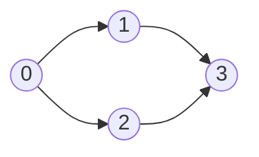
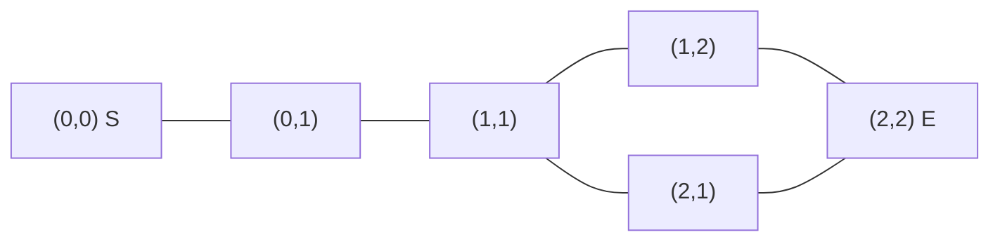
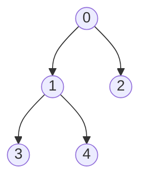
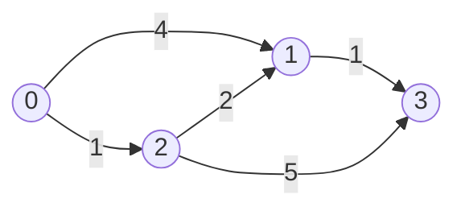

# Java 알고리즘 템플릿

템플릿을 외우기보다 각 변수의 의미와 불변식을 이해한다. 실행 가능한 통합 예제는 [CodingTestTemplates.java](../examples/java/CodingTestTemplates.java)에 있다.

## 이 문서를 문제와 연결해서 읽는 방법

알고리즘 코드는 문제 상황을 정점, 상태, 선택, 구간 같은 수학적 대상으로 바꾼 결과다.
따라서 템플릿을 보기 전에 다음 질문을 순서대로 던진다.

```text
1. 문제에서 하나의 상태는 무엇인가?
2. 한 상태에서 다음 상태로 어떻게 이동하는가?
3. 문제에서 요구하는 것은 탐색, 최단 거리, 순서, 최댓값, 구간 합 중 무엇인가?
4. 모든 후보를 직접 확인하면 얼마나 느린가?
5. 정렬, 동일한 이동 비용, 중복 부분 문제 같은 추가 성질이 있는가?
6. 그 성질을 이용하는 자료구조와 알고리즘은 무엇인가?
```

예를 들어 “미로에서 출구까지 최소 이동 횟수”는 다음처럼 번역한다.

```text
상태       → 현재 칸 (row, col)
이동       → 상하좌우의 빈칸
이동 비용  → 항상 1
목표       → 시작 칸에서 출구까지의 최단 거리
선택       → 같은 비용의 상태를 거리 순서로 처리하는 BFS
```

각 절에서는 다음 흐름으로 코드와 문제를 연결한다.

```text
문제 상황
→ 단순한 방법의 한계
→ 알고리즘을 선택하는 이유
→ 문제 입력을 코드의 변수와 자료구조로 변환
→ 알고리즘 실행
→ 반환값에서 문제의 정답을 추출
```

## 1. lower bound

### 문제 상황에서 시작하기

정렬된 상품 가격이 있고, 고객이 원하는 최소 가격 이상인 첫 상품을 찾아야 한다고 하자.

```text
가격: [1_000, 1_500, 1_500, 2_300, 4_000]
조건: 가격이 1_500 이상인 첫 상품
정답: index 1
```

앞에서부터 찾으면 한 번의 질의에 `O(N)`이 걸린다. 가격 배열은 이미 정렬되어 있으므로 중간
값을 확인할 때 왼쪽이나 오른쪽 절반 전체가 정답이 될 수 없는지 판단할 수 있다. 이 성질을
이용하면 `O(log N)`에 경계를 찾을 수 있다.

여기서 중요한 점은 특정 값 `1_500` 하나를 찾는 것이 아니라 다음 조건이 바뀌는 경계를 찾는
것이다.

```text
가격 < 1_500   가격 >= 1_500
false false | true true true
            ↑ 처음 true가 되는 위치
```

이 “처음으로 조건을 만족하는 위치”가 lower bound다.

### 문제를 코드로 옮기기

```text
정렬된 가격 목록 → int[] a
최소 허용 가격   → target
찾아야 하는 것   → a[index] >= target인 가장 작은 index
```

호출과 정답 사용은 다음과 같다.

```java
int[] prices = {1_000, 1_500, 1_500, 2_300, 4_000};
int index = lowerBound(prices, 1_500);

if (index == prices.length) {
    // 조건을 만족하는 상품이 없음
} else {
    int firstAvailablePrice = prices[index];
}
```

lower bound는 값의 존재 여부만 묻는 일반 이진 탐색보다 다음 상황에 더 직접적으로 사용된다.

```text
- 특정 값 이상인 첫 원소
- 특정 날짜 이후의 첫 일정
- 정렬된 점수에서 기준 점수 이상인 사람 수
- 중복 값의 시작 위치
- upper bound와 결합한 특정 값의 등장 횟수
```

정렬된 배열에서 `target` 이상인 값이 처음 등장하는 인덱스를 찾는다.

```text
배열:   [1, 2, 2, 2, 5, 7]
인덱스:  0  1  2  3  4  5

lowerBound(array, 2) = 1
lowerBound(array, 3) = 4
lowerBound(array, 8) = 6  // 조건을 만족하는 값이 없으면 배열 길이
```

단순한 이진 탐색은 `target` 하나를 발견하면 종료하지만, lower bound는 중복 값 중 가장 왼쪽
위치를 찾아야 하므로 값을 발견해도 왼쪽 구간을 계속 확인한다.

```java
static int lowerBound(int[] a, int target) {
    int left = 0;
    int right = a.length;

    while (left < right) {
        int mid = left + (right - left) / 2;

        if (a[mid] < target) {
            left = mid + 1;
        } else {
            right = mid;
        }
    }

    return left;
}
```

### 탐색 구간과 불변식

탐색 구간을 `[left, right)`로 관리한다. 왼쪽 경계는 포함하고 오른쪽 경계는 포함하지 않는
반열린 구간이다.

```text
탐색 중인 후보 인덱스: left 이상, right 미만

[0 ... left)   target보다 작다고 판명된 구간
[left ... right) 아직 확인할 후보 구간
[right ... N)  target 이상이라고 판명된 구간
```

초기값을 `right = a.length`로 두면 조건을 만족하는 값이 없을 때 배열 바깥의 가상 위치
`a.length`를 자연스럽게 반환할 수 있다. `right`는 실제로 접근할 인덱스가 아니라 탐색 구간의
끝이므로 `a[right]`를 조회하지 않는다.

### 경계 이동의 의미

중간 값이 `target`보다 작으면 `mid`까지는 정답이 될 수 없다.

```java
if (a[mid] < target) {
    left = mid + 1;
}
```

중간 값이 `target` 이상이면 `mid`가 정답일 가능성이 있으므로 버리지 않고 오른쪽 경계를
`mid`로 옮긴다.

```java
else {
    right = mid;
}
```

`left == right`가 되면 후보가 하나의 경계 위치로 수렴하고, 그 위치가 `target` 이상인 첫
인덱스다.

### 단계별 예시

```text
a = [1, 2, 2, 2, 5, 7], target = 2
초기: left=0, right=6
```

| 단계 | `left` | `right` | `mid` | `a[mid]` | 다음 상태 |
|---:|---:|---:|---:|---:|---|
| 1 | 0 | 6 | 3 | 2 | `right=3` |
| 2 | 0 | 3 | 1 | 2 | `right=1` |
| 3 | 0 | 1 | 0 | 1 | `left=1` |

`left == right == 1`이므로 정답은 인덱스 `1`이다.

### upper bound와 등장 횟수

upper bound는 `target`보다 **큰** 값이 처음 등장하는 위치다. 비교 연산 하나만 다르다.

```java
static int upperBound(int[] a, int target) {
    int left = 0;
    int right = a.length;

    while (left < right) {
        int mid = left + (right - left) / 2;

        if (a[mid] <= target) {
            left = mid + 1;
        } else {
            right = mid;
        }
    }

    return left;
}
```

정렬된 배열에서 `target`의 등장 횟수는 두 경계의 차이다.

```java
int count = upperBound(a, target) - lowerBound(a, target);
```

```text
[1, 2, 2, 2, 5, 7]에서 target=2

lower bound = 1
upper bound = 4
등장 횟수 = 4 - 1 = 3
```

### 복잡도와 전제 조건

```text
시간: O(log N)
공간: O(1)
전제: 배열이 탐색 기준에 맞게 정렬되어 있어야 함
```

매 단계마다 후보 구간의 크기가 절반으로 줄어든다.

### 자주 하는 실수

```text
- 정렬되지 않은 배열에 이진 탐색을 적용함
- target을 발견하자마자 반환하여 첫 위치를 놓침
- [left, right)와 [left, right] 규칙을 섞어 사용함
- right=a.length인데 a[right]를 조회함
- left=mid로 갱신하여 반복 구간이 줄지 않고 무한 반복함
- mid=(left+right)/2에서 덧셈 오버플로 가능성을 무시함
```

## 2. BFS

### 문제 상황에서 시작하기

지하철 노선에서 한 역에서 다른 역까지 최소 몇 개의 구간을 지나야 하는지 구한다고 하자.

```text
역       → 그래프의 정점
직접 연결 → 그래프의 간선
한 구간 이동 비용 → 항상 1
목표     → 시작역에서 각 역까지 거치는 최소 간선 수
```

DFS로도 도착역에 도달하는 경로 하나는 찾을 수 있지만, 처음 발견한 경로가 최소 구간이라는
보장은 없다. 모든 경로를 나열하면 경우의 수가 급격히 증가한다.

BFS는 시작점에서 한 칸 떨어진 정점을 모두 처리한 뒤 두 칸 떨어진 정점을 처리한다. 따라서
어떤 정점을 처음 발견한 순간의 레벨이 곧 최소 이동 횟수다.

```text
시작역
→ 환승 0번으로 갈 수 있는 역
→ 한 구간 더 이동해서 갈 수 있는 역
→ 다시 한 구간 더 이동해서 갈 수 있는 역
```

### 문제를 코드로 옮기기

도로, 친구 관계, 단어 변환처럼 표현이 달라도 다음 네 요소를 찾으면 같은 BFS 템플릿으로
바꿀 수 있다.

```text
현재 상태       → current
한 번에 갈 수 있는 상태 → graph.get(current)의 next
이미 본 상태    → distance[next] != -1
시작점부터 이동 횟수 → distance[next]
```

예를 들어 무방향 연결 관계라면 입력 간선을 양쪽에 저장하고 BFS를 호출한다.

```java
List<List<Integer>> graph = new ArrayList<>();
for (int vertex = 0; vertex < vertexCount; vertex++) {
    graph.add(new ArrayList<>());
}

for (int[] edge : edges) {
    int a = edge[0];
    int b = edge[1];
    graph.get(a).add(b);
    graph.get(b).add(a);
}

int[] distance = bfs(graph, start);
int answer = distance[target]; // -1이면 도달 불가능
```

이 코드는 “경로 자체”가 아니라 최소 거리를 반환한다. 실제 이동 경로까지 필요하다면
`parent[next] = current`를 함께 기록하고 목표점부터 역추적한다.

너비 우선 탐색(Breadth-First Search)은 시작점에서 가까운 정점부터 거리 순서대로 탐색한다.
간선 하나를 이동하는 비용이 모두 같을 때 시작점으로부터의 최단 거리를 구할 수 있다.

```text
거리 0: 시작점
거리 1: 시작점과 직접 연결된 정점
거리 2: 거리 1 정점에서 처음 발견한 정점
거리 3: 거리 2 정점에서 처음 발견한 정점
```

먼저 발견한 정점을 먼저 처리해야 하므로 FIFO 구조인 큐를 사용한다.

```java
static int[] bfs(List<List<Integer>> graph, int start) {
    int[] distance = new int[graph.size()];
    Arrays.fill(distance, -1);

    Deque<Integer> queue = new ArrayDeque<>();
    queue.offerLast(start);
    distance[start] = 0;

    while (!queue.isEmpty()) {
        int current = queue.pollFirst();

        for (int next : graph.get(current)) {
            if (distance[next] != -1) continue;

            distance[next] = distance[current] + 1;
            queue.offerLast(next);
        }
    }

    return distance;
}
```

### `distance` 배열의 두 역할

```java
Arrays.fill(distance, -1);
```

`distance[v] == -1`은 아직 방문하지 않았다는 뜻이고, 그 외의 값은 시작점에서 `v`까지의
최단 거리다. 따라서 별도의 `visited` 배열 없이 방문 여부와 거리를 함께 관리한다.

```text
distance[v] == -1 → 미방문
distance[v] >= 0  → 방문 완료 또는 큐에서 처리 대기 중
```

### 큐에 넣을 때 방문 처리하는 이유

방문 처리는 큐에서 꺼낼 때가 아니라 큐에 넣을 때 한다.

```java
distance[next] = distance[current] + 1;
queue.offerLast(next);
```

다음과 같이 두 정점이 같은 정점을 가리키는 상황을 생각해 보자.



정점 `3`을 큐에서 꺼낼 때까지 미방문으로 두면 정점 `1`과 `2`가 모두 `3`을 큐에 넣을 수 있다.
큐에 넣는 순간 방문 처리하면 최초 한 번만 들어간다.

### 단계별 동작

위 그래프를 정점 `0`부터 탐색한다고 하자.

| 단계 | 큐 | 꺼낸 정점 | 새로 발견 | distance |
|---|---|---:|---|---|
| 초기 | `[0]` | - | `0` | `[0, -1, -1, -1]` |
| 1 | `[1, 2]` | 0 | `1`, `2` | `[0, 1, 1, -1]` |
| 2 | `[2, 3]` | 1 | `3` | `[0, 1, 1, 2]` |
| 3 | `[3]` | 2 | 없음 | `[0, 1, 1, 2]` |
| 4 | `[]` | 3 | 없음 | `[0, 1, 1, 2]` |

정점 `3`은 거리 `2`에서 처음 발견된다. 큐가 거리 순서를 유지하므로 이후 더 짧은 경로가
나올 수 없으며, 최초 기록한 거리가 최단 거리다.

### BFS가 최단 거리를 보장하는 조건

현재 템플릿은 모든 간선의 이동 비용이 동일하다고 가정한다.

```text
모든 간선 비용이 같음       → BFS
비용이 0과 1로만 구성       → 0-1 BFS
서로 다른 음수 없는 가중치 → 다익스트라
```

가중치가 `1`, `10`, `100`처럼 서로 다르면 간선 개수가 가장 적은 경로와 비용 합이 가장 작은
경로가 달라질 수 있으므로 일반 BFS로 최단 비용을 구할 수 없다.

### 그래프가 여러 컴포넌트인 경우

한 시작점에서의 도달 여부만 필요하면 한 번의 BFS로 충분하다. 그래프 전체의 연결 요소를
모두 찾으려면 모든 정점을 확인하면서 미방문 정점마다 BFS를 시작한다.

```java
int componentCount = 0;
boolean[] visited = new boolean[graph.size()];

for (int start = 0; start < graph.size(); start++) {
    if (visited[start]) continue;

    componentCount++;

    Deque<Integer> queue = new ArrayDeque<>();
    queue.offerLast(start);
    visited[start] = true;

    while (!queue.isEmpty()) {
        int current = queue.pollFirst();

        for (int next : graph.get(current)) {
            if (visited[next]) continue;
            visited[next] = true;
            queue.offerLast(next);
        }
    }
}
```

### 목표 정점이 하나인 경우

목표 정점을 큐에서 꺼냈을 때 탐색을 종료할 수 있다. 그 순간의 거리는 이미 최단 거리다.

```java
int current = queue.pollFirst();
if (current == target) {
    return distance[current];
}
```

목표를 큐에 넣는 순간에도 최단 거리는 결정되지만, 종료 시점을 한 가지 규칙으로 통일하면
상태가 복잡한 BFS에서 실수를 줄이기 쉽다.

### 복잡도

인접 리스트를 사용하면:

```text
시간: O(V + E)
공간: O(V + E)
```

각 정점은 최대 한 번 큐에 들어가고, 각 간선은 인접 리스트 순회 중 한 번씩 확인한다.
무방향 그래프에서는 한 간선이 양쪽 리스트에 저장되지만 `2E`도 `O(E)`다.

### 자주 하는 실수

```text
- 방문 처리를 큐에서 꺼낼 때 하여 같은 정점이 여러 번 들어감
- 큐 대신 스택을 사용함
- 무방향 간선을 한 방향으로만 추가함
- 가중치가 서로 다른데 일반 BFS로 최단 비용을 구함
- 도달하지 못한 정점의 distance=-1 처리를 빠뜨림
- ArrayDeque에 null을 넣으려 함
```

## 3. 격자 BFS

### 문제 상황에서 시작하기

다음과 같은 미로에서 `S`에서 `E`까지 이동하는 최소 횟수를 구한다고 하자.

```text
S . #
# . .
. . E
```

미로는 그래프라는 말을 직접 사용하지 않지만, 이동 가능한 칸 하나를 정점으로 보면 그래프
최단 거리 문제가 된다.

```text
상태       → 현재 좌표 (row, col)
가능한 이동 → 상하좌우의 범위 안에 있는 빈칸
이동 비용  → 한 칸마다 1
방문 금지  → 벽 또는 이미 방문한 칸
목표       → E 좌표까지 최소 이동 횟수
```

모든 이동 비용이 같으므로 일반 그래프의 BFS를 그대로 적용할 수 있다. 차이는 인접 리스트를
미리 만들지 않고 `dr`, `dc` 방향 배열로 현재 칸의 이웃을 그때그때 생성한다는 점이다.

### 문제를 코드로 옮기기

입력 문자가 `'.'`, `'#'`, `'S'`, `'E'`라면 먼저 문제 조건에 맞는 격자 표현으로 바꾸거나,
템플릿의 벽 검사 조건을 문자 기준으로 바꾼다.

```java
if (grid[nr][nc] == '#') continue;
```

현재 문서의 전체 템플릿은 `0=이동 가능`, `1=벽`을 사용한다. BFS가 반환한 거리 배열에서
도착점 좌표의 값을 읽으면 문제의 정답이 된다.

```java
int[][] distance = gridBfs(
        grid,
        startRow,
        startCol
);

int answer = distance[endRow][endCol];

if (answer == -1) {
    // 출구까지 갈 수 없음
}
```

최단 거리가 아니라 영역의 넓이를 구하는 문제라면 거리를 증가시키는 대신 방문할 때마다
카운트를 증가시킨다. 같은 BFS 구조를 사용하되 무엇을 누적하고 반환할지만 달라진다.

2차원 지도에서 상하좌우 또는 대각선으로 이동하며 최단 이동 횟수, 영역 크기, 도달 가능 여부를
구하는 형태다. 그래프의 정점을 `(row, col)` 좌표로 표현한 BFS라고 생각하면 된다.

```text
일반 그래프의 정점 v     ↔ 격자의 좌표 (row, col)
일반 그래프의 인접 리스트 ↔ 상하좌우 방향 배열
```

다음 템플릿은 `0`을 이동 가능한 칸, `1`을 벽으로 가정한다.

```java
record Point(int row, int col) { }

static int[][] gridBfs(
        int[][] grid,
        int startRow,
        int startCol
) {
    int rows = grid.length;
    int cols = grid[0].length;

    int[][] distance = new int[rows][cols];
    for (int[] row : distance) {
        Arrays.fill(row, -1);
    }

    if (grid[startRow][startCol] == 1) {
        return distance;
    }

    int[] dr = {-1, 1, 0, 0};
    int[] dc = {0, 0, -1, 1};

    Deque<Point> queue = new ArrayDeque<>();
    queue.offerLast(new Point(startRow, startCol));
    distance[startRow][startCol] = 0;

    while (!queue.isEmpty()) {
        Point current = queue.pollFirst();

        for (int direction = 0; direction < 4; direction++) {
            int nr = current.row() + dr[direction];
            int nc = current.col() + dc[direction];

            if (nr < 0 || nr >= rows || nc < 0 || nc >= cols) {
                continue;
            }
            if (grid[nr][nc] == 1) continue;
            if (distance[nr][nc] != -1) continue;

            distance[nr][nc] =
                    distance[current.row()][current.col()] + 1;
            queue.offerLast(new Point(nr, nc));
        }
    }

    return distance;
}
```

### 방향 배열

상하좌우 이동량을 같은 인덱스끼리 짝지어 사용한다.

```java
int[] dr = {-1, 1, 0, 0};
int[] dc = {0, 0, -1, 1};

for (int direction = 0; direction < 4; direction++) {
    int nr = row + dr[direction];
    int nc = col + dc[direction];

    if (nr < 0 || nr >= rows || nc < 0 || nc >= cols) continue;
}
```

```text
direction=0 → (-1,  0) → 위
direction=1 → ( 1,  0) → 아래
direction=2 → ( 0, -1) → 왼쪽
direction=3 → ( 0,  1) → 오른쪽
```

대각선까지 이동할 수 있다면 8방향을 사용한다.

```java
int[] dr = {-1, -1, -1, 0, 0, 1, 1, 1};
int[] dc = {-1,  0,  1, -1, 1, -1, 0, 1};
```

문제에서 대각선 이동 여부와 한 번의 이동 비용이 같은지 반드시 확인한다.

### 검사 순서

새 좌표로 이동할 때는 다음 순서가 안전하다.

```text
1. 좌표 계산
2. 격자 범위 확인
3. 벽·금지 칸 확인
4. 방문 여부 확인
5. 거리 기록 후 큐에 삽입
```

범위를 확인하기 전에 `grid[nr][nc]`를 조회하면 `ArrayIndexOutOfBoundsException`이 발생할 수 있다.

```java
// 잘못된 순서
if (grid[nr][nc] == 1 || nr < 0 || nr >= rows) { }

// 올바른 순서
if (nr < 0 || nr >= rows || nc < 0 || nc >= cols) continue;
if (grid[nr][nc] == 1) continue;
```

### 격자를 그래프로 보는 방법

예를 들어 다음 지도에서 `0`은 빈칸, `1`은 벽이다.

```text
S 0 1
1 0 0
0 0 E
```

이동 가능한 인접 칸끼리 간선이 연결되어 있다고 생각한다.



모든 이동 비용이 `1`이므로 처음 도착한 거리가 최단 거리다.

### 좌표 저장 방법

의미를 명확하게 표현하려면 `record`를 사용한다.

```java
record Point(int row, int col) { }
```

간단하게 `int[]`로 저장할 수도 있지만 `point[0]`, `point[1]`의 의미를 헷갈릴 수 있다.

```java
queue.offerLast(new int[]{row, col});
```

객체 생성을 줄이고 싶으면 좌표를 하나의 정수로 인코딩한다.

```java
int encoded = row * cols + col;

int row = encoded / cols;
int col = encoded % cols;
```

`row * cols`가 `int` 범위를 넘지 않는 입력인지도 확인한다.

### 다중 시작점 BFS

불, 바이러스, 익은 토마토처럼 여러 위치에서 동시에 퍼지는 문제는 모든 시작점을 거리 `0`으로
설정하여 큐에 먼저 넣는다.

```java
Deque<Point> queue = new ArrayDeque<>();

for (Point source : sources) {
    distance[source.row()][source.col()] = 0;
    queue.offerLast(source);
}

// 이후 BFS 반복문은 시작점이 하나일 때와 동일
```

가상의 공통 시작점을 만들고 모든 실제 시작점으로 비용 `0`의 간선을 연결한 것과 같은 효과다.
각 칸에는 가장 가까운 시작점에서의 거리가 기록된다.

### 방문 배열을 원본 격자와 함께 쓸 것인가

원본 격자를 다시 사용할 필요가 없다면 방문한 칸을 직접 다른 값으로 바꿀 수도 있다.

```java
grid[nr][nc] = 1; // 방문한 칸을 벽처럼 처리
```

하지만 원본 정보가 이후에도 필요하거나 거리 자체를 저장해야 한다면 별도의 `distance` 또는
`visited` 배열을 사용하는 편이 안전하다.

### 복잡도

```text
시간: O(rows × cols)
공간: O(rows × cols)
```

각 칸은 최대 한 번 큐에 들어가고, 들어간 칸마다 상하좌우 네 방향만 확인한다.

### 자주 하는 실수

```text
- row와 col의 범위를 서로 바꾸어 검사함
- 범위 검사 전에 grid[nr][nc]에 접근함
- dr과 dc의 같은 인덱스가 한 방향을 나타낸다는 점을 놓침
- 방문 처리를 큐에서 꺼낼 때 하여 같은 좌표가 중복 삽입됨
- 시작점의 거리를 0으로 설정하지 않음
- 여러 시작점 문제를 각 시작점마다 따로 BFS하여 시간이 증가함
- 이동 비용이 서로 다른데 일반 격자 BFS를 사용함
```

## 4. DFS

### 문제 상황에서 시작하기

컴퓨터들이 케이블로 연결되어 있고, 서로 통신 가능한 컴퓨터 그룹이 몇 개인지 구한다고 하자.

```text
컴퓨터   → 정점
케이블   → 무방향 간선
한 그룹  → 한 정점에서 간선을 따라 모두 도달할 수 있는 정점들의 집합
목표     → 서로 분리된 연결 요소의 개수
```

이 문제는 최소 이동 횟수를 요구하지 않는다. 한 컴퓨터에서 시작해 같은 그룹에 속한 컴퓨터를
전부 방문 표시할 수 있으면 충분하다. DFS는 한 연결 경로를 끝까지 따라가면서 현재 시작점과
같은 그룹의 모든 정점을 소진한다.

```text
미방문 정점 하나 선택
→ DFS로 연결된 정점 모두 방문
→ 그룹 하나를 찾았으므로 count 증가
→ 다음 미방문 정점에서 반복
```

### 문제를 코드로 옮기기

재귀 함수 `dfs(current, graph, visited)`의 의미를 다음 문장으로 정의하면 코드를 이해하기 쉽다.

```text
current에서 도달 가능한 아직 방문하지 않은 모든 정점을 방문 처리한다.
```

호출이 끝났다면 `current`가 속한 연결 요소 전체가 방문된 상태다.

```java
int groupCount = 0;
boolean[] visited = new boolean[graph.size()];

for (int vertex = 0; vertex < graph.size(); vertex++) {
    if (visited[vertex]) continue;

    dfs(vertex, graph, visited);
    groupCount++;
}
```

DFS가 자주 사용되는 문제는 크게 두 종류다.

```text
그래프 DFS
→ 이미 존재하는 연결 관계를 따라가며 도달 가능한 상태를 방문
→ 네트워크, 섬, 트리, 사이클

백트래킹 DFS
→ 내가 선택을 만들고 취소하면서 가능한 경우를 탐색
→ 순열, 조합, N-Queen, 선택 가능한 모든 경로
```

둘 다 재귀 구조를 사용하지만 그래프 DFS는 보통 방문 상태를 유지하고, 백트래킹은 현재 선택
경로가 끝나면 상태를 복구한다.

깊이 우선 탐색(Depth-First Search)은 한 경로를 가능한 깊게 따라간 뒤 더 갈 곳이 없으면
이전 갈림길로 돌아와 다른 경로를 탐색한다.

```text
현재 정점 방문
→ 방문하지 않은 인접 정점 하나로 깊게 이동
→ 더 갈 곳이 없으면 이전 호출로 복귀
→ 남은 인접 정점 탐색
```

연결 요소 탐색, 사이클 판별, 트리 순회, 위상 정렬, 완전 탐색과 백트래킹에서 자주 사용한다.

```java
static void dfs(
        int current,
        List<List<Integer>> graph,
        boolean[] visited
) {
    visited[current] = true;

    for (int next : graph.get(current)) {
        if (!visited[next]) {
            dfs(next, graph, visited);
        }
    }
}
```

### 방문 처리를 재귀 호출 전에 하는 이유

현재 정점에 들어오자마자 방문 표시를 해야 연결된 정점이 현재 정점을 다시 호출하지 않는다.

```java
visited[current] = true;
```

무방향 그래프 `0 — 1`에서 방문 표시가 없다면 다음 호출이 반복된다.

```text
dfs(0) → dfs(1) → dfs(0) → dfs(1) → ...
```

### 재귀 호출 스택

다음 그래프를 정점 `0`에서 시작한다고 하자. 인접 리스트는 번호가 작은 순서라고 가정한다.



재귀 호출은 다음처럼 쌓이고 빠진다.

```text
dfs(0)
└─ dfs(1)
   ├─ dfs(3) → 복귀
   └─ dfs(4) → 복귀
└─ dfs(2) → 복귀

방문 순서: 0, 1, 3, 4, 2
```

재귀 함수의 지역 변수와 다음에 확인할 인접 정점 위치는 JVM 호출 스택에 저장된다.

### 전위 처리와 후위 처리

재귀 호출 앞에서 실행하면 자식보다 먼저 처리하는 전위 순회가 된다.

```java
visited[current] = true;
order.add(current); // 전위 처리

for (int next : graph.get(current)) {
    if (!visited[next]) {
        dfs(next, graph, visited);
    }
}
```

재귀 호출을 모두 마친 뒤 실행하면 자식보다 나중에 처리하는 후위 순회가 된다.

```java
for (int next : graph.get(current)) {
    if (!visited[next]) {
        dfs(next, graph, visited);
    }
}

order.add(current); // 후위 처리
```

DFS 위상 정렬, 서브트리 DP, 진입·진출 시간 계산에서는 처리 위치가 알고리즘의 의미를 바꾼다.

### 반복형 DFS

재귀 깊이가 클 수 있으면 `ArrayDeque<Integer>`를 스택으로 사용한다.

```java
static void dfsIterative(
        int start,
        List<List<Integer>> graph,
        boolean[] visited
) {
    Deque<Integer> stack = new ArrayDeque<>();
    stack.push(start);
    visited[start] = true;

    while (!stack.isEmpty()) {
        int current = stack.pop();

        for (int next : graph.get(current)) {
            if (visited[next]) continue;

            visited[next] = true;
            stack.push(next);
        }
    }
}
```

스택은 마지막에 넣은 정점을 먼저 꺼내므로 재귀 DFS와 방문 순서가 달라질 수 있다. 방문 순서가
정답에 영향을 준다면 인접 정점을 역순으로 스택에 넣거나, 다음 인접 정점 인덱스까지 저장하는
스택 프레임을 직접 만들어야 한다.

### 연결 요소 전체 탐색

시작점 하나에서 실행한 DFS는 그 시작점에서 도달할 수 있는 정점만 방문한다. 분리된 그래프의
모든 연결 요소를 세려면 모든 정점을 확인한다.

```java
int componentCount = 0;
boolean[] visited = new boolean[graph.size()];

for (int vertex = 0; vertex < graph.size(); vertex++) {
    if (visited[vertex]) continue;

    componentCount++;
    dfs(vertex, graph, visited);
}
```

### 무방향 그래프의 사이클 판별

무방향 그래프에서는 현재 정점으로 들어오게 한 부모 정점은 방문된 상태여도 사이클로 판단하지
않는다. 부모가 아닌 방문 정점으로 다시 연결되면 사이클이다.

```java
static boolean hasCycleUndirected(
        int current,
        int parent,
        List<List<Integer>> graph,
        boolean[] visited
) {
    visited[current] = true;

    for (int next : graph.get(current)) {
        if (!visited[next]) {
            if (hasCycleUndirected(
                    next,
                    current,
                    graph,
                    visited
            )) {
                return true;
            }
        } else if (next != parent) {
            return true;
        }
    }

    return false;
}
```

### 방향 그래프의 사이클 판별

방문 여부를 세 상태로 구분한다.

```text
0: 아직 방문하지 않음
1: 현재 DFS 경로에서 방문 중
2: 해당 정점 아래의 탐색을 완료함
```

현재 경로에서 방문 중인 상태 `1`의 정점으로 돌아가는 간선을 발견하면 사이클이다.

```java
static boolean hasCycleDirected(
        int current,
        List<List<Integer>> graph,
        int[] state
) {
    state[current] = 1;

    for (int next : graph.get(current)) {
        if (state[next] == 1) return true;

        if (state[next] == 0
                && hasCycleDirected(next, graph, state)) {
            return true;
        }
    }

    state[current] = 2;
    return false;
}
```

단순한 `boolean visited`만으로는 이미 탐색을 끝낸 정점과 현재 재귀 경로에 있는 정점을
구분할 수 없으므로 방향 그래프의 사이클을 정확하게 판단할 수 없다.

### DFS와 백트래킹의 차이

DFS는 탐색 순서를 뜻하고, 백트래킹은 선택 상태를 변경한 뒤 재귀 호출이 끝나면 원상 복구하며
가능한 선택을 탐색하는 기법이다.

```java
selected[candidate] = true;   // 선택
search(depth + 1);
selected[candidate] = false;  // 복구
```

그래프 방문에서는 한 번 방문한 정점을 계속 방문 상태로 두는 경우가 많지만, 순열·조합을 만드는
백트래킹에서는 다른 탐색 경로가 같은 원소를 다시 선택할 수 있도록 상태를 복구한다.

### BFS와 DFS 선택 기준

| 목적 | 우선 고려 |
|---|---|
| 가중치 없는 최단 거리 | BFS |
| 시작점에서 도달 가능한 정점 탐색 | BFS 또는 DFS |
| 한 경로를 끝까지 탐색 | DFS |
| 재귀적인 트리 구조와 서브트리 계산 | DFS |
| 레벨·최소 횟수 | BFS |
| 순열·조합·선택지 완전 탐색 | DFS 기반 백트래킹 |

### 복잡도

인접 리스트를 사용하면:

```text
시간: O(V + E)
공간: O(V + E)
```

방문 배열은 `O(V)`, 재귀 호출 스택은 최악에 `O(V)`를 사용한다. 그래프 자체의 인접 리스트가
`O(V + E)` 공간을 사용한다.

### 재귀 깊이 주의

Java는 재귀 호출이 매우 깊어지면 `StackOverflowError`가 발생할 수 있다. 일렬로 연결된 그래프,
큰 격자, 편향된 트리처럼 최대 깊이가 큰 입력에서는 반복형 DFS나 BFS를 검토한다.

### 자주 하는 실수

```text
- 현재 정점의 방문 표시를 하지 않거나 너무 늦게 함
- 분리된 그래프인데 시작점 하나에서만 DFS함
- 무방향 사이클 판별에서 부모 간선을 사이클로 처리함
- 방향 그래프 사이클 판별에 boolean visited만 사용함
- 백트래킹에서 선택 상태를 복구하지 않음
- 입력이 매우 깊은데 재귀 DFS를 그대로 사용함
- DFS 방문 순서가 항상 하나로 정해진다고 가정함
```

## 5. 다익스트라

### 문제 상황에서 시작하기

여러 도시와 도로별 이동 시간이 주어지고, 출발 도시에서 각 도시까지 걸리는 최소 시간을
구한다고 하자.

```text
도시        → 정점
도로        → 간선
도로 이동 시간 → 0 이상의 가중치
목표        → 출발점에서 각 정점까지 가중치 합이 최소인 거리
```

BFS는 지나간 간선 수가 적은 경로를 먼저 찾는다. 하지만 도로마다 시간이 다르면 간선이 적은
경로가 더 느릴 수 있다.

```text
A → B       간선 1개, 비용 100
A → C → B   간선 2개, 비용 3 + 3 = 6
```

이 경우 BFS는 `A → B`를 먼저 발견하지만 최단 비용은 `A → C → B`다. 다익스트라는 간선
개수가 아니라 현재까지의 누적 비용이 가장 작은 상태를 우선순위 큐에서 먼저 처리한다.

### 문제를 코드로 옮기기

입력의 각 도로를 `Edge(to, weight)`로 인접 리스트에 저장한다.

```java
List<List<Edge>> graph = new ArrayList<>();
for (int vertex = 0; vertex < vertexCount; vertex++) {
    graph.add(new ArrayList<>());
}

for (int[] road : roads) {
    int from = road[0];
    int to = road[1];
    int weight = road[2];

    graph.get(from).add(new Edge(to, weight));
}

long[] distance = dijkstra(graph, start);
long answer = distance[target];
```

문제가 무방향 도로라면 반대 방향 간선도 추가한다. 특정 도착점 하나만 필요하면 그 정점의
거리만 읽고, 모든 도시의 배달 가능 여부가 필요하면 `distance` 전체를 순회한다.

```java
long reachableCount = Arrays.stream(distance)
        .filter(value -> value <= timeLimit)
        .count();
```

이 템플릿이 해결하는 핵심 질문은 다음과 같다.

```text
지금까지 발견한 경로 중 가장 싼 경로부터 확장하면
각 정점의 최소 누적 비용을 어떻게 확정할 수 있는가?
```

### 언제 사용하는가

하나의 시작 정점에서 다른 모든 정점까지의 최단 거리를 구하며, 모든 간선 가중치가
`0` 이상일 때 사용한다.

```text
간선 가중치가 모두 1          → BFS
간선 가중치가 0 또는 1        → 0-1 BFS
간선 가중치가 0 이상인 일반 값 → 다익스트라
음수 간선이 존재              → 벨만-포드 등 다른 알고리즘 검토
```

다익스트라는 음수 간선이 있으면 사용할 수 없다. 현재 가장 가까운 정점을 확정한 뒤에는
더 짧은 경로가 나중에 나타나지 않는다는 그리디 성질이 음수 간선에서 깨지기 때문이다.

### 핵심 아이디어: 간선 완화

현재까지 알고 있는 `start → u`의 최단 거리와 `u → v` 간선을 이용해 `v`까지의 더 짧은
경로를 찾았는지 검사한다.

```text
기존 거리: distance[v]
새 후보:   distance[u] + weight(u, v)

distance[u] + weight(u, v) < distance[v]
→ distance[v] 갱신
```

이 과정을 간선 완화(relaxation)라고 한다. 갱신된 정점은 새로운 거리와 함께 최소 힙에 넣는다.

```java
record Edge(int to, int weight) { }
record State(int vertex, long distance) { }

static long[] dijkstra(List<List<Edge>> graph, int start) {
    long infinity = Long.MAX_VALUE / 4;
    long[] distance = new long[graph.size()];
    Arrays.fill(distance, infinity);

    PriorityQueue<State> pq = new PriorityQueue<>(
            Comparator.comparingLong(State::distance)
    );

    distance[start] = 0;
    pq.offer(new State(start, 0));

    while (!pq.isEmpty()) {
        State current = pq.poll();

        if (current.distance() != distance[current.vertex()]) continue;

        for (Edge edge : graph.get(current.vertex())) {
            long candidate = current.distance() + edge.weight();

            if (candidate < distance[edge.to()]) {
                distance[edge.to()] = candidate;
                pq.offer(new State(edge.to(), candidate));
            }
        }
    }

    return distance;
}
```

### 코드의 변수 의미

```text
distance[v]  시작점에서 v까지 현재까지 발견한 최소 거리
Edge         현재 정점에서 갈 수 있는 도착 정점과 간선 가중치
State        우선순위 큐에 넣는 정점과 그 당시의 거리
pq           거리가 가장 작은 State를 먼저 꺼내는 최소 힙
```

`PriorityQueue`에 정점 번호만 넣으면 어느 정점을 먼저 처리할지 결정할 수 없다. 반드시
그 정점까지의 거리도 상태에 포함하고, 거리를 기준으로 정렬한다.

### 오래된 상태를 건너뛰는 이유

Java의 `PriorityQueue`에는 특정 원소의 우선순위를 효율적으로 낮추는 decrease-key 연산이 없다.
더 짧은 경로를 찾으면 기존 상태를 수정하는 대신 새 `State`를 추가한다.

```text
정점 1까지 거리 10 발견 → (1, 10) 삽입
정점 1까지 거리  4 발견 → (1,  4) 삽입

우선순위 큐 안에는 두 상태가 함께 존재할 수 있음
```

거리 `4`가 먼저 처리된 뒤 `(1, 10)`이 나중에 나오면 이미 쓸모없는 상태다.

```java
if (current.distance() != distance[current.vertex()]) continue;
```

이 검사가 없더라도 음수 간선이 없다면 최종 거리는 구할 수 있지만, 같은 정점의 간선을
불필요하게 여러 번 확인하여 실행 시간이 크게 증가할 수 있다.

### 동작 예시



간선은 다음과 같다.

```text
0 → 1 (4)
0 → 2 (1)
2 → 1 (2)
1 → 3 (1)
2 → 3 (5)
```

시작점이 `0`일 때:

| 꺼낸 상태 | 완화 결과 | distance |
|---|---|---|
| `(0, 0)` | `1=4`, `2=1` | `[0, 4, 1, INF]` |
| `(2, 1)` | `1=3`, `3=6` | `[0, 3, 1, 6]` |
| `(1, 3)` | `3=4` | `[0, 3, 1, 4]` |
| `(1, 4)` | 오래된 상태이므로 무시 | `[0, 3, 1, 4]` |
| `(3, 4)` | 갱신 없음 | `[0, 3, 1, 4]` |

최단 경로 `0 → 2 → 1 → 3`의 거리는 `1 + 2 + 1 = 4`다.

### 올바름을 이해하는 핵심

우선순위 큐에서 현재 거리와 일치하는 가장 작은 상태 `(u, distance[u])`를 꺼냈다고 하자.
아직 처리하지 않은 다른 정점을 거쳐 `u`로 돌아오는 경로는 현재 거리보다 작아질 수 없다.
모든 간선 가중치가 `0` 이상이기 때문이다. 따라서 이 시점의 `distance[u]`를 최단 거리로
확정해도 안전하다.

### 그래프 구성과 자료형

방향 그래프는 간선을 한 번 추가한다.

```java
graph.get(from).add(new Edge(to, weight));
```

무방향 그래프는 양방향으로 추가한다.

```java
graph.get(a).add(new Edge(b, weight));
graph.get(b).add(new Edge(a, weight));
```

최단 거리는 여러 간선의 가중치를 누적하므로 `long`을 우선 검토한다. `INF`에 간선 가중치를
더할 때 오버플로되지 않도록 `Long.MAX_VALUE` 자체보다 충분히 작은 값을 사용한다.

```java
long infinity = Long.MAX_VALUE / 4;
```

### 복잡도

인접 리스트와 우선순위 큐를 사용하면:

```text
시간: O((V + E) log V), 보통 O(E log V)
공간: O(V + E)
```

각 간선은 완화 과정에서 확인되고, 거리 갱신마다 우선순위 큐 삽입이 발생할 수 있다.

### 자주 하는 실수

```text
- 음수 간선이 있는데 다익스트라를 사용함
- PriorityQueue를 거리 기준으로 정렬하지 않음
- 오래된 State를 건너뛰지 않음
- 무방향 간선을 한 방향으로만 추가함
- 거리 합을 int로 계산하여 오버플로됨
- 도달할 수 없는 정점의 INF를 실제 거리로 출력함
```

## 6. 유니온 파인드

### 문제 상황에서 시작하기

처음에는 모든 사람이 서로 다른 모임에 속해 있고 다음 두 종류의 요청이 반복된다고 하자.

```text
union a b → a가 속한 모임과 b가 속한 모임을 합침
check a b → a와 b가 현재 같은 모임인지 확인
```

`check` 요청마다 BFS나 DFS를 실행하면 현재 연결 관계 전체를 반복해서 탐색해야 한다.
요청이 수십만 개라면 비효율적이다. 이 문제에서 실제 경로나 그룹 구성원의 순서는 필요하지
않고, 두 원소의 대표 그룹이 같은지만 빠르게 알면 된다.

유니온 파인드는 각 집합에 대표 루트를 하나 두고 다음처럼 질문을 바꾼다.

```text
a와 b가 연결되어 있는가?
→ find(a)와 find(b)가 같은가?
```

### 문제를 코드로 옮기기

원소가 `0`부터 `n - 1`까지라면 `DisjointSet(n)`을 만든다. 처음에는 각 원소가 자기 자신만
포함하는 집합이다.

```java
DisjointSet disjointSet = new DisjointSet(n);

// query = {type, a, b}, type 0은 합치기, type 1은 확인
for (int[] query : queries) {
    int type = query[0];
    int a = query[1];
    int b = query[2];

    if (type == 0) {
        disjointSet.union(a, b);
    } else {
        boolean sameGroup =
                disjointSet.find(a)
                == disjointSet.find(b);
    }
}
```

간선을 하나씩 추가하는 문제에서는 `union(a, b)`가 `false`인지 확인해 사이클을 찾는다.

```text
union이 true  → 서로 다른 두 그룹이 새로 연결됨
union이 false → 이미 같은 그룹이므로 새 간선이 사이클을 만듦
```

즉, 유니온 파인드는 “어떤 경로로 연결되었는가?”가 아니라 “현재 같은 연결 요소인가?”를
빠르게 해결한다. 실제 최단 경로나 두 정점 사이의 간선 목록이 필요하면 다른 그래프 탐색이
필요하다.

서로 겹치지 않는 집합들을 관리하는 자료구조로, Disjoint Set Union 또는 DSU라고도 한다.

```text
find(x)      x가 속한 집합의 대표 루트를 찾음
union(a, b)  a와 b가 속한 두 집합을 합침
```

주로 다음 문제에서 사용한다.

```text
- 두 원소가 같은 그룹에 속하는지 반복해서 확인
- 간선을 하나씩 추가하면서 사이클 발생 여부 확인
- 크루스칼 최소 신장 트리
- 네트워크 연결과 그룹 개수 관리
```

```java
static class DisjointSet {
    private final int[] parent;
    private final int[] size;

    DisjointSet(int n) {
        parent = new int[n];
        size = new int[n];

        for (int i = 0; i < n; i++) {
            parent[i] = i;
            size[i] = 1;
        }
    }

    int find(int x) {
        if (parent[x] != x) {
            parent[x] = find(parent[x]);
        }
        return parent[x];
    }

    boolean union(int a, int b) {
        int rootA = find(a);
        int rootB = find(b);
        if (rootA == rootB) return false;

        if (size[rootA] < size[rootB]) {
            int temp = rootA;
            rootA = rootB;
            rootB = temp;
        }

        parent[rootB] = rootA;
        size[rootA] += size[rootB];
        return true;
    }
}
```

### 표현 방법과 불변식

각 집합을 하나의 트리로 표현한다. 루트는 자기 자신을 부모로 가진다.

```text
parent[root] = root
```

예를 들어 다음 상태에서 `0`은 `{0, 1, 2, 3}` 집합의 대표다.

```text
0
├─ 1
│  └─ 3
└─ 2

parent = [0, 0, 0, 1]
```

두 원소가 같은 집합에 있는지는 대표 루트가 같은지 확인하면 된다.

```java
boolean connected = disjointSet.find(a) == disjointSet.find(b);
```

### 경로 압축

단순히 부모를 따라가면 트리가 한쪽으로 길어져 `find()`가 `O(N)`이 될 수 있다.
경로 압축은 루트를 찾는 과정에서 지나간 노드들을 루트에 직접 연결한다.

```java
int find(int x) {
    if (parent[x] != x) {
        parent[x] = find(parent[x]);
    }
    return parent[x];
}
```

```text
압축 전: 3 → 2 → 1 → 0
find(3)
압축 후: 3 ─┐
         2 ─┼→ 0
         1 ─┘
```

### 크기 기준 합치기

작은 트리의 루트를 큰 트리의 루트 아래에 붙이면 트리의 높이가 불필요하게 커지는 것을 막는다.

```java
if (size[rootA] < size[rootB]) {
    int temp = rootA;
    rootA = rootB;
    rootB = temp;
}

parent[rootB] = rootA;
size[rootA] += size[rootB];
```

`size[x]`는 `x`가 루트일 때만 해당 집합의 정확한 크기를 의미한다. 따라서 다음처럼 루트를
찾은 뒤 조회해야 한다.

```java
int componentSize = size[find(x)];
```

### `union()`이 boolean을 반환하는 이유

이미 같은 집합이면 합치지 않고 `false`를 반환한다.

```java
if (rootA == rootB) return false;
```

간선을 추가하면서 `union()`이 `false`가 되면 두 정점은 이미 연결되어 있었으므로 그 간선은
사이클을 만든다.

```java
for (Edge edge : edges) {
    if (!disjointSet.union(edge.from(), edge.to())) {
        // 이 간선을 추가하면 사이클
    }
}
```

크루스칼 알고리즘에서는 가중치가 작은 간선부터 보며 `union()`이 `true`인 간선만 선택한다.

### 복잡도

경로 압축과 크기 기준 합치기를 함께 사용하면 한 연산의 분할 상환 복잡도는:

```text
O(α(N))
```

`α`는 역 아커만 함수로, 현실적인 입력 크기에서는 거의 상수로 볼 수 있다.

### 자주 하는 실수

```text
- union하기 전에 두 원소의 루트를 찾지 않음
- 일반 노드의 size 값을 집합 크기로 사용함
- 0-based와 1-based 초기화 범위를 혼동함
- 연결 관계를 삭제해야 하는 문제에 그대로 사용함
- 집합의 모든 원소를 열거하는 기능도 있다고 오해함
```

기본 유니온 파인드는 합치기와 연결 여부 확인에는 강하지만, 이미 합친 집합을 다시 분리하는
연산은 지원하지 않는다.

## 7. Kahn 위상 정렬

### 문제 상황에서 시작하기

과목마다 선수 과목이 있고 모든 과목을 들을 수 있는 순서를 구한다고 하자.

```text
선수 과목 A를 먼저 들어야 B를 수강 가능
→ 방향 간선 A → B
```

일반적인 숫자·문자 정렬은 두 원소를 직접 비교하지만, 선수 관계는 일부 과목 사이에만 존재한다.
따라서 “선행 조건을 모두 만족한 과목부터 하나씩 제거한다”는 방식으로 가능한 순서를 만든다.

```text
아직 듣지 않은 선수 과목 수가 0
→ 지금 수강 가능한 과목
→ 그 과목을 완료
→ 후속 과목의 남은 선수 과목 수 감소
```

Kahn 알고리즘에서 진입 차수는 단순한 간선 개수가 아니라 **아직 해결되지 않은 선행 조건의
개수**로 해석할 수 있다.

### 문제를 코드로 옮기기

선수 과목 `prerequisite`와 후속 과목 `course`가 주어지면 방향 간선과 진입 차수를 만든다.

```java
graph.get(prerequisite).add(course);
indegree[course]++;
```

그래프 구성을 마친 뒤 위상 정렬을 실행한다.

```java
List<Integer> order = topologicalSort(
        graph,
        indegree.clone()
);

if (order.size() < courseCount) {
    // 선수 관계에 사이클이 있어 모든 과목을 들을 수 없음
} else {
    // order가 가능한 수강 순서 중 하나
}
```

예를 들어 `A → B → C → A`라면 어느 과목도 먼저 시작할 수 없다. 이런 순환 의존성을
결과 길이로 판별하는 것까지가 위상 정렬이 해결하는 문제다.

이 알고리즘은 다음 질문에 답한다.

```text
부분적인 선후 관계만 주어졌을 때
모든 조건을 만족하는 전체 순서를 만들 수 있는가?
가능하다면 그 순서 중 하나는 무엇인가?
```

방향 그래프에서 모든 간선 `u → v`에 대해 `u`가 `v`보다 앞에 오도록 정점을 나열한다.
위상 정렬은 사이클이 없는 방향 그래프인 DAG에서만 가능하다.

```text
선수 과목 → 다음 과목
선행 작업 → 후속 작업
빌드 대상 → 의존하는 빌드 순서
```

진입 차수(indegree)는 현재 정점으로 들어오는 간선의 개수다.

```text
A → C ← B

indegree[A] = 0
indegree[B] = 0
indegree[C] = 2
```

진입 차수가 `0`인 정점은 아직 처리하지 않은 선행 조건이 없으므로 지금 결과에 넣어도 된다.

```java
static List<Integer> topologicalSort(
        List<List<Integer>> graph,
        int[] indegree
) {
    Deque<Integer> queue = new ArrayDeque<>();

    for (int v = 0; v < graph.size(); v++) {
        if (indegree[v] == 0) queue.offerLast(v);
    }

    List<Integer> order = new ArrayList<>();

    while (!queue.isEmpty()) {
        int current = queue.pollFirst();
        order.add(current);

        for (int next : graph.get(current)) {
            if (--indegree[next] == 0) {
                queue.offerLast(next);
            }
        }
    }

    return order; // size가 V보다 작으면 사이클
}
```

### 단계별 동작

```text
A → C
B → C
C → D
```

초기 진입 차수:

```text
A=0, B=0, C=2, D=1
```

| 단계 | 큐 | 꺼낸 정점 | 갱신 |
|---|---|---|---|
| 초기 | `[A, B]` | - | - |
| 1 | `[B]` | `A` | `C: 2 → 1` |
| 2 | `[]` | `B` | `C: 1 → 0`, 큐에 `C` 추가 |
| 3 | `[]` | `C` | `D: 1 → 0`, 큐에 `D` 추가 |
| 4 | `[]` | `D` | 없음 |

결과 `A, B, C, D`는 가능한 위상 순서 중 하나다. `A`와 `B` 사이에는 선후 관계가 없으므로
`B, A, C, D`도 올바른 순서다.

### 핵심 불변식

```text
큐에 들어 있는 모든 정점은
아직 결과에 넣지 않은 정점 중 남은 진입 차수가 0이다.
```

정점 `current`를 결과에 넣는 것은 그래프에서 그 정점을 제거하는 것과 같다. 따라서
`current → next` 간선을 하나씩 제거한다는 의미로 `indegree[next]`를 감소시킨다.

```java
if (--indegree[next] == 0) {
    queue.offerLast(next);
}
```

### 사이클 판별

사이클에 속한 정점들은 서로의 진입 간선을 끝까지 제거할 수 없어 진입 차수가 `0`이 되지 않는다.

```text
A → B → C
↑       ↓
└───────┘
```

큐가 비었는데 결과에 들어간 정점 수가 전체보다 작다면 사이클이 존재한다.

```java
List<Integer> order = topologicalSort(graph, indegree);
boolean hasCycle = order.size() < graph.size();
```

현재 템플릿은 `indegree` 배열을 직접 감소시킨다. 이후에도 원본 진입 차수가 필요하다면 복사본을
전달한다.

```java
List<Integer> order = topologicalSort(
        graph,
        indegree.clone()
);
```

### 여러 정답 중 하나를 선택하는 방법

진입 차수가 `0`인 정점이 여러 개라면 위상 순서는 하나로 정해지지 않는다. 아무 순서나 가능하면
`ArrayDeque`를 사용하고, 항상 번호가 작은 정점을 먼저 선택해야 하면 `PriorityQueue`를 사용한다.

```java
PriorityQueue<Integer> ready = new PriorityQueue<>();
```

### 위상 정렬과 DP

선행 작업이 끝나는 최소 시간을 계산할 때 위상 순서로 간선을 처리하며 DP를 함께 갱신할 수 있다.

```java
// next는 current가 끝난 뒤 시작할 수 있다.
finishTime[next] = Math.max(
        finishTime[next],
        finishTime[current] + duration[next]
);
```

선수 과목의 최소 학기, 작업 완료 시간, DAG의 최장 경로 등에 같은 형태가 사용된다.

### Kahn 방식과 DFS 방식 비교

| 방식 | 핵심 | 사이클 확인 | 특징 |
|---|---|---|---|
| Kahn | 진입 차수 0부터 제거 | 결과 개수 `< V` | 순서 생성과 단계별 처리가 직관적 |
| DFS | 탐색 종료 순서의 역순 | 방문 중인 노드 재방문 | 재귀 후위 순회로 구현 |

DFS 방식에서는 상태를 세 가지로 구분한다.

```text
0: 방문하지 않음
1: 현재 DFS 경로에서 방문 중
2: 탐색 완료
```

상태 `1`인 정점으로 다시 가는 간선을 발견하면 현재 재귀 경로에 사이클이 있다는 뜻이다.

### 복잡도

```text
시간: O(V + E)
공간: O(V + E)
```

모든 정점을 한 번 큐에 넣고, 모든 간선을 한 번씩 제거한다.

### 자주 하는 실수

```text
- 방향 그래프의 진입 차수를 반대로 계산함
- 모든 indegree 0 정점을 초기에 큐에 넣지 않음
- 간선을 처리하면서 indegree를 감소시키지 않음
- order.size()로 사이클을 확인하지 않음
- 위상 정렬 결과가 항상 하나뿐이라고 가정함
- 호출 후에도 필요한 indegree 원본을 그대로 전달함
```

## 8. 0/1 배낭

### 문제 상황에서 시작하기

여행 가방의 최대 무게가 정해져 있고, 각 물건에 무게와 가치가 있을 때 가져갈 물건의 가치
합을 최대화한다고 하자. 물건은 쪼갤 수 없고 각각 하나씩만 있다.

```text
물건 선택 안 함 → 무게와 가치 변화 없음
물건 선택함     → 현재 무게에 weight[i] 추가, 가치에 value[i] 추가
제약            → 총무게가 capacity 이하
목표            → 가치 합 최대
```

각 물건마다 선택 여부가 두 가지이므로 모든 조합을 확인하면 최대 `2^N`개가 된다. 물건 수가
커지면 완전 탐색은 불가능하다.

가치/무게 비율이 높은 물건부터 고르는 그리디도 0/1 배낭에서는 항상 최적이 아니다.

```text
capacity = 50

(무게 10, 가치 60)  비율 6
(무게 20, 가치 100) 비율 5
(무게 30, 가치 120) 비율 4

비율 순서 선택: 10 + 20 → 가치 160
최적 선택:       20 + 30 → 가치 220
```

대신 “앞의 몇 개 물건까지 고려했는가”와 “남은 용량이 얼마인가”가 같으면 이후에 풀어야 할
부분 문제도 같다. 이 중복을 DP 배열에 저장한다.

### 문제를 코드로 옮기기

```text
가방 용량      → capacity
각 물건의 무게 → weight[item]
각 물건의 가치 → value[item]
상태           → dp[currentCapacity]
정답           → dp[capacity]
```

```java
int answer = knapsack(
        capacity,
        weight,
        value
);
```

반복문 하나는 물건을 한 번씩 살펴보고, 다른 반복문은 현재 물건을 넣을 수 있는 모든 용량에서
“넣지 않는 경우”와 “넣는 경우”를 비교한다.

```text
dp[current]
→ 현재 물건을 넣지 않았을 때의 기존 최댓값

dp[current - weight[item]] + value[item]
→ 현재 물건을 넣었을 때의 후보 값
```

이 코드가 풀려는 핵심은 모든 선택 조합을 직접 나열하지 않고, 같은 용량 상태에서 얻을 수 있는
최선의 결과 하나만 남기는 것이다.

각 물건을 최대 한 번씩 선택하여 제한 용량을 넘지 않으면서 가치 합을 최대화한다.

```text
물건 i의 무게: weight[i]
물건 i의 가치: value[i]
배낭의 최대 용량: capacity
```

“각 물건을 선택하거나 선택하지 않는다”는 두 선택지가 있으므로 0/1 배낭이라고 부른다.

### 2차원 DP에서 시작하기

먼저 다음 상태를 생각한다.

```text
dp[i][c] = 앞의 i개 물건만 고려했을 때
           용량 c 이하로 얻을 수 있는 최대 가치
```

물건 `i`를 선택하지 않는 경우:

```text
dp[i][c] = dp[i - 1][c]
```

현재 용량에 물건을 담을 수 있다면 선택하는 경우도 비교한다.

```text
dp[i][c] = max(
    dp[i - 1][c],
    dp[i - 1][c - weight[i]] + value[i]
)
```

두 경우 모두 이전 행 `i - 1`을 보기 때문에 같은 물건을 두 번 선택하지 않는다.

### 1차원으로 압축하기

현재 행을 계산할 때 바로 이전 행만 필요하므로 용량 차원을 1차원 배열 하나로 압축할 수 있다.

```text
dp[c] = 지금까지 확인한 물건들만 사용해서
        용량 c 이하로 얻을 수 있는 최대 가치
```

```java
static int knapsack(int capacity, int[] weight, int[] value) {
    int[] dp = new int[capacity + 1];

    for (int item = 0; item < weight.length; item++) {
        for (int current = capacity;
             current >= weight[item];
             current--) {
            dp[current] = Math.max(
                    dp[current],
                    dp[current - weight[item]] + value[item]
            );
        }
    }

    return dp[capacity];
}
```

### 용량을 역순으로 순회하는 이유

용량을 큰 값에서 작은 값으로 확인하면 `dp[current - weight[item]]`는 아직 현재 물건으로
갱신되지 않은 이전 단계의 값이다. 따라서 현재 물건을 한 번만 사용한다.

무게 `2`, 가치 `3`, 용량 `4`인 물건 하나만 있다고 하자.

역순 순회:

```text
current=4: dp[4] = dp[2] + 3 = 3
current=3: dp[3] = dp[1] + 3 = 3
current=2: dp[2] = dp[0] + 3 = 3

결과: 물건을 한 번만 사용
```

반대로 작은 용량부터 순회하면:

```text
current=2: dp[2] = dp[0] + 3 = 3
current=4: dp[4] = dp[2] + 3 = 6
                         ↑ 현재 물건으로 갱신된 값

결과: 같은 물건을 두 번 사용한 상태가 됨
```

따라서 순회 방향으로 문제 유형을 구분할 수 있다.

```text
각 물건을 최대 한 번 사용 → 용량을 내림차순
각 물건을 여러 번 사용   → 용량을 오름차순
```

### 동작 예시

```text
capacity = 5
weight   = [2, 3, 4]
value    = [3, 4, 5]
```

| 처리한 물건 | dp[0..5] |
|---|---|
| 초기 | `[0, 0, 0, 0, 0, 0]` |
| `(2, 3)` | `[0, 0, 3, 3, 3, 3]` |
| `(3, 4)` | `[0, 0, 3, 4, 4, 7]` |
| `(4, 5)` | `[0, 0, 3, 4, 5, 7]` |

용량 `5`에서는 무게 `2`와 `3`인 물건을 골라 가치 `7`을 얻는다.

### 초기값의 의미

현재 코드는 `dp`를 `0`으로 초기화하므로 “용량을 꼭 정확히 채울 필요 없이 용량 이하로 얻는
최대 가치”를 구한다. 용량을 정확히 채워야 한다면 도달 불가능한 상태를 매우 작은 값으로
구분하고 `dp[0] = 0`만 유효하게 시작해야 한다.

### 복잡도와 한계

```text
시간: O(N × W)
공간: O(W)

N: 물건 수
W: 최대 용량
```

복잡도가 용량 값 `W` 자체에 비례하므로 의사 다항 시간(pseudo-polynomial) 알고리즘이다.
`W`가 매우 크면 물건 수나 가치 합을 기준으로 한 다른 DP를 검토해야 한다.

### 자주 하는 실수

```text
- 0/1 배낭인데 용량을 오름차순으로 순회함
- weight와 value의 같은 인덱스가 같은 물건임을 놓침
- 가치 합이 큰데 dp를 int로 선언함
- 정확히 용량을 채워야 하는 문제에서도 모든 상태를 0으로 초기화함
- capacity가 너무 큰데 O(NW) DP를 그대로 사용함
```

## 9. Fenwick Tree

### 문제 상황에서 시작하기

계좌별 잔액이 다음 배열로 주어졌다고 하자.

```text
index:  1  2  3  4  5  6  7  8
value:  3  2  5  1  4  6  7  2
```

다음 두 종류의 명령이 매우 많이 반복된다.

```text
update i delta → i번 계좌의 잔액을 delta만큼 변경
query l r      → l번부터 r번 계좌까지의 잔액 합 출력
```

예를 들어 `query 3 6`은 다음 값을 요구한다.

```text
array[3] + array[4] + array[5] + array[6]
= 5 + 1 + 4 + 6
= 16
```

### 배열과 누적합만으로는 무엇이 부족한가

일반 배열은 한 값을 바로 바꿀 수 있다.

```java
values[index] += delta; // O(1)
```

하지만 구간 합은 해당 구간을 하나씩 순회해야 한다.

```java
long sum = 0;
for (int index = left; index <= right; index++) {
    sum += values[index];
}
```

반대로 누적합 배열을 만들면 구간 합을 `O(1)`에 계산할 수 있다.

```text
prefix[i] = array[1] + ... + array[i]

sum(left, right)
= prefix[right] - prefix[left - 1]
```

그러나 `array[5]`가 바뀌면 `prefix[5]`, `prefix[6]`, `prefix[7]`처럼 뒤의 누적합을 모두
수정해야 한다.

```text
단순 배열: 갱신 O(1), 구간 합 O(N)
누적합:    갱신 O(N), 구간 합 O(1)
Fenwick:   갱신 O(log N), 구간 합 O(log N)
```

명령 수와 배열 길이가 각각 `200_000`이면 한쪽이 `O(N)`인 방법은 최악에 수백억 번의 연산이
필요할 수 있다. Fenwick Tree는 갱신과 구간 합이 둘 다 반복되는 이 상황을 해결한다.
Fenwick Tree는 Binary Indexed Tree, 줄여서 BIT라고도 부른다.

```text
점 갱신: array[index] += delta
누적 합: array[1] + ... + array[index]
구간 합: array[left] + ... + array[right]
```

### 핵심 생각: 여러 크기의 구간 합을 요약해서 저장한다

Fenwick Tree는 `Node` 객체로 이루어진 일반적인 트리가 아니다. `long[] tree`의 각 칸에
원본 배열의 특정 구간 합을 저장한다.

```text
원본 배열
index:  1  2  3  4  5  6  7  8
value:  3  2  5  1  4  6  7  2
```

| `tree` 위치 | 담당하는 원본 구간 | 저장되는 값 |
|---:|---|---:|
| `tree[1]` | `[1, 1]` | `3` |
| `tree[2]` | `[1, 2]` | `3 + 2 = 5` |
| `tree[3]` | `[3, 3]` | `5` |
| `tree[4]` | `[1, 4]` | `3 + 2 + 5 + 1 = 11` |
| `tree[5]` | `[5, 5]` | `4` |
| `tree[6]` | `[5, 6]` | `4 + 6 = 10` |
| `tree[7]` | `[7, 7]` | `7` |
| `tree[8]` | `[1, 8]` | `30` |

실제 `tree` 배열은 다음처럼 보인다.

```text
index:  1  2  3   4  5   6  7   8
tree:   3  5  5  11  4  10  7  30
```

각 칸은 원본 값 하나가 아니라 일정한 구간의 합이다. 저장 범위가 서로 겹치지만, 누적합을
구할 때는 필요한 구간 몇 개만 골라 겹치지 않게 조립한다.

```text
누적합 조회
→ 필요한 요약 구간 몇 개를 골라 더함

값 갱신
→ 그 값을 포함하는 요약 구간에 변화량을 반영
```

### `lowbit`은 담당 구간의 길이다

```java
int lowbit = index & -index;
```

`lowbit(index)`는 `tree[index]`가 담당하는 구간의 길이를 나타낸다.

```text
tree[index]의 담당 구간
= [index - lowbit(index) + 1, index]
```

예를 들어 `index=6`이면:

```text
6의 이진수 = 0110
lowbit(6) = 2

tree[6]의 담당 범위
= [6 - 2 + 1, 6]
= [5, 6]
```

`index=4`이면:

```text
4의 이진수 = 0100
lowbit(4) = 4

tree[4]의 담당 범위
= [4 - 4 + 1, 4]
= [1, 4]
```

패턴은 다음처럼 볼 수 있다.

```text
홀수 인덱스                  → 길이 1
2의 배수지만 4의 배수는 아님 → 길이 2
4의 배수지만 8의 배수는 아님 → 길이 4
8의 배수                    → 길이 8
```

| `i` | `i`의 이진수 | `lowbit(i)` | `tree[i]`가 담당하는 범위 |
|---:|---:|---:|---|
| 1 | `0001` | 1 | `[1, 1]` |
| 2 | `0010` | 2 | `[1, 2]` |
| 3 | `0011` | 1 | `[3, 3]` |
| 4 | `0100` | 4 | `[1, 4]` |
| 5 | `0101` | 1 | `[5, 5]` |
| 6 | `0110` | 2 | `[5, 6]` |
| 7 | `0111` | 1 | `[7, 7]` |
| 8 | `1000` | 8 | `[1, 8]` |

`index & -index`는 이진수에서 가장 오른쪽의 `1` 비트만 남긴다.

```text
 6 = 0110
-6 = 1010
---------- AND
     0010 = 2
```

처음에는 비트 연산의 유도보다 다음 의미를 먼저 기억한다.

```java
index & -index // tree[index]가 담당하는 구간 길이
```

### 전체 구현

```java
static class FenwickTree {
    private final long[] tree;

    FenwickTree(int size) {
        // 실제로는 index 1부터 size까지 사용한다.
        tree = new long[size + 1];
    }

    private int lowbit(int index) {
        return index & -index;
    }

    void add(int index, long delta) {
        /*
         * 원본의 index 값이 delta만큼 변했으므로
         * index를 포함하는 모든 구간 합을 수정한다.
         */
        while (index < tree.length) {
            tree[index] += delta;
            index += lowbit(index);
        }
    }

    long prefixSum(int index) {
        /*
         * [1, index]를 구성하는 Fenwick 구간들을
         * 오른쪽부터 하나씩 더한다.
         */
        long sum = 0;

        while (index > 0) {
            sum += tree[index];
            index -= lowbit(index);
        }

        return sum;
    }

    long rangeSum(int left, int right) {
        /*
         * [left, right]
         * = [1, right] - [1, left - 1]
         */
        return prefixSum(right)
                - prefixSum(left - 1);
    }
}
```

### `prefixSum(7)`은 어떻게 동작하는가

`1`부터 `7`까지의 합은 다음 세 구간으로 조립할 수 있다.

```text
tree[7] = [7, 7]의 합 = 7
tree[6] = [5, 6]의 합 = 10
tree[4] = [1, 4]의 합 = 11

[7, 7] + [5, 6] + [1, 4]
= [1, 7]

prefixSum(7) = 7 + 10 + 11 = 28
```

현재 구간을 더한 뒤 그 구간 바로 앞으로 이동한다.

```text
7 → 6 → 4 → 0
```

이 이동이 다음 코드다.

```java
index -= lowbit(index);
```

```text
index=7: 7 - lowbit(7) = 7 - 1 = 6
index=6: 6 - lowbit(6) = 6 - 2 = 4
index=4: 4 - lowbit(4) = 4 - 4 = 0
```

한 칸씩 이동하지 않고 길이가 `1`, `2`, `4`인 구간을 건너뛰므로 최대 `O(log N)`번 이동한다.

### 구간 합은 누적합 두 개의 차이다

`3`부터 `6`까지의 합을 구한다고 하자.

```text
[1, 2, 3, 4, 5, 6]에서 [1, 2]를 제외
→ [3, 4, 5, 6]

sum(3, 6)
= prefixSum(6) - prefixSum(2)
```

일반식은 다음과 같다.

```text
sum(left, right)
= prefixSum(right) - prefixSum(left - 1)
```

### `add(5, 3)`은 어떻게 동작하는가

원본의 `array[5]`가 `4`에서 `7`로 증가했다고 하자.

```text
기존 값 = 4
새 값   = 7
변화량  = 3
```

`array[5]`를 포함하는 모든 요약 구간에 `3`을 더해야 한다.

```text
tree[5] = [5, 5] →  4에서  7
tree[6] = [5, 6] → 10에서 13
tree[8] = [1, 8] → 30에서 33
```

그 구간들을 다음 순서로 찾아간다.

```text
5 → 6 → 8 → 16
```

현재 위치를 포함하는 더 큰 요약 구간으로 이동하는 코드가 다음과 같다.

```java
index += lowbit(index);
```

```text
index=5: 5 + lowbit(5) = 5 + 1 = 6
index=6: 6 + lowbit(6) = 6 + 2 = 8
index=8: 8 + lowbit(8) = 8 + 8 = 16
```

`16`은 크기 `8`인 Fenwick Tree의 범위를 벗어나므로 종료한다.

### `delta`와 `newValue`의 차이

`add(index, delta)`는 값을 `delta`만큼 증가시키는 연산이지, 값을 `delta`로 교체하는 연산이
아니다.

현재 값 `4`를 새 값 `10`으로 바꾸려면 실제 변화량은 `6`이다.

```text
기존 값: 4
새 값:   10
delta:   10 - 4 = 6
```

Fenwick Tree의 구간 합에는 기존 값 `4`가 이미 포함되어 있으므로 `10` 전체가 아니라 증가한
`6`만 더해야 한다.

```java
long delta = newValue - values[index];
values[index] = newValue;
tree.add(index + 1, delta);
```

`newValue`를 그대로 더하면 기존 값에 `10`을 추가한 것으로 처리되어 잘못된 결과가 나온다.

```text
올바른 변경: 4 + 6  = 10
잘못된 변경: 4 + 10 = 14
```

Fenwick Tree 클래스는 원본 `values` 배열을 직접 관리하지 않는다. 값 교체 명령이 있다면
호출하는 쪽에서 기존 값을 보관하고 `delta`를 계산해야 한다.

### 왜 1-based 인덱스를 사용하는가

Fenwick Tree의 내부 인덱스는 `1`부터 시작한다.

```text
원본 배열 index: 0  1  2  3
Fenwick index:   1  2  3  4
```

따라서 원본 배열의 `index`는 Fenwick Tree에서 `index + 1`이다.

```java
tree.add(index + 1, delta);
```

0-based 원본 배열의 `[left, right]`는 내부에서 `[left + 1, right + 1]`이 된다.

```java
long answer = tree.rangeSum(
        left + 1,
        right + 1
);
```

인덱스 `0`에서 `lowbit(0)`은 `0`이다. `add(0, delta)`를 호출하면 인덱스가 증가하지 않아
무한 반복하므로 반드시 1-based로 변환한다.

```text
index = 0
index += lowbit(0)
index = 0 + 0
→ 계속 0
```

### 초기화부터 질의까지 전체 사용 예시

```java
long[] values = {3, 2, 5, 1, 4, 6, 7, 2};

FenwickTree tree = new FenwickTree(values.length);

// 원본의 0-based index를 Fenwick의 1-based index로 변환
for (int index = 0; index < values.length; index++) {
    tree.add(index + 1, values[index]);
}

// 원본 배열의 0-based 구간 [2, 5]
long rangeSum = tree.rangeSum(2 + 1, 5 + 1);
// 5 + 1 + 4 + 6 = 16

// 원본 index 4의 값을 4에서 10으로 교체
int index = 4;
long newValue = 10;
long delta = newValue - values[index]; // 6

values[index] = newValue;
tree.add(index + 1, delta);
```

문제의 명령은 다음처럼 대응한다.

```text
값을 delta만큼 증가
→ tree.add(index + 1, delta)

0-based 구간 [left, right]의 합
→ tree.rangeSum(left + 1, right + 1)

값을 newValue로 교체
→ delta = newValue - oldValue를 계산한 뒤 add
```

### 이동 방향으로 기억하기

```text
누적합 조회는 왼쪽으로 이동
7 → 6 → 4 → 0
index -= lowbit(index)

값 갱신은 오른쪽의 더 큰 구간으로 이동
5 → 6 → 8 → 16
index += lowbit(index)
```

Fenwick Tree의 목적은 결국 다음과 같다.

> 값을 바꾸면 그 값을 포함하는 요약 구간만 수정하고, 구간 합을 물으면 필요한 요약 구간
> 몇 개만 조립한다.

### 복잡도와 세그먼트 트리 비교

```text
초기화: 원소마다 add하면 O(N log N)
점 갱신: O(log N)
누적 합: O(log N)
구간 합: O(log N)
공간:    O(N)
```

| 자료구조 | 장점 | 제한 |
|---|---|---|
| Fenwick Tree | 코드가 짧고 상수 비용이 작음 | 주로 누적 연산과 점 갱신에 적합 |
| Segment Tree | 최솟값·최댓값 등 다양한 구간 연산 | 코드와 메모리 사용량이 더 큼 |

### 자주 하는 실수

```text
- 0-based 인덱스를 그대로 add()에 전달함
- 값 대입 문제에서 newValue 전체를 더하고 delta를 계산하지 않음
- 구간 합에서 prefixSum(left)를 빼는 off-by-one 오류
- 합이 큰데 tree를 int[]로 선언함
- 갱신이 없는 문제에서도 단순 누적합 대신 Fenwick Tree를 사용함
```

## 10. 빠른 거듭제곱

### 문제 상황에서 시작하기

`2^1,000,000,000 mod 1,000,000,007`처럼 지수가 매우 큰 값을 구한다고 하자. 지수만큼
직접 곱하면 10억 번의 연산이 필요하고, 실제 거듭제곱 값을 먼저 만들면 자료형 범위를 즉시
넘는다.

모듈러 연산에는 다음 성질이 있다.

```text
(a × b) mod M
= ((a mod M) × (b mod M)) mod M
```

따라서 매 곱셈마다 나머지만 남겨 값의 크기를 제한할 수 있다. 여기에 지수를 이진수로
분해하면 필요한 제곱 항만 `O(log exponent)`번 곱할 수 있다.

```text
13 = 1101₂ = 8 + 4 + 1

base^13
= base^8 × base^4 × base^1
```

### 문제를 코드로 옮기기

```text
거듭제곱의 밑 → base
지수          → exponent
나눌 값       → mod
정답          → base^exponent mod mod
```

```java
long answer = powerMod(
        base,
        exponent,
        mod
);
```

반복문의 각 단계는 현재 지수의 마지막 이진 비트를 처리한다.

```text
비트가 1 → 현재 base 항을 result에 포함
base 제곱 → 다음 이진 자릿수에 해당하는 항 준비
지수 / 2  → 처리한 비트 제거
```

예를 들어 지수가 최대 `10^18`이어도 반복 횟수는 대략 60번뿐이다. 이 코드는 큰 수 자체를
구하는 것이 아니라 문제에서 요구한 나머지를 빠르게 구한다.

지수가 매우 클 때 반복해서 곱하지 않고 지수를 이진수로 분해하여 `O(log exponent)`에
거듭제곱을 계산한다. 이진 거듭제곱 또는 분할 정복 거듭제곱이라고도 한다.

```text
3^13

13 = 8 + 4 + 1 = 1101₂
3^13 = 3^8 × 3^4 × 3^1
```

밑을 반복해서 제곱하면 필요한 항들을 만들 수 있다.

```text
3, 3², 3⁴, 3⁸, ...
```

```java
static long powerMod(long base, long exponent, long mod) {
    long result = 1 % mod;
    base %= mod;

    while (exponent > 0) {
        if ((exponent & 1) == 1) {
            result = result * base % mod;
        }
        base = base * base % mod;
        exponent >>= 1;
    }

    return result;
}
```

### 반복문의 의미

현재 지수의 가장 낮은 비트가 `1`이면 현재 `base`가 최종 결과에 필요한 항이라는 뜻이다.

```java
if ((exponent & 1) == 1) {
    result = result * base % mod;
}
```

매 단계에서 밑은 제곱하고 지수는 오른쪽으로 한 비트 이동한다.

```java
base = base * base % mod;
exponent >>= 1;
```

이는 다음 변환에 해당한다.

```text
지수가 짝수: base^exponent = (base²)^(exponent / 2)
지수가 홀수: base^exponent = base × (base²)^((exponent - 1) / 2)
```

### 불변식

반복 중 다음 관계가 항상 유지된다.

```text
result × base^exponent
≡ 처음의 base^처음의 exponent (mod mod)
```

지수가 `0`이 되면 `base^0 = 1`이므로 `result`에 정답이 남는다.

### `3^13 mod 100` 추적

| exponent | 현재 비트 | result | base | 수행 후 |
|---:|---:|---:|---:|---|
| 13 | 1 | 1 | 3 | `result=3`, `base=9` |
| 6 | 0 | 3 | 9 | `result=3`, `base=81` |
| 3 | 1 | 3 | 81 | `result=43`, `base=61` |
| 1 | 1 | 43 | 61 | `result=23` |

따라서 `3^13 mod 100 = 23`이다.

### 초기값과 입력 조건

```java
long result = 1 % mod;
```

`mod == 1`이면 모든 나머지가 `0`이므로 처음부터 올바른 값을 만들기 위해 `% mod`를 적용한다.
이 템플릿은 `exponent >= 0`, `mod > 0`을 전제로 한다.

음수인 밑을 항상 `0` 이상 `mod - 1` 이하로 정규화해야 한다면 다음처럼 처리한다.

```java
base = ((base % mod) + mod) % mod;
```

### 오버플로 주의

모듈러 연산을 하더라도 곱셈이 먼저 수행된다.

```java
result = result * base % mod;
```

`result * base` 자체가 `long` 범위를 넘으면 `% mod`를 적용하기 전에 이미 오버플로가 발생한다.
곱셈 결과가 `long` 안에 들어오는지 확인하고, 범위를 넘을 수 있다면 `BigInteger`나 별도의
모듈러 곱셈 알고리즘을 사용한다.

```java
BigInteger answer = BigInteger.valueOf(base)
        .modPow(
                BigInteger.valueOf(exponent),
                BigInteger.valueOf(mod)
        );
```

### 복잡도

지수를 매 단계 절반으로 줄인다.

```text
시간: O(log exponent)
공간: O(1)  // 반복형 구현
```

### 활용

```text
- 큰 지수의 모듈러 거듭제곱
- 행렬 빠른 거듭제곱
- 소수 모듈러에서 페르마의 소정리를 이용한 역원
- 선형 점화식의 빠른 계산
```

### 자주 하는 실수

```text
- exponent번 직접 곱하여 O(exponent)로 계산함
- 곱셈 오버플로를 생각하지 않고 마지막에만 mod를 적용함
- 음수 base의 나머지를 그대로 사용함
- mod가 1인 경우 초기 result를 1로 둠
- 음수 exponent를 같은 코드로 처리하려 함
```

## 11. 알고리즘 선택 단서

| 문제에서 보이는 조건 | 우선 떠올릴 알고리즘 | 핵심 확인 사항 |
|---|---|---|
| 음수 없는 가중 그래프의 최단 거리 | 다익스트라 | 간선 가중치가 모두 0 이상인가? |
| 연결 여부 질의와 집합 합치기 반복 | 유니온 파인드 | 연결 삭제가 필요한가? |
| 선행 조건이 있는 작업 순서 | 위상 정렬 | 방향 그래프이며 사이클이 없는가? |
| 각 물건을 한 번만 선택해 가치 최대화 | 0/1 배낭 | `N × capacity`가 가능한가? |
| 점 갱신과 구간 합 질의 반복 | Fenwick Tree | 인덱스를 1-based로 변환했는가? |
| 매우 큰 지수의 거듭제곱 | 빠른 거듭제곱 | 중간 곱셈이 자료형 범위 안인가? |

## 12. 제출 전 확인

```text
- 그래프 정점 번호가 0-based인지 1-based인지 확인
- 거리와 누적합은 long 검토
- 재귀 깊이가 큰 DFS는 반복형으로 전환
- PriorityQueue 상태의 정렬 기준 확인
- 다익스트라에 음수 간선이 없는지 확인
- 유니온 파인드의 size는 루트에서 조회
- 위상 정렬 결과 개수로 사이클 확인
- 0/1 배낭의 용량은 내림차순 순회
- Fenwick Tree의 내부 인덱스는 1부터 시작
- INF를 Long.MAX_VALUE 그대로 써서 더하지 않기
- 입력 배열을 정렬해도 되는지 확인
```
