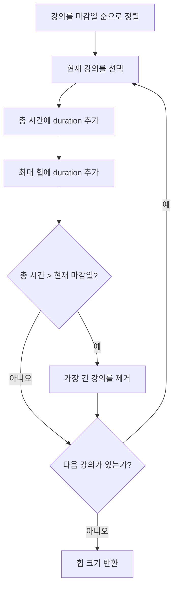

# 630. Course Schedule III

- 문제: [LeetCode 630. Course Schedule III](https://leetcode.com/problems/course-schedule-iii/)
- 난이도: Hard
- 핵심 자료구조: 정렬, 최대 힙
- 핵심 패턴: **마감일 순으로 제약을 확인하고, 불가능해지면 가장 긴 선택을 취소한다.**

---

## 1. 문제 핵심

각 강의는 `[duration, lastDay]`로 주어진다.

```text
duration : 강의를 듣는 데 필요한 연속 일수
lastDay  : 강의를 끝내야 하는 마지막 날짜
```

강의는 1일째부터 시작할 수 있고 한 번에 하나만 들을 수 있다. 들을 수 있는 강의 수의 최댓값을 구한다.

```text
courses = [[100,200], [200,1300], [1000,1250], [2000,3200]]
정답 = 3
```

---

## 2. 처음 문제를 풀 때의 사고 과정

### 2.1 모든 조합을 확인한다

강의마다 선택하거나 선택하지 않는 두 경우가 있으므로 모든 부분집합은 `2^N`개다. 입력이 커지면 사용할 수 없다.

```text
시간 복잡도: O(2^N)
```

여기서 강의의 개수만 최대화하고 각 강의의 가치는 모두 1이라는 점을 본다. 같은 개수라면 총 소요 시간이 짧을수록 이후 강의를 더 넣기 쉽다.

### 2.2 짧은 강의부터 들으면 될까?

강의 시간만 보면 마감일의 긴급성을 놓친다.

```text
[[1,100], [2,2], [2,4]]
```

짧은 `[1,100]`부터 고정하면 촉박한 `[2,2]`를 놓칠 수 있다. 반면 마감일 순으로 들으면 세 강의를 모두 들을 수 있다.

따라서 시간축의 제약을 처리하려면 먼저 마감일을 봐야 한다.

### 2.3 마감일 순으로 가능한 강의만 선택하면 될까?

```text
[[5,5], [4,6], [2,6]]
```

단순히 가능한 강의를 선택하고 취소하지 않으면 `[5,5]` 하나만 남는다. 하지만 5일짜리를 포기하면 4일과 2일 강의를 모두 들어 2개를 선택할 수 있다.

```text
긴 강의 하나를 짧은 강의로 교체해야 한다.
```

### 2.4 시간이 넘으면 무엇을 취소해야 할까?

현재까지 선택한 강의 수를 최대한 유지하면서 총 시간을 가장 많이 줄이려면 가장 긴 강의를 제거해야 한다.

```text
선택한 강의 시간: [5, 4, 2]
하나를 제거해야 한다면 5를 제거

남은 시간: 4 + 2 = 6
```

선택한 강의 중 가장 긴 값을 빠르게 찾기 위해 최대 힙을 사용한다.

---

## 3. 알고리즘

```text
1. 강의를 lastDay 오름차순으로 정렬한다.
2. 현재 강의를 일단 선택한다.
3. 총 강의 시간을 증가시킨다.
4. 총 시간이 현재 lastDay를 넘으면 최대 힙에서 가장 긴 강의를 제거한다.
5. 모든 강의를 확인한 뒤 힙의 크기를 반환한다.
```



---

## 4. Java 풀이

```java
import java.util.*;

class Solution {
    public int scheduleCourse(int[][] courses) {
        Arrays.sort(
            courses,
            Comparator.comparingInt(course -> course[1])
        );

        PriorityQueue<Integer> selectedDurations =
            new PriorityQueue<>(Comparator.reverseOrder());

        int totalDuration = 0;

        for (int[] course : courses) {
            int duration = course[0];
            int lastDay = course[1];

            totalDuration += duration;
            selectedDurations.offer(duration);

            if (totalDuration > lastDay) {
                totalDuration -= selectedDurations.poll();
            }
        }

        return selectedDurations.size();
    }
}
```

---

## 5. 정확성의 핵심

### 5.1 왜 가장 긴 강의를 제거하는가?

현재 강의를 추가했더니 마감일을 넘었다면 현재 선택 상태는 불가능하다. 선택 개수를 최대한 유지하려면 강의 하나만 제거한다.

이때 가장 긴 강의를 제거하면 같은 개수의 강의를 남기는 모든 선택 중 총 시간이 가장 작아진다.

```text
같은 선택 개수
→ 총 시간이 작을수록 남은 마감일 제약에 유리
→ 가장 긴 강의를 제거
```

현재 강의보다 이전 강의가 더 길다면 이전 강의를 제거할 수도 있다. 이것이 단순히 “현재 강의를 들을 수 없으면 포기한다”와 다른 점이다.

### 5.2 왜 한 번만 제거해도 되는가?

현재 강의를 추가하기 전에는 다음 조건을 만족한다.

```text
previousTotal <= previousDeadline <= currentDeadline
```

현재 강의의 기간을 `duration`이라고 하면, 추가 후 최대 힙의 최댓값은 최소한 `duration` 이상이다.

```text
removedDuration >= duration
```

따라서 가장 긴 강의를 한 번 제거한 뒤의 시간은 다음과 같다.

```text
newTotal
= previousTotal + duration - removedDuration
<= previousTotal
<= currentDeadline
```

그러므로 한 번 제거하면 현재 마감일 조건을 다시 만족한다.

### 5.3 알고리즘이 유지하는 불변식

마감일 순으로 `i`번째 강의까지 처리했을 때 다음 상태를 유지한다.

```text
1. 지금까지 확인한 강의 중 가능한 최대 개수를 선택한다.
2. 그 개수를 만드는 총 시간은 가능한 한 작게 유지한다.
```

최대 힙은 두 번째 조건을 유지하기 위한 교체 장치다.

---

## 6. 같은 마감일에서 강의 시간 정렬도 필요한가?

결론은 **마감일만 정렬해도 된다.**

```java
Arrays.sort(
    courses,
    Comparator.comparingInt(course -> course[1])
);
```

강의 시간을 보조 기준으로 추가해도 틀리지는 않지만 필수는 아니다.

```java
Arrays.sort(
    courses,
    Comparator
        .comparingInt((int[] course) -> course[1])
        .thenComparingInt(course -> course[0])
);
```

두 자료구조의 역할이 분리되어 있기 때문이다.

```text
마감일 정렬: 어떤 시간 제약부터 검사할지 결정
최대 힙: 시간 초과 시 어떤 강의를 취소할지 결정
```

### 같은 마감일 예제

```text
[[5,6], [4,6], [2,6]]
```

처리 순서가 `5 → 4 → 2`이면:

```text
5 선택
5 + 4 = 9 > 6 → 가장 긴 5 제거
4 + 2 = 6

최종: [4,2], 개수 2
```

처리 순서가 `2 → 4 → 5`이면:

```text
2 + 4 = 6
2 + 4 + 5 = 11 > 6 → 가장 긴 5 제거

최종: [2,4], 개수 2
```

같은 마감일의 모든 강의를 처리하면 최대 힙이 가장 긴 강의를 제거하므로 처리 순서와 무관하게 최적 상태에 도달한다.

---

## 7. 반례를 체계적으로 찾는 방법

반례는 무작위로 만들기보다 내가 만든 그리디가 믿는 주장을 문장으로 적고 그 반대를 공격한다.

### 7.1 그리디가 무시하는 값을 극단적으로 만든다

후보 풀이:

```text
강의 시간이 짧은 순으로 선택한다.
```

무시하는 조건은 마감일이다. 따라서 짧은 강의의 마감일은 아주 늦게, 조금 긴 강의의 마감일은 촉박하게 만든다.

```text
[[1,100], [2,2], [2,4]]
```

### 7.2 되돌릴 수 없는 선택을 공격한다

후보 풀이:

```text
마감일 순으로 가능한 강의만 선택하고 이전 선택은 취소하지 않는다.
```

긴 강의 하나와 짧은 강의 여러 개를 경쟁시킨다.

```text
[[5,5], [4,6], [2,6]]
```

이 반례에서 “이전의 긴 강의를 취소해야 한다”는 힌트를 얻고 최대 힙을 떠올릴 수 있다.

### 7.3 경계값 바로 앞뒤를 검사한다

```text
totalDuration = lastDay - 1
totalDuration = lastDay
totalDuration = lastDay + 1
```

정확히 마감일에 끝나는 강의는 가능하므로 비교 조건은 다음과 같다.

```java
if (totalDuration > lastDay)
```

`>=`를 사용하면 정확히 마감일에 끝나는 유효한 일정을 제거한다.

### 7.4 동률을 만든다

정렬 문제에서는 다음 입력을 검사한다.

```text
- 마감일이 모두 같음
- 기간이 모두 같음
- 기간과 마감일이 모두 같음
```

이를 통해 보조 정렬 조건이 실제로 필요한지 확인할 수 있다.

### 7.5 최소 반례로 줄인다

반례를 찾았다면 강의를 하나씩 제거하고 값 차이를 줄인다.

```text
이 강의를 제거해도 실패하는가?
마감일 차이를 1로 줄여도 실패하는가?
3개 강의만으로 같은 문제를 만들 수 있는가?
```

작은 반례일수록 실패 원인이 선명하다.

---

## 8. 후보 풀이별 공격 방법

| 후보 그리디 | 무시하거나 고정한 것 | 공격용 반례 |
|---|---|---|
| 짧은 강의부터 선택 | 촉박한 마감일 | `[[1,100],[2,2],[2,4]]` |
| 마감일 순으로 가능하면 선택 | 이전 선택을 취소하지 못함 | `[[5,5],[4,6],[2,6]]` |
| 시간이 넘으면 현재 강의 포기 | 이전 강의가 더 길 수 있음 | `[[5,5],[4,6],[2,6]]` |
| 시간이 넘으면 가장 짧은 강의 제거 | 충분한 시간을 확보하지 못함 | `[[5,5],[4,6],[2,6]]` |

---

## 9. 완전탐색을 반례 탐색기로 사용하기

작은 `N`에서는 모든 부분집합을 확인하는 코드를 정답 판별기로 사용할 수 있다.

```text
1. 모든 강의 부분집합을 만든다.
2. 선택한 강의를 마감일 순으로 정렬한다.
3. 누적 시간이 각 마감일 이하인지 검사한다.
4. 가능한 부분집합 중 최대 크기를 구한다.
5. 그리디 결과와 다르면 반례다.
```

개념적인 코드는 다음과 같다.

```java
int bruteForce(int[][] courses) {
    int courseCount = courses.length;
    int answer = 0;

    for (int mask = 0; mask < (1 << courseCount); mask++) {
        List<int[]> selected = new ArrayList<>();

        for (int index = 0; index < courseCount; index++) {
            if ((mask & (1 << index)) != 0) {
                selected.add(courses[index]);
            }
        }

        selected.sort(
            Comparator.comparingInt(course -> course[1])
        );

        int totalDuration = 0;
        boolean possible = true;

        for (int[] course : selected) {
            totalDuration += course[0];

            if (totalDuration > course[1]) {
                possible = false;
                break;
            }
        }

        if (possible) {
            answer = Math.max(answer, selected.size());
        }
    }

    return answer;
}
```

작은 기간과 마감일을 자동 생성해 그리디 결과와 완전탐색 결과를 비교하면 컴퓨터가 반례를 찾아준다. 발견한 입력을 분석하면 어떤 유형에서 후보 그리디가 실패하는지 감각을 익힐 수 있다.

---

## 10. 복잡도

```text
정렬: O(N log N)
각 강의의 힙 삽입·삭제: O(log N)

전체 시간: O(N log N)
공간: O(N)
```

---

## 11. 제출 전 확인

```text
- duration이 아니라 lastDay 기준으로 정렬했는가?
- PriorityQueue가 최대 힙인가?
- 현재 강의를 먼저 넣고 초과하면 가장 긴 강의를 제거하는가?
- totalDuration에서 제거한 기간을 뺐는가?
- totalDuration == lastDay는 가능한 일정으로 처리하는가?
- 입력 배열이 정렬로 변경되어도 괜찮은가?
- 같은 마감일 입력에서도 결과가 유지되는가?
```
