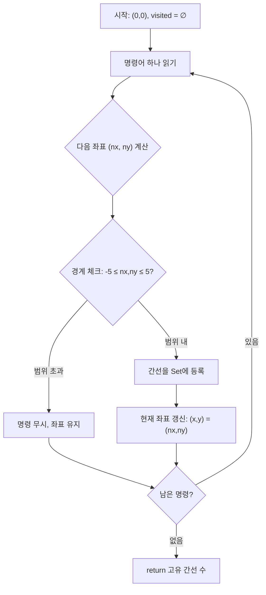

# 방문 길이 — 복습 문서

> **출처:** [프로그래머스 Level 2 — 방문 길이](https://school.programmers.co.kr/learn/courses/30/lessons/49994)  
> **유형:** 시뮬레이션, Set(해시), 간선 관리  
> **핵심 키워드:** 간선 정규화, 좌표평면 경계 처리, 무방향 간선 중복 제거

---

## 목차

1. [문제 요약](#1-문제-요약)
2. [핵심 인사이트 — 점 방문 vs 간선 방문](#2-핵심-인사이트--점-방문-vs-간선-방문)
3. [풀이 전략 비교 — 두 가지 정규화 방식](#3-풀이-전략-비교--두-가지-정규화-방식)
4. [Mermaid 다이어그램 — 알고리즘 흐름](#4-mermaid-다이어그램--알고리즘-흐름)
5. [내 풀이 (Java) — 양방향 삽입 + 나누기 2](#5-내-풀이-java--양방향-삽입--나누기-2)
6. [풀이 A — min/max 정규화 (5개 언어)](#6-풀이-a--minmax-정규화-5개-언어)
7. [풀이 B — 4차원 배열 대안](#7-풀이-b--4차원-배열-대안)
8. [단계별 트레이스](#8-단계별-트레이스)
9. [엣지 케이스 분석](#9-엣지-케이스-분석)
10. [복잡도 비교표](#10-복잡도-비교표)
11. [핵심 Q&A 정리](#11-핵심-qa-정리)

---

## 1. 문제 요약

게임 캐릭터가 좌표평면의 **(0, 0)**에서 시작하여 명령어(`U`, `D`, `R`, `L`)에 따라 이동한다.

- **좌표 범위:** -5 ≤ x, y ≤ 5
- **경계 초과 명령:** 무시 (캐릭터 위치 유지)
- **구해야 할 것:** 캐릭터가 **처음 걸어본 길(간선)의 개수**
- **제약:** dirs 길이 ≤ 500

### 입출력 예

| dirs | return |
|------|--------|
| `"ULURRDLLU"` | 7 |
| `"LULLLLLLU"` | 7 |

---

## 2. 핵심 인사이트 — 점 방문 vs 간선 방문

이 문제에서 가장 흔한 실수: **"점(노드)의 방문 여부"를 추적하는 것.**

```
  예: "UD" 입력 시
  
  (0,0) → (0,1) → (0,0)
  
  ❌ 점 기반: {(0,0), (0,1)} → 2개? (의미 없음)
  ✅ 간선 기반: {(0,0)-(0,1)} → 1개 (정답)
```

좌표평면의 격자를 **그래프**로 보면:
- **노드** = 격자점 (11×11 = 121개)
- **간선** = 인접한 두 점을 잇는 선분 (최대 220개)
- 같은 선분을 양쪽 방향으로 걸어도 **하나의 간선**

따라서 **무방향 간선의 중복 제거**가 핵심이다.

### 왜 220개가 상한인가?

```
가로 간선: 10 × 11 = 110개  (각 행에 10개 × 11행)
세로 간선: 11 × 10 = 110개  (각 열에 10개 × 11열)
합계: 220개
```

---

## 3. 풀이 전략 비교 — 두 가지 정규화 방식

무방향 간선 `(A, B)`와 `(B, A)`를 같은 것으로 취급하는 방법이 크게 두 가지다.

### 방식 1: 양방향 삽입 후 나누기 2 (내 풀이)

```
(0,0)→(0,1) 이동 시:
  Set에 "0 0 0 1" 추가
  Set에 "0 1 0 0" 추가   ← 역방향도 추가
  
최종 답 = Set.size() / 2
```

**장점:** 정규화 로직 없이 단순히 양방향 모두 넣으면 됨  
**주의:** 반드시 **2로 나눠야** 함을 잊으면 안 됨

### 방식 2: min/max 정규화

```
(0,0)→(0,1) 이동 시:
  정규화: (min(0,0), min(0,1), max(0,0), max(0,1)) = (0,0,0,1)
  
(0,1)→(0,0) 이동 시:
  정규화: (min(0,0), min(1,0), max(0,0), max(1,0)) = (0,0,0,1)  ← 같은 키!

최종 답 = Set.size()
```

**장점:** Set 크기가 곧 답, 공간 절반만 사용  
**주의:** 정규화 로직을 정확히 구현해야 함

### 왜 두 방식 모두 올바른가?

양방향 삽입 방식에서, 모든 간선은 반드시 **정확히 2개의 엔트리**를 만든다:
- 새로운 간선을 걸을 때 → 2개 추가
- 이미 걸은 간선을 다시 걸을 때 → 이미 2개 다 존재하므로 0개 추가

따라서 `Set.size()`는 항상 짝수이며, `Set.size() / 2`는 고유 간선 수와 정확히 일치한다.

---

## 4. Mermaid 다이어그램 — 알고리즘 흐름



간선 등록 방식에 따라:
- **양방향 삽입:** A→B, B→A 둘 다 넣고 마지막에 ÷ 2
- **min/max 정규화:** 하나만 넣고 Set.size() 반환

---

## 5. 내 풀이 (Java) — 양방향 삽입 + 나누기 2

```java
import java.util.HashMap;
import java.util.HashSet;

class Solution {

    // 경계 검사: 좌표가 -5 ~ 5 범위 내인지 확인
    private static boolean isValidMove(int nx, int ny) {
        return -5 <= nx && nx <= 5 && -5 <= ny && ny <= 5;
    }

    // 방향별 이동 벡터를 저장하는 맵
    private static final HashMap<Character, int[]> location = new HashMap<>();

    // 이동 벡터 초기화
    private static void initLocation() {
        location.put('U', new int[]{0, 1});
        location.put('D', new int[]{0, -1});
        location.put('L', new int[]{-1, 0});
        location.put('R', new int[]{1, 0});
    }

    public int solution(String dirs) {
        initLocation();
        int x = 0, y = 0;
        HashSet<String> answer = new HashSet<>();

        for (int i = 0; i < dirs.length(); i++) {
            int[] offset = location.get(dirs.charAt(i));
            int nx = x + offset[0];
            int ny = y + offset[1];

            // 경계 밖이면 이동하지 않음
            if (!isValidMove(nx, ny)) continue;

            // 핵심: 양방향 모두 Set에 삽입
            answer.add(x + " " + y + " " + nx + " " + ny);   // 정방향
            answer.add(nx + " " + ny + " " + x + " " + y);   // 역방향

            x = nx;
            y = ny;
        }

        // 양방향으로 2개씩 넣었으므로 나누기 2
        return answer.size() / 2;
    }
}
```

### 이 풀이의 핵심 아이디어

1. **정규화 대신 "대칭 삽입":** 간선 (A→B)를 걸을 때 `"A B"` 와 `"B A"` 를 모두 Set에 넣는다.
2. **역방향 재방문 자동 감지:** 나중에 (B→A)를 걸으면, `"B A"`와 `"A B"` 를 넣으려 하지만 이미 존재하므로 Set 크기 불변.
3. **나누기 2:** 모든 고유 간선이 정확히 2개의 엔트리를 가지므로 `size() / 2` = 답.

### 장단점

| 항목 | 평가 |
|------|------|
| 코드 간결성 | ✅ 정규화 로직이 필요 없어 단순함 |
| 정확성 | ✅ 수학적으로 정확 (Set 크기는 항상 짝수) |
| 공간 효율 | ⚠️ Set 크기가 2배 (최대 440 엔트리), 이 문제에선 무시 가능 |
| 문자열 키 | ⚠️ "0 0 0 1" 같은 문자열 해싱은 튜플보다 느리지만, N ≤ 500이므로 무관 |

---

## 6. 풀이 A — min/max 정규화 (5개 언어)

### JavaScript

```javascript
function solution(dirs) {
    // 방향별 이동 벡터
    const move = { U: [0, 1], D: [0, -1], R: [1, 0], L: [-1, 0] };
    const visited = new Set();
    let [x, y] = [0, 0];

    for (const d of dirs) {
        const [dx, dy] = move[d];
        const [nx, ny] = [x + dx, y + dy];

        // 경계 초과 시 무시
        if (nx < -5 || nx > 5 || ny < -5 || ny > 5) continue;

        // 간선 정규화: (작은 x, 작은 y, 큰 x, 큰 y)
        const edge = `${Math.min(x, nx)},${Math.min(y, ny)},${Math.max(x, nx)},${Math.max(y, ny)}`;
        visited.add(edge);

        [x, y] = [nx, ny];
    }

    return visited.size;
}
```

### C++

```cpp
#include <string>
#include <set>
#include <tuple>
#include <algorithm>
using namespace std;

int solution(string dirs) {
    // 정규화된 간선을 tuple로 저장
    set<tuple<int,int,int,int>> visited;
    int x = 0, y = 0;

    for (char d : dirs) {
        int nx = x, ny = y;
        if (d == 'U') ny++;
        else if (d == 'D') ny--;
        else if (d == 'R') nx++;
        else if (d == 'L') nx--;

        // 경계 검사
        if (nx < -5 || nx > 5 || ny < -5 || ny > 5) continue;

        // min/max로 정규화하여 Set에 삽입
        visited.insert({min(x,nx), min(y,ny), max(x,nx), max(y,ny)});

        x = nx;
        y = ny;
    }

    return visited.size();
}
```

### Java

```java
import java.util.*;

class Solution {
    public int solution(String dirs) {
        Set<String> visited = new HashSet<>();
        int x = 0, y = 0;

        // 방향별 이동량
        Map<Character, int[]> move = Map.of(
            'U', new int[]{0, 1}, 'D', new int[]{0, -1},
            'R', new int[]{1, 0}, 'L', new int[]{-1, 0}
        );

        for (char d : dirs.toCharArray()) {
            int[] delta = move.get(d);
            int nx = x + delta[0], ny = y + delta[1];

            if (nx < -5 || nx > 5 || ny < -5 || ny > 5) continue;

            // 정규화된 간선 키 생성
            String edge = Math.min(x, nx) + "," + Math.min(y, ny) + ","
                         + Math.max(x, nx) + "," + Math.max(y, ny);
            visited.add(edge);

            x = nx;
            y = ny;
        }

        return visited.size();
    }
}
```

### Rust

```rust
use std::collections::HashSet;

fn solution(dirs: &str) -> i32 {
    let mut visited: HashSet<(i32, i32, i32, i32)> = HashSet::new();
    let (mut x, mut y) = (0i32, 0i32);

    for d in dirs.chars() {
        // 방향에 따른 다음 좌표
        let (nx, ny) = match d {
            'U' => (x, y + 1),
            'D' => (x, y - 1),
            'R' => (x + 1, y),
            'L' => (x - 1, y),
            _ => continue,
        };

        if nx < -5 || nx > 5 || ny < -5 || ny > 5 { continue; }

        // 정규화: (min_x, min_y, max_x, max_y) 튜플
        visited.insert((x.min(nx), y.min(ny), x.max(nx), y.max(ny)));
        x = nx;
        y = ny;
    }

    visited.len() as i32
}
```

### Go

```go
func solution(dirs string) int {
    type Edge struct{ x1, y1, x2, y2 int }
    visited := map[Edge]bool{}

    move := map[rune][2]int{
        'U': {0, 1}, 'D': {0, -1},
        'R': {1, 0}, 'L': {-1, 0},
    }

    x, y := 0, 0
    for _, d := range dirs {
        delta := move[d]
        nx, ny := x+delta[0], y+delta[1]

        if nx < -5 || nx > 5 || ny < -5 || ny > 5 { continue }

        // 정규화된 간선을 구조체 키로 사용
        edge := Edge{min(x, nx), min(y, ny), max(x, nx), max(y, ny)}
        visited[edge] = true

        x, y = nx, ny
    }

    return len(visited)
}

func min(a, b int) int { if a < b { return a }; return b }
func max(a, b int) int { if a > b { return a }; return b }
```

---

## 7. 풀이 B — 4차원 배열 대안

Set 해싱 없이, 좌표를 +5 시프트하여 0~10 범위로 변환한 뒤 **4차원 boolean 배열**로 직접 인덱싱한다.

### JavaScript

```javascript
function solution(dirs) {
    // 11×11×11×11 배열 (좌표를 +5 시프트)
    const visited = Array.from({length: 11}, () =>
        Array.from({length: 11}, () =>
            Array.from({length: 11}, () =>
                Array(11).fill(false))));

    const move = { U: [0,1], D: [0,-1], R: [1,0], L: [-1,0] };
    let [x, y] = [5, 5]; // 원점 시프트
    let count = 0;

    for (const d of dirs) {
        const [dx, dy] = move[d];
        const [nx, ny] = [x + dx, y + dy];

        if (nx < 0 || nx > 10 || ny < 0 || ny > 10) continue;

        // 양방향 모두 체크하고, 새 간선이면 카운트
        if (!visited[x][y][nx][ny]) {
            visited[x][y][nx][ny] = true;
            visited[nx][ny][x][y] = true;
            count++;
        }

        [x, y] = [nx, ny];
    }

    return count;
}
```

### Go

```go
func solution(dirs string) int {
    var visited [11][11][11][11]bool
    move := map[rune][2]int{
        'U': {0, 1}, 'D': {0, -1},
        'R': {1, 0}, 'L': {-1, 0},
    }

    x, y := 5, 5
    count := 0

    for _, d := range dirs {
        delta := move[d]
        nx, ny := x+delta[0], y+delta[1]

        if nx < 0 || nx > 10 || ny < 0 || ny > 10 { continue }

        if !visited[x][y][nx][ny] {
            visited[x][y][nx][ny] = true
            visited[nx][ny][x][y] = true
            count++
        }

        x, y = nx, ny
    }

    return count
}
```

---

## 8. 단계별 트레이스

### 입력: `"ULURRDLLU"`

| 단계 | 명령 | (x,y) → (nx,ny) | 간선 표현 | 새 길? | 누적 간선 수 |
|:----:|:----:|:-----------------:|:----------:|:------:|:----------:|
| 1 | U | (0,0) → (0,1) | (0,0)-(0,1) | ✅ | 1 |
| 2 | L | (0,1) → (-1,1) | (-1,1)-(0,1) | ✅ | 2 |
| 3 | U | (-1,1) → (-1,2) | (-1,1)-(-1,2) | ✅ | 3 |
| 4 | R | (-1,2) → (0,2) | (-1,2)-(0,2) | ✅ | 4 |
| 5 | R | (0,2) → (1,2) | (0,2)-(1,2) | ✅ | 5 |
| 6 | D | (1,2) → (1,1) | (1,1)-(1,2) | ✅ | 6 |
| 7 | L | (1,1) → (0,1) | (0,1)-(1,1) | ✅ | 7 |
| 8 | L | (0,1) → (-1,1) | (-1,1)-(0,1) | ❌ 2단계와 중복 | 7 |
| 9 | U | (-1,1) → (-1,2) | (-1,1)-(-1,2) | ❌ 3단계와 중복 | 7 |

**최종 답: 7**

### 내 풀이(양방향 삽입) 기준 Set 상태 추적

```
단계 1 후: {"0 0 0 1", "0 1 0 0"}                             → size=2
단계 2 후: + {"0 1 -1 1", "-1 1 0 1"}                         → size=4
단계 7 후:                                                     → size=14
단계 8: "0 1 -1 1" 이미 존재, "-1 1 0 1" 이미 존재            → size=14 (변화 없음)
단계 9: "-1 1 -1 2" 이미 존재, "-1 2 -1 1" 이미 존재          → size=14 (변화 없음)

최종: 14 / 2 = 7 ✅
```

---

## 9. 엣지 케이스 분석

| 관점 | 엣지 케이스 | 입력 예시 | 기대 출력 | 처리 |
|------|------------|-----------|----------|------|
| **최소 입력** | 명령어 1개 | `"U"` | 1 | 간선 1개 생성 |
| **완전 왕복** | 같은 길 왕복 | `"UD"` | 1 | 역방향도 같은 간선 |
| **경계 무시** | 한 방향으로 계속 | `"UUUUUUUUU"` (9개) | 5 | 6번째 U부터 무시 |
| **왕복 반복** | 한 간선만 반복 | `"RLRL"` | 1 | 모두 같은 (0,0)-(1,0) 간선 |
| **모든 명령 무시** | 시작점이 구석 + 벽으로 | 초기(0,0)에서 `"D"` 5번 후 `"DDDDD"` | 5+0 | 5칸 이동 후 전부 무시 |
| **최대 간선** | 모든 격자 간선 방문 | 이론적 최대 | 220 | Set 상한 = 220 |

---

## 10. 복잡도 비교표

| 풀이 | 시간 복잡도 | 공간 복잡도 | 특징 |
|------|-----------|-----------|------|
| 내 풀이 (양방향 삽입) | O(N) | O(N), 최대 440 문자열 | 정규화 불필요, 구현 단순 |
| 풀이 A (min/max 정규화) | O(N) | O(N), 최대 220 엔트리 | 정규화로 공간 절반 |
| 풀이 B (4차원 배열) | O(N) | O(1) — 고정 11⁴ ≈ 14K | 해싱 없이 직접 인덱싱 |

> N = dirs 길이 (≤ 500). 모든 풀이가 실질적으로 상수 시간·공간.

---

## 11. 핵심 Q&A 정리

### Q1. 왜 "점 방문"이 아니라 "간선 방문"인가?

같은 점에 여러 방향에서 도착할 수 있다. 예를 들어 (0,1)에 아래에서 올 수도, 왼쪽에서 올 수도 있는데, 이때 걷는 **길**은 서로 다르다. 문제가 요구하는 것은 "처음 걸어본 **길**"이므로, 두 점을 잇는 선분(간선) 단위로 추적해야 한다.

### Q2. 양방향 삽입 방식에서 size가 항상 짝수인 이유는?

모든 `add` 호출은 반드시 쌍으로 이루어진다 (정방향 + 역방향). Set의 특성상:
- 두 문자열 모두 새로우면 → size +2
- 두 문자열 모두 이미 존재하면 → size +0

한쪽만 존재하는 경우는 **절대 없다** (항상 쌍으로 삽입하므로). 따라서 size는 항상 짝수.

### Q3. min/max 정규화가 올바른 이유는?

인접 이동은 한 좌표축만 ±1 변한다:
- **수평 이동:** y 동일, x만 ±1 → `min(x, nx) ≠ max(x, nx)`, `min(y, ny) = max(y, ny)`
- **수직 이동:** x 동일, y만 ±1 → `min(x, nx) = max(x, nx)`, `min(y, ny) ≠ max(y, ny)`

어느 방향에서 이동하든 `(min_x, min_y, max_x, max_y)` 결과가 동일하므로, 같은 간선은 항상 같은 키를 생성한다.

### Q4. 4차원 배열 방식에서 양방향 체크가 필요한 이유는?

`visited[x][y][nx][ny]` 와 `visited[nx][ny][x][y]`는 배열에서 **다른 위치**다. 따라서:
- 처음 걸을 때: 두 위치 모두 `true`로 설정
- 재방문 시: 둘 중 하나만 확인해도 되지만, 일관성을 위해 `visited[x][y][nx][ny]`를 체크

정규화 방식이라면 배열을 반으로 줄일 수 있지만, 11⁴ ≈ 14,641이라 메모리 절약의 실익이 없다.

### Q5. 문자열 키 vs 튜플/구조체 키?

| 방식 | 해싱 비용 | 비교 비용 | 사용 가능 언어 |
|------|---------|---------|--------------|
| 문자열 `"x1 y1 x2 y2"` | 문자열 해싱 (느림) | 문자열 비교 (느림) | 모든 언어 |
| 튜플/구조체 | 정수 해싱 (빠름) | 정수 비교 (빠름) | C++, Rust, Go 등 |

이 문제에선 N ≤ 500이라 차이가 없지만, 대규모 데이터에선 튜플/구조체 방식이 유리하다.

---

## 부록: 세 풀이 방식 한눈에 비교

```
┌─────────────────────────────────────────────────────┐
│            무방향 간선 중복 제거 전략                    │
├──────────────┬──────────────┬───────────────────────┤
│  양방향 삽입   │  min/max 정규화  │   4차원 배열          │
│              │              │                       │
│  A→B, B→A    │  normalize   │  arr[A][B] = true     │
│  둘 다 Set에  │  → 하나의 키  │  arr[B][A] = true     │
│              │              │                       │
│  답 = size/2 │  답 = size   │  답 = count           │
│              │              │                       │
│  해싱 2회/이동 │  해싱 1회/이동 │  해싱 0회 (직접접근)   │
└──────────────┴──────────────┴───────────────────────┘
```