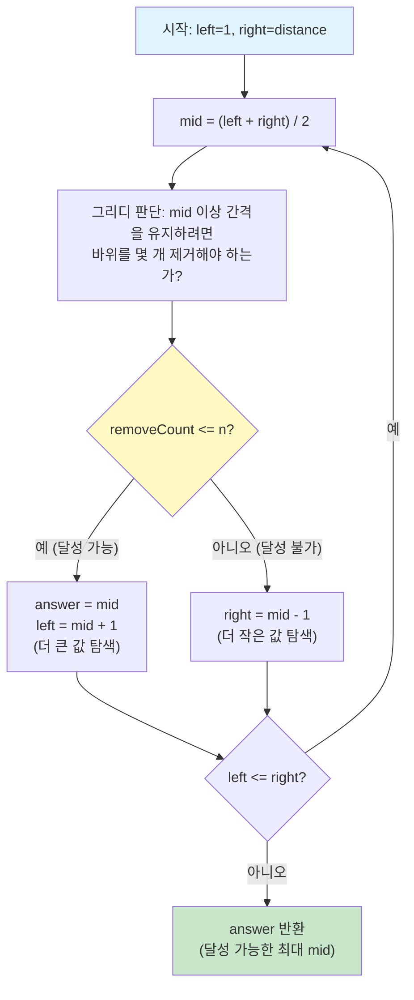

# 프로그래머스 - 징검다리 (이분 탐색) 복습 노트

> **문제 링크**: https://school.programmers.co.kr/learn/courses/30/lessons/43236  
> **핵심 알고리즘**: 이분 탐색 (Parametric Search)  
> **난이도**: Level 4

---

## 1. 문제 요약

출발지점(0)부터 도착지점(distance)까지 사이에 바위들이 놓여 있다. 바위 n개를 제거한 뒤, 남은 각 지점 사이 거리의 **최솟값** 중에서 **가장 큰 값**을 구하라.

### 제한사항

- distance: 1 이상 **1,000,000,000** 이하
- 바위 개수: 1 이상 **50,000** 이하
- n: 1 이상 바위의 개수 이하

### 입출력 예시

| distance | rocks | n | return |
|---|---|---|---|
| 25 | [2, 14, 11, 21, 17] | 2 | 4 |

---

## 2. 왜 이분 탐색인가? (풀이 전략 도출 과정)

### 2-1. 완전탐색은 불가능하다

가장 먼저 떠오르는 접근은 "바위 50,000개 중 n개를 골라 제거하는 모든 조합을 시도하고, 각 경우마다 최솟값을 구해서 최대를 찾자"이다. 하지만 조합의 수가 천문학적이므로 시간 내에 절대 풀 수 없다.

### 2-2. 정답의 범위가 정해져 있다

여기서 시선을 바꾼다. 정답은 "거리의 최솟값 중 가장 큰 값"인데, 이 값은 **최소 1, 최대 distance** 사이의 정수이다. 즉, 정답이 될 수 있는 후보가 1부터 distance까지 일렬로 늘어서 있는 셈이다.

### 2-3. 단조성(Monotonicity)이 존재한다

핵심 관찰은 다음과 같다.

- 목표 최소 간격(mid)을 **작게** 잡을수록 → 제거할 바위가 **적다** → 달성하기 **쉽다**
- 목표 최소 간격(mid)을 **크게** 잡을수록 → 제거할 바위가 **많다** → 달성하기 **어렵다**

예제(distance=25, rocks=[2,11,14,17,21], n=2)로 확인하면 다음과 같다.

| mid (목표 최소 간격) | 제거해야 할 바위 수 | n=2로 가능? |
|---|---|---|
| 1 | 0개 | 가능 |
| 2 | 0개 | 가능 |
| 3 | 1개 | 가능 |
| 4 | 2개 | 가능 |
| **5** | **3개** | **불가능** |
| 6 | 3개 | 불가능 |

"가능, 가능, ..., 가능, 불가능, 불가능, ..." 처럼 **경계가 딱 한 번만 바뀐다.** 이 경계의 마지막 "가능"이 정답이며, 이분 탐색으로 O(log N)만에 찾을 수 있다. 이것이 **"답을 이분 탐색한다(Parametric Search)"** 기법이다.

### 2-4. mid의 의미

mid는 배열에서 찾는 인덱스가 아니다. **"바위를 적절히 제거해서, 남은 모든 간격을 최소 mid 이상으로 만들 수 있는가?"** 라고 질문하는 **후보 정답값**이다. 이분 탐색은 이 후보를 효율적으로 좁혀나가는 방법이다.

---

## 3. 핵심 개념: "n개 이하" 제거로 판단하는 이유

문제는 "바위를 **정확히 n개** 제거한 뒤"라고 했는데, 코드에서는 `removeCount <= n`으로 판단한다. 이것이 성립하는 이유는 다음과 같다.

**바위를 추가로 제거한다고 해서 최솟값이 줄어들지 않기 때문이다.** 이미 모든 간격이 mid 이상인 상태에서 바위 하나를 더 빼면, 그 바위의 양쪽 간격이 합쳐져서 **더 커지기만 한다.** 따라서 removeCount가 n보다 작더라도, 나머지를 아무 데서나 더 빼면 정확히 n개 제거를 만족하면서 최솟값은 mid 이상을 유지할 수 있다.

정리하면, `removeCount <= n`은 "mid를 달성하는 데 필요한 **최소** 제거 수가 n 이내이므로, 정확히 n개를 제거하더라도 mid 이상의 최솟값을 **보장할 수 있다**"는 의미이다.

---

## 4. 전체 코드

```java
import java.util.Arrays;

class Solution {
    public int solution(int distance, int[] rocks, int n) {
        // [1단계] 바위를 위치 순으로 정렬 — 순서대로 간격을 계산하기 위함
        Arrays.sort(rocks);

        // [2단계] 이분 탐색 범위 설정 — 정답은 1 ~ distance 사이
        long left = 1;
        long right = distance;
        long answer = 0;

        // [3단계] 이분 탐색 반복
        while (left <= right) {
            long mid = (left + right) / 2;

            // [4단계] 그리디 판단: mid를 달성하려면 바위를 몇 개 제거해야 하는가?
            int removeCount = 0;
            int prev = 0; // 마지막으로 남긴 지점 (출발점 = 0)

            for (int rock : rocks) {
                if (rock - prev < mid) {
                    // 간격이 mid 미만 → 이 바위를 제거
                    removeCount++;
                } else {
                    // 간격이 mid 이상 → 이 바위를 남기고 기준점 갱신
                    prev = rock;
                }
            }

            // [5단계] 마지막 남긴 바위와 도착지점 사이 거리도 확인
            if (distance - prev < mid) {
                removeCount++;
            }

            // [6단계] 결과에 따라 탐색 범위 조정
            if (removeCount <= n) {
                answer = mid;    // mid는 달성 가능 → 기록
                left = mid + 1;  // 더 큰 값도 가능한지 탐색
            } else {
                right = mid - 1; // mid가 너무 큼 → 줄여서 탐색
            }
        }

        // [7단계] 달성 가능한 mid 중 가장 큰 값이 정답
        return (int) answer;
    }
}
```

---

## 5. 코드 단계별 상세 해설

### 5-1. 정렬

입력 `[2, 14, 11, 21, 17]`이 정렬 후 `[2, 11, 14, 17, 21]`이 된다. 출발점(0)부터 도착점(25)까지 순서대로 간격을 계산하려면 위치 순 정렬이 필수다.

```
0 --- 2 --- 11 --- 14 --- 17 --- 21 --- 25
  (2)  (9)   (3)    (3)    (4)    (4)
```

### 5-2. 이분 탐색 범위 설정

left=1은 "최소 간격이 1 이상", right=25는 "최소 간격이 최대 25"이다. answer는 지금까지 찾은 "달성 가능한 최대값"을 저장한다.

### 5-3. 그리디 판단 (mid=4일 때 예제 트레이스)

정렬된 바위를 앞에서부터 하나씩 보면서 "이전에 남긴 지점(prev)과의 거리가 mid 이상인가?"를 묻는다.

```
초기 상태: prev=0, removeCount=0

바위 2:  거리 = 2-0 = 2   → 2 < 4  → 제거!  removeCount=1, prev는 여전히 0
바위 11: 거리 = 11-0 = 11 → 11 >= 4 → 남긴다! prev=11
바위 14: 거리 = 14-11 = 3 → 3 < 4  → 제거!  removeCount=2, prev는 여전히 11
바위 17: 거리 = 17-11 = 6 → 6 >= 4 → 남긴다! prev=17
바위 21: 거리 = 21-17 = 4 → 4 >= 4 → 남긴다! prev=21

도착지점: 25-21 = 4 → 4 >= 4 → OK
```

핵심 포인트는 **바위를 제거하면 prev가 갱신되지 않는다**는 것이다. 바위 2를 제거했으니 prev는 여전히 0이고, 다음 바위 11은 0으로부터의 거리(11)로 판단한다. 이렇게 하면 제거된 바위의 간격이 자연스럽게 양옆에 합쳐지는 효과가 난다.

결과: removeCount=2, n=2 → 2 <= 2이므로 **mid=4는 달성 가능!**

### 5-4. 탐색 범위 조정

mid=4가 가능하므로 answer=4로 기록하고, left=5로 올려서 "5도 가능할까?" 탐색한다. mid=5일 때 해보면 removeCount=3이 되어 n=2를 초과하므로 불가능 → right를 내린다. 이렇게 좁혀나가면 최종 answer=4가 확정된다.

---

## 6. 시간 복잡도

| 단계 | 복잡도 |
|---|---|
| 정렬 | O(R log R) |
| 이분 탐색 반복 횟수 | O(log D) |
| 매 반복마다 바위 순회 | O(R) |
| **전체** | **O(R log R + R log D)** |

R=50,000, D=1,000,000,000일 때 약 50,000 × 30 = 1,500,000번 연산으로 충분히 빠르다.

---

## 7. 이 문제에서 기억할 패턴 (Parametric Search)

이 문제는 **"최솟값을 최대화하라"** 또는 **"최대값을 최소화하라"** 유형의 전형적인 Parametric Search 문제이다. 이 패턴을 적용하려면 세 가지 조건을 확인하면 된다.

1. **정답의 범위가 정해져 있는가?** → 1 ~ distance 사이의 정수
2. **특정 값이 달성 가능한지 빠르게 판단할 수 있는가?** → 그리디로 O(R)에 판단 가능
3. **단조성이 있는가?** → mid가 커질수록 제거 수가 늘어남 (가능 → 불가능 경계가 하나)

세 조건이 모두 만족하면, **"정답을 mid로 가정하고 가능 여부를 판단"** 하는 이분 탐색을 적용할 수 있다.

---

## Mermaid 다이어그램



---

## 엣지 케이스 분석

| 관점 | 케이스 | 처리 방법 |
|---|---|---|
| 바위가 1개, n=1 | 바위를 제거하면 0~distance 사이 간격만 남음 | 정렬 후 출발~도착 거리가 곧 정답 |
| 모든 바위를 제거 (n = rocks.length) | 남은 간격은 0~distance 하나뿐 | answer = distance |
| 바위가 모두 같은 위치 | 중복 위치의 바위 → 간격 0 발생 | 정렬 후 간격 0인 바위는 자동으로 제거 대상 |
| distance가 매우 큼 (10^9) | left, right 범위가 넓어짐 | long 타입 사용, 이분 탐색이므로 약 30회 반복으로 충분 |
| 바위 간격이 모두 동일 | 제거 수가 n 이하인 최대 mid가 정답 | 그리디 판단이 정상 동작 |
| 마지막 바위와 도착지점 사이 간격이 mid 미만 | 마지막 구간도 검증 필요 | `distance - prev < mid` 체크로 처리 |

---

## 시간·공간 복잡도

| 풀이 | 시간 복잡도 | 공간 복잡도 | 비고 |
|---|---|---|---|
| Parametric Search (이분 탐색 + 그리디) | O(R log R + R log D) | O(1) (정렬 제외) | R=바위 수, D=distance. 정렬 O(R log R) + 이분 탐색 O(log D) × 판단 O(R) |

---

## 다국어 솔루션

### JavaScript

```javascript
function solution(distance, rocks, n) {
    // 바위를 위치 순으로 정렬
    rocks.sort((a, b) => a - b);

    let left = 1;
    let right = distance;
    let answer = 0;

    while (left <= right) {
        const mid = Math.floor((left + right) / 2);

        // 그리디: mid 이상 간격을 유지하려면 바위를 몇 개 제거해야 하는가
        let removeCount = 0;
        let prev = 0; // 마지막으로 남긴 지점

        for (const rock of rocks) {
            if (rock - prev < mid) {
                // 간격이 mid 미만 → 이 바위를 제거
                removeCount++;
            } else {
                // 간격이 mid 이상 → 이 바위를 남기고 기준점 갱신
                prev = rock;
            }
        }

        // 마지막 바위와 도착지점 사이 거리 확인
        if (distance - prev < mid) {
            removeCount++;
        }

        if (removeCount <= n) {
            answer = mid;     // 달성 가능 → 기록
            left = mid + 1;   // 더 큰 값 탐색
        } else {
            right = mid - 1;  // 달성 불가 → 줄여서 탐색
        }
    }

    return answer;
}
```

### C++

```cpp
#include <vector>
#include <algorithm>
using namespace std;

int solution(int distance, vector<int> rocks, int n) {
    // 바위를 위치 순으로 정렬
    sort(rocks.begin(), rocks.end());

    long long left = 1;
    long long right = distance;
    long long answer = 0;

    while (left <= right) {
        long long mid = (left + right) / 2;

        // 그리디: mid 이상 간격 유지에 필요한 제거 수 계산
        int removeCount = 0;
        int prev = 0; // 마지막으로 남긴 지점

        for (int rock : rocks) {
            if (rock - prev < mid) {
                // 간격이 mid 미만 → 제거
                removeCount++;
            } else {
                // 간격이 mid 이상 → 남기고 기준점 갱신
                prev = rock;
            }
        }

        // 마지막 바위와 도착지점 사이 거리 확인
        if (distance - prev < mid) {
            removeCount++;
        }

        if (removeCount <= n) {
            answer = mid;     // 달성 가능 → 기록
            left = mid + 1;   // 더 큰 값 탐색
        } else {
            right = mid - 1;  // 달성 불가 → 줄여서 탐색
        }
    }

    return (int)answer;
}
```

### Rust

```rust
fn solution(distance: i64, rocks: Vec<i64>, n: i64) -> i64 {
    // 바위를 위치 순으로 정렬
    let mut rocks = rocks;
    rocks.sort();

    let mut left: i64 = 1;
    let mut right: i64 = distance;
    let mut answer: i64 = 0;

    while left <= right {
        let mid = (left + right) / 2;

        // 그리디: mid 이상 간격 유지에 필요한 제거 수 계산
        let mut remove_count: i64 = 0;
        let mut prev: i64 = 0; // 마지막으로 남긴 지점

        for &rock in &rocks {
            if rock - prev < mid {
                // 간격이 mid 미만 → 제거
                remove_count += 1;
            } else {
                // 간격이 mid 이상 → 남기고 기준점 갱신
                prev = rock;
            }
        }

        // 마지막 바위와 도착지점 사이 거리 확인
        if distance - prev < mid {
            remove_count += 1;
        }

        if remove_count <= n {
            answer = mid;     // 달성 가능 → 기록
            left = mid + 1;   // 더 큰 값 탐색
        } else {
            right = mid - 1;  // 달성 불가 → 줄여서 탐색
        }
    }

    answer
}
```

### Go

```go
import "sort"

func solution(distance int, rocks []int, n int) int {
    // 바위를 위치 순으로 정렬
    sort.Ints(rocks)

    left := 1
    right := distance
    answer := 0

    for left <= right {
        mid := (left + right) / 2

        // 그리디: mid 이상 간격 유지에 필요한 제거 수 계산
        removeCount := 0
        prev := 0 // 마지막으로 남긴 지점

        for _, rock := range rocks {
            if rock-prev < mid {
                // 간격이 mid 미만 → 제거
                removeCount++
            } else {
                // 간격이 mid 이상 → 남기고 기준점 갱신
                prev = rock
            }
        }

        // 마지막 바위와 도착지점 사이 거리 확인
        if distance-prev < mid {
            removeCount++
        }

        if removeCount <= n {
            answer = mid    // 달성 가능 → 기록
            left = mid + 1  // 더 큰 값 탐색
        } else {
            right = mid - 1 // 달성 불가 → 줄여서 탐색
        }
    }

    return answer
}