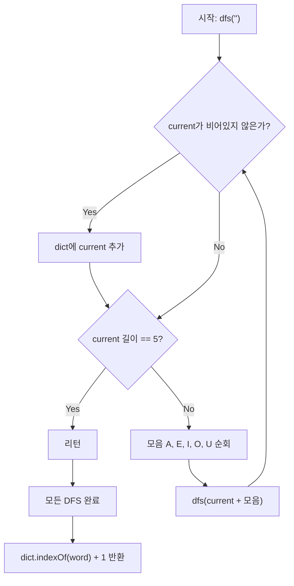

# 모음사전 - DFS 완전탐색 풀이

A, E, I, O, U 5개의 모음으로 만들 수 있는 **1~5글자 단어를 사전순으로 정렬**한 모음사전에서 주어진 단어의 순서를 찾는 문제입니다.

---

## 1. 문제 이해

모음사전의 시작과 끝:

```
1번째: A
2번째: AA
3번째: AAA
4번째: AAAA
5번째: AAAAA
6번째: AAAAE
...
3905번째: UUUUU
```

전체 단어 수: `5 + 5² + 5³ + 5⁴ + 5⁵ = 3905`개

---

## 2. 핵심 아이디어

### 왜 완전탐색이 가능한가?

- 사전 전체 크기가 **최대 3905개**로 매우 작습니다.
- DFS로 사전 전체를 생성한 뒤, 주어진 단어의 인덱스를 찾으면 됩니다.

### DFS로 사전순 생성하는 이유

DFS는 **깊이를 먼저** 탐색합니다. 'A'를 선택하면 AA → AAA → AAAA → AAAAA 순으로 깊이 들어가고, 막힌 뒤 백트래킹하여 AAAAE, AAAAI... 이 됩니다.

이 탐색 순서가 **모음사전의 사전순과 정확히 일치**합니다.

```
DFS 탐색 순서:
A → AA → AAA → AAAA → AAAAA (깊이 5, 되돌아옴)
                      → AAAAE
                      → AAAAI
                      ...
              → AAAE
              ...
```

---

## 3. 알고리즘 단계

```
1. DFS로 사전 전체 생성 (List에 순서대로 저장)
2. List.indexOf(word) + 1 반환 (1-indexed)
```

---

## 4. 코드 설명

```java
class Solution1 {
    private List<String> dict = new ArrayList<>();

    public int solution(String word) {
        dfs("");                          // 빈 문자열부터 DFS 시작
        return dict.indexOf(word) + 1;   // 0-indexed → 1-indexed 변환
    }

    private void dfs(String current) {
        if (!current.isEmpty()) {
            dict.add(current);           // 비어있지 않으면 사전에 추가
        }
        if (current.length() == 5) return; // 최대 5글자 제한

        for (char v : new char[]{'A', 'E', 'I', 'O', 'U'}) {
            dfs(current + v);            // 각 모음을 덧붙여 재귀 호출
        }
    }
}
```

**핵심:** 반복문이 `A→E→I→O→U` 순서로 돌기 때문에, DFS 탐색 결과가 자동으로 사전순이 됩니다.

### JavaScript

```javascript
function solution(word) {
    const dict = [];
    const vowels = ['A', 'E', 'I', 'O', 'U'];

    // DFS로 사전 전체 생성
    function dfs(current) {
        if (current.length > 0) {
            dict.push(current);
        }
        if (current.length === 5) return; // 최대 5글자 제한

        for (const v of vowels) {
            dfs(current + v); // 각 모음을 덧붙여 재귀 호출
        }
    }

    dfs("");
    return dict.indexOf(word) + 1; // 1-indexed
}
```

### C++

```cpp
#include <string>
#include <vector>

using namespace std;

vector<string> dict;

// DFS로 사전 전체 생성
void dfs(string current) {
    if (!current.empty()) {
        dict.push_back(current);
    }
    if (current.length() == 5) return; // 최대 5글자 제한

    for (char v : {'A', 'E', 'I', 'O', 'U'}) {
        dfs(current + v); // 각 모음을 덧붙여 재귀 호출
    }
}

int solution(string word) {
    dict.clear();
    dfs("");

    for (int i = 0; i < dict.size(); i++) {
        if (dict[i] == word) return i + 1; // 1-indexed
    }
    return -1;
}
```

### Rust

```rust
fn solution(word: &str) -> i32 {
    let mut dict: Vec<String> = Vec::new();
    let vowels = ['A', 'E', 'I', 'O', 'U'];

    // DFS로 사전 전체 생성
    fn dfs(current: String, dict: &mut Vec<String>, vowels: &[char]) {
        if !current.is_empty() {
            dict.push(current.clone());
        }
        if current.len() == 5 { return; } // 최대 5글자 제한

        for &v in vowels {
            dfs(format!("{}{}", current, v), dict, vowels);
        }
    }

    dfs(String::new(), &mut dict, &vowels);

    // 단어의 위치를 찾아 1-indexed로 반환
    for (i, w) in dict.iter().enumerate() {
        if w == word {
            return (i + 1) as i32;
        }
    }
    -1
}
```

### Go

```go
package main

func solution(word string) int {
	var dict []string
	vowels := []byte{'A', 'E', 'I', 'O', 'U'}

	// DFS로 사전 전체 생성
	var dfs func(current string)
	dfs = func(current string) {
		if len(current) > 0 {
			dict = append(dict, current)
		}
		if len(current) == 5 { // 최대 5글자 제한
			return
		}
		for _, v := range vowels {
			dfs(current + string(v)) // 각 모음을 덧붙여 재귀 호출
		}
	}

	dfs("")

	// 단어의 위치를 찾아 1-indexed로 반환
	for i, w := range dict {
		if w == word {
			return i + 1
		}
	}
	return -1
}
```

## Mermaid 다이어그램



## 엣지 케이스 분석

| 관점 | 케이스 | 처리 방법 |
|---|---|---|
| 첫 번째 단어 | word = "A" | dict[0]에 저장, indexOf 결과 0+1 = 1 |
| 마지막 단어 | word = "UUUUU" | dict[3904]에 저장, indexOf 결과 3904+1 = 3905 |
| 한 글자 단어 | word = "I" | DFS가 A(1), E(783), I(1565) 순서로 생성 |
| 최대 길이 단어 | word = "AAAAA" | DFS가 A→AA→AAA→AAAA→AAAAA 순서로 5번째에 저장 |
| 모든 모음 포함 | word = "AEIOU" | 각 위치에서 서로 다른 모음 선택, 245번째 |

---

## 5. DFS 트리 시각화 (`word = "AAAAE"` 예시)

```
dfs("")
 └── dfs("A")          → dict[0] = "A"       (1번째)
      └── dfs("AA")    → dict[1] = "AA"      (2번째)
           └── dfs("AAA") → dict[2] = "AAA"  (3번째)
                └── dfs("AAAA") → dict[3]    (4번째)
                     └── dfs("AAAAA") → dict[4] (5번째)
                     └── dfs("AAAAE") → dict[5] (6번째) ← 찾는 단어!
                     ...
```

`indexOf("AAAAE") + 1 = 5 + 1 = 6` ✓

---

## 6. 복잡도 분석

| 풀이 | 시간 복잡도 | 공간 복잡도 | 비고 |
|---|---|---|---|
| DFS 완전탐색 | O(3905) ≈ O(1) | O(3905) | 사전 생성 고정 비용, dict 리스트 저장 |

---

## 7. 예시 검증

| 입력 | 기대 출력 | 확인 |
|------|-----------|------|
| "AAAAE" | 6 | A→AA→AAA→AAAA→AAAAA→AAAAE |
| "AEIOU" | 245 | — |
| "EIO" | 1189 | — |
