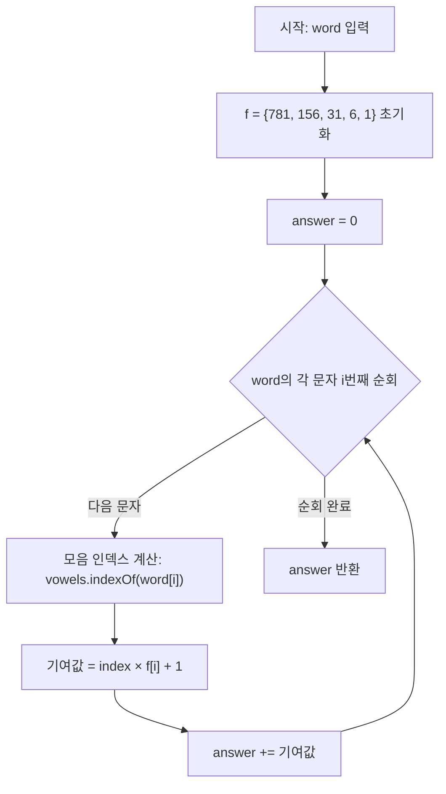

# 모음사전 - 수학적 계산 풀이 (O(L))

DFS로 3905개 단어를 전부 생성하지 않고, **위치 공식**을 이용해 O(단어 길이)에 바로 답을 구하는 방법입니다.

---

## 1. 핵심 관찰: 접두사별 단어 수

특정 접두사 `p`를 공유하는 단어의 수를 `f(len(p))`라 하면:

| 접두사 길이 | 예시 | 해당 단어 수 |
|-------------|------|-------------|
| 1 | "A..." | 1 + 5 + 25 + 125 + 625 = **781** |
| 2 | "AA..." | 1 + 5 + 25 + 125 = **156** |
| 3 | "AAA..." | 1 + 5 + 25 = **31** |
| 4 | "AAAA..." | 1 + 5 = **6** |
| 5 | "AAAAA" | **1** |

이를 배열로 표현: `f[] = {781, 156, 31, 6, 1}`

---

## 2. 공식 도출

단어 `w[0]w[1]...w[L-1]`의 순서를 구하려면:

각 위치 `i`에서:
1. `w[i]` 이전 모음으로 시작하는 모든 단어를 건너뛴다 → `index(w[i]) × f[i]`
2. 현재 위치까지의 접두사(`w[0..i]`) 자체를 1개로 센다 → `+1`

```
rank(w) = Σ (index(w[i]) × f[i] + 1)
          i=0 to L-1
```

---

## 3. 예시로 검증

### "AAAAE" (기댓값 6)

| i | w[i] | index | f[i] | 기여 |
|---|------|-------|------|------|
| 0 | A    | 0     | 781  | 0×781+1 = **1** |
| 1 | A    | 0     | 156  | 0×156+1 = **1** |
| 2 | A    | 0     | 31   | 0×31+1  = **1** |
| 3 | A    | 0     | 6    | 0×6+1   = **1** |
| 4 | E    | 1     | 1    | 1×1+1   = **2** |

합계: 1+1+1+1+2 = **6** ✓

### "AEIOU" (기댓값 245)

| i | w[i] | index | f[i] | 기여 |
|---|------|-------|------|------|
| 0 | A    | 0     | 781  | 0×781+1 = **1** |
| 1 | E    | 1     | 156  | 1×156+1 = **157** |
| 2 | I    | 2     | 31   | 2×31+1  = **63** |
| 3 | O    | 3     | 6    | 3×6+1   = **19** |
| 4 | U    | 4     | 1    | 4×1+1   = **5** |

합계: 1+157+63+19+5 = **245** ✓

### "EIO" (기댓값 1189)

| i | w[i] | index | f[i] | 기여 |
|---|------|-------|------|------|
| 0 | E    | 1     | 781  | 1×781+1 = **782** |
| 1 | I    | 2     | 156  | 2×156+1 = **313** |
| 2 | O    | 3     | 31   | 3×31+1  = **94** |

합계: 782+313+94 = **1189** ✓

---

## 4. 코드 설명

```java
class Solution2 {
    public int solution(String word) {
        int[] f = {781, 156, 31, 6, 1};  // 접두사 길이별 단어 수
        String vowels = "AEIOU";          // indexOf로 모음 인덱스 추출

        int answer = 0;
        for (int i = 0; i < word.length(); i++) {
            // i번 모음 인덱스 × 해당 접두사 길이의 단어 수 + 접두사 자체
            answer += vowels.indexOf(word.charAt(i)) * f[i] + 1;
        }
        return answer;
    }
}
```

### JavaScript

```javascript
function solution(word) {
    const f = [781, 156, 31, 6, 1]; // 접두사 길이별 단어 수
    const vowels = "AEIOU";

    let answer = 0;
    for (let i = 0; i < word.length; i++) {
        // i번 모음 인덱스 × 해당 접두사 길이의 단어 수 + 접두사 자체
        answer += vowels.indexOf(word[i]) * f[i] + 1;
    }
    return answer;
}
```

### C++

```cpp
#include <string>

using namespace std;

int solution(string word) {
    int f[] = {781, 156, 31, 6, 1}; // 접두사 길이별 단어 수
    string vowels = "AEIOU";

    int answer = 0;
    for (int i = 0; i < word.length(); i++) {
        // i번 모음 인덱스 × 해당 접두사 길이의 단어 수 + 접두사 자체
        answer += vowels.find(word[i]) * f[i] + 1;
    }
    return answer;
}
```

### Rust

```rust
fn solution(word: &str) -> i32 {
    let f = [781, 156, 31, 6, 1]; // 접두사 길이별 단어 수
    let vowels = "AEIOU";

    let mut answer = 0;
    for (i, ch) in word.chars().enumerate() {
        // i번 모음 인덱스 × 해당 접두사 길이의 단어 수 + 접두사 자체
        let idx = vowels.find(ch).unwrap() as i32;
        answer += idx * f[i] + 1;
    }
    answer
}
```

### Go

```go
package main

import "strings"

func solution(word string) int {
	f := [5]int{781, 156, 31, 6, 1} // 접두사 길이별 단어 수
	vowels := "AEIOU"

	answer := 0
	for i, ch := range word {
		// i번 모음 인덱스 × 해당 접두사 길이의 단어 수 + 접두사 자체
		idx := strings.IndexRune(vowels, ch)
		answer += idx*f[i] + 1
	}
	return answer
}
```

## Mermaid 다이어그램



## 엣지 케이스 분석

| 관점 | 케이스 | 처리 방법 |
|---|---|---|
| 한 글자 단어 | word = "A" | 0×781+1 = 1 |
| 한 글자 끝 모음 | word = "U" | 4×781+1 = 3125 |
| 최대 길이 마지막 | word = "UUUUU" | 4×781+1 + 4×156+1 + 4×31+1 + 4×6+1 + 4×1+1 = 3905 |
| 혼합 모음 | word = "AEIOU" | 1+157+63+19+5 = 245 |
| 짧은 단어 | word = "EIO" | 782+313+94 = 1189, 나머지 f 값 사용 안 함 |

---

## 5. 공식의 직관적 이해

`"+1"이 들어가는 이유`:

```
"E..."를 계산할 때:
  - A, AA, AAA, ..., UUUUU 중 "A"로 시작하는 모든 단어(781개)를 건너뜀
  - 하지만 "E" 자체(단어)도 위치를 차지함 → +1 필요
```

즉, **각 위치에서 해당 접두사에 해당하는 단어 하나씩을 +1로 누적**하는 것이 핵심입니다.

---

## 6. Solution1 vs Solution2 비교

| 풀이 | 시간 복잡도 | 공간 복잡도 | 비고 |
|---|---|---|---|
| Solution1 (DFS) | O(3905) | O(3905) | 사전 전체 생성, 구현 쉬움 |
| Solution2 (수학) | O(L), L≤5 | O(1) | 위치 공식 사용, 공식 이해 필요 |

코딩테스트에서는 **Solution1(DFS)** 이 직관적이고 빠르게 작성할 수 있어 실전에서 유리합니다.
Solution2는 사전의 크기가 훨씬 커질 경우를 대비한 최적화 방법입니다.
