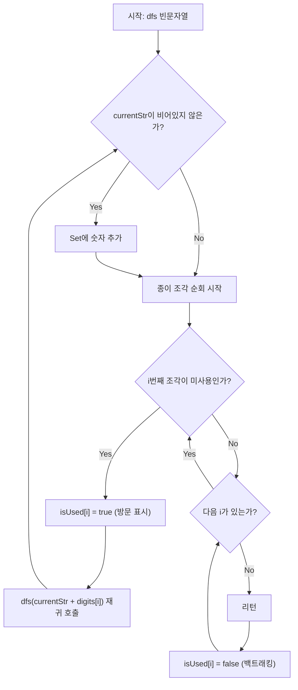

네, 맞습니다! 사용자가 정확하게 보셨습니다. 이 문제는 **DFS(깊이 우선 탐색)**로 푸는 것이 아주 전형적인 방법입니다.

사실 제가 앞서 보여드린 재귀 함수 방식도 넓은 의미에서는 DFS의 일종입니다. 하지만 이번에는 코딩 테스트에서 흔히 "순열/조합을 위한 DFS 표준 패턴"이라고 부르는, **`visited` 배열(방문 여부 체크 배열)을 사용하는 방식**으로 코드를 작성해 보겠습니다. 이 방식이 DFS의 동작 원리를 이해하는 데 더 직관적일 수 있습니다.

### 핵심 아이디어: DFS를 이용한 상태 트리 탐색

우리는 가지고 있는 종이 조각들을 하나씩 선택해서 이어 붙이며 숫자를 만들어 나갑니다. 이때 중요한 것은 **"이미 사용한 종이 조각은 다시 사용할 수 없다"**는 규칙입니다.

이를 위해 DFS 함수는 다음 두 가지 상태를 들고 다녀야 합니다.

1. **만들어진 숫자 문자열**: 현재까지 이어 붙인 결과물
2. **방문 여부(`visited`)**: 몇 번째 종이 조각을 사용했는지 체크하는 배열

---

### Java 솔루션 코드 (DFS + visited 배열 표준 패턴)

```java
import java.util.HashSet;

class Solution {
    // 생성된 모든 숫자를 저장할 Set (중복 제거용)
    HashSet<Integer> generatedNumbers = new HashSet<>();
    // 방문 여부를 체크할 배열
    boolean[] isUsed;
    // 입력받은 숫자 문자열을 전역으로 사용
    String digits;

    public int solution(String numbers) {
        this.digits = numbers;
        // 종이 조각 개수만큼 방문 배열 초기화
        this.isUsed = new boolean[numbers.length()];

        // 1. DFS 시작 (빈 문자열부터 시작)
        dfs("");

        // 2. 생성된 숫자들 중 소수 개수 세기
        int count = 0;
        for (int num : generatedNumbers) {
            if (isPrime(num)) {
                count++;
            }
        }
        return count;
    }

    // DFS 함수: 현재까지 만들어진 문자열 currentStr을 받음
    public void dfs(String currentStr) {
        // 기저 조건(Base Case)은 따로 없으며, 모든 경우를 다 탐색합니다.
        
        // 현재까지 만들어진 문자열이 비어있지 않다면 Set에 추가
        if (!currentStr.equals("")) {
            // "011" -> 11 로 변환되며 Set이 알아서 중복 처리
            generatedNumbers.add(Integer.valueOf(currentStr));
        }

        // 가진 종이 조각들을 모두 순회하며 다음 글자 붙이기 시도
        for (int i = 0; i < digits.length(); i++) {
            // i번째 종이 조각을 아직 사용하지 않았다면
            if (!isUsed[i]) {
                // 1. 체크(방문 표시): 이 조각 사용함
                isUsed[i] = true;
                
                // 2. 들어가기(재귀 호출): 현재 문자열에 이 조각을 붙여서 다음 단계로 진행
                dfs(currentStr + digits.charAt(i));
                
                // 3. 나오기(백트래킹): 다른 조합을 만들기 위해 사용 표시 해제
                isUsed[i] = false;
            }
        }
    }

    // 소수 판별 함수 (효율성 O(sqrt(N)))
    public boolean isPrime(int num) {
        if (num < 2) return false;
        for (int i = 2; i * i <= num; i++) {
            if (num % i == 0) return false;
        }
        return true;
    }
}

```

### DFS 동작 과정 시각화 (ASCII Art)

`numbers = "17"`인 경우 DFS가 어떻게 움직이는지 트리를 따라가 봅시다.
**`[v]`는 `isUsed=true` (방문함), `[ ]`는 `isUsed=false` (미방문) 상태를 나타냅니다.**

```text
시작: dfs("", visited=[ , ])
│
├── 첫 번째 조각 '1' 선택 (인덱스 0)
│   visited=[v, ]가 됨.
│   → dfs("1") 호출
│     Set에 1 추가.
│     │
│     ├── 인덱스 0은 이미 방문([v]). 패스.
│     │
│     └── 인덱스 1('7') 선택
│         visited=[v, v]가 됨.
│         → dfs("17") 호출
│           Set에 17 추가.
│           더 이상 선택할 조각 없음. 리턴.
│         ← 백트래킹: visited=[v, ]로 복구
│     ← 리턴
│   ← 백트래킹: visited=[ , ]로 복구
│
└── 두 번째 조각 '7' 선택 (인덱스 1)
    visited=[ , v]가 됨.
    → dfs("7") 호출
      Set에 7 추가.
      │
      ├── 인덱스 0('1') 선택
      │   visited=[v, v]가 됨.
      │   → dfs("71") 호출
      │     Set에 71 추가.
      │     더 이상 선택할 조각 없음. 리턴.
      │   ← 백트래킹: visited=[ , v]로 복구
      │
      └── 인덱스 1은 이미 방문([v]). 패스.
      ← 리턴
    ← 백트래킹: visited=[ , ]로 복구
끝.

최종 Set 상태: {1, 7, 17, 71}
이 중 소수는 7, 17, 71 -> 결과 3

```

### JavaScript

```javascript
function solution(numbers) {
    const numberSet = new Set();
    const digits = numbers;
    const isUsed = new Array(digits.length).fill(false);

    // DFS 함수: visited 배열을 사용한 표준 패턴
    function dfs(currentStr) {
        if (currentStr.length > 0) {
            numberSet.add(Number(currentStr));
        }

        for (let i = 0; i < digits.length; i++) {
            if (!isUsed[i]) {
                isUsed[i] = true;              // 방문 표시
                dfs(currentStr + digits[i]);   // 재귀 호출
                isUsed[i] = false;             // 백트래킹
            }
        }
    }

    dfs("");

    // 소수 판별
    function isPrime(num) {
        if (num < 2) return false;
        for (let i = 2; i * i <= num; i++) {
            if (num % i === 0) return false;
        }
        return true;
    }

    return [...numberSet].filter(isPrime).length;
}
```

### C++

```cpp
#include <string>
#include <set>

using namespace std;

set<int> generatedNumbers;
bool isUsed[7]; // 종이 조각 최대 7개
string digits;

// 소수 판별 함수
bool isPrime(int n) {
    if (n < 2) return false;
    for (int i = 2; i * i <= n; i++) {
        if (n % i == 0) return false;
    }
    return true;
}

// DFS 함수: visited 배열 사용
void dfs(string currentStr) {
    if (!currentStr.empty()) {
        generatedNumbers.insert(stoi(currentStr));
    }

    for (int i = 0; i < digits.length(); i++) {
        if (!isUsed[i]) {
            isUsed[i] = true;                          // 방문 표시
            dfs(currentStr + digits[i]);               // 재귀 호출
            isUsed[i] = false;                         // 백트래킹
        }
    }
}

int solution(string numbers) {
    generatedNumbers.clear();
    fill(isUsed, isUsed + 7, false);
    digits = numbers;

    dfs("");

    int count = 0;
    for (int num : generatedNumbers) {
        if (isPrime(num)) count++;
    }
    return count;
}
```

### Rust

```rust
use std::collections::HashSet;

fn solution(numbers: &str) -> i32 {
    let mut generated: HashSet<i64> = HashSet::new();
    let digits: Vec<char> = numbers.chars().collect();
    let mut is_used = vec![false; digits.len()];

    // DFS 함수: visited 배열 사용
    fn dfs(
        digits: &[char],
        is_used: &mut Vec<bool>,
        current: String,
        generated: &mut HashSet<i64>,
    ) {
        if !current.is_empty() {
            if let Ok(num) = current.parse::<i64>() {
                generated.insert(num);
            }
        }
        for i in 0..digits.len() {
            if !is_used[i] {
                is_used[i] = true;              // 방문 표시
                dfs(digits, is_used, current.clone() + &digits[i].to_string(), generated);
                is_used[i] = false;             // 백트래킹
            }
        }
    }

    dfs(&digits, &mut is_used, String::new(), &mut generated);

    // 소수 개수 반환
    generated.iter().filter(|&&n| is_prime(n)).count() as i32
}

// 소수 판별 함수
fn is_prime(n: i64) -> bool {
    if n < 2 { return false; }
    let mut i = 2;
    while i * i <= n {
        if n % i == 0 { return false; }
        i += 1;
    }
    true
}
```

### Go

```go
package main

import (
	"strconv"
)

// 소수 판별 함수
func isPrime(n int) bool {
	if n < 2 {
		return false
	}
	for i := 2; i*i <= n; i++ {
		if n%i == 0 {
			return false
		}
	}
	return true
}

func solution(numbers string) int {
	generated := make(map[int]bool)
	digits := []byte(numbers)
	isUsed := make([]bool, len(digits))

	// DFS 함수: visited 배열 사용
	var dfs func(current string)
	dfs = func(current string) {
		if len(current) > 0 {
			num, _ := strconv.Atoi(current)
			generated[num] = true
		}
		for i := 0; i < len(digits); i++ {
			if !isUsed[i] {
				isUsed[i] = true                        // 방문 표시
				dfs(current + string(digits[i]))        // 재귀 호출
				isUsed[i] = false                       // 백트래킹
			}
		}
	}

	dfs("")

	// 소수 개수 세기
	count := 0
	for num := range generated {
		if isPrime(num) {
			count++
		}
	}
	return count
}
```

---

## Mermaid 다이어그램



## 엣지 케이스 분석

| 관점 | 케이스 | 처리 방법 |
|---|---|---|
| 중복 숫자 카드 | numbers = "011" | Integer.valueOf로 앞자리 0 제거, Set으로 중복된 값 자동 제거 |
| 한 장의 카드 | numbers = "2" | DFS가 "2" 하나만 생성, 소수이므로 1 반환 |
| 모든 카드가 0 | numbers = "000" | 0만 생성되며 소수가 아니므로 0 반환 |
| visited 배열 역할 | numbers = "77" | isUsed로 같은 인덱스를 중복 사용 방지, "77"은 정상 생성 |
| 최대 길이 | numbers = "1234567" | 7! = 5040개 순열 생성, Set으로 중복 제거 후 소수 판별 |

### 이 코드가 "표준 DFS"인 이유

이전 코드(문자열 자르기 방식)와 이번 코드(`visited` 배열 방식)는 결과적으로 같은 일을 하지만, 이 방식이 더 표준적인 DFS입니다.

1. **상태 관리의 명확성**: `isUsed` 배열을 통해 어떤 노드(종이 조각)를 방문했는지 명시적으로 관리합니다.
2. **백트래킹(Backtracking)**: `isUsed[i] = true;` (들어가기 전 체크)와 `isUsed[i] = false;` (나온 후 체크 해제)를 통해 트리의 깊은 곳을 탐색하고 다시 돌아오는 과정이 명확하게 보입니다.

이 패턴은 순열, 조합, 미로 찾기 등 수많은 문제에서 기본이 되는 형태이므로 꼭 익혀두시기를 권장합니다! 이해가 잘 되셨나요?

---

## 복잡도 분석

| 풀이 | 시간 복잡도 | 공간 복잡도 | 비고 |
|---|---|---|---|
| DFS + visited 배열 | O(N! × N + K × √M) | O(N!) | N=숫자 개수(최대 7), K=생성된 숫자 수, M=최대 숫자값. visited 배열로 상태 관리 |