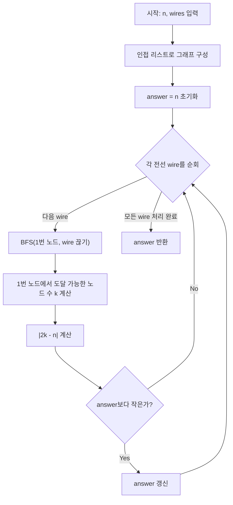

# 전력망을 둘로 나누기 - BFS 완전탐색 풀이

이 문제는 **트리에서 전선 하나를 끊어** 두 그룹의 송전탑 수 차이를 최소화하는 전형적인 **완전탐색(Brute Force)** 문제입니다.

---

## 1. 문제 이해

- `n`개의 송전탑이 **트리(사이클 없는 연결 그래프)** 형태로 연결되어 있습니다.
- 전선(`wires`) 중 하나를 끊으면 트리가 **정확히 두 그룹**으로 나뉩니다.
- 모든 전선에 대해 끊었을 때의 두 그룹 크기 차이를 구하고, 그 **최솟값**을 반환합니다.

```
예시 (n=9):
  1 - 3 - 4 - 5
      |   |
      2   6
          |
          7 - 8
              |
              9
```

---

## 2. 핵심 아이디어

### 왜 완전탐색이 가능한가?

- 전선의 수 = `n - 1`개 (트리 성질)
- `n ≤ 100`이므로 최대 99개의 전선만 확인하면 됩니다.
- 전선 하나 제거 후 BFS 탐색: O(n)
- 전체 시간복잡도: O(n²) → 충분히 빠릅니다.

### 한쪽만 세면 되는 이유

전선을 끊으면 두 그룹이 생깁니다. 1번 노드가 속한 그룹의 크기를 `k`라 하면:
- 나머지 그룹 크기 = `n - k`
- 차이 = `|k - (n - k)| = |2k - n|`

즉, **1번 노드에서 BFS로 도달 가능한 노드 수**만 세면 됩니다.

---

## 3. 알고리즘 단계

```
1. 인접 리스트로 그래프 구성
2. 각 전선(wire)에 대해:
   a. 해당 전선을 끊은 것처럼 BFS 수행
   b. 1번 노드에서 도달 가능한 노드 수 k 계산
   c. |2k - n| 을 answer와 비교하여 최솟값 갱신
3. answer 반환
```

---

## 4. 코드 설명

```java
public int solution(int n, int[][] wires) {
    int answer = n;  // 최악의 경우 차이는 n을 넘을 수 없음

    // 인접 리스트 구성 (양방향)
    List<List<Integer>> graph = new ArrayList<>();
    for (int i = 0; i <= n; i++) graph.add(new ArrayList<>());
    for (int[] wire : wires) {
        graph.get(wire[0]).add(wire[1]);
        graph.get(wire[1]).add(wire[0]);
    }

    // 각 전선을 하나씩 끊어보며 BFS 수행
    for (int[] wire : wires) {
        int count = bfs(n, graph, wire[0], wire[1]);  // wire를 끊었을 때 1번 그룹 크기
        answer = Math.min(answer, Math.abs(2 * count - n));
    }
    return answer;
}
```

```java
private int bfs(int n, List<List<Integer>> graph, int cut1, int cut2) {
    boolean[] visited = new boolean[n + 1];
    Queue<Integer> queue = new LinkedList<>();
    queue.add(1); visited[1] = true;
    int count = 0;
    while (!queue.isEmpty()) {
        int curr = queue.poll(); count++;
        for (int next : graph.get(curr)) {
            if (!visited[next]
                && !(curr == cut1 && next == cut2)   // 끊을 전선의 한쪽 방향
                && !(curr == cut2 && next == cut1)) { // 끊을 전선의 반대 방향
                visited[next] = true; queue.add(next);
            }
        }
    }
    return count;  // 1번 노드가 속한 그룹의 크기
}
```

**핵심 조건:** 전선 `(cut1, cut2)`를 실제로 삭제하지 않고, BFS 탐색 중 해당 간선을 **무시(skip)** 합니다. 양방향 간선이므로 두 방향 모두 차단합니다.

### JavaScript

```javascript
function solution(n, wires) {
    // 인접 리스트 구성 (양방향)
    const graph = Array.from({ length: n + 1 }, () => []);
    for (const [a, b] of wires) {
        graph[a].push(b);
        graph[b].push(a);
    }

    // BFS: cut1-cut2 간선을 끊은 상태에서 1번 노드 그룹 크기 반환
    function bfs(cut1, cut2) {
        const visited = new Array(n + 1).fill(false);
        const queue = [1];
        visited[1] = true;
        let count = 0;

        while (queue.length > 0) {
            const curr = queue.shift();
            count++;
            for (const next of graph[curr]) {
                if (!visited[next]
                    && !(curr === cut1 && next === cut2)
                    && !(curr === cut2 && next === cut1)) {
                    visited[next] = true;
                    queue.push(next);
                }
            }
        }
        return count;
    }

    let answer = n;
    for (const [a, b] of wires) {
        const count = bfs(a, b);
        answer = Math.min(answer, Math.abs(2 * count - n));
    }
    return answer;
}
```

### C++

```cpp
#include <vector>
#include <queue>
#include <cmath>
#include <algorithm>

using namespace std;

// BFS: cut1-cut2 간선을 끊은 상태에서 1번 노드 그룹 크기 반환
int bfs(int n, vector<vector<int>>& graph, int cut1, int cut2) {
    vector<bool> visited(n + 1, false);
    queue<int> q;
    q.push(1);
    visited[1] = true;
    int count = 0;

    while (!q.empty()) {
        int curr = q.front(); q.pop();
        count++;
        for (int next : graph[curr]) {
            if (!visited[next]
                && !(curr == cut1 && next == cut2)
                && !(curr == cut2 && next == cut1)) {
                visited[next] = true;
                q.push(next);
            }
        }
    }
    return count;
}

int solution(int n, vector<vector<int>> wires) {
    // 인접 리스트 구성 (양방향)
    vector<vector<int>> graph(n + 1);
    for (auto& w : wires) {
        graph[w[0]].push_back(w[1]);
        graph[w[1]].push_back(w[0]);
    }

    int answer = n;
    for (auto& w : wires) {
        int count = bfs(n, graph, w[0], w[1]);
        answer = min(answer, abs(2 * count - n));
    }
    return answer;
}
```

### Rust

```rust
use std::collections::VecDeque;

fn solution(n: i32, wires: Vec<Vec<i32>>) -> i32 {
    let n = n as usize;

    // 인접 리스트 구성 (양방향)
    let mut graph = vec![vec![]; n + 1];
    for w in &wires {
        graph[w[0] as usize].push(w[1] as usize);
        graph[w[1] as usize].push(w[0] as usize);
    }

    // BFS: cut1-cut2 간선을 끊은 상태에서 1번 노드 그룹 크기 반환
    let bfs = |cut1: usize, cut2: usize| -> i32 {
        let mut visited = vec![false; n + 1];
        let mut queue = VecDeque::new();
        queue.push_back(1);
        visited[1] = true;
        let mut count = 0;

        while let Some(curr) = queue.pop_front() {
            count += 1;
            for &next in &graph[curr] {
                if !visited[next]
                    && !(curr == cut1 && next == cut2)
                    && !(curr == cut2 && next == cut1)
                {
                    visited[next] = true;
                    queue.push_back(next);
                }
            }
        }
        count
    };

    let mut answer = n as i32;
    for w in &wires {
        let count = bfs(w[0] as usize, w[1] as usize);
        answer = answer.min((2 * count - n as i32).abs());
    }
    answer
}
```

### Go

```go
package main

func solution(n int, wires [][]int) int {
	// 인접 리스트 구성 (양방향)
	graph := make([][]int, n+1)
	for i := range graph {
		graph[i] = []int{}
	}
	for _, w := range wires {
		graph[w[0]] = append(graph[w[0]], w[1])
		graph[w[1]] = append(graph[w[1]], w[0])
	}

	// BFS: cut1-cut2 간선을 끊은 상태에서 1번 노드 그룹 크기 반환
	bfs := func(cut1, cut2 int) int {
		visited := make([]bool, n+1)
		queue := []int{1}
		visited[1] = true
		count := 0

		for len(queue) > 0 {
			curr := queue[0]
			queue = queue[1:]
			count++
			for _, next := range graph[curr] {
				if !visited[next] &&
					!(curr == cut1 && next == cut2) &&
					!(curr == cut2 && next == cut1) {
					visited[next] = true
					queue = append(queue, next)
				}
			}
		}
		return count
	}

	answer := n
	for _, w := range wires {
		count := bfs(w[0], w[1])
		diff := 2*count - n
		if diff < 0 {
			diff = -diff
		}
		if diff < answer {
			answer = diff
		}
	}
	return answer
}
```

## Mermaid 다이어그램



## 엣지 케이스 분석

| 관점 | 케이스 | 처리 방법 |
|---|---|---|
| 최소 입력 | n=2, wires=[[1,2]] | 전선 하나만 끊으면 각 1개씩, 차이 = 0 |
| 일직선 트리 | n=4, wires=[[1,2],[2,3],[3,4]] | 가운데 [2,3] 끊으면 2:2로 차이 0 |
| 별 모양 트리 | 중앙 노드에 모든 노드 연결 | 어느 전선을 끊어도 1 vs n-1, 차이 = n-2 |
| 균형 이진 트리 | 완전 이진 트리 형태 | 루트 근처 전선을 끊을수록 균등 분할 가능 |

---

## 5. 복잡도 분석

| 풀이 | 시간 복잡도 | 공간 복잡도 | 비고 |
|---|---|---|---|
| BFS 완전탐색 | O(n²) | O(n) | 전선 n-1개 × BFS O(n), 그래프 + visited 배열 |

---

## 6. 예시로 확인 (n=9)

```
wires = [[1,3],[2,3],[3,4],[4,5],[4,6],[4,7],[7,8],[7,9]]
```

전선 `[4,7]`을 끊는 경우:
```
그룹 A (1번 소속): 1-3-2, 3-4-5, 4-6  → 6개
그룹 B: 7-8, 7-9                        → 3개
차이: |6 - 3| = 3
```

다른 전선들도 확인하면 최솟값이 **3**임을 알 수 있습니다.

---

## 7. BFS vs DFS

이 문제는 BFS와 DFS 둘 다 사용 가능합니다.

| | BFS (Solution1) | DFS (Solution2) |
|--|--|--|
| 구현 방식 | Queue 반복문 | 재귀 호출 |
| 장점 | 직관적, 스택 오버플로 없음 | 코드 간결 |
| 성능 | 동일 O(n²) | 동일 O(n²) |
