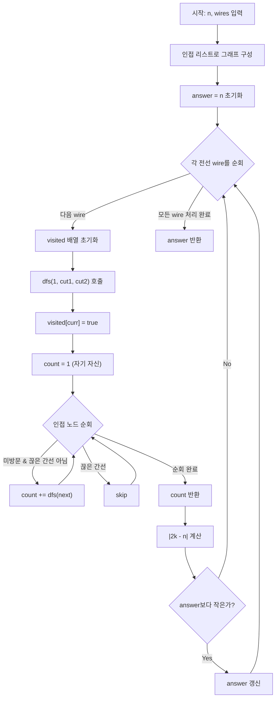

# 전력망을 둘로 나누기 - DFS 완전탐색 풀이 (재귀)

Solution1(BFS)과 동일한 완전탐색 전략을 사용하지만, **DFS 재귀**로 구현합니다.
재귀 함수가 **서브트리의 노드 수를 반환**하는 구조가 핵심입니다.

---

## 1. BFS와 무엇이 다른가?

| | Solution1 (BFS) | Solution2 (DFS) |
|--|--|--|
| 탐색 방식 | Queue + 반복문 | 재귀 호출 |
| 카운트 방법 | `count++` 반복 | 재귀 반환값 누적 |
| 코드 길이 | 조금 더 김 | 더 짧고 간결 |
| 스택 오버플로 | 없음 | n≤100이므로 안전 |

핵심 아이디어(`|2k-n|` 공식, 끊은 전선 무시)는 완전히 동일합니다.

---

## 2. DFS 재귀의 핵심: 반환값 활용

BFS에서는 노드를 방문할 때마다 `count++`로 개수를 셌습니다.
DFS 재귀에서는 **각 호출이 자신의 서브트리 크기를 반환**합니다.

```
dfs(노드) = 1(자기 자신) + dfs(자식1) + dfs(자식2) + ...
```

이 패턴은 트리에서 서브트리 크기를 구하는 전형적인 방식입니다.

---

## 3. 알고리즘 단계

```
1. 인접 리스트로 그래프 구성
2. 각 전선(wire)에 대해:
   a. visited 배열 초기화
   b. dfs(1, wire[0], wire[1]) 호출 → 1번 그룹 크기 k 반환
   c. |2k - n| 을 answer와 비교하여 최솟값 갱신
3. answer 반환
```

---

## 4. 코드 설명

```java
public int solution(int n, int[][] wires) {
    int answer = n;
    graph = new ArrayList<>();
    for (int i = 0; i <= n; i++) graph.add(new ArrayList<>());
    for (int[] wire : wires) {
        graph.get(wire[0]).add(wire[1]);
        graph.get(wire[1]).add(wire[0]);
    }

    for (int[] wire : wires) {
        visited = new boolean[n + 1];          // 전선마다 visited 초기화
        int count = dfs(1, wire[0], wire[1]);  // 1번 노드에서 DFS 시작
        answer = Math.min(answer, Math.abs(2 * count - n));
    }
    return answer;
}
```

```java
private int dfs(int curr, int cut1, int cut2) {
    visited[curr] = true;
    int count = 1;  // 현재 노드 자신을 1로 시작

    for (int next : graph.get(curr)) {
        if (!visited[next]
            && !(curr == cut1 && next == cut2)   // 끊을 전선 방향 1 차단
            && !(curr == cut2 && next == cut1)) { // 끊을 전선 방향 2 차단
            count += dfs(next, cut1, cut2);  // 자식 서브트리 크기 누적
        }
    }
    return count;  // 내 서브트리(나 포함) 총 노드 수
}
```

### JavaScript

```javascript
function solution(n, wires) {
    // 인접 리스트 구성 (양방향)
    const graph = Array.from({ length: n + 1 }, () => []);
    for (const [a, b] of wires) {
        graph[a].push(b);
        graph[b].push(a);
    }

    let answer = n;

    for (const [cut1, cut2] of wires) {
        const visited = new Array(n + 1).fill(false);

        // DFS: 재귀로 서브트리 크기 반환
        function dfs(curr) {
            visited[curr] = true;
            let count = 1; // 현재 노드 자신

            for (const next of graph[curr]) {
                if (!visited[next]
                    && !(curr === cut1 && next === cut2)
                    && !(curr === cut2 && next === cut1)) {
                    count += dfs(next); // 자식 서브트리 크기 누적
                }
            }
            return count;
        }

        const count = dfs(1);
        answer = Math.min(answer, Math.abs(2 * count - n));
    }

    return answer;
}
```

### C++

```cpp
#include <vector>
#include <cmath>
#include <algorithm>

using namespace std;

vector<vector<int>> graph;
vector<bool> visited;

// DFS: 재귀로 서브트리 크기 반환
int dfs(int curr, int cut1, int cut2) {
    visited[curr] = true;
    int count = 1; // 현재 노드 자신

    for (int next : graph[curr]) {
        if (!visited[next]
            && !(curr == cut1 && next == cut2)
            && !(curr == cut2 && next == cut1)) {
            count += dfs(next, cut1, cut2); // 자식 서브트리 크기 누적
        }
    }
    return count;
}

int solution(int n, vector<vector<int>> wires) {
    // 인접 리스트 구성 (양방향)
    graph.assign(n + 1, vector<int>());
    for (auto& w : wires) {
        graph[w[0]].push_back(w[1]);
        graph[w[1]].push_back(w[0]);
    }

    int answer = n;
    for (auto& w : wires) {
        visited.assign(n + 1, false);
        int count = dfs(1, w[0], w[1]);
        answer = min(answer, abs(2 * count - n));
    }
    return answer;
}
```

### Rust

```rust
fn solution(n: i32, wires: Vec<Vec<i32>>) -> i32 {
    let n = n as usize;

    // 인접 리스트 구성 (양방향)
    let mut graph = vec![vec![]; n + 1];
    for w in &wires {
        graph[w[0] as usize].push(w[1] as usize);
        graph[w[1] as usize].push(w[0] as usize);
    }

    // DFS: 재귀로 서브트리 크기 반환
    fn dfs(
        curr: usize,
        cut1: usize,
        cut2: usize,
        graph: &Vec<Vec<usize>>,
        visited: &mut Vec<bool>,
    ) -> i32 {
        visited[curr] = true;
        let mut count = 1; // 현재 노드 자신

        for &next in &graph[curr] {
            if !visited[next]
                && !(curr == cut1 && next == cut2)
                && !(curr == cut2 && next == cut1)
            {
                count += dfs(next, cut1, cut2, graph, visited);
            }
        }
        count
    }

    let mut answer = n as i32;
    for w in &wires {
        let mut visited = vec![false; n + 1];
        let count = dfs(1, w[0] as usize, w[1] as usize, &graph, &mut visited);
        answer = answer.min((2 * count - n as i32).abs());
    }
    answer
}
```

### Go

```go
package main

func solution(n int, wires [][]int) int {
	// 인접 리스트 구성 (양방향)
	graph := make([][]int, n+1)
	for i := range graph {
		graph[i] = []int{}
	}
	for _, w := range wires {
		graph[w[0]] = append(graph[w[0]], w[1])
		graph[w[1]] = append(graph[w[1]], w[0])
	}

	answer := n

	for _, w := range wires {
		visited := make([]bool, n+1)
		cut1, cut2 := w[0], w[1]

		// DFS: 재귀로 서브트리 크기 반환
		var dfs func(curr int) int
		dfs = func(curr int) int {
			visited[curr] = true
			count := 1 // 현재 노드 자신

			for _, next := range graph[curr] {
				if !visited[next] &&
					!(curr == cut1 && next == cut2) &&
					!(curr == cut2 && next == cut1) {
					count += dfs(next) // 자식 서브트리 크기 누적
				}
			}
			return count
		}

		count := dfs(1)
		diff := 2*count - n
		if diff < 0 {
			diff = -diff
		}
		if diff < answer {
			answer = diff
		}
	}

	return answer
}
```

## Mermaid 다이어그램



## 엣지 케이스 분석

| 관점 | 케이스 | 처리 방법 |
|---|---|---|
| 최소 입력 | n=2, wires=[[1,2]] | DFS가 1번 노드만 방문, count=1, |2-2|=0 |
| 일직선 트리 | n=4, wires=[[1,2],[2,3],[3,4]] | 가운데 끊으면 2:2, 양 끝 끊으면 1:3 |
| 별 모양 트리 | 중앙에 모든 노드 연결 | DFS 재귀 깊이 2로 매우 얕음 |
| 재귀 깊이 최대 | n=100, 일직선 | 재귀 깊이 최대 100, 스택 오버플로 안전 |

---

## 5. DFS 호출 흐름 시각화

전선 `[4,7]`을 끊는 경우 (n=9, 예시 1):

```
트리 구조:
  1 - 3 - 4 - 5
      |   |
      2   6
          |
          7 - 8    ← [4,7] 끊음
              |
              9
```

```
dfs(1, 4, 7)
 └── → dfs(3, 4, 7)            [3 탐색]
        ├── → dfs(2, 4, 7)     [2 탐색] → 리턴 1
        └── → dfs(4, 4, 7)     [4 탐색]
               ├── → dfs(5, 4, 7) → 리턴 1
               ├── → dfs(6, 4, 7) → 리턴 1
               └── next=7: cut1==curr(4), cut2==next(7) → 차단!
               ↑ 리턴 1+1+1 = 3
        ↑ 리턴 1+1+3 = 5
 ↑ 리턴 1+5 = 6

count = 6
|2×6 - 9| = |12 - 9| = 3
```

---

## 6. 재귀 vs 반복 (BFS) 선택 기준

| 상황 | 추천 |
|------|------|
| n이 작고 코드 간결성이 중요 | DFS 재귀 |
| n이 크거나 스택 오버플로 우려 | BFS 반복 |
| 면접/코테 기본 패턴 연습 | DFS 재귀 (트리 크기 계산 패턴) |

이 문제는 `n ≤ 100`이므로 재귀 깊이가 최대 100 수준이라 DFS 재귀가 안전합니다.

---

## 7. 복잡도 분석

| 풀이 | 시간 복잡도 | 공간 복잡도 | 비고 |
|---|---|---|---|
| DFS 완전탐색 | O(n²) | O(n) | 전선 n-1개 × DFS O(n), 그래프 + visited + 재귀 스택 |

---

## 8. 예시 검증

| 입력 | 기대 출력 | 확인 |
|------|-----------|------|
| n=9, wires=[[1,3],[2,3],[3,4],[4,5],[4,6],[4,7],[7,8],[7,9]] | 3 | [4,7] 끊기: 6 vs 3 |
| n=4, wires=[[1,2],[2,3],[3,4]] | 0 | [2,3] 끊기: 2 vs 2 |
| n=7, wires=[[1,2],[2,7],[3,7],[3,4],[4,5],[6,7]] | 1 | [2,7] 끊기: 3 vs 4 |
