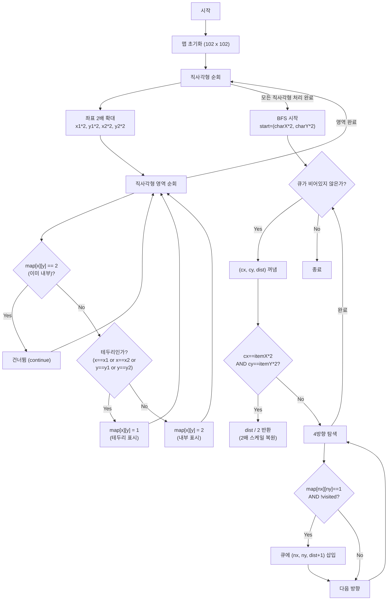

네, 물론입니다! 이 문제는 프로그래머스의 '아이템 줍기'라는 문제로, **BFS(너비 우선 탐색)**를 활용한 최단 거리 문제입니다.

하지만 단순히 BFS만 적용하면 풀 수 없는 **치명적인 함정**이 하나 있습니다. 바로 좌표 문제인데요, 이 문제를 해결하는 **핵심 테크닉(좌표 2배 확대)**과 함께 Java 풀이를 상세하게 설명해 드리겠습니다.

---

### 1. 핵심 전략: 좌표 2배 확대 (Coordinate Scaling)

#### 왜 그냥 풀면 안 되나요?

일반적인 2차원 배열 격자에서는 `(1,1)`과 `(1,2)`가 붙어 있지만, 기하학적 도형의 테두리에서는 상황이 다릅니다.

예를 들어, ㄷ자 모양의 경로가 있을 때 `(3, 5)`와 `(4, 5)`가 좌표상으로는 붙어 있어 보이지만, 실제로는 벽으로 막혀 있어 돌아가야 하는 경우가 있습니다. 1칸 단위의 격자에서는 이 "끊어진 길"과 "이어진 길"을 구분하기가 어렵습니다. 이로 인해 BFS가 테두리를 따라가지 않고 **가로질러버리는 오류**가 발생합니다.

#### 해결책: 맵을 2배로 키우기

모든 직사각형의 좌표를 **2배**로 늘립니다.

*  크기의 칸이 가 되면서, 테두리와 내부 공간 사이에 명확한 "빈 공간"이 생깁니다.
* 이렇게 하면 BFS가 경로를 건너뛰지 않고 테두리를 정직하게 따라가게 됩니다.
* 마지막에 구한 거리를 다시 **2로 나누면** 정답이 됩니다.

---

### 2. Java 솔루션 코드

```java
import java.util.*;

class Solution {
    // 맵의 최대 크기: 좌표값 50 * 2배 = 100, 여유분 포함 102
    static int[][] map;
    static int answer;
    
    // 상하좌우 이동 방향
    static int[] dx = {-1, 1, 0, 0};
    static int[] dy = {0, 0, -1, 1};
    
    public int solution(int[][] rectangle, int characterX, int characterY, int itemX, int itemY) {
        answer = 0;
        
        // 1. 맵 초기화 (모든 좌표를 2배로 늘림)
        map = new int[102][102];
        
        // 2. 테두리와 내부 채우기
        for (int[] rect : rectangle) {
            int x1 = rect[0] * 2;
            int y1 = rect[1] * 2;
            int x2 = rect[2] * 2;
            int y2 = rect[3] * 2;
            
            for (int x = x1; x <= x2; x++) {
                for (int y = y1; y <= y2; y++) {
                    // 이미 내부(2)로 채워진 곳은 건너뜀 (내부가 테두리보다 우선순위 높음)
                    if (map[x][y] == 2) continue;
                    
                    // 현재 검사 중인 부분이 2배 늘린 직사각형의 테두리인지 확인
                    if (x == x1 || x == x2 || y == y1 || y == y2) {
                        // 테두리면 1로 표시
                        map[x][y] = 1; 
                    } else {
                        // 테두리가 아니면 내부이므로 2로 표시
                        map[x][y] = 2;
                    }
                }
            }
        }
        
        // 3. BFS 탐색 시작 (시작점과 도착점도 2배)
        bfs(characterX * 2, characterY * 2, itemX * 2, itemY * 2);
        
        return answer;
    }
    
    private void bfs(int startX, int startY, int itemX, int itemY) {
        boolean[][] visited = new boolean[102][102];
        Queue<int[]> queue = new LinkedList<>();
        
        // x좌표, y좌표, 현재 이동 거리
        queue.add(new int[]{startX, startY, 0});
        visited[startX][startY] = true;
        
        while (!queue.isEmpty()) {
            int[] curr = queue.poll();
            int cx = curr[0];
            int cy = curr[1];
            int dist = curr[2];
            
            // 목표 지점 도달 시 종료
            if (cx == itemX && cy == itemY) {
                // 2배로 늘렸으니 결과는 2로 나눠줌
                answer = dist / 2;
                return;
            }
            
            for (int i = 0; i < 4; i++) {
                int nx = cx + dx[i];
                int ny = cy + dy[i];
                
                // 맵 범위 체크
                if (nx < 0 || ny < 0 || nx >= 102 || ny >= 102) continue;
                
                // 방문하지 않았고, 테두리(1)인 경우에만 이동
                if (!visited[nx][ny] && map[nx][ny] == 1) {
                    visited[nx][ny] = true;
                    queue.add(new int[]{nx, ny, dist + 1});
                }
            }
        }
    }
}

```

---

### 3. 코드 상세 설명

#### Step 1: 맵 그리기 (`for` 루프 부분)

이 문제에서 가장 중요한 부분입니다. 직사각형이 겹쳤을 때, 가장 바깥쪽 테두리만 남기는 로직입니다.

1. 모든 좌표를 2배(`*2`) 합니다.
2. 이중 for문을 돌며 직사각형 영역을 채웁니다.
* **테두리(`1`)**: `x`나 `y`가 시작점 혹은 끝점일 때.
* **내부(`2`)**: 테두리가 아닌 안쪽 공간일 때.


3. **중요한 조건**: `if (map[x][y] == 2) continue;`
* 만약 어떤 점이 다른 직사각형의 '내부'라면, 그 점은 절대 테두리가 될 수 없습니다.
* 따라서 이미 `2`(내부)로 마킹된 곳은 `1`(테두리)로 덮어쓰지 않도록 방어합니다. 이 로직 덕분에 직사각형이 겹쳤을 때, 안쪽 선들은 사라지고 가장 바깥쪽 윤곽선만 `1`로 남게 됩니다.


#### Step 2: BFS 탐색

일반적인 미로 찾기 문제와 동일합니다.

1. `visited` 배열로 방문 여부를 체크하여 뱅글뱅글 도는 것을 방지합니다.
2. `map[nx][ny] == 1`인 곳(테두리)으로만 이동합니다.
3. 목표 지점에 도달하면 `dist / 2`를 반환합니다. (처음에 2배 늘렸던 것을 원복)

### 정리

이 문제는 **"좌표 2배 확대"**라는 아이디어만 떠올리면 나머지는 평범한 BFS 구현 문제입니다. 코딩 테스트에서 기하학적 도형의 테두리 문제가 나오면 이 기법을 꼭 기억하세요!

---

## Mermaid 다이어그램

아래 다이어그램은 좌표 2배 확대 + BFS 탐색의 전체 흐름을 시각화한 것입니다.



---

## 다국어 솔루션

### JavaScript

```javascript
function solution(rectangle, characterX, characterY, itemX, itemY) {
    // 맵 초기화 (좌표 2배 확대)
    const map = Array.from({length: 102}, () => new Array(102).fill(0));
    const dx = [-1, 1, 0, 0];
    const dy = [0, 0, -1, 1];

    // 직사각형 테두리와 내부 채우기
    for (const [rx1, ry1, rx2, ry2] of rectangle) {
        const x1 = rx1 * 2, y1 = ry1 * 2, x2 = rx2 * 2, y2 = ry2 * 2;
        for (let x = x1; x <= x2; x++) {
            for (let y = y1; y <= y2; y++) {
                if (map[x][y] === 2) continue; // 이미 내부로 채워진 곳은 건너뜀
                if (x === x1 || x === x2 || y === y1 || y === y2) {
                    map[x][y] = 1; // 테두리
                } else {
                    map[x][y] = 2; // 내부
                }
            }
        }
    }

    // BFS 탐색 (시작점과 도착점도 2배)
    const startX = characterX * 2, startY = characterY * 2;
    const goalX = itemX * 2, goalY = itemY * 2;
    const visited = Array.from({length: 102}, () => new Array(102).fill(false));
    const queue = [[startX, startY, 0]];
    visited[startX][startY] = true;

    while (queue.length > 0) {
        const [cx, cy, dist] = queue.shift();
        if (cx === goalX && cy === goalY) return dist / 2;

        for (let i = 0; i < 4; i++) {
            const nx = cx + dx[i], ny = cy + dy[i];
            if (nx >= 0 && ny >= 0 && nx < 102 && ny < 102) {
                if (!visited[nx][ny] && map[nx][ny] === 1) {
                    visited[nx][ny] = true;
                    queue.push([nx, ny, dist + 1]);
                }
            }
        }
    }

    return 0;
}
```

### C++

```cpp
#include <vector>
#include <queue>
using namespace std;

int solution(vector<vector<int>> rectangle, int characterX, int characterY, int itemX, int itemY) {
    // 맵 초기화 (좌표 2배 확대)
    int map_board[102][102] = {0};
    int dx[] = {-1, 1, 0, 0};
    int dy[] = {0, 0, -1, 1};

    // 직사각형 테두리와 내부 채우기
    for (auto& rect : rectangle) {
        int x1 = rect[0] * 2, y1 = rect[1] * 2;
        int x2 = rect[2] * 2, y2 = rect[3] * 2;
        for (int x = x1; x <= x2; x++) {
            for (int y = y1; y <= y2; y++) {
                if (map_board[x][y] == 2) continue;
                if (x == x1 || x == x2 || y == y1 || y == y2) {
                    map_board[x][y] = 1; // 테두리
                } else {
                    map_board[x][y] = 2; // 내부
                }
            }
        }
    }

    // BFS 탐색
    bool visited[102][102] = {false};
    queue<tuple<int, int, int>> q;
    int sx = characterX * 2, sy = characterY * 2;
    int gx = itemX * 2, gy = itemY * 2;

    q.push({sx, sy, 0});
    visited[sx][sy] = true;

    while (!q.empty()) {
        auto [cx, cy, dist] = q.front();
        q.pop();

        if (cx == gx && cy == gy) return dist / 2;

        for (int i = 0; i < 4; i++) {
            int nx = cx + dx[i], ny = cy + dy[i];
            if (nx >= 0 && ny >= 0 && nx < 102 && ny < 102) {
                if (!visited[nx][ny] && map_board[nx][ny] == 1) {
                    visited[nx][ny] = true;
                    q.push({nx, ny, dist + 1});
                }
            }
        }
    }

    return 0;
}
```

### Rust

```rust
use std::collections::VecDeque;

pub fn solution(rectangle: Vec<Vec<i32>>, character_x: i32, character_y: i32, item_x: i32, item_y: i32) -> i32 {
    // 맵 초기화 (좌표 2배 확대)
    let mut map = vec![vec![0i32; 102]; 102];
    let dx = [-1i32, 1, 0, 0];
    let dy = [0i32, 0, -1, 1];

    // 직사각형 테두리와 내부 채우기
    for rect in &rectangle {
        let (x1, y1, x2, y2) = (rect[0] * 2, rect[1] * 2, rect[2] * 2, rect[3] * 2);
        for x in x1..=x2 {
            for y in y1..=y2 {
                let (ux, uy) = (x as usize, y as usize);
                if map[ux][uy] == 2 { continue; }
                if x == x1 || x == x2 || y == y1 || y == y2 {
                    map[ux][uy] = 1; // 테두리
                } else {
                    map[ux][uy] = 2; // 내부
                }
            }
        }
    }

    // BFS 탐색
    let mut visited = vec![vec![false; 102]; 102];
    let mut queue = VecDeque::new();
    let (sx, sy) = (character_x * 2, character_y * 2);
    let (gx, gy) = (item_x * 2, item_y * 2);

    queue.push_back((sx, sy, 0));
    visited[sx as usize][sy as usize] = true;

    while let Some((cx, cy, dist)) = queue.pop_front() {
        if cx == gx && cy == gy {
            return dist / 2;
        }

        for i in 0..4 {
            let nx = cx + dx[i];
            let ny = cy + dy[i];
            if nx >= 0 && ny >= 0 && nx < 102 && ny < 102 {
                let (unx, uny) = (nx as usize, ny as usize);
                if !visited[unx][uny] && map[unx][uny] == 1 {
                    visited[unx][uny] = true;
                    queue.push_back((nx, ny, dist + 1));
                }
            }
        }
    }

    0
}
```

### Go

```go
package main

func solution(rectangle [][]int, characterX, characterY, itemX, itemY int) int {
    // 맵 초기화 (좌표 2배 확대)
    mapBoard := [102][102]int{}
    dx := []int{-1, 1, 0, 0}
    dy := []int{0, 0, -1, 1}

    // 직사각형 테두리와 내부 채우기
    for _, rect := range rectangle {
        x1, y1, x2, y2 := rect[0]*2, rect[1]*2, rect[2]*2, rect[3]*2
        for x := x1; x <= x2; x++ {
            for y := y1; y <= y2; y++ {
                if mapBoard[x][y] == 2 {
                    continue
                }
                if x == x1 || x == x2 || y == y1 || y == y2 {
                    mapBoard[x][y] = 1 // 테두리
                } else {
                    mapBoard[x][y] = 2 // 내부
                }
            }
        }
    }

    // BFS 탐색
    type State struct{ x, y, dist int }
    visited := [102][102]bool{}
    sx, sy := characterX*2, characterY*2
    gx, gy := itemX*2, itemY*2
    queue := []State{{sx, sy, 0}}
    visited[sx][sy] = true

    for len(queue) > 0 {
        cur := queue[0]
        queue = queue[1:]

        if cur.x == gx && cur.y == gy {
            return cur.dist / 2
        }

        for i := 0; i < 4; i++ {
            nx, ny := cur.x+dx[i], cur.y+dy[i]
            if nx >= 0 && ny >= 0 && nx < 102 && ny < 102 {
                if !visited[nx][ny] && mapBoard[nx][ny] == 1 {
                    visited[nx][ny] = true
                    queue = append(queue, State{nx, ny, cur.dist + 1})
                }
            }
        }
    }

    return 0
}
```

---

## 엣지 케이스 분석

| 관점 | 케이스 | 처리 방법 |
|---|---|---|
| 단일 직사각형 | 직사각형이 1개만 주어지는 경우 | 겹침 처리 없이 테두리만 따라가면 됨 |
| 완전 포함 | 작은 직사각형이 큰 직사각형 안에 완전히 포함 | 내부(2) 우선 처리로 안쪽 테두리가 사라짐 |
| 시작=도착 | characterX==itemX, characterY==itemY | 같은 좌표이므로 dist=0, 2로 나눠도 0 |
| 인접 직사각형 | 두 직사각형이 변을 공유 | 공유 변은 테두리(1)로 유지되어 BFS가 통과 가능 |
| 좌표 경계 | 좌표값이 최대 50인 경우 | 2배 확대 시 100, 배열 크기 102로 충분 |

---

## 복잡도 분석

| 풀이 | 시간 복잡도 | 공간 복잡도 | 비고 |
|---|---|---|---|
| 좌표 2배 확대 + BFS | O(N * area + S^2) | O(S^2) | N=직사각형 수, area=각 직사각형 넓이, S=맵 크기(102) |