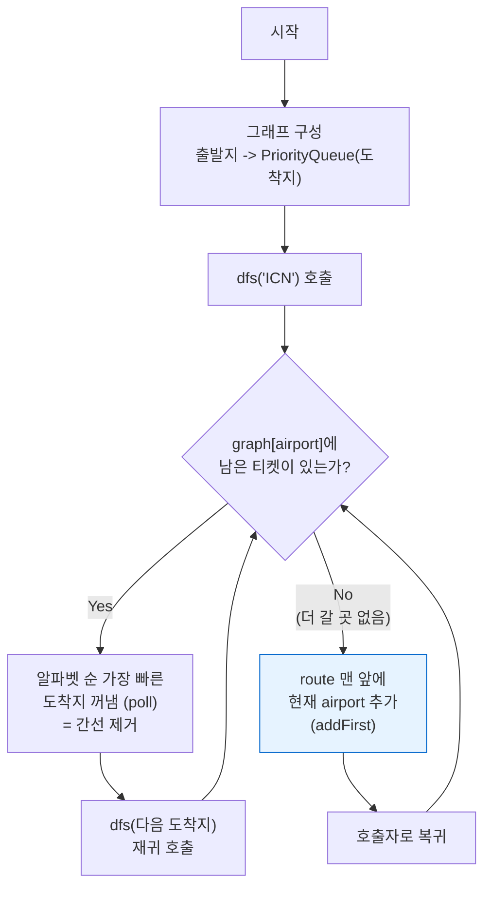

```java

import java.util.ArrayList;
import java.util.Collections;
import java.util.List;
class Solution {
    List<String> list = new ArrayList<>();
	static String route = "";
	static boolean[] visit;
	
	private void dfs(String[][] tickets, String end, int cnt) {
		route += end + ",";
		
		if(cnt == tickets.length) {
			list.add(route); return;
		}
		
		for(int i = 0; i < tickets.length; i++) {
			String s = tickets[i][0], e = tickets[i][1];
			if(s.equals(end) && !visit[i]) {
				visit[i] = true;
				dfs(tickets, e, cnt + 1);
				visit[i] = false; route = route.substring(0, route.length()-4);
			}
		}
	}
	
	public String[] solution(String[][] tickets) {
		for(int i = 0; i < tickets.length; i++) {
			visit = new boolean[tickets.length];
			String start = tickets[i][0], end = tickets[i][1];
			
			if(start.equals("ICN")) {
				route = start + ","; visit[i] = true; 
				dfs(tickets, end, 1);
			}
		}
		
		Collections.sort(list);
		String[] answer = list.get(0).split(",");

		return answer;
	}
}

```


안녕하세요! **코딩 테스트 마스터**입니다.

보내주신 문제와 작성하신 코드를 아주 꼼꼼히 확인했습니다. **"여행경로"** 문제는 그래프 이론 중 **DFS(깊이 우선 탐색)** 또는 **오일러 경로(Eulerian Path)** 개념을 활용하는 대표적인 문제입니다.

작성하신 코드는 **완전 탐색(Backtracking)** 방식을 사용하여 모든 가능한 경로를 찾은 뒤 정렬하는 방식이군요. 논리적으로 정확하며 정답을 도출할 수 있는 훌륭한 접근입니다.

다만, 몇 가지 **최적화 포인트**와 이 문제를 바라보는 **완전히 다른 시각(스택/재귀를 이용한 오일러 경로)**을 소개해 드리고자 합니다. 이 방법들을 익히시면 효율성과 코드의 간결함을 동시에 잡으실 수 있습니다.

---

### 💡 사용자 코드 분석 및 피드백

작성하신 코드도 훌륭하지만, 코딩 테스트 관점에서 몇 가지 개선할 수 있는 부분이 있습니다.

1. **문자열 연산 비용**: `route += end + ","`와 `substring` 연산은 반복될 때마다 새로운 문자열 객체를 생성하므로 메모리와 시간 소모가 큽니다. `StringBuilder`나 `List`를 사용하는 것이 훨씬 효율적입니다.
2. **사후 정렬 (Post-sorting)**: 가능한 모든 경로를 다 구한 뒤(`list.add`) 마지막에 `Collections.sort`를 하고 있습니다. 만약 티켓이 많고 경로의 수가 매우 많다면 시간 초과가 발생할 수 있습니다. 탐색을 시작하기 전에 **도착지를 알파벳순으로 정렬**해두면, 가장 먼저 완성된 경로가 곧 정답이 되므로 탐색을 조기 종료할 수 있습니다.

---

### 🚀 추천 해결 전략

이 문제는 두 가지의 세련된 방법으로 해결할 수 있습니다.

1. **전략 1: 인접 리스트 + 정렬 + DFS (백트래킹 최적화)**
* 사용자분의 접근법을 개선한 형태입니다.
* `Map<String, List<String>>`을 만들어 간선을 관리하고, 도착지 리스트를 미리 정렬합니다.
* 경로가 완성되자마자 탐색을 멈춥니다.


2. **전략 2: 계층적 접근 (Hierholzer’s Algorithm 응용)**
* **가장 추천하는 방법**입니다.
* 모든 티켓을 소모해야 한다는 점(오일러 경로)을 이용합니다.
* 갈 수 있는 곳까지 깊게 들어간 후, 더 이상 갈 곳이 없을 때 해당 공항을 경로의 '마지막'으로 추가하며 역순으로 경로를 완성합니다.


---

### 💻 솔루션 코드

주로 사용하시는 **Java**로 두 가지 방법을 모두 보여드리고, **C++, JavaScript, Rust** 코드는 가장 효율적인 '전략 2'를 기준으로 제공해 드리겠습니다.

#### 1. Java: 전략 1 (DFS + 인접 리스트 + 선 정렬)

이 방식은 직관적이며 사용자분의 기존 로직과 흐름이 유사합니다.

```java
import java.util.*;

class Solution {
    boolean[] visited;
    ArrayList<String> allRoute; 
    
    public String[] solution(String[][] tickets) {
        // 1. 인접 리스트 생성 시 자동 정렬 효과를 위해 내용물만 정렬하거나 PriorityQueue 사용 고려
        // 하지만 인덱스 기반 방문 체크를 위해 여기서는 tickets 자체를 정렬합니다.
        Arrays.sort(tickets, (a, b) -> {
            if(a[0].equals(b[0])) return a[1].compareTo(b[1]);
            return a[0].compareTo(b[0]);
        });
        
        visited = new boolean[tickets.length];
        allRoute = new ArrayList<>();
        
        // 경로 탐색 시작
        dfs("ICN", "ICN", tickets, 0);
        
        return allRoute.get(0).split(" ");
    }
    
    public boolean dfs(String start, String route, String[][] tickets, int cnt){
        // 모든 티켓을 사용했을 때 (기저 조건)
        if(cnt == tickets.length){
            allRoute.add(route);
            return true; // 정답을 찾았으므로 true 반환하여 탐색 종료
        }
        
        for(int i = 0; i < tickets.length; i++){
            // 출발지가 일치하고, 아직 사용하지 않은 티켓인 경우
            if(tickets[i][0].equals(start) && !visited[i]){
                visited[i] = true;
                // 정렬되어 있으므로 가장 먼저 완성된 경로가 알파벳 순서상 앞섬
                if(dfs(tickets[i][1], route + " " + tickets[i][1], tickets, cnt + 1)){
                    return true; 
                }
                visited[i] = false; // 백트래킹
            }
        }
        return false;
    }
}

```

#### 2. Java: 전략 2 (스택/재귀 - Hierholzer’s Algorithm 응용) 🔥 *추천*

이 방식은 코드가 매우 간결해지며, 별도의 `visited` 배열 없이 그래프의 간선을 하나씩 제거하며 이동하는 방식입니다.

```java
import java.util.*;

class Solution {
    // 목적지들을 우선순위 큐에 담아 항상 알파벳 순으로 먼저 방문하도록 함
    Map<String, PriorityQueue<String>> graph = new HashMap<>();
    LinkedList<String> route = new LinkedList<>();

    public String[] solution(String[][] tickets) {
        // 1. 그래프 구성 (Min-Heap PriorityQueue 사용)
        for (String[] t : tickets) {
            graph.putIfAbsent(t[0], new PriorityQueue<>());
            graph.get(t[0]).add(t[1]);
        }

        // 2. DFS 시작
        dfs("ICN");

        // 3. 결과 반환 (List를 배열로 변환)
        return route.toArray(new String[0]);
    }

    public void dfs(String airport) {
        // 해당 공항에서 출발하는 티켓이 남아있는 동안 계속 깊이 탐색
        while (graph.containsKey(airport) && !graph.get(airport).isEmpty()) {
            // 알파벳 순서가 가장 빠른 도착지를 꺼냄 (Poll: 간선 삭제 효과)
            String nextDest = graph.get(airport).poll();
            dfs(nextDest);
        }
        
        // 더 이상 갈 곳이 없으면(막다른 곳 or 모든 티켓 소진) 경로의 맨 앞에 추가
        // 스택에서 빠져나올 때 경로가 역순으로 쌓이는 원리
        route.addFirst(airport);
    }
}

```

---

### 🌍 다국어 솔루션 (전략 2 기반)

가장 효율적인 **전략 2(스택/재귀)** 방식을 다른 언어로도 구현했습니다.

#### C++ Code

```cpp
#include <string>
#include <vector>
#include <algorithm>
#include <map>
#include <queue>

using namespace std;

// 목적지를 사전순으로 정렬하기 위해 priority_queue (greater) 사용
map<string, priority_queue<string, vector<string>, greater<string>>> adj;
vector<string> route;

void dfs(string u) {
    // 갈 수 있는 경로가 있다면 계속 깊이 들어감
    while (adj.find(u) != adj.end() && !adj[u].empty()) {
        string v = adj[u].top();
        adj[u].pop(); // 티켓 사용 (간선 제거)
        dfs(v);
    }
    // 더 이상 갈 곳이 없을 때 경로에 추가 (역순으로 쌓임)
    route.push_back(u);
}

vector<string> solution(vector<vector<string>> tickets) {
    for (auto& t : tickets) {
        adj[t[0]].push(t[1]);
    }
    
    dfs("ICN");
    
    // 역순으로 쌓였으므로 뒤집어줌
    reverse(route.begin(), route.end());
    return route;
}

```

#### JavaScript Code

```javascript
function solution(tickets) {
    const graph = {};
    
    // 그래프 생성
    for (const [src, dest] of tickets) {
        if (!graph[src]) graph[src] = [];
        graph[src].push(dest);
    }
    
    // 도착지 기준 알파벳 역순 정렬 (pop()을 효율적으로 쓰기 위해)
    for (const key in graph) {
        graph[key].sort((a, b) => a < b ? 1 : -1);
    }
    
    const route = [];
    
    function dfs(airport) {
        const destinations = graph[airport];
        
        // 갈 곳이 남아있다면
        while (destinations && destinations.length > 0) {
            // 알파벳 순서가 빠른 것을 꺼냄 (역순 정렬했으므로 pop이 가장 빠른 것)
            const nextNode = destinations.pop();
            dfs(nextNode);
        }
        // 더 이상 갈 곳이 없으면 경로에 추가 (역순)
        route.push(airport);
    }
    
    dfs("ICN");
    
    return route.reverse();
}

```

#### Rust Code

```rust
use std::collections::{HashMap, BinaryHeap};
use std::cmp::Reverse;

pub fn solution(tickets: Vec<Vec<String>>) -> Vec<String> {
    let mut graph: HashMap<String, BinaryHeap<Reverse<String>>> = HashMap::new();

    // 그래프 구성: Min-Heap을 위해 Reverse 사용
    for ticket in tickets {
        graph.entry(ticket[0].clone())
             .or_insert_with(BinaryHeap::new)
             .push(Reverse(ticket[1].clone()));
    }

    let mut route: Vec<String> = Vec::new();
    
    // DFS 함수 (클로저로 구현하거나 별도 함수 분리 가능하나, Rust 소유권 문제로 재귀 구조 주의)
    // 여기서는 명시적 스택을 사용한 반복문 방식이 더 깔끔할 수 있으나,
    // 설명의 일관성을 위해 재귀 로직을 Helper 함수로 분리합니다.
    dfs(&mut graph, "ICN".to_string(), &mut route);
    
    // 결과 뒤집기
    route.reverse();
    route
}

fn dfs(graph: &mut HashMap<String, BinaryHeap<Reverse<String>>>, u: String, route: &mut Vec<String>) {
    while let Some(dest_wrapper) = graph.get_mut(&u).and_then(|heap| heap.pop()) {
        let dest = dest_wrapper.0;
        dfs(graph, dest, route);
    }
    route.push(u);
}

```

#### Go Code

```go
package main

import (
    "container/heap"
)

// 최소 힙을 위한 문자열 힙 구현
type StringHeap []string

func (h StringHeap) Len() int           { return len(h) }
func (h StringHeap) Less(i, j int) bool { return h[i] < h[j] }
func (h StringHeap) Swap(i, j int)      { h[i], h[j] = h[j], h[i] }
func (h *StringHeap) Push(x interface{}) { *h = append(*h, x.(string)) }
func (h *StringHeap) Pop() interface{} {
    old := *h
    n := len(old)
    x := old[n-1]
    *h = old[:n-1]
    return x
}

func solution(tickets [][]string) []string {
    // 그래프 구성: 출발지 -> 도착지 최소 힙
    graph := make(map[string]*StringHeap)
    for _, t := range tickets {
        if graph[t[0]] == nil {
            h := &StringHeap{}
            heap.Init(h)
            graph[t[0]] = h
        }
        heap.Push(graph[t[0]], t[1])
    }

    route := []string{}

    // DFS: 갈 수 있는 데까지 깊이 들어간 후 역순으로 경로 기록
    var dfs func(airport string)
    dfs = func(airport string) {
        for graph[airport] != nil && graph[airport].Len() > 0 {
            next := heap.Pop(graph[airport]).(string)
            dfs(next)
        }
        route = append(route, airport)
    }

    dfs("ICN")

    // 역순으로 쌓였으므로 뒤집기
    for i, j := 0, len(route)-1; i < j; i, j = i+1, j-1 {
        route[i], route[j] = route[j], route[i]
    }

    return route
}
```

---

### 🔍 알고리즘 상세 해설 (전략 2: 스택/재귀 방식)

이 방식이 왜 작동하는지 이해하는 것이 중요합니다. 핵심은 **"들어갔다가 나오면서 경로를 기록한다"**입니다.

#### 1. 작동 원리 (Diagram)

`[["ICN", "SFO"], ["ICN", "ATL"], ["SFO", "ATL"], ["ATL", "ICN"], ["ATL", "SFO"]]` 예제를 봅시다.
(알파벳 순서에 따라 `ICN -> ATL`이 `ICN -> SFO`보다 우선입니다.)

**Step 1: 그래프 구성 (PriorityQueue)**

* ICN: [ATL, SFO]
* ATL: [ICN, SFO]
* SFO: [ATL]

**Step 2: DFS 진행 (Call Stack)**

1. `dfs("ICN")` 호출. `ICN`에서 `ATL`을 꺼냄 (남은 ICN: [SFO]). -> `dfs("ATL")` 호출
2. `ATL`에서 `ICN`을 꺼냄 (남은 ATL: [SFO]). -> `dfs("ICN")` 호출
3. `ICN`에서 `SFO`를 꺼냄 (남은 ICN: []). -> `dfs("SFO")` 호출
4. `SFO`에서 `ATL`을 꺼냄 (남은 SFO: []). -> `dfs("ATL")` 호출
5. `ATL`에서 `SFO`를 꺼냄 (남은 ATL: []). -> `dfs("SFO")` 호출
6. `SFO`는 갈 곳이 없음 (남은 SFO: []).
* **Action:** `route` 리스트 맨 앞에 `SFO` 추가. `dfs` 종료. (Route: `[SFO]`)


7. (5번으로 복귀) `dfs("ATL")`의 while문 종료.
* **Action:** `route` 리스트 맨 앞에 `ATL` 추가. (Route: `[ATL, SFO]`)


8. ... (이 과정이 반복되며 역순으로 쌓임)

최종 `route`: `["ICN", "ATL", "ICN", "SFO", "ATL", "SFO"]`

#### 2. 복잡도 분석

* **시간 복잡도**:
* 각 티켓(간선)을 그래프에 넣을 때 정렬(PriorityQueue 삽입) 비용이 듭니다. 티켓 수를 이라 할 때 .
* DFS 탐색은 모든 간선을 한 번씩만 지나므로 .
* 최종 시간 복잡도는 정렬 비용에 지배되어 $O(N \log N)$입니다.


* **공간 복잡도**:
* 그래프를 저장하는 데 만큼의 공간이 필요합니다.
* 재귀 호출 스택(또는 경로 저장 배열) 또한 최대 에 비례합니다.


---

### 🌟 멘토의 조언 (Comparison)

| 특징 | 사용자님의 코드 (완전탐색 + 사후정렬) | 추천 코드 1 (DFS + 선정렬) | 추천 코드 2 (오일러 경로/스택) |
| --- | --- | --- | --- |
| **핵심 로직** | 모든 경로 탐색 후 정렬 | 경로 탐색 중 알파벳 순 선택 | 간선 소거법 (Post-order) |
| **효율성** | 낮음 (모든 경로 저장 시 메모리 큼) | 높음 (첫 경로 발견 시 종료) | **매우 높음** (불필요한 되돌리기 없음) |
| **코드 복잡도** | 보통 | 보통 | **매우 간결** |
| **직관성** | 직관적 | 직관적 | 다소 난해할 수 있음 (개념 이해 필요) |

사용자님께서 작성하신 코드는 문제 해결의 정석적인 과정을 잘 따르고 있습니다. 이제 **자료구조(PriorityQueue)를 활용한 정렬 자동화**와 **그래프 이론(오일러 경로)**을 적용한 방식을 익히신다면, 훨씬 더 복잡한 문제도 효율적으로 푸실 수 있을 것입니다.

**다음 단계 제안:**
혹시 위에서 설명해 드린 **"스택/재귀 방식의 작동 원리"**에 대해 그림으로 더 자세한 설명이 필요하시거나, 다른 그래프 문제(예: 순위, 가장 먼 노드 등)에 대한 풀이가 궁금하시다면 언제든 말씀해 주세요!

---

## Mermaid 다이어그램

아래 다이어그램은 Hierholzer 알고리즘(전략 2) 기반 DFS 탐색의 흐름을 시각화한 것입니다.



---

## 엣지 케이스 분석

| 관점 | 케이스 | 처리 방법 |
|---|---|---|
| 단일 티켓 | 티켓이 1장뿐인 경우 (ICN -> A) | DFS 한 번 호출 후 즉시 경로 완성: [ICN, A] |
| 동일 목적지 | ICN -> SFO 티켓이 여러 장 | PriorityQueue가 중복 허용하므로 정상 처리 |
| 알파벳 순서 분기 | 같은 출발지에서 여러 도착지가 가능 | PriorityQueue가 알파벳순 보장 |
| 사이클 | 경로가 순환 구조 (ICN->A->ICN->B) | Hierholzer 알고리즘이 간선 소거로 정확히 처리 |
| 막다른 길 | 특정 경로가 모든 티켓을 소진하지 못하는 경우 | 전략1(백트래킹)은 되돌림, 전략2는 post-order로 자동 해결 |

---

## 복잡도 분석

| 풀이 | 시간 복잡도 | 공간 복잡도 | 비고 |
|---|---|---|---|
| 완전탐색 + 사후정렬 (사용자 원본) | O(N! * N) | O(N! * N) | 모든 경로를 저장 후 정렬 |
| DFS + 선정렬 (전략 1) | O(N! ) 최악 | O(N) | 첫 경로 발견 시 조기 종료 |
| Hierholzer 응용 (전략 2) | O(N log N) | O(N) | PriorityQueue 삽입 비용이 지배적 |