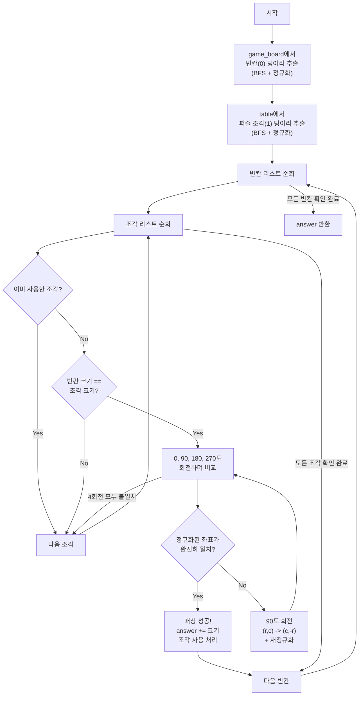

안녕하세요! **코딩 테스트 마스터**입니다.

이 문제는 **"퍼즐 조각 채우기"**라는 문제로, **BFS/DFS(너비/깊이 우선 탐색)**를 이용한 영역 추출과 **2차원 배열 회전(Matrix Rotation)** 구현 능력을 동시에 요구하는 난이도 있는 구현 문제입니다.

단순히 빈칸을 찾는 것을 넘어, **도형의 모양을 비교**해야 한다는 점이 핵심입니다.

---

## 💡 핵심 문제 해결 전략

이 문제는 다음 4단계로 나누어 생각하면 해결하기 쉽습니다.

1. **조각 추출 (Extraction)**:
* `game_board`에서 비어있는 공간(0)들을 찾아 각각 하나의 도형(좌표 리스트)으로 저장합니다.
* `table`에서 퍼즐 조각(1)들을 찾아 각각 하나의 도형으로 저장합니다.
* 이때 BFS나 DFS를 사용하여 연결된 덩어리를 찾아냅니다.


2. **좌표 정규화 (Normalization)**:
* 추출한 도형의 좌표들은 보드 내의 절대 좌표(예: `(3, 4), (3, 5)`)입니다.
* 도형끼리 모양을 비교하려면 `(0, 0)`을 기준으로 하는 상대 좌표로 변환해야 합니다. (모든 좌표에서 가장 작은 x, y 값을 빼줍니다.)


3. **회전 (Rotation)**:
* 퍼즐 조각은 회전이 가능합니다.
* `table`에서 가져온 조각을 0도, 90도, 180도, 270도 회전시키며 `game_board`의 빈칸과 딱 맞는지 확인해야 합니다.


4. **매칭 (Matching)**:
* `game_board`의 빈 공간 리스트와 `table`의 조각 리스트를 이중 반복문으로 비교하며 딱 맞는 조각을 찾으면 카운트하고, 해당 조각은 사용 처리합니다.


---

### 💻 솔루션 코드 (Java)

이 로직을 완벽하게 구현한 Java 코드입니다.

```java
import java.util.*;

class Solution {
    // 도형을 표현하기 위한 Point 클래스 (정렬을 위해 Comparable 구현)
    static class Point implements Comparable<Point> {
        int r, c;
        public Point(int r, int c) {
            this.r = r;
            this.c = c;
        }
        
        @Override
        public int compareTo(Point o) {
            if (this.r == o.r) return this.c - o.c;
            return this.r - o.r;
        }
    }

    int[] dr = {-1, 1, 0, 0};
    int[] dc = {0, 0, -1, 1};
    int boardSize;

    public int solution(int[][] game_board, int[][] table) {
        boardSize = game_board.length;

        // 1. game_board의 빈칸(0) 추출
        // (BFS 탐색을 위해 0을 타겟으로 함)
        List<List<Point>> emptySpaces = extractShapes(game_board, 0);

        // 2. table의 퍼즐 조각(1) 추출
        List<List<Point>> puzzlePieces = extractShapes(table, 1);

        int answer = 0;
        boolean[] visitedPieces = new boolean[puzzlePieces.size()];

        // 3. 빈칸과 퍼즐 조각 매칭
        for (List<Point> space : emptySpaces) {
            for (int i = 0; i < puzzlePieces.size(); i++) {
                // 이미 사용한 조각은 패스
                if (visitedPieces[i]) continue;
                
                List<Point> piece = puzzlePieces.get(i);
                
                // 칸의 개수가 다르면 모양도 당연히 다르므로 패스 (최적화)
                if (space.size() != piece.size()) continue;

                // 4. 회전하며 매칭 확인
                if (isMatch(space, piece)) {
                    visitedPieces[i] = true; // 조각 사용 처리
                    answer += space.size();  // 채운 칸 수 더하기
                    break; // 해당 빈칸은 채웠으므로 다음 빈칸으로 넘어감
                }
            }
        }

        return answer;
    }

    // BFS로 연결된 영역(도형) 추출 함수
    private List<List<Point>> extractShapes(int[][] board, int target) {
        List<List<Point>> shapes = new ArrayList<>();
        boolean[][] visited = new boolean[boardSize][boardSize];

        for (int i = 0; i < boardSize; i++) {
            for (int j = 0; j < boardSize; j++) {
                if (board[i][j] == target && !visited[i][j]) {
                    List<Point> shape = new ArrayList<>();
                    Queue<Point> q = new LinkedList<>();
                    
                    q.add(new Point(i, j));
                    visited[i][j] = true;
                    shape.add(new Point(i, j));

                    while (!q.isEmpty()) {
                        Point curr = q.poll();
                        for (int k = 0; k < 4; k++) {
                            int nr = curr.r + dr[k];
                            int nc = curr.c + dc[k];

                            if (nr >= 0 && nc >= 0 && nr < boardSize && nc < boardSize) {
                                if (board[nr][nc] == target && !visited[nr][nc]) {
                                    visited[nr][nc] = true;
                                    Point next = new Point(nr, nc);
                                    q.add(next);
                                    shape.add(next);
                                }
                            }
                        }
                    }
                    // 추출한 도형을 (0,0) 기준으로 정규화
                    shapes.add(normalize(shape));
                }
            }
        }
        return shapes;
    }

    // 좌표를 (0,0) 기준으로 이동 및 정렬
    private List<Point> normalize(List<Point> shape) {
        int minR = Integer.MAX_VALUE;
        int minC = Integer.MAX_VALUE;

        for (Point p : shape) {
            minR = Math.min(minR, p.r);
            minC = Math.min(minC, p.c);
        }

        List<Point> normalized = new ArrayList<>();
        for (Point p : shape) {
            normalized.add(new Point(p.r - minR, p.c - minC));
        }
        
        // 비교를 위해 정렬
        Collections.sort(normalized);
        return normalized;
    }

    // 회전시키며 같은 모양인지 확인
    private boolean isMatch(List<Point> space, List<Point> piece) {
        // 4번 회전 (0, 90, 180, 270)
        for (int i = 0; i < 4; i++) {
            // 정렬된 상태에서 좌표가 모두 일치하는지 확인
            boolean match = true;
            for (int j = 0; j < space.size(); j++) {
                if (space.get(j).r != piece.get(j).r || space.get(j).c != piece.get(j).c) {
                    match = false;
                    break;
                }
            }
            
            if (match) return true;
            
            // 일치하지 않으면 90도 회전 후 다시 정규화
            piece = rotate(piece);
        }
        return false;
    }

    // 도형 90도 회전 함수
    // (r, c) -> (c, -r) 로 변환 후 정규화하면 90도 회전과 같음
    private List<Point> rotate(List<Point> shape) {
        List<Point> rotated = new ArrayList<>();
        for (Point p : shape) {
            rotated.add(new Point(p.c, -p.r));
        }
        return normalize(rotated);
    }
}

```

---

### 🔍 코드 상세 해설

**1. `extractShapes` (BFS 추출)**

* `game_board`에서는 `0`이 빈칸이므로 `target=0`으로 호출하고, `table`에서는 `1`이 조각이므로 `target=1`로 호출합니다.
* BFS를 돌면서 연결된 모든 좌표 `(r, c)`를 리스트에 담습니다.
* 탐색이 끝난 후 바로 `normalize`를 호출하여 기준점을 통일합니다.

**2. `normalize` (정규화)**

* 도형이 `(3,3), (3,4), (4,3)`에 있든 `(0,0), (0,1), (1,0)`에 있든 같은 모양으로 인식해야 합니다.
* 가장 작은 r값(`minR`)과 c값(`minC`)을 찾아 모든 좌표에서 빼줍니다. 그러면 도형이 항상 `(0,0)`에 딱 붙게 이동됩니다.
* **중요:** `Collections.sort`를 해줘야 두 도형 리스트의 순서가 같아져서 인덱스별 비교(`space.get(j)` vs `piece.get(j)`)가 가능해집니다.

**3. `rotate` (회전)**

* 2차원 평면에서 90도 회전 공식은 `(x, y) -> (y, -x)` 입니다.
* 여기서는 행렬 인덱스 `(r, c)`를 사용하므로 `(r, c) -> (c, -r)`로 변환합니다.
* 변환하면 좌표가 음수가 될 수 있지만, 다시 `normalize`를 호출해주므로 자동으로 `(0,0)` 기준의 양수 좌표로 예쁘게 변환됩니다.

**4. `isMatch` (매칭)**

* 빈칸(`space`)은 가만히 두고, 조각(`piece`)을 90도씩 4번 회전시키며 모양이 완전히 똑같은지 확인합니다.
* 문제 조건 중 **"인접한 칸이 비어있으면 안 된다"**는 조건이 있습니다.
* 우리는 BFS로 **빈 공간 덩어리 전체**를 가져왔고, **조각 덩어리 전체**와 비교합니다.
* 두 도형이 정확히 일치한다는 것은 빈 공간에 조각이 남거나 모자람 없이 딱 들어맞는다는 뜻이므로 조건이 자연스럽게 해결됩니다.


### 🌟 멘토의 팁

이 문제는 **좌표 변환(Translation & Rotation)** 개념을 확실히 잡고 가야 하는 문제입니다.

* **정규화(Normalization)**: 복잡한 상대 좌표 계산 대신, 그냥 `(minR, minC)`를 빼서 `(0,0)`으로 미는 방식이 가장 구현하기 쉽고 실수가 적습니다.
* **자료구조**: 좌표를 다룰 때는 `int[]` 배열도 좋지만, `Point` 클래스(또는 구조체)를 만들고 `compareTo`를 구현해두면 정렬과 비교가 매우 편해집니다.


## Point Class에 compareTo를 오버라이딩한 이유

**`compareTo`를 오버라이딩한 핵심 이유**는 **"두 도형(Point 리스트)이 같은 모양인지 비교하기 위해서 순서를 통일(정렬)"**해야 하기 때문입니다.

더 구체적으로 3가지 관점에서 설명해 드릴게요.

---

### 1. 리스트 비교의 문제점 (순서가 다르면 다른 객체)

우리가 BFS로 찾아낸 도형은 탐색 순서에 따라 `List<Point>`에 담기는 **좌표의 순서가 제각각**일 수 있습니다.

예를 들어, 똑같은 "ㄴ"자 모양이라도 탐색 순서에 따라 리스트에 담긴 순서가 다를 수 있습니다.

* **도형 A (탐색 순서 1):** `[(1, 0), (0, 0), (0, 1)]`
* **도형 B (탐색 순서 2):** `[(0, 0), (0, 1), (1, 0)]`

이 두 리스트는 구성 요소가 같아서 사실상 **같은 모양**입니다. 하지만 컴퓨터에게 `listA.equals(listB)`를 물어보면 **`false`**라고 대답합니다. 리스트는 **인덱스별로 순서까지 똑같아야** 같다고 판단하기 때문입니다.

### 2. 해결책: 정렬(Sorting)을 통한 표준화

이 문제를 해결하려면 두 리스트를 비교하기 전에 **똑같은 규칙으로 줄을 세워야(정렬)** 합니다.

`Collections.sort(shape)`를 호출하면, 우리가 정의한 `compareTo` 규칙에 따라 줄을 섭니다.

* **정렬 후 A:** `[(0, 0), (0, 1), (1, 0)]`
* **정렬 후 B:** `[(0, 0), (0, 1), (1, 0)]`

이제 두 리스트는 완벽하게 동일해졌으므로 비교가 가능해집니다. `Point` 클래스에 `Comparable` 인터페이스를 구현(`implements Comparable<Point>`)하고 `compareTo`를 오버라이딩해두면, **자바의 정렬 함수(`sort`)가 이 규칙을 알아서 가져다 씁니다.**

### 3. 로직 상세 해석 (행 우선, 열 차선)

작성하신 코드는 **"책을 읽는 순서(좌상단 → 우하단)"**로 정렬하겠다는 뜻입니다.

```java
@Override
public int compareTo(Point o) {
    // 1. 행(row, y좌표)이 다르면?
    // 행 번호가 작은 것(위쪽)이 앞으로 오게 함 (오름차순)
    if (this.r != o.r) { 
        return this.r - o.r; 
    }
    
    // 2. 행이 같다면? (같은 줄에 있다면)
    // 열(column, x좌표) 번호가 작은 것(왼쪽)이 앞으로 오게 함 (오름차순)
    return this.c - o.c;
}

```

* `this.r < o.r` 이면 결과가 음수 → `this`가 앞쪽에 배치됨
* `this.r > o.r` 이면 결과가 양수 → `this`가 뒤쪽에 배치됨

### 요약

> **"도형 안의 점들이 뒤죽박죽 섞여 있어도, 항상 '위에서 아래로, 왼쪽에서 오른쪽으로' 줄을 세워놓으면, 모양이 같은지 `for`문 하나로 쉽게 비교할 수 있기 때문입니다."**

---

## Mermaid 다이어그램

아래 다이어그램은 퍼즐 조각 채우기 알고리즘의 전체 흐름을 시각화한 것입니다.



---

## 다국어 솔루션

### JavaScript

```javascript
function solution(game_board, table) {
    const n = game_board.length;
    const dr = [-1, 1, 0, 0];
    const dc = [0, 0, -1, 1];

    // BFS로 연결된 영역 추출
    function extractShapes(board, target) {
        const shapes = [];
        const visited = Array.from({length: n}, () => new Array(n).fill(false));

        for (let i = 0; i < n; i++) {
            for (let j = 0; j < n; j++) {
                if (board[i][j] === target && !visited[i][j]) {
                    const shape = [];
                    const queue = [[i, j]];
                    visited[i][j] = true;
                    shape.push([i, j]);

                    while (queue.length > 0) {
                        const [cr, cc] = queue.shift();
                        for (let k = 0; k < 4; k++) {
                            const nr = cr + dr[k], nc = cc + dc[k];
                            if (nr >= 0 && nc >= 0 && nr < n && nc < n) {
                                if (board[nr][nc] === target && !visited[nr][nc]) {
                                    visited[nr][nc] = true;
                                    queue.push([nr, nc]);
                                    shape.push([nr, nc]);
                                }
                            }
                        }
                    }
                    shapes.push(normalize(shape));
                }
            }
        }
        return shapes;
    }

    // 좌표 정규화: (0,0) 기준으로 이동 후 정렬
    function normalize(shape) {
        const minR = Math.min(...shape.map(p => p[0]));
        const minC = Math.min(...shape.map(p => p[1]));
        const normalized = shape.map(p => [p[0] - minR, p[1] - minC]);
        normalized.sort((a, b) => a[0] !== b[0] ? a[0] - b[0] : a[1] - b[1]);
        return normalized;
    }

    // 90도 회전: (r, c) -> (c, -r) 후 재정규화
    function rotate(shape) {
        const rotated = shape.map(p => [p[1], -p[0]]);
        return normalize(rotated);
    }

    // 두 도형이 같은 모양인지 확인 (4번 회전)
    function isMatch(space, piece) {
        let current = piece;
        for (let rot = 0; rot < 4; rot++) {
            if (current.length === space.length) {
                let match = true;
                for (let j = 0; j < space.length; j++) {
                    if (space[j][0] !== current[j][0] || space[j][1] !== current[j][1]) {
                        match = false;
                        break;
                    }
                }
                if (match) return true;
            }
            current = rotate(current);
        }
        return false;
    }

    // 빈칸과 조각 추출
    const emptySpaces = extractShapes(game_board, 0);
    const puzzlePieces = extractShapes(table, 1);
    const usedPieces = new Array(puzzlePieces.length).fill(false);
    let answer = 0;

    // 매칭
    for (const space of emptySpaces) {
        for (let i = 0; i < puzzlePieces.length; i++) {
            if (usedPieces[i]) continue;
            if (space.length !== puzzlePieces[i].length) continue;
            if (isMatch(space, puzzlePieces[i])) {
                usedPieces[i] = true;
                answer += space.length;
                break;
            }
        }
    }

    return answer;
}
```

### C++

```cpp
#include <vector>
#include <queue>
#include <algorithm>
using namespace std;

struct Point {
    int r, c;
    bool operator<(const Point& o) const {
        if (r == o.r) return c < o.c;
        return r < o.r;
    }
    bool operator==(const Point& o) const {
        return r == o.r && c == o.c;
    }
};

int dr[] = {-1, 1, 0, 0};
int dc[] = {0, 0, -1, 1};

// 좌표 정규화: (0,0) 기준으로 이동 후 정렬
vector<Point> normalize(vector<Point>& shape) {
    int minR = 1e9, minC = 1e9;
    for (auto& p : shape) {
        minR = min(minR, p.r);
        minC = min(minC, p.c);
    }
    vector<Point> norm;
    for (auto& p : shape) {
        norm.push_back({p.r - minR, p.c - minC});
    }
    sort(norm.begin(), norm.end());
    return norm;
}

// 90도 회전: (r, c) -> (c, -r)
vector<Point> rotate(vector<Point>& shape) {
    vector<Point> rotated;
    for (auto& p : shape) {
        rotated.push_back({p.c, -p.r});
    }
    return normalize(rotated);
}

// BFS로 연결된 영역 추출
vector<vector<Point>> extractShapes(vector<vector<int>>& board, int target) {
    int n = board.size();
    vector<vector<bool>> visited(n, vector<bool>(n, false));
    vector<vector<Point>> shapes;

    for (int i = 0; i < n; i++) {
        for (int j = 0; j < n; j++) {
            if (board[i][j] == target && !visited[i][j]) {
                vector<Point> shape;
                queue<Point> q;
                q.push({i, j});
                visited[i][j] = true;
                shape.push_back({i, j});

                while (!q.empty()) {
                    Point cur = q.front(); q.pop();
                    for (int k = 0; k < 4; k++) {
                        int nr = cur.r + dr[k], nc = cur.c + dc[k];
                        if (nr >= 0 && nc >= 0 && nr < n && nc < n) {
                            if (board[nr][nc] == target && !visited[nr][nc]) {
                                visited[nr][nc] = true;
                                q.push({nr, nc});
                                shape.push_back({nr, nc});
                            }
                        }
                    }
                }
                shapes.push_back(normalize(shape));
            }
        }
    }
    return shapes;
}

// 회전하며 매칭 확인
bool isMatch(vector<Point>& space, vector<Point> piece) {
    for (int i = 0; i < 4; i++) {
        if (space == piece) return true;
        piece = rotate(piece);
    }
    return false;
}

int solution(vector<vector<int>> game_board, vector<vector<int>> table) {
    auto emptySpaces = extractShapes(game_board, 0);
    auto puzzlePieces = extractShapes(table, 1);
    vector<bool> usedPieces(puzzlePieces.size(), false);
    int answer = 0;

    for (auto& space : emptySpaces) {
        for (int i = 0; i < puzzlePieces.size(); i++) {
            if (usedPieces[i]) continue;
            if (space.size() != puzzlePieces[i].size()) continue;
            if (isMatch(space, puzzlePieces[i])) {
                usedPieces[i] = true;
                answer += space.size();
                break;
            }
        }
    }

    return answer;
}
```

### Rust

```rust
use std::collections::VecDeque;

#[derive(Clone, Eq, PartialEq, Ord, PartialOrd)]
struct Point {
    r: i32,
    c: i32,
}

// 좌표 정규화: (0,0) 기준으로 이동 후 정렬
fn normalize(shape: &[Point]) -> Vec<Point> {
    let min_r = shape.iter().map(|p| p.r).min().unwrap();
    let min_c = shape.iter().map(|p| p.c).min().unwrap();
    let mut norm: Vec<Point> = shape.iter()
        .map(|p| Point { r: p.r - min_r, c: p.c - min_c })
        .collect();
    norm.sort();
    norm
}

// 90도 회전: (r, c) -> (c, -r)
fn rotate(shape: &[Point]) -> Vec<Point> {
    let rotated: Vec<Point> = shape.iter()
        .map(|p| Point { r: p.c, c: -p.r })
        .collect();
    normalize(&rotated)
}

// BFS로 연결된 영역 추출
fn extract_shapes(board: &Vec<Vec<i32>>, target: i32) -> Vec<Vec<Point>> {
    let n = board.len();
    let dr = [-1i32, 1, 0, 0];
    let dc = [0i32, 0, -1, 1];
    let mut visited = vec![vec![false; n]; n];
    let mut shapes = Vec::new();

    for i in 0..n {
        for j in 0..n {
            if board[i][j] == target && !visited[i][j] {
                let mut shape = Vec::new();
                let mut queue = VecDeque::new();
                queue.push_back((i as i32, j as i32));
                visited[i][j] = true;
                shape.push(Point { r: i as i32, c: j as i32 });

                while let Some((cr, cc)) = queue.pop_front() {
                    for k in 0..4 {
                        let nr = cr + dr[k];
                        let nc = cc + dc[k];
                        if nr >= 0 && nc >= 0 && (nr as usize) < n && (nc as usize) < n {
                            let (ur, uc) = (nr as usize, nc as usize);
                            if board[ur][uc] == target && !visited[ur][uc] {
                                visited[ur][uc] = true;
                                queue.push_back((nr, nc));
                                shape.push(Point { r: nr, c: nc });
                            }
                        }
                    }
                }
                shapes.push(normalize(&shape));
            }
        }
    }
    shapes
}

// 회전하며 매칭 확인
fn is_match(space: &[Point], piece: &[Point]) -> bool {
    let mut current = piece.to_vec();
    for _ in 0..4 {
        if space == current.as_slice() {
            return true;
        }
        current = rotate(&current);
    }
    false
}

pub fn solution(game_board: Vec<Vec<i32>>, table: Vec<Vec<i32>>) -> i32 {
    let empty_spaces = extract_shapes(&game_board, 0);
    let puzzle_pieces = extract_shapes(&table, 1);
    let mut used = vec![false; puzzle_pieces.len()];
    let mut answer = 0;

    for space in &empty_spaces {
        for i in 0..puzzle_pieces.len() {
            if used[i] { continue; }
            if space.len() != puzzle_pieces[i].len() { continue; }
            if is_match(space, &puzzle_pieces[i]) {
                used[i] = true;
                answer += space.len() as i32;
                break;
            }
        }
    }

    answer
}
```

### Go

```go
package main

import (
    "sort"
)

type Point struct {
    r, c int
}

// 좌표 정규화: (0,0) 기준으로 이동 후 정렬
func normalizeShape(shape []Point) []Point {
    minR, minC := shape[0].r, shape[0].c
    for _, p := range shape {
        if p.r < minR { minR = p.r }
        if p.c < minC { minC = p.c }
    }
    norm := make([]Point, len(shape))
    for i, p := range shape {
        norm[i] = Point{p.r - minR, p.c - minC}
    }
    sort.Slice(norm, func(i, j int) bool {
        if norm[i].r == norm[j].r { return norm[i].c < norm[j].c }
        return norm[i].r < norm[j].r
    })
    return norm
}

// 90도 회전: (r, c) -> (c, -r)
func rotateShape(shape []Point) []Point {
    rotated := make([]Point, len(shape))
    for i, p := range shape {
        rotated[i] = Point{p.c, -p.r}
    }
    return normalizeShape(rotated)
}

// BFS로 연결된 영역 추출
func extractShapes(board [][]int, target int) [][]Point {
    n := len(board)
    dr := []int{-1, 1, 0, 0}
    dc := []int{0, 0, -1, 1}
    visited := make([][]bool, n)
    for i := range visited { visited[i] = make([]bool, n) }
    var shapes [][]Point

    for i := 0; i < n; i++ {
        for j := 0; j < n; j++ {
            if board[i][j] == target && !visited[i][j] {
                shape := []Point{{i, j}}
                queue := []Point{{i, j}}
                visited[i][j] = true

                for len(queue) > 0 {
                    cur := queue[0]
                    queue = queue[1:]
                    for k := 0; k < 4; k++ {
                        nr, nc := cur.r+dr[k], cur.c+dc[k]
                        if nr >= 0 && nc >= 0 && nr < n && nc < n {
                            if board[nr][nc] == target && !visited[nr][nc] {
                                visited[nr][nc] = true
                                queue = append(queue, Point{nr, nc})
                                shape = append(shape, Point{nr, nc})
                            }
                        }
                    }
                }
                shapes = append(shapes, normalizeShape(shape))
            }
        }
    }
    return shapes
}

// 회전하며 매칭 확인
func isMatchShape(space, piece []Point) bool {
    current := make([]Point, len(piece))
    copy(current, piece)
    for rot := 0; rot < 4; rot++ {
        if len(space) == len(current) {
            match := true
            for j := 0; j < len(space); j++ {
                if space[j] != current[j] {
                    match = false
                    break
                }
            }
            if match { return true }
        }
        current = rotateShape(current)
    }
    return false
}

func solution(gameBoard, table [][]int) int {
    emptySpaces := extractShapes(gameBoard, 0)
    puzzlePieces := extractShapes(table, 1)
    used := make([]bool, len(puzzlePieces))
    answer := 0

    for _, space := range emptySpaces {
        for i := 0; i < len(puzzlePieces); i++ {
            if used[i] { continue }
            if len(space) != len(puzzlePieces[i]) { continue }
            if isMatchShape(space, puzzlePieces[i]) {
                used[i] = true
                answer += len(space)
                break
            }
        }
    }

    return answer
}
```

---

## 엣지 케이스 분석

| 관점 | 케이스 | 처리 방법 |
|---|---|---|
| 조각 크기 불일치 | 빈칸 크기와 조각 크기가 다른 경우 | size 비교로 빠르게 건너뜀 (최적화) |
| 회전 필요 | 조각이 0도에서는 안 맞지만 90/180/270도에서 맞는 경우 | 4번 회전 후 비교하여 매칭 |
| 단일 칸 조각 | 크기가 1인 빈칸과 조각 | 정규화하면 둘 다 [(0,0)]이므로 회전 없이 매칭 |
| 같은 모양 여러 개 | 동일한 모양의 빈칸 또는 조각이 여러 개 | visited 배열로 사용된 조각 추적, 중복 매칭 방지 |
| 매칭 불가능 | 남은 조각으로 빈칸을 채울 수 없는 경우 | 매칭 실패한 빈칸은 그대로 넘어감, 정답에 미포함 |
| 빈칸 인접 조건 | 빈칸 주변에 다른 빈칸이 있으면 안 되는 조건 | BFS로 빈칸 덩어리 전체를 추출하고, 조각과 크기가 완전 일치해야 매칭 |

---

## 복잡도 분석

| 풀이 | 시간 복잡도 | 공간 복잡도 | 비고 |
|---|---|---|---|
| BFS 추출 + 회전 비교 | O(N^2 + E * S * 4 * K) | O(N^2) | N=보드 크기, E=빈칸 수, S=조각 수, K=조각 최대 크기 |