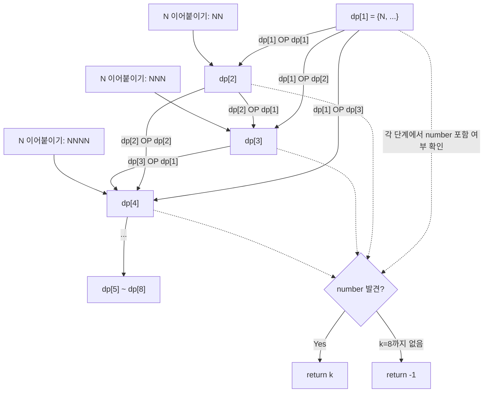

# N으로 표현 복습 정리
**Programmers - DP (Dynamic Programming)**  
https://school.programmers.co.kr/learn/courses/30/lessons/42895

---

## 1. 문제 요약

숫자 N과 사칙연산만 사용해서 number를 표현할 때, N의 사용 횟수의 최솟값을 구하는 문제입니다. 단, 최솟값이 8보다 크면 -1을 반환합니다.

---

## 2. 문제 유형 파악: 왜 DP인가?

처음 보면 완전탐색이나 Greedy로 접근하고 싶어집니다. 하지만 가능한 수식의 형태가 너무 다양하기 때문에 (괄호, 이어붙이기, 사칙연산 조합 등) 수식을 직접 나열하는 방식은 경우의 수가 폭발적으로 커집니다.

이 문제의 핵심 관찰은 다음과 같습니다. **"N을 k번 사용해서 만들 수 있는 모든 숫자"** 는 반드시 **"N을 i번 사용해서 만든 숫자"** 와 **"N을 k-i번 사용해서 만든 숫자"** 의 사칙연산 결과로 만들어집니다. 이 구조 자체가 DP의 핵심 원리인 "작은 문제의 해를 조합해 큰 문제를 해결"과 정확히 일치합니다.

따라서 `dp[k]`를 "N을 정확히 k번 사용해서 만들 수 있는 모든 숫자의 집합"으로 정의하고, k=1부터 8까지 순서대로 채워나가면서 `number`가 등장하는 최초의 k를 반환하면 됩니다.

---

## 3. dp[k]를 채우는 두 가지 방법

`dp[k]`의 원소는 두 가지 방식으로 생성됩니다.

**방법 1: N을 k개 이어 붙이기**

N을 사칙연산 없이 k번 나열하면 새로운 숫자가 됩니다. 예를 들어 N=5일 때 k=1이면 5, k=2이면 55, k=3이면 555가 됩니다. 이 숫자는 매번 `concat = concat * 10 + N`을 k번 반복하면 만들 수 있습니다.

**방법 2: k를 i와 k-i로 쪼개서 사칙연산**

k번의 N 사용을 두 그룹으로 나눠, 각 그룹이 만드는 숫자들 사이에 +, -, ×, ÷ 를 적용합니다. i는 1부터 k-1까지 순회하므로 양쪽 모두 최소 1번씩 N을 사용하게 됩니다.

```
k=4 라면:
  dp[1] OP dp[3]  →  5 와 (N 3번으로 만든 수들) 사이의 사칙연산
  dp[2] OP dp[2]  →  55, 10, 0, 25, 1 끼리의 사칙연산
  dp[3] OP dp[1]  →  (N 3번으로 만든 수들) 와 5 사이의 사칙연산
```

---

## 4. 반복문 조건식 상세 이유

코드에 두 종류의 반복문이 등장하는데, 각각 시작 조건이 다른 이유를 명확히 이해하는 것이 중요합니다.

**`for (int i = 0; i < k; i++)` — 이어붙이기용**

이 반복문의 목적은 "정확히 k번 반복"하는 것입니다. `concat = concat * 10 + N`을 k번 실행해야 k자리 숫자가 만들어지므로, i=0부터 시작해서 i < k 조건으로 정확히 k회 실행합니다. i=1부터 시작하면 k-1번만 실행되어 한 자리가 부족해집니다.

**`for (int i = 1; i < k; i++)` — 쪼개기용**

이 반복문의 목적은 "양쪽에 최소 1번씩 N을 배분"하는 것입니다. i=0이 되면 `dp[0]`을 참조하게 되는데, `dp[0]`은 "N을 0번 사용해서 만든 숫자의 집합"으로 빈 집합입니다. 빈 집합과 사칙연산을 하면 아무 결과도 나오지 않으므로 i=0은 의미가 없습니다. 마찬가지로 i=k가 되면 `dp[k-i] = dp[0]`이 되어 같은 문제가 생깁니다. 따라서 반드시 1 이상 k-1 이하, 즉 `i < k` 범위여야 합니다.

```
for (int i = 0; i < k; i++)  →  "k번 반복"이 목적, 총 k회 실행
for (int i = 1; i < k; i++)  →  "양쪽 최소 1번 배분"이 목적, 총 k-1회 실행
```

**`k <= 8` 에서 8을 쓰는 이유**

문제 제한 사항에 "최솟값이 8보다 크면 -1을 return 합니다"라고 직접 명시되어 있습니다. number의 최댓값이 32,000으로 제한되어 있기 때문에 N을 8번 이내로 조합하면 사실상 이 범위 안의 모든 숫자를 표현할 수 있습니다. 8번 안에 표현이 안 된다면 그 이상 탐색할 필요 없이 -1을 반환하면 됩니다.

---

## 5. Java 코드 풀이

```java
import java.util.*;

class Solution {
    public int solution(int N, int number) {
        // dp[k] = N을 정확히 k번 사용해서 만들 수 있는 숫자들의 집합
        // dp[0]은 빈 집합으로, 인덱스를 1부터 맞추기 위한 자리 채우기용
        List<Set<Integer>> dp = new ArrayList<>();
        dp.add(new HashSet<>()); // dp[0] = 빈 집합

        for (int k = 1; k <= 8; k++) {
            Set<Integer> set = new HashSet<>();

            // 방법 1: N을 k개 이어 붙인 수 추가 (예: N=5, k=3 → 555)
            // 정확히 k번 반복해야 k자리 숫자가 되므로 i=0부터 시작
            int concat = 0;
            for (int i = 0; i < k; i++) {
                concat = concat * 10 + N;
            }
            set.add(concat);

            // 방법 2: k를 i와 k-i로 쪼개서 사칙연산
            // i=0이면 dp[0](빈 집합)을 참조하므로 의미 없음 → i=1부터 시작
            // i=k이면 dp[0]을 참조하는 문제가 다시 생김 → i < k 조건
            for (int i = 1; i < k; i++) {
                for (int a : dp.get(i)) {         // N을 i번 사용해 만든 수
                    for (int b : dp.get(k - i)) { // N을 k-i번 사용해 만든 수
                        set.add(a + b);
                        set.add(a - b);
                        set.add(a * b);
                        if (b != 0) set.add(a / b); // 0으로 나누기 방지
                    }
                }
            }

            // number가 이 집합 안에 있으면 k가 최솟값
            if (set.contains(number)) return k;

            dp.add(set); // dp[k] 저장 후 다음 단계에서 재사용
        }

        // k=1~8 안에 number를 표현할 수 없음
        return -1;
    }
}
```

### JavaScript

```javascript
function solution(N, number) {
    // dp[k] = N을 정확히 k번 사용해서 만들 수 있는 숫자들의 집합
    const dp = [new Set()]; // dp[0] = 빈 집합

    for (let k = 1; k <= 8; k++) {
        const set = new Set();

        // 방법 1: N을 k개 이어 붙인 수 (예: 5, 55, 555, ...)
        let concat = 0;
        for (let i = 0; i < k; i++) {
            concat = concat * 10 + N;
        }
        set.add(concat);

        // 방법 2: dp[i]와 dp[k-i]의 사칙연산 결과 조합
        for (let i = 1; i < k; i++) {
            for (const a of dp[i]) {
                for (const b of dp[k - i]) {
                    set.add(a + b);
                    set.add(a - b);
                    set.add(a * b);
                    if (b !== 0) set.add(Math.floor(a / b)); // 0으로 나누기 방지, 정수 나눗셈
                }
            }
        }

        // number가 이 집합에 있으면 k가 최솟값
        if (set.has(number)) return k;

        dp.push(set);
    }

    // k=1~8 안에 표현 불가
    return -1;
}
```

### C++

```cpp
#include <vector>
#include <unordered_set>
#include <algorithm>
using namespace std;

int solution(int N, int number) {
    // dp[k] = N을 정확히 k번 사용해서 만들 수 있는 숫자들의 집합
    vector<unordered_set<int>> dp(9);

    for (int k = 1; k <= 8; k++) {
        // 방법 1: N을 k개 이어 붙인 수
        int concat = 0;
        for (int i = 0; i < k; i++) {
            concat = concat * 10 + N;
        }
        dp[k].insert(concat);

        // 방법 2: dp[i]와 dp[k-i]의 사칙연산 결과 조합
        for (int i = 1; i < k; i++) {
            for (int a : dp[i]) {
                for (int b : dp[k - i]) {
                    dp[k].insert(a + b);
                    dp[k].insert(a - b);
                    dp[k].insert(a * b);
                    if (b != 0) dp[k].insert(a / b); // 0으로 나누기 방지
                }
            }
        }

        // number가 이 집합에 있으면 k가 최솟값
        if (dp[k].count(number)) return k;
    }

    // k=1~8 안에 표현 불가
    return -1;
}
```

### Rust

```rust
use std::collections::HashSet;

fn solution(n: i32, number: i32) -> i32 {
    // dp[k] = N을 정확히 k번 사용해서 만들 수 있는 숫자들의 집합
    let mut dp: Vec<HashSet<i32>> = vec![HashSet::new()]; // dp[0] = 빈 집합

    for k in 1..=8 {
        let mut set = HashSet::new();

        // 방법 1: N을 k개 이어 붙인 수
        let mut concat = 0;
        for _ in 0..k {
            concat = concat * 10 + n;
        }
        set.insert(concat);

        // 방법 2: dp[i]와 dp[k-i]의 사칙연산 결과 조합
        for i in 1..k {
            let pairs: Vec<(i32, i32)> = dp[i]
                .iter()
                .flat_map(|&a| dp[k - i].iter().map(move |&b| (a, b)))
                .collect();
            for (a, b) in pairs {
                set.insert(a + b);
                set.insert(a - b);
                set.insert(a * b);
                if b != 0 {
                    set.insert(a / b); // 0으로 나누기 방지
                }
            }
        }

        // number가 이 집합에 있으면 k가 최솟값
        if set.contains(&number) {
            return k as i32;
        }

        dp.push(set);
    }

    // k=1~8 안에 표현 불가
    -1
}
```

### Go

```go
func solution(N int, number int) int {
	// dp[k] = N을 정확히 k번 사용해서 만들 수 있는 숫자들의 집합
	dp := make([]map[int]bool, 9)
	for i := 0; i <= 8; i++ {
		dp[i] = make(map[int]bool)
	}

	for k := 1; k <= 8; k++ {
		// 방법 1: N을 k개 이어 붙인 수
		concat := 0
		for i := 0; i < k; i++ {
			concat = concat*10 + N
		}
		dp[k][concat] = true

		// 방법 2: dp[i]와 dp[k-i]의 사칙연산 결과 조합
		for i := 1; i < k; i++ {
			for a := range dp[i] {
				for b := range dp[k-i] {
					dp[k][a+b] = true
					dp[k][a-b] = true
					dp[k][a*b] = true
					if b != 0 {
						dp[k][a/b] = true // 0으로 나누기 방지
					}
				}
			}
		}

		// number가 이 집합에 있으면 k가 최솟값
		if dp[k][number] {
			return k
		}
	}

	// k=1~8 안에 표현 불가
	return -1
}
```

---

## 6. 풀이 동작 원리 (N=5, number=12)

### dp[1] 계산

방법 1로 이어붙이기 숫자 5를 추가합니다. 쪼갤 수 있는 방법은 없습니다 (i가 1 이상 k-1=0 이하이므로 반복 안 됨).

```
dp[1] = {5}
→ 12 없음, 계속
```

### dp[2] 계산

방법 1로 55를 추가합니다. 방법 2에서는 i=1만 가능하므로 `dp[1] OP dp[1]`, 즉 5와 5의 사칙연산을 모두 수행합니다.

```
5+5=10, 5-5=0, 5*5=25, 5/5=1

dp[2] = {55, 10, 0, 25, 1}
→ 12 없음, 계속
```

### dp[3] 계산

방법 1로 555를 추가합니다. 방법 2에서는 i=1과 i=2 두 경우를 모두 검토합니다.

```
i=1: dp[1]={5} OP dp[2]={55,10,0,25,1}
  5+55=60,  5-55=-50, 5*55=275, 5/55=0
  5+10=15,  5-10=-5,  5*10=50,  5/10=0
  5+0=5,    5-0=5,    5*0=0
  5+25=30,  5-25=-20, 5*25=125, 5/25=0
  5+1=6,    5-1=4,    5*1=5,    5/1=5

i=2: dp[2]={55,10,0,25,1} OP dp[1]={5}
  55+5=60, 55-5=50, 55*5=275, 55/5=11
  10+5=15, 10-5=5,  10*5=50,  10/5=2
  ...

dp[3] = {555, 60, -50, 275, 15, -5, 50, 30, -20, 125, 6, 4, 11, 2, 20, ...}
→ 12 없음, 계속
```

### dp[4] 계산

방법 1로 5555를 추가합니다. 방법 2에서 i=1, 2, 3을 모두 검토하는 과정에서 12가 등장합니다.

```
i=2: dp[2] OP dp[2]
  55/5=11 (dp[2]에 있음), 11+1=12  ✅
  (또는 55/5 + 5/5 = 11 + 1 = 12)

dp[4]에 12 발견! → return 4 ✅
```

---

## Mermaid 다이어그램

아래 다이어그램은 dp[k]가 이전 dp 집합들의 조합으로 구성되는 과정을 보여준다.



---

## 7. DP 테이블 구조 시각화

```
dp[1] = {5}
   │
   ▼ dp[1] OP dp[1]
dp[2] = {55, 10, 0, 25, 1}
   │
   ▼ dp[1] OP dp[2],  dp[2] OP dp[1]
dp[3] = {555, 15, 11, 2, 6, 4, 20, ...}
   │
   ▼ dp[1] OP dp[3],  dp[2] OP dp[2],  dp[3] OP dp[1]
dp[4] = {5555, ..., 12, ...}   ← 12 발견! → return 4
```

각 dp[k]는 이전 dp들의 사칙연산 결과를 모두 담고 있기 때문에, Set을 사용해 중복을 자동으로 제거합니다.

---

## 8. 완전탐색 vs DP 비교

DP 방식이 왜 우월한지 이해하려면 완전탐색과 비교해보는 것이 좋습니다. 완전탐색은 "5+5", "5*5+5/5" 같은 모든 수식 트리를 직접 만들어야 하므로 경우의 수가 폭발적으로 늘어납니다. 반면 DP는 각 단계에서 만들어진 숫자들의 집합만 저장하므로, 같은 숫자를 만드는 서로 다른 수식들은 Set에 의해 자동으로 합쳐집니다. 수식 자체보다 결과값에만 집중하는 것이 핵심입니다.

| 방식 | 탐색 대상 | 중복 처리 | 효율 |
|:---|:---|:---|:---|
| 완전탐색 | 모든 수식 트리 직접 생성 | 별도 처리 필요 | 비효율적 |
| DP | 만들 수 있는 숫자의 집합 | Set이 자동 제거 | 효율적 ✅ |

---

## 9. 복잡도 분석

k는 최대 8로 고정되고, 각 dp[k] 집합의 크기에도 실질적인 상한이 있으므로 시간 복잡도와 공간 복잡도는 모두 사실상 **O(1)** (상수)입니다. number의 범위(1~32,000)를 감안하면 각 Set의 원소 수도 제한적입니다.

---

## 엣지 케이스 분석

| 관점 | 케이스 | 처리 방법 |
|---|---|---|
| 최솟값 경계 | N == number (예: N=5, number=5) | dp[1]에서 바로 발견되어 return 1 |
| 최댓값 경계 | number = 32000 (최대) | k=1~8까지 탐색하며, 발견 못 하면 -1 반환 |
| 이어붙이기 | number가 N의 반복 (예: N=1, number=11111111) | 방법 1의 이어붙이기에서 k=8일 때 발견 |
| 나눗셈 0 방지 | dp[k-i]에 0이 포함된 경우 | b != 0 조건으로 0 나눗셈 스킵 |
| 음수 결과 | a - b가 음수인 경우 | Set에 음수도 저장되지만 number는 양수이므로 정답에 영향 없음 |
| 표현 불가 | 8번 이내에 number를 만들 수 없는 경우 | k=8까지 탐색 후 -1 반환 |

---

## 복잡도 비교 (테이블)

| 풀이 | 시간 복잡도 | 공간 복잡도 | 비고 |
|---|---|---|---|
| Set 기반 DP (본 풀이) | O(1) (상수) | O(1) (상수) | k는 최대 8로 고정, 집합 크기도 유한 |
| 완전탐색 (수식 트리) | 지수적 | 지수적 | 비실용적, 비교 목적으로만 언급 |

---

## 10. 핵심 요약

이 문제의 풀이는 세 가지 통찰을 조합한 것입니다.

첫째, "N을 k번 사용해서 만들 수 있는 수"는 반드시 "N을 i번 사용한 결과 OP N을 k-i번 사용한 결과"로 표현할 수 있다는 구조적 관찰입니다. 이것이 DP 점화식의 근거가 됩니다.

둘째, 숫자를 이어붙이는 특수 케이스(5, 55, 555...)를 방법 1로 별도 처리해야 완전한 탐색이 됩니다. 이 케이스를 빠뜨리면 많은 숫자를 표현하지 못하게 됩니다.

셋째, 결과를 Set으로 관리하면 중복 없이 "만들 수 있는 모든 숫자"를 효율적으로 누적할 수 있습니다. k가 커질수록 이전 모든 dp 집합들이 재사용되어 탐색이 점점 더 풍부해집니다.