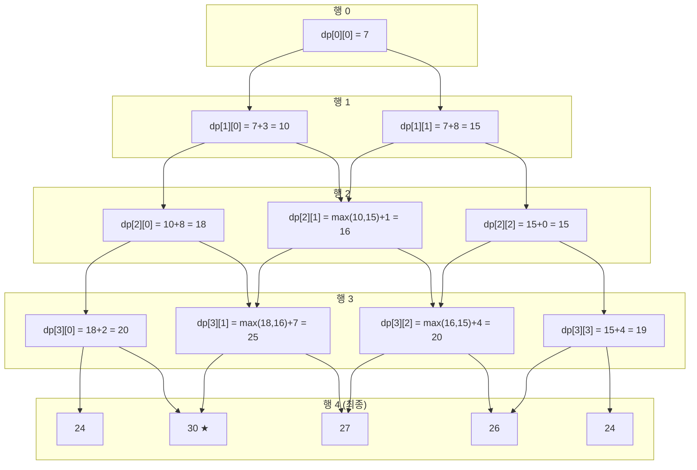

# 프로그래머스 Level 3 — 정수 삼각형 (43105)

> **분류**: 동적 프로그래밍 (Dynamic Programming)  
> **핵심 개념**: 최적 부분 구조, 중복 부분 문제, 벨만 최적성 원리  
> **난이도**: Level 3  
> **링크**: https://school.programmers.co.kr/learn/courses/30/lessons/43105

---

## 1. 문제 요약

삼각형의 꼭대기에서 바닥까지 이어지는 경로 중, 거쳐간 숫자의 합이 가장 큰 경우를 찾는다. 아래 칸으로 이동할 때는 대각선 방향으로 한 칸 오른쪽 또는 왼쪽으로만 이동 가능하다.

**제약 조건**: 삼각형 높이 1~500, 각 숫자 0~9,999

**예제 입력**: `[[7], [3, 8], [8, 1, 0], [2, 7, 4, 4], [4, 5, 2, 6, 5]]`  
**예제 출력**: `30`

삼각형을 시각화하면 다음과 같다.

```
       7
      / \
     3   8
    / \ / \
   8   1   0
  / \ / \ / \
 2   7   4   4
/ \ / \ / \ / \
4   5   2   6   5
```

최적 경로: `7 → 3 → 8 → 7 → 5 = 30`

---

## 2. 왜 DP인가? — 브루트포스의 한계

꼭대기에서 매번 2가지 선택지가 있으므로, 높이 `h`인 삼각형에서 가능한 경로의 수는 **2^(h-1)**개이다. 높이 500이면 2^499 — 우주의 원자 수보다 많으므로 모든 경로를 탐색하는 것은 절대 불가능하다.

DP가 적용 가능한 이유는 이 문제가 다음 두 가지 성질을 모두 만족하기 때문이다.

### 2-1. 최적 부분 구조 (Optimal Substructure)

전체 문제의 최적 해가 부분 문제의 최적 해로부터 구성될 수 있어야 한다. 이 문제에서 위치 `(i, j)`까지의 최대 합은, `(i, j)`에 도달할 수 있는 이전 위치들 — 즉 `(i-1, j-1)`과 `(i-1, j)` — 까지의 최대 합 중 더 큰 것에 현재 값을 더한 것과 같다.

이것이 성립하는 이유는 경로가 위에서 아래로만 진행하기 때문이다. `(i, j)`까지의 최적 경로는 반드시 `(i-1, j-1)` 또는 `(i-1, j)`를 거치며, 그 이전 경로 역시 최적이어야 전체가 최적이 된다. 만약 이전 경로가 최적이 아니라면, 더 나은 이전 경로로 교체함으로써 전체 합을 개선할 수 있으므로 모순이 생긴다.

### 2-2. 중복 부분 문제 (Overlapping Subproblems)

예를 들어 위치 `(2, 1)` — 값 `1`이 있는 위치 — 은 `(1, 0)`에서 오른쪽으로 내려올 때와 `(1, 1)`에서 왼쪽으로 내려올 때 모두에서 필요하다. 재귀로 풀면 이 위치의 최적 합을 여러 번 반복 계산하게 된다. DP는 이 결과를 한 번만 계산하고 저장(메모이제이션)하여 재활용한다.

---

## 3. 핵심 점화식 해부

```
dp[i][j] = triangle[i][j] + max(dp[i-1][j-1], dp[i-1][j])
```

이 식은 **"꼭대기(0, 0)에서 출발하여 위치 (i, j)에 도착했을 때, 거쳐온 숫자들의 합이 가능한 최대 얼마인가?"**를 정의한다.

### 좌변: `dp[i][j]`

"꼭대기에서 위치 (i, j)까지 내려오는 모든 가능한 경로 중, 합이 최대인 경로의 합"을 저장하는 값이다. `i`는 행 번호(0부터), `j`는 행 내 열 번호(0부터)이다.

### 우변 첫 번째 항: `triangle[i][j]`

현재 위치 (i, j)에 적혀 있는 숫자 그 자체이다. 경로의 합을 구하는 것이니 현재 위치의 숫자를 "밟아야" 하므로 반드시 더해야 한다.

### 우변 두 번째 항: `max(dp[i-1][j-1], dp[i-1][j])`

"현재 위치 (i, j)로 올 수 있는 두 가지 이전 위치 중, 더 큰 누적합을 가진 쪽을 선택한다"는 의미이다.

문제의 이동 규칙 "대각선 방향으로 한 칸 오른쪽 또는 왼쪽"을 **거꾸로** 생각하면, 현재 위치 (i, j)에 도달할 수 있는 윗행의 위치는 정확히 두 곳뿐이다.

```
행 i-1:   ...  [j-1]  [j]  ...
                 ↘    ↙
행 i:     ...       [j]       ...
```

`dp[i-1][j-1]`은 **왼쪽 위 부모**로, 윗행 인덱스 j-1에서 오른쪽 대각선으로 내려오면 (i, j)에 도착한다.  
`dp[i-1][j]`는 **오른쪽 위 부모**로, 윗행 인덱스 j에서 왼쪽 대각선으로 내려오면 (i, j)에 도착한다.

`max()`를 취하는 이유는 최대 합 경로를 찾는 것이 목표이기 때문이다. 두 부모 중 어느 쪽에서 내려오든 현재 위치에 도달할 수 있으므로, 더 큰 누적합을 가진 부모를 선택하는 것이 항상 최적이다.

### 구체적 계산 예시: dp[2][1]

```
행0:    7           dp[0][0] = 7
행1:   3   8        dp[1][0] = 10,  dp[1][1] = 15
행2:  8   1   0     dp[2][1] = ?
```

위치 (2, 1)로 올 수 있는 부모는 (1, 0) — dp값 10 — 과 (1, 1) — dp값 15 — 이다.

```
dp[2][1] = triangle[2][1] + max(dp[1][0], dp[1][1])
         =       1        + max(  10   ,    15   )
         =       1        +      15
         =      16
```

이것은 "경로 7→8→1 (합 16)"과 "경로 7→3→1 (합 11)" 중 전자가 최대이므로 16이 저장되는 것과 일치한다.

### 한 문장 요약

`dp[i][j] = triangle[i][j] + max(dp[i-1][j-1], dp[i-1][j])`는 **"현재 칸의 값" + "이 칸에 도달 가능한 두 부모 중 더 나은 경로의 누적합"**을 합쳐서 **"이 칸까지의 최적 누적합"**을 구하는 식이다.

### 경계 조건

맨 왼쪽 원소(`j == 0`)는 바로 윗행의 맨 왼쪽에서만 올 수 있으므로 `dp[i-1][j-1]`이 존재하지 않아 `dp[i-1][j]`만 사용한다. 맨 오른쪽 원소(`j == i`)는 바로 윗행의 맨 오른쪽에서만 올 수 있으므로 `dp[i-1][j]`가 존재하지 않아 `dp[i-1][j-1]`만 사용한다. 가운데 원소들만 두 방향 중 최댓값을 선택한다.

---

## Mermaid 다이어그램

아래 다이어그램은 Bottom-Up DP(Top→Bottom 방향)에서 dp 테이블이 채워지는 흐름을 나타낸다.



---

## 4. 풀이 1 — Bottom-Up DP (Top → Bottom 방향)

위에서 아래로 한 행씩 내려가면서, 각 위치에 "그 위치까지 도달할 수 있는 경로 합의 최댓값"을 누적한다. 마지막 행에서 가장 큰 값이 정답이다.

### 단계별 시뮬레이션

```
원본 삼각형:            dp 배열 변화 과정:

행0:    7               행0:    7
행1:   3  8             행1:   10  15          (3+7=10, 8+7=15)
행2:  8  1  0           행2:  18  16  15       (8+10=18, 1+max(10,15)=16, 0+15=15)
행3: 2  7  4  4         행3: 20  25  20  19    (2+18=20, 7+max(18,16)=25, ...)
행4: 4  5  2  6  5      행4: 24  30  27  26  24
                                 ↑
                              최댓값 = 30
```

### JavaScript

```javascript
function solution(triangle) {
	// dp 배열: triangle을 복사하여 원본 보존
	const dp = triangle.map(row => [...row]);
	
	// 행 1부터 마지막 행까지 순회 (행 0은 꼭대기이므로 그대로)
	for (let i = 1; i < dp.length; i++) {
		for (let j = 0; j <= i; j++) {
			if (j === 0) {
				// 맨 왼쪽: 윗행의 같은 인덱스에서만 올 수 있음
				dp[i][j] += dp[i - 1][j];
			} else if (j === i) {
				// 맨 오른쪽: 윗행의 j-1에서만 올 수 있음
				dp[i][j] += dp[i - 1][j - 1];
			} else {
				// 가운데: 윗행의 j-1과 j 중 큰 값 선택
				dp[i][j] += Math.max(dp[i - 1][j - 1], dp[i - 1][j]);
			}
		}
	}
	
	// 마지막 행에서 최댓값이 정답
	return Math.max(...dp[dp.length - 1]);
}
```

### C++

```cpp
#include <vector>
#include <algorithm>
using namespace std;

int solution(vector<vector<int>> triangle) {
    for (int i = 1; i < (int)triangle.size(); i++) {
        for (int j = 0; j <= i; j++) {
            if (j == 0) {
                triangle[i][j] += triangle[i - 1][j];
            } else if (j == i) {
                triangle[i][j] += triangle[i - 1][j - 1];
            } else {
                triangle[i][j] += max(triangle[i - 1][j - 1], triangle[i - 1][j]);
            }
        }
    }
    return *max_element(triangle.back().begin(), triangle.back().end());
}
```

### Java

```java
class Solution {
    public int solution(int[][] triangle) {
        int n = triangle.length;
        int[][] dp = new int[n][];
        for (int i = 0; i < n; i++) {
            dp[i] = triangle[i].clone();
        }

        for (int i = 1; i < n; i++) {
            for (int j = 0; j <= i; j++) {
                if (j == 0) {
                    dp[i][j] += dp[i - 1][j];
                } else if (j == i) {
                    dp[i][j] += dp[i - 1][j - 1];
                } else {
                    dp[i][j] += Math.max(dp[i - 1][j - 1], dp[i - 1][j]);
                }
            }
        }

        int answer = 0;
        for (int val : dp[n - 1]) {
            answer = Math.max(answer, val);
        }
        return answer;
    }
}
```

### Rust

```rust
fn solution(triangle: Vec<Vec<i32>>) -> i32 {
    let mut dp = triangle.clone();

    for i in 1..dp.len() {
        for j in 0..=i {
            dp[i][j] += if j == 0 {
                dp[i - 1][j]
            } else if j == i {
                dp[i - 1][j - 1]
            } else {
                dp[i - 1][j - 1].max(dp[i - 1][j])
            };
        }
    }

    *dp.last().unwrap().iter().max().unwrap()
}
```

### 복잡도

시간 O(n²), 공간 O(n²) (별도 dp 배열) 또는 O(1) (원본 수정 시)

---

## 5. 풀이 2 — Bottom-Up DP (Bottom → Top 방향) ★ 추천

바닥에서 꼭대기로 올라간다. 바닥 행을 초기값으로 놓고, 한 행씩 위로 올라가면서 각 위치에 "아래 두 자식 중 더 큰 값"을 더한다. 꼭대기 값이 곧 정답이다.

### Top→Bottom 방향 대비 장점

첫째, 경계 조건 분기(j==0, j==i)가 사라지고 모든 위치에서 균일하게 `max(아래왼쪽, 아래오른쪽)`만 하면 된다. 둘째, 마지막에 최댓값을 별도로 스캔할 필요 없이 `dp[0][0]` 하나만 반환하면 된다. 셋째, 1차원 배열만으로 공간 최적화가 자연스럽게 가능하다.

### 점화식

```
dp[i][j] = triangle[i][j] + max(dp[i+1][j], dp[i+1][j+1])
기저 조건: dp[마지막행][j] = triangle[마지막행][j]
```

### 단계별 시뮬레이션

```
초기(바닥행):  4   5   2   6   5

행3 갱신:     2          7          4          4
           +max(4,5)  +max(5,2)  +max(2,6)  +max(6,5)
           = 7         = 12        = 10        = 10

행2 갱신:     8          1          0
           +max(7,12) +max(12,10) +max(10,10)
           = 20        = 13        = 10

행1 갱신:     3          8
           +max(20,13) +max(13,10)
           = 23        = 21

행0 갱신:     7
           +max(23,21)
           = 30  ← 정답!
```

### Java (1차원 배열 최적화)

```java
class Solution {
    public int solution(int[][] triangle) {
        int n = triangle.length;

        // dp를 바닥 행으로 초기화
        int[] dp = triangle[n - 1].clone();

        // 바닥에서 한 행씩 위로 올라감
        for (int i = n - 2; i >= 0; i--) {
            for (int j = 0; j <= i; j++) {
                // 아래 두 자식 중 큰 값 + 현재 값
                dp[j] = triangle[i][j] + Math.max(dp[j], dp[j + 1]);
            }
        }

        // 꼭대기 값이 곧 정답
        return dp[0];
    }
}
```

### 왜 `n - 2`부터 시작하는가? (`n - 1`이 아닌 이유)

위 코드에서 `for (int i = n - 2; i >= 0; i--)` 부분의 `-2`가 왜 `-1`이 아닌지는 Bottom→Top DP의 시작점을 이해하는 핵심이다.

**바닥 행(인덱스 n-1)은 이미 dp 배열의 초기값으로 들어가 있기 때문이다.** 바로 윗줄의 `int[] dp = triangle[n - 1].clone()`에서 바닥 행 전체를 dp에 복사했으므로, 바닥 행은 "처리 완료" 상태이다. 따라서 아직 계산하지 않은 첫 번째 행, 즉 바닥 바로 위인 `n - 2`부터 갱신을 시작해야 한다.

예제 삼각형의 높이는 5이므로 `n = 5`이다. 행 인덱스는 0, 1, 2, 3, 4이고, 바닥 행은 인덱스 4(`n - 1 = 4`)이다.

```
행0:    7          ← i = 0 (꼭대기, 마지막에 처리)
행1:   3   8       ← i = 1
행2:  8   1   0    ← i = 2
행3: 2   7   4   4 ← i = 3 = n-2 (여기서부터 처리 시작!)
행4: 4   5   2   6   5  ← i = 4 = n-1 (dp 초기값, 이미 완료)
```

만약 `n - 1`부터 시작하면 `dp[j] = triangle[n-1][j] + Math.max(dp[j], dp[j+1])`을 실행하게 되는데, 이 시점에서 dp에는 이미 바닥 행의 값이 들어있으므로 **바닥 행의 값을 자기 자신에게 한 번 더 더하는 셈**이 되어 값이 두 배로 뻥튀기되고 틀린 답이 나온다.

정리하면, `-2`는 "배열 인덱스가 0부터 시작하므로 마지막 인덱스는 n-1인데, 그 마지막 행은 초기값으로 이미 처리했으니 그 한 칸 위인 n-1-1 = n-2부터 시작한다"는 뜻이다.

### Go

```go
func solution(triangle [][]int) int {
n := len(triangle)

dp := make([]int, len(triangle[n-1]))
copy(dp, triangle[n-1])

for i := n - 2; i >= 0; i-- {
for j := 0; j <= i; j++ {
if dp[j] > dp[j+1] {
dp[j] = triangle[i][j] + dp[j]
} else {
dp[j] = triangle[i][j] + dp[j+1]
}
}
}

return dp[0]
}
```

### 복잡도

시간 O(n²), 공간 O(n) — 1차원 배열 사용

---

## 6. 풀이 3 — Top-Down 재귀 + 메모이제이션

재귀적으로 "꼭대기에서 바닥까지의 최대 합"을 구하되, 중복 계산을 메모이제이션으로 제거한다.

### 메모이제이션이 없을 때 vs. 있을 때

순수 재귀는 시간 복잡도 O(2^h)로 폭발한다. 호출 트리를 보면 동일한 부분 문제가 기하급수적으로 중복 호출된다.

```
                    dfs(0,0)
                   /         \
             dfs(1,0)       dfs(1,1)
             /     \        /     \
        dfs(2,0) dfs(2,1) dfs(2,1) dfs(2,2)
                   ↑ 같은 호출이 반복됨
```

메모이제이션을 적용하면 각 (row, col) 쌍에 대해 최초 1회만 실제 계산하고, 이후는 O(1)에 캐시 반환하므로 전체 O(n²)으로 줄어든다.

### JavaScript

```javascript
function solution(triangle) {
	const n = triangle.length;
	const memo = Array.from({length: n}, (_, i) => Array(i + 1).fill(-1));
	
	function dfs(row, col) {
		// 기저 조건: 바닥 행 도달
		if (row === n - 1) return triangle[row][col];
		
		// 이미 계산한 값이면 캐시에서 반환
		if (memo[row][col] !== -1) return memo[row][col];
		
		// 왼쪽 아래와 오른쪽 아래 중 최대 경로 선택
		const left = dfs(row + 1, col);
		const right = dfs(row + 1, col + 1);
		
		memo[row][col] = triangle[row][col] + Math.max(left, right);
		return memo[row][col];
	}
	
	return dfs(0, 0);
}
```

### 복잡도

시간 O(n²), 공간 O(n²) (memo) + O(n) (재귀 스택)

---

## 7. 풀이 비교

| 항목 | 풀이 1 (Top→Bottom) | 풀이 2 (Bottom→Top) | 풀이 3 (재귀+메모) |
|------|---------------------|---------------------|-------------------|
| 방향 | 위 → 아래 | 아래 → 위 | 위 → 아래 (재귀) |
| 시간 복잡도 | O(n²) | O(n²) | O(n²) |
| 공간 복잡도 | O(n²) 또는 O(1) | O(n) (1차원 최적화) | O(n²) + 스택 O(n) |
| 경계 처리 | j==0, j==i 분기 필요 | 분기 없이 균일 | 분기 없이 균일 |
| 결과 추출 | max(마지막 행) | dp[0] 하나 | dfs(0,0) 반환값 |
| 실전 추천도 | ★★★ | ★★★★★ | ★★★ |

**실전에서는 풀이 2(Bottom→Top, 1차원 배열)가 가장 깔끔하다.** 경계 분기가 없고, 공간 효율이 좋고, 결과를 별도로 스캔할 필요가 없기 때문이다.

---

## 엣지 케이스 분석

| 관점 | 케이스 | 처리 방법 |
|---|---|---|
| 최솟값 경계 | 삼각형 높이가 1 (행이 하나) | dp 갱신 루프에 진입하지 않고, 꼭대기 값 자체가 정답 |
| 최댓값 경계 | 삼각형 높이가 500, 각 값이 9999 | 최대 누적합 약 500 * 9999 = 4,999,500으로 int 범위 내 |
| 균일 값 | 모든 원소가 동일한 값 (예: 전부 0) | 어떤 경로든 합이 동일하므로 아무 경로나 최적 |
| 한쪽 치우침 | 맨 왼쪽 열만 큰 값, 나머지 0 | 경계 조건(j==0) 분기가 정상 작동하는지 확인 |
| 바닥 행 원소 1개 | 높이 1인 삼각형 | 행 0만 존재하므로 루프 스킵, dp[0][0] 반환 |

---

## 복잡도 비교 (테이블)

| 풀이 | 시간 복잡도 | 공간 복잡도 | 비고 |
|---|---|---|---|
| 풀이 1 — Top→Bottom (2차원 dp) | O(n^2) | O(n^2) | 별도 dp 배열 사용 시 |
| 풀이 1 — Top→Bottom (원본 수정) | O(n^2) | O(1) | triangle 배열 직접 수정 |
| 풀이 2 — Bottom→Top (1차원 dp) | O(n^2) | O(n) | 1차원 배열 최적화, 추천 |
| 풀이 3 — 재귀 + 메모이제이션 | O(n^2) | O(n^2) + O(n) 스택 | memo 배열 + 재귀 호출 스택 |

---

## 8. 수학적 배경: 벨만 최적성 원리

이 문제에서 DP가 작동하는 근본적인 수학적 근거는 Richard Bellman이 제시한 **최적성 원리(Principle of Optimality)**이다.

핵심 내용은 다음과 같다: "최적 정책(optimal policy)의 어떤 중간 상태에서 시작하더라도, 남은 경로는 그 중간 상태를 시작점으로 하는 부분 문제의 최적 해와 동일해야 한다."

이 삼각형 문제에 대입해 보면, 만약 꼭대기에서 바닥까지의 최적 경로가 위치 (i, j)를 지난다면, (i, j)에서 바닥까지의 부분 경로 역시 (i, j)를 꼭대기로 하는 부분 삼각형에서의 최적 해여야 한다. 만약 그렇지 않다면 더 나은 부분 경로로 교체하여 전체를 개선할 수 있기 때문이다. 이 원리가 바로 점화식의 정당성을 보장한다.