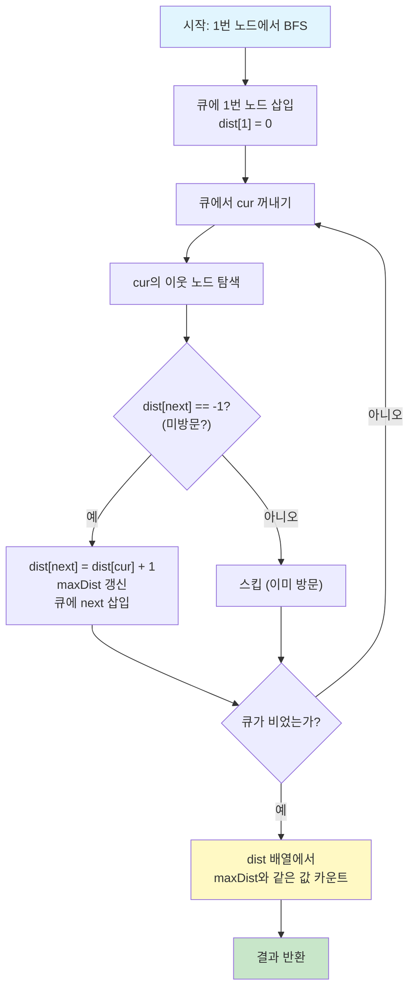

# 가장 먼 노드 (프로그래머스 Lv.3)

## 문제 요약

1번 노드에서 **최단 경로**로 이동했을 때, 간선의 개수가 **가장 많은(=가장 먼)** 노드가 몇 개인지 구하는 문제이다. 그래프는 양방향이고, 가중치가 모두 1인 무가중 그래프이다.

## 핵심 아이디어: 왜 BFS인가?

이 문제의 본질은 "1번 노드에서 모든 노드까지의 최단 거리를 구하라"는 것이다. 간선의 가중치가 모두 동일(=1)한 무가중 그래프에서 최단 거리를 구하는 가장 효율적인 방법이 바로 **BFS(너비 우선 탐색)**이다.

BFS가 최단 거리를 보장하는 이유는 탐색의 진행 방식에 있다. BFS는 큐(Queue)를 사용해서 시작점으로부터 거리가 1인 노드들을 모두 방문한 뒤, 거리가 2인 노드들을 방문하고, 그 다음 거리 3인 노드들을 방문하는 식으로 **거리 순서대로 레이어를 확장**해 나간다. 따라서 어떤 노드를 처음 방문하는 시점의 거리가 곧 최단 거리가 된다.

## 풀이 흐름

전체 알고리즘은 세 단계로 나뉜다.

**1단계 — 그래프 구성**: 입력으로 주어지는 간선 배열 `edge`를 인접 리스트(adjacency list)로 변환한다. 양방향 간선이므로 `a → b`와 `b → a`를 모두 추가한다.

**2단계 — BFS 실행**: 1번 노드를 시작점으로 BFS를 수행하면서, 각 노드까지의 최단 거리를 `dist[]` 배열에 기록한다. 방문 여부는 `dist[i] == -1`로 판단하며, 이미 방문한 노드는 건너뛴다. BFS 과정에서 만나는 최대 거리값도 함께 갱신한다.

**3단계 — 카운트**: `dist[]` 배열을 순회하면서, 최대 거리와 같은 값을 가진 노드의 개수를 세서 반환한다.

## 예제 트레이스

입력: `n=6`, `edge=[[3,6],[4,3],[3,2],[1,3],[1,2],[2,4],[5,2]]`

```
그래프 구조:
    1 --- 2 --- 5
    |     |
    3 --- 4
    |
    6
```

BFS 진행 과정을 단계별로 보면 다음과 같다.

```
초기 상태: dist = [-1, 0, -1, -1, -1, -1, -1]  (인덱스 0은 미사용)
           큐 = [1]

[거리 0 레이어] cur=1
  → 이웃 3: dist[3]=1, 큐에 추가
  → 이웃 2: dist[2]=1, 큐에 추가
  dist = [-1, 0, 1, 1, -1, -1, -1]

[거리 1 레이어] cur=3
  → 이웃 6: dist[6]=2, 큐에 추가
  → 이웃 4: dist[4]=2, 큐에 추가
  → 이웃 2: 이미 방문(dist=1), 스킵
  → 이웃 1: 이미 방문(dist=0), 스킵

[거리 1 레이어] cur=2
  → 이웃 5: dist[5]=2, 큐에 추가
  → 이웃 3: 이미 방문, 스킵
  → 이웃 1: 이미 방문, 스킵
  → 이웃 4: 이미 방문, 스킵

[거리 2 레이어] cur=6, cur=4, cur=5 → 새 이웃 없음

최종 dist = [-1, 0, 1, 1, 2, 2, 2]
maxDist = 2
dist[i] == 2인 노드: 4, 5, 6 → 정답 = 3
```

## 시간 · 공간 복잡도

시간 복잡도는 **O(N + E)** 이다. 모든 노드를 한 번씩 방문하고(N), 모든 간선을 한 번씩 확인(E)하기 때문이다. 이 문제의 제한(N ≤ 20,000, E ≤ 50,000)에서는 매우 여유롭다.

공간 복잡도도 **O(N + E)** 이다. 인접 리스트가 O(N + E), dist 배열이 O(N), 큐가 최악의 경우 O(N)을 차지한다.

---

## Java 풀이

```java
import java.util.*;

class Solution {
    public int solution(int n, int[][] edge) {
        // ── 1단계: 인접 리스트로 그래프 구성 ──
        List<List<Integer>> graph = new ArrayList<>();
        for (int i = 0; i <= n; i++) {
            graph.add(new ArrayList<>());
        }
        for (int[] e : edge) {
            graph.get(e[0]).add(e[1]);   // 양방향이므로
            graph.get(e[1]).add(e[0]);   // 양쪽 모두 추가
        }

        // ── 2단계: BFS로 최단 거리 계산 ──
        int[] dist = new int[n + 1];
        Arrays.fill(dist, -1);           // -1 = 미방문 상태
        dist[1] = 0;                     // 시작점의 거리는 0

        Queue<Integer> queue = new LinkedList<>();
        queue.add(1);

        int maxDist = 0;                 // BFS 도중 최대 거리를 함께 갱신

        while (!queue.isEmpty()) {
            int cur = queue.poll();
            for (int next : graph.get(cur)) {
                if (dist[next] == -1) {  // 아직 방문하지 않은 노드만 처리
                    dist[next] = dist[cur] + 1;
                    maxDist = Math.max(maxDist, dist[next]);
                    queue.add(next);
                }
            }
        }

        // ── 3단계: 최대 거리 노드 카운트 ──
        int count = 0;
        for (int i = 1; i <= n; i++) {
            if (dist[i] == maxDist) count++;
        }
        return count;
    }
}
```

## Go 풀이

```go
package main

func solution(n int, edge [][]int) int {
    // ── 1단계: 인접 리스트로 그래프 구성 ──
    graph := make([][]int, n+1)
    for _, e := range edge {
        graph[e[0]] = append(graph[e[0]], e[1])  // 양방향이므로
        graph[e[1]] = append(graph[e[1]], e[0])  // 양쪽 모두 추가
    }

    // ── 2단계: BFS로 최단 거리 계산 ──
    dist := make([]int, n+1)
    for i := range dist {
        dist[i] = -1                // Go는 기본값이 0이므로 명시적 -1 초기화 필요
    }
    dist[1] = 0                     // 시작점의 거리는 0

    queue := []int{1}               // Go에는 Queue 타입이 없으므로 슬라이스 사용
    maxDist := 0                    // BFS 도중 최대 거리를 함께 갱신

    for len(queue) > 0 {
        cur := queue[0]             // front 꺼내기
        queue = queue[1:]           // dequeue (앞부분 잘라내기)

        for _, next := range graph[cur] {
            if dist[next] == -1 {   // 아직 방문하지 않은 노드만 처리
                dist[next] = dist[cur] + 1
                if dist[next] > maxDist {
                    maxDist = dist[next]
                }
                queue = append(queue, next)
            }
        }
    }

    // ── 3단계: 최대 거리 노드 카운트 ──
    count := 0
    for i := 1; i <= n; i++ {
        if dist[i] == maxDist {
            count++
        }
    }
    return count
}
```

---

## Java와 Go 구현 비교

두 언어의 구현 구조는 거의 동일하지만, 몇 가지 차이점이 있다.

**큐 자료구조**: Java는 `LinkedList<Integer>`를 `Queue` 인터페이스로 사용한다. Go는 별도의 Queue 타입이 없으므로, 슬라이스(`[]int`)를 사용하고 `queue[0]`으로 꺼낸 뒤 `queue = queue[1:]`로 앞을 잘라내는 방식을 쓴다. 이 방식은 간단하지만, 내부적으로 슬라이스의 시작 포인터만 이동하므로 GC가 앞부분을 회수하지 못할 수 있다. 대규모 데이터에서는 `container/list`나 링 버퍼를 고려할 수 있지만, 이 문제의 제한에서는 슬라이스로 충분하다.

**배열 초기화**: Java는 `Arrays.fill(dist, -1)`로 한 번에 채울 수 있다. Go는 기본값이 0이므로 `for` 루프를 돌며 `-1`로 명시적 초기화가 필요하다.

**그래프 표현**: Java는 `List<List<Integer>>`로 이중 리스트를, Go는 `[][]int`(슬라이스의 슬라이스)로 표현한다. Go의 `append`가 Java의 `add`에 대응한다.

**최댓값 갱신**: Java는 `Math.max()`를 사용하고, Go는 표준 라이브러리에 정수용 max가 없으므로(Go 1.21 미만 기준) `if` 조건문으로 직접 비교한다.

## 관련 패턴 정리

이 문제는 **"무가중 그래프 + 최단 거리"** 패턴의 전형적인 예시이다. 같은 패턴이 적용되는 상황들을 정리하면 다음과 같다.

"특정 노드에서 모든 노드까지 최단 거리" → BFS 한 번으로 해결 가능하다. "최단 거리인 노드의 개수" → BFS로 거리를 구한 뒤 카운트하면 된다 (이 문제). "최단 경로의 수" → BFS에서 같은 거리로 도달할 때 경로 수를 누적한다. "모든 쌍의 최단 거리" → 각 노드에서 BFS를 돌리거나, 플로이드-워셜을 고려한다.

만약 간선에 가중치가 있었다면 BFS 대신 **다익스트라(Dijkstra)** 알고리즘을 사용해야 한다. BFS가 가중치 1 전용 다익스트라의 특수 케이스라고 이해하면 두 알고리즘의 관계를 파악하기 쉽다.

---

## Mermaid 다이어그램



---

## 엣지 케이스 분석

| 관점 | 케이스 | 처리 방법 |
|---|---|---|
| 노드가 2개, 간선 1개 | 1번에서 2번까지 거리 1 | 답은 1 (가장 먼 노드 1개) |
| 1번 노드에서 모든 노드까지 거리가 동일 | 스타(star) 형태 그래프 | 답은 n - 1 |
| 일렬로 연결된 그래프 (1-2-3-...-n) | 가장 먼 노드는 n번 하나 | 답은 1 |
| 연결이 안 된 노드 존재 (문제 조건상 연결 그래프) | dist[i] = -1인 노드 | 문제에서 연결 그래프를 보장하므로 발생하지 않음 |
| 간선이 매우 많은 밀집 그래프 | BFS가 모든 간선을 한 번씩 확인 | O(N + E)이므로 시간 내 처리 가능 |
| 같은 간선 중복 입력 | 인접 리스트에 중복 추가됨 | dist 체크로 중복 방문 방지, 정답에 영향 없음 |

---

## 시간·공간 복잡도

| 풀이 | 시간 복잡도 | 공간 복잡도 | 비고 |
|---|---|---|---|
| BFS (너비 우선 탐색) | O(N + E) | O(N + E) | N <= 20,000, E <= 50,000. 인접 리스트 + dist 배열 + 큐 |

---

## 다국어 솔루션

### JavaScript

```javascript
function solution(n, edge) {
    // 인접 리스트로 그래프 구성
    const graph = Array.from({length: n + 1}, () => []);
    for (const [a, b] of edge) {
        graph[a].push(b); // 양방향이므로
        graph[b].push(a); // 양쪽 모두 추가
    }

    // BFS로 최단 거리 계산
    const dist = new Array(n + 1).fill(-1); // -1 = 미방문
    dist[1] = 0; // 시작점 거리 0
    const queue = [1];
    let maxDist = 0;

    while (queue.length > 0) {
        const cur = queue.shift();
        for (const next of graph[cur]) {
            if (dist[next] === -1) { // 미방문 노드만
                dist[next] = dist[cur] + 1;
                maxDist = Math.max(maxDist, dist[next]);
                queue.push(next);
            }
        }
    }

    // 최대 거리 노드 카운트
    let count = 0;
    for (let i = 1; i <= n; i++) {
        if (dist[i] === maxDist) count++;
    }
    return count;
}
```

### C++

```cpp
#include <vector>
#include <queue>
#include <algorithm>
using namespace std;

int solution(int n, vector<vector<int>> edge) {
    // 인접 리스트로 그래프 구성
    vector<vector<int>> graph(n + 1);
    for (auto& e : edge) {
        graph[e[0]].push_back(e[1]); // 양방향이므로
        graph[e[1]].push_back(e[0]); // 양쪽 모두 추가
    }

    // BFS로 최단 거리 계산
    vector<int> dist(n + 1, -1); // -1 = 미방문
    dist[1] = 0; // 시작점 거리 0
    queue<int> q;
    q.push(1);
    int maxDist = 0;

    while (!q.empty()) {
        int cur = q.front();
        q.pop();
        for (int next : graph[cur]) {
            if (dist[next] == -1) { // 미방문 노드만
                dist[next] = dist[cur] + 1;
                maxDist = max(maxDist, dist[next]);
                q.push(next);
            }
        }
    }

    // 최대 거리 노드 카운트
    int count = 0;
    for (int i = 1; i <= n; i++) {
        if (dist[i] == maxDist) count++;
    }
    return count;
}
```

### Rust

```rust
use std::collections::VecDeque;

fn solution(n: usize, edge: Vec<Vec<i32>>) -> i32 {
    // 인접 리스트로 그래프 구성
    let mut graph = vec![vec![]; n + 1];
    for e in &edge {
        let a = e[0] as usize;
        let b = e[1] as usize;
        graph[a].push(b); // 양방향이므로
        graph[b].push(a); // 양쪽 모두 추가
    }

    // BFS로 최단 거리 계산
    let mut dist = vec![-1i32; n + 1]; // -1 = 미방문
    dist[1] = 0; // 시작점 거리 0
    let mut queue = VecDeque::new();
    queue.push_back(1);
    let mut max_dist = 0;

    while let Some(cur) = queue.pop_front() {
        for &next in &graph[cur] {
            if dist[next] == -1 { // 미방문 노드만
                dist[next] = dist[cur] + 1;
                if dist[next] > max_dist {
                    max_dist = dist[next];
                }
                queue.push_back(next);
            }
        }
    }

    // 최대 거리 노드 카운트
    let mut count = 0;
    for i in 1..=n {
        if dist[i] == max_dist {
            count += 1;
        }
    }
    count
}