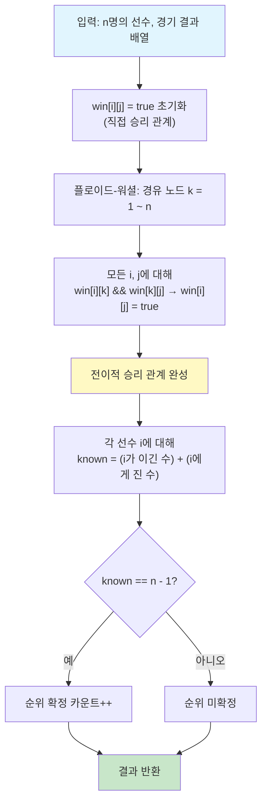

# 순위 매기기 (프로그래머스 Lv.3)

> **문제 링크**: https://school.programmers.co.kr/learn/courses/30/lessons/49191  
> **핵심 키워드**: 방향 그래프, 전이적 관계(Transitive Closure), 플로이드-워셜, BFS

---

## 문제 요약

n명의 권투선수가 1대1 경기를 하고, A가 B보다 실력이 좋으면 항상 A가 이긴다.
일부 경기 결과만 주어졌을 때, **순위를 정확히 매길 수 있는 선수의 수**를 구하라.

순위를 확정할 수 있는 조건은 다음과 같다.
어떤 선수 i에 대해 "i보다 확실히 강한 선수 수 + i보다 확실히 약한 선수 수 = n - 1"이면,
다른 모든 선수와의 상대적 위치가 결정되므로 순위가 확정된다.

여기서 "확실히 강하다/약하다"는 직접 경기 결과뿐 아니라 **간접적 추론**도 포함한다.
예를 들어 A가 B를 이기고, B가 C를 이기면 A는 C보다 확실히 강하다.
이것이 바로 **전이적 관계(Transitive Closure)**이다.

---

## 풀이 1: 플로이드-워셜 (전이적 폐쇄)

### 접근 방식

`win[i][j] = true`를 "i가 j를 (직접 또는 간접으로) 이긴다"로 정의한다.
플로이드-워셜 알고리즘으로 모든 쌍에 대해 전이적 승리 관계를 구한 뒤,
각 선수별로 관계가 밝혀진 상대 수를 센다.

### 코드 (Java)

```java
class Solution {
    public int solution(int n, int[][] results) {
        // win[i][j] = true : i가 j를 (직접 or 간접) 이긴다
        boolean[][] win = new boolean[n + 1][n + 1];
        for (int[] r : results) {
            win[r[0]][r[1]] = true;
        }

        // 플로이드-워셜: 전이적 승리 관계 전파
        for (int k = 1; k <= n; k++) {         // k = 경유 노드
            for (int i = 1; i <= n; i++) {     // i = 출발 노드
                for (int j = 1; j <= n; j++) { // j = 도착 노드
                    if (win[i][k] && win[k][j]) {
                        win[i][j] = true;
                    }
                }
            }
        }

        int answer = 0;
        for (int i = 1; i <= n; i++) {
            int known = 0;
            for (int j = 1; j <= n; j++) {
                // i가 j를 이기든, j가 i를 이기든 관계가 밝혀진 것
                if (win[i][j] || win[j][i]) known++;
            }
            if (known == n - 1) answer++;
        }
        return answer;
    }
}
```

### 코드 (Go)

```go
func solution(n int, results [][]int) int {
    win := make([][]bool, n+1)
    for i := range win {
        win[i] = make([]bool, n+1)
    }
    for _, r := range results {
        win[r[0]][r[1]] = true
    }

    for k := 1; k <= n; k++ {
        for i := 1; i <= n; i++ {
            for j := 1; j <= n; j++ {
                if win[i][k] && win[k][j] {
                    win[i][j] = true
                }
            }
        }
    }

    answer := 0
    for i := 1; i <= n; i++ {
        known := 0
        for j := 1; j <= n; j++ {
            if win[i][j] || win[j][i] {
                known++
            }
        }
        if known == n-1 {
            answer++
        }
    }
    return answer
}
```

### 시간복잡도

O(n³). 이 문제에서 n ≤ 100이므로 최대 100만 번 연산으로 충분히 빠르다.

---

## 플로이드-워셜 점화식 심층 이해

### 점화식

```
reach(i, j, k) = reach(i, j, k-1) OR (reach(i, k, k-1) AND reach(k, j, k-1))
```

이 수식이 의미하는 바를 하나씩 풀어보자.

### reach(i, j, k)란 무엇인가

`reach(i, j, k)`는 "**경유지로 1번부터 k번까지의 노드만 사용할 수 있을 때**, i에서 j로 도달할 수 있는가?"를 뜻한다.

여기서 "경유지"란 i와 j 사이의 **중간 다리 역할**을 하는 노드를 말한다.
i→...→j 경로에서 시작(i)과 끝(j)을 제외한 나머지 노드들이 경유지다.

이 정의에 따르면 다음과 같은 경계 조건이 성립한다.

`reach(i, j, 0)`은 경유지를 아예 쓸 수 없다는 뜻이므로,
i에서 j로의 **직접 간선이 있을 때만** true이다. 이것이 초기 상태, 즉 입력으로 주어진 경기 결과다.

`reach(i, j, n)`은 모든 노드를 경유지로 쓸 수 있다는 뜻이므로,
이것이 최종적으로 우리가 원하는 **전이적 도달 가능성**이다.

### 점화식의 두 갈래

k번 노드를 새로 경유지 후보로 추가했을 때, i에서 j로 갈 수 있는 경우는 딱 두 가지다.

**갈래 1: k를 안 거쳐도 이미 갈 수 있는 경우**

```
reach(i, j, k-1) = true
```

경유지 {1, 2, ..., k-1}만으로 이미 i→j가 가능하다면,
k를 추가하든 말든 당연히 여전히 가능하다.

**갈래 2: k를 거쳐야 비로소 갈 수 있는 경우**

```
reach(i, k, k-1) AND reach(k, j, k-1) = true
```

i에서 k까지 갈 수 있고(경유지 {1..k-1} 사용), 동시에 k에서 j까지 갈 수 있으면,
i → ... → k → ... → j 경로가 존재하므로 i에서 j로 갈 수 있다.

이 두 가지를 OR로 합치면, "경유지 {1..k}를 써서 i→j가 가능한가?"의 완전한 답이 된다.

```
reach(i, j, k) = reach(i, j, k-1) OR (reach(i, k, k-1) AND reach(k, j, k-1))
```

### 비유로 이해하기: 섬과 다리

5개의 섬(노드 1~5)이 있고, 일부 섬 사이에 일방통행 다리가 놓여 있다고 상상해보자.

처음에는 직접 연결된 다리만 건널 수 있다(k=0 상태).

이제 "섬 1번을 중간 기착지로 사용해도 된다"고 허가한다(k=1).
그러면 "A→1 다리"와 "1→B 다리"가 모두 있는 경우, A에서 B로 갈 수 있게 된다.

다음으로 "섬 2번도 중간 기착지로 허가한다"(k=2).
이제 1번과 2번을 모두 경유할 수 있으므로 더 많은 경로가 열린다.

이렇게 허가되는 경유지를 **한 개씩 늘려가며** 도달 가능성을 갱신하는 것이
플로이드-워셜의 핵심 원리다. k=n이 끝나면 모든 노드를 경유할 수 있으므로
최종 전이적 관계가 완성된다.

### 코드와 점화식의 대응

점화식에는 k-1 차원이 있지만, 코드에서는 2차원 배열 하나로 in-place 갱신한다.
이것이 가능한 이유는 다음과 같다.

`win[i][k]`와 `win[k][j]`는 k번째 루프에서 **참조만** 할 뿐, k행과 k열의 값 자체는
이번 k 루프에서 변하지 않기 때문이다. (k를 경유해서 k에 도달하는 건 자기 자신이므로 의미 없다.)
따라서 별도의 이전 상태 배열 없이도 정확한 결과를 얻을 수 있다.

```
점화식                              코드
─────────────────────────────────   ─────────────────────────
reach(i, j, k-1)                →   win[i][j] (갱신 전 현재 값)
reach(i, k, k-1)                →   win[i][k] (k 루프에서 불변)
reach(k, j, k-1)                →   win[k][j] (k 루프에서 불변)
reach(i, j, k)                  →   win[i][j] = true (갱신)
```

### 예시 트레이스 (k=2 단계)

입력: `[4,3], [4,2], [3,2], [1,2], [2,5]`

k=2 직전 상태 (직접 간선만 존재):

```
     1  2  3  4  5
1  [ .  T  .  .  . ]
2  [ .  .  .  .  T ]
3  [ .  T  .  .  . ]
4  [ .  T  T  .  . ]
5  [ .  .  .  .  . ]
```

k=2일 때 "2번을 경유"할 수 있는 모든 조합을 확인한다.

```
i=1: win[1][2]=T → 2를 거쳐 갈 수 있는 곳 확인
     win[2][5]=T → win[1][5] = true  ✅ 발견! "1→2→5"

i=3: win[3][2]=T → 2를 거쳐 갈 수 있는 곳 확인
     win[2][5]=T → win[3][5] = true  ✅ 발견! "3→2→5"

i=4: win[4][2]=T → 2를 거쳐 갈 수 있는 곳 확인
     win[2][5]=T → win[4][5] = true  ✅ 발견! "4→2→5"
```

k=2 이후 상태:

```
     1  2  3  4  5
1  [ .  T  .  .  T ]  ← 1→5 추가
2  [ .  .  .  .  T ]
3  [ .  T  .  .  T ]  ← 3→5 추가
4  [ .  T  T  .  T ]  ← 4→5 추가
5  [ .  .  .  .  . ]
```

---

## 풀이 2: BFS (방향 그래프 + 역방향 그래프)

### 접근 방식

각 선수마다 두 번의 BFS를 수행한다.

1. **승리 그래프**에서 BFS → i가 (직접·간접으로) 이기는 선수 수를 센다.
2. **패배 그래프**(간선 방향을 뒤집은 역방향 그래프)에서 BFS → i를 (직접·간접으로) 이기는 선수 수를 센다.

두 수의 합이 n-1이면 순위가 확정된다.

### 왜 역방향 그래프가 필요한가

승리 그래프에서 i를 시작점으로 BFS를 돌리면, i에서 출발해 도달 가능한 노드,
즉 "i보다 약한 선수"만 찾을 수 있다. "i보다 강한 선수"는 간선 방향이 반대이므로
승리 그래프의 BFS로는 찾을 수 없다.

해결법은 간선 방향을 모두 뒤집은 **역방향 그래프**를 만드는 것이다.
역방향 그래프에서 i를 시작점으로 BFS를 돌리면, 원래 그래프에서 i로 도달 가능한 노드,
즉 "i보다 강한 선수"를 찾을 수 있다.

이 "역방향 그래프 BFS" 패턴은 방향 그래프 문제에서 빈번하게 등장하는 테크닉이다.

### 코드 (Java)

```java
import java.util.*;

class Solution {
    public int solution(int n, int[][] results) {
        // winGraph[i] : i가 직접 이긴 상대 목록
        // loseGraph[i] : i를 직접 이긴 상대 목록 (역방향)
        List<List<Integer>> winGraph = new ArrayList<>();
        List<List<Integer>> loseGraph = new ArrayList<>();
        for (int i = 0; i <= n; i++) {
            winGraph.add(new ArrayList<>());
            loseGraph.add(new ArrayList<>());
        }

        for (int[] r : results) {
            winGraph.get(r[0]).add(r[1]);   // r[0] → r[1] (이김)
            loseGraph.get(r[1]).add(r[0]);  // 역방향: r[1] ← r[0]
        }

        int answer = 0;
        for (int i = 1; i <= n; i++) {
            // i보다 약한 선수 수 + i보다 강한 선수 수
            int known = bfs(i, winGraph, n) + bfs(i, loseGraph, n);
            if (known == n - 1) answer++;
        }
        return answer;
    }

    // start에서 graph 방향을 따라 도달 가능한 노드 수를 반환
    private int bfs(int start, List<List<Integer>> graph, int n) {
        boolean[] visited = new boolean[n + 1];
        visited[start] = true;

        Queue<Integer> queue = new LinkedList<>();
        queue.add(start);

        int count = 0;
        while (!queue.isEmpty()) {
            int cur = queue.poll();
            for (int next : graph.get(cur)) {
                if (!visited[next]) {
                    visited[next] = true;
                    count++;
                    queue.add(next);
                }
            }
        }
        return count;
    }
}
```

### 코드 (Go)

```go
func solution(n int, results [][]int) int {
    winGraph := make([][]int, n+1)
    loseGraph := make([][]int, n+1)

    for _, r := range results {
        winGraph[r[0]] = append(winGraph[r[0]], r[1])
        loseGraph[r[1]] = append(loseGraph[r[1]], r[0])
    }

    answer := 0
    for i := 1; i <= n; i++ {
        known := bfs(i, winGraph, n) + bfs(i, loseGraph, n)
        if known == n-1 {
            answer++
        }
    }
    return answer
}

func bfs(start int, graph [][]int, n int) int {
    visited := make([]bool, n+1)
    visited[start] = true
    queue := []int{start}
    count := 0

    for len(queue) > 0 {
        cur := queue[0]
        queue = queue[1:]
        for _, next := range graph[cur] {
            if !visited[next] {
                visited[next] = true
                count++
                queue = append(queue, next)
            }
        }
    }
    return count
}
```

### 시간복잡도

각 선수마다 BFS 2번, 각 BFS는 O(n + E). 전체 O(n(n + E)).
이 문제에서는 n ≤ 100, E ≤ 4,500이므로 충분히 빠르다.

---

## 두 풀이 비교

| 항목 | 플로이드-워셜 | BFS |
|---|---|---|
| 관점 | 모든 쌍의 관계를 한꺼번에 | 각 선수별로 개별 탐색 |
| 시간복잡도 | O(n³) | O(n(n + E)) |
| 공간복잡도 | O(n²) boolean 배열 | O(n + E) 인접 리스트 × 2 |
| 구현 난이도 | 매우 단순 (3중 루프) | 약간 더 김 (BFS 함수 + 역방향 그래프) |
| n이 크고 간선 희소 | 불리 (항상 n³) | 유리 (E가 작으면 빠름) |
| 핵심 테크닉 | 경유지 점진 확장 | 역방향 그래프 BFS |

이 문제의 제약(n ≤ 100)에서는 두 방식 모두 성능 차이가 거의 없다.
플로이드-워셜은 코드가 짧고 단순하며,
BFS는 "왜 역방향 그래프가 필요한가"를 이해하는 데 좋은 연습이 된다.

---

## 예시 트레이스 (n=5)

입력: `[[4,3], [4,2], [3,2], [1,2], [2,5]]`

최종 전이적 승리 관계 (두 풀이 모두 동일한 결과):

```
     1  2  3  4  5
1  [ .  ✓  .  .  ✓ ]   1→2, 1→5 (이김 2명)
2  [ .  .  .  .  ✓ ]   2→5 (이김 1명)
3  [ .  ✓  .  .  ✓ ]   3→2, 3→5 (이김 2명)
4  [ .  ✓  ✓  .  ✓ ]   4→2, 4→3, 4→5 (이김 3명)
5  [ .  .  .  .  . ]   (이김 0명)
```

각 선수의 "관계가 밝혀진 상대" 수:

```
1번: 이김(2,5) + 짐(없음) = 2  →  2 ≠ 4  →  순위 미확정
2번: 이김(5) + 짐(1,3,4) = 4   →  4 = n-1  →  ✅ 4위 확정
3번: 이김(2,5) + 짐(4) = 3     →  3 ≠ 4  →  순위 미확정
4번: 이김(2,3,5) + 짐(없음) = 3 →  3 ≠ 4  →  순위 미확정
5번: 이김(없음) + 짐(1,2,3,4) = 4 → 4 = n-1 → ✅ 5위 확정
```

정답: **2**

---

## Mermaid 다이어그램



---

## 엣지 케이스 분석

| 관점 | 케이스 | 처리 방법 |
|---|---|---|
| 경기 결과가 0개 | 아무 관계도 없으므로 순위 확정 불가 | known = 0 → 답은 0 |
| 모든 선수가 체인 형태 (1>2>3>...>n) | 전이적 관계로 모든 순위 확정 가능 | 플로이드-워셜이 모든 관계를 전파 → 답은 n |
| 두 선수 간 경기 결과가 중복 입력 | win[i][j]가 이미 true → 영향 없음 | boolean 배열이므로 중복 대입 무해 |
| n = 1 | 선수가 한 명이면 known = 0 = n-1 = 0 | 답은 1 |
| 간선이 희소 (경기 결과 적음) | 관계가 밝혀지지 않는 선수 많음 | 답이 적거나 0에 가까움 |
| 사이클이 존재하는 입력 (문제 조건상 불가) | A>B>C>A는 실력 기반 문제라 발생 안 함 | 코드에 별도 처리 불필요 |

---

## 시간·공간 복잡도

| 풀이 | 시간 복잡도 | 공간 복잡도 | 비고 |
|---|---|---|---|
| 플로이드-워셜 | O(n^3) | O(n^2) | n <= 100이므로 최대 100만 연산 |
| BFS (승리 + 패배 그래프) | O(n(n + E)) | O(n + E) | E <= 4,500. 각 선수마다 BFS 2회 |

---

## 다국어 솔루션

### JavaScript (플로이드-워셜)

```javascript
function solution(n, results) {
    // win[i][j] = true : i가 j를 (직접 or 간접) 이긴다
    const win = Array.from({length: n + 1}, () => Array(n + 1).fill(false));

    for (const [a, b] of results) {
        win[a][b] = true;
    }

    // 플로이드-워셜: 전이적 승리 관계 전파
    for (let k = 1; k <= n; k++) {
        for (let i = 1; i <= n; i++) {
            for (let j = 1; j <= n; j++) {
                if (win[i][k] && win[k][j]) {
                    win[i][j] = true;
                }
            }
        }
    }

    // 각 선수의 관계가 밝혀진 상대 수 확인
    let answer = 0;
    for (let i = 1; i <= n; i++) {
        let known = 0;
        for (let j = 1; j <= n; j++) {
            if (win[i][j] || win[j][i]) known++;
        }
        if (known === n - 1) answer++;
    }
    return answer;
}
```

### C++ (플로이드-워셜)

```cpp
#include <vector>
using namespace std;

int solution(int n, vector<vector<int>> results) {
    // win[i][j] = true : i가 j를 (직접 or 간접) 이긴다
    vector<vector<bool>> win(n + 1, vector<bool>(n + 1, false));

    for (auto& r : results) {
        win[r[0]][r[1]] = true;
    }

    // 플로이드-워셜: 전이적 승리 관계 전파
    for (int k = 1; k <= n; k++) {
        for (int i = 1; i <= n; i++) {
            for (int j = 1; j <= n; j++) {
                if (win[i][k] && win[k][j]) {
                    win[i][j] = true;
                }
            }
        }
    }

    // 각 선수의 관계가 밝혀진 상대 수 확인
    int answer = 0;
    for (int i = 1; i <= n; i++) {
        int known = 0;
        for (int j = 1; j <= n; j++) {
            if (win[i][j] || win[j][i]) known++;
        }
        if (known == n - 1) answer++;
    }
    return answer;
}
```

### Rust (플로이드-워셜)

```rust
fn solution(n: usize, results: Vec<Vec<i32>>) -> i32 {
    // win[i][j] = true : i가 j를 (직접 or 간접) 이긴다
    let mut win = vec![vec![false; n + 1]; n + 1];

    for r in &results {
        win[r[0] as usize][r[1] as usize] = true;
    }

    // 플로이드-워셜: 전이적 승리 관계 전파
    for k in 1..=n {
        for i in 1..=n {
            for j in 1..=n {
                if win[i][k] && win[k][j] {
                    win[i][j] = true;
                }
            }
        }
    }

    // 각 선수의 관계가 밝혀진 상대 수 확인
    let mut answer = 0;
    for i in 1..=n {
        let mut known = 0;
        for j in 1..=n {
            if win[i][j] || win[j][i] {
                known += 1;
            }
        }
        if known == n - 1 {
            answer += 1;
        }
    }
    answer
}