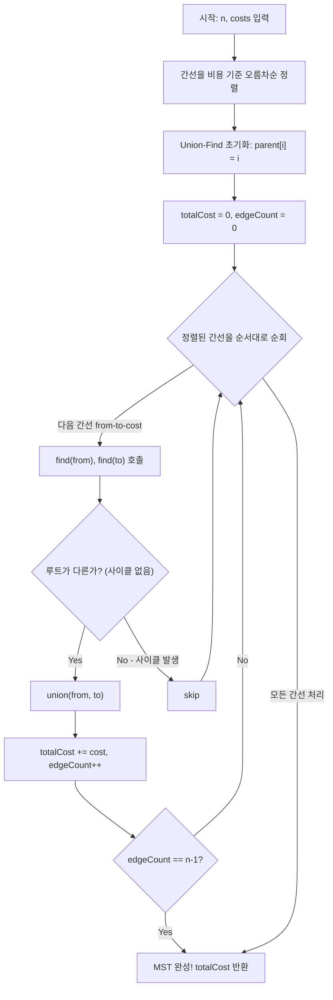

# 섬 연결하기 복습 정리
**Programmers - 탐욕법 (Greedy)**  
https://school.programmers.co.kr/learn/courses/30/lessons/42861

---

## 1. 문제 요약

n개의 섬을 최소 비용으로 모두 연결하는 문제입니다. 다리를 여러 번 건너더라도 도달할 수 있으면 통행 가능하다고 보며, 모든 섬이 서로 통행 가능하도록 만드는 데 필요한 최소 비용을 구해야 합니다.

---

## 2. 핵심 알고리즘 개념

### 2-1. 최소 신장 트리 (MST, Minimum Spanning Tree)

신장 트리(Spanning Tree)란 그래프의 모든 노드를 **사이클 없이** 연결한 트리입니다. 이때 간선의 수는 항상 `노드 수 - 1`이 됩니다. 최소 신장 트리(MST)는 여러 신장 트리 중 **간선 비용의 합이 최소**인 트리를 의미합니다.

MST의 세 가지 핵심 조건은 다음과 같습니다.
- 모든 노드가 포함되어야 합니다.
- 간선 수 = 노드 수 - 1 이어야 합니다.
- 사이클이 없어야 합니다. (사이클이 생기면 불필요한 비용 낭비)

**왜 간선 수가 N-1인가?** 처음에 N개의 노드가 모두 분리되어 있을 때, 연결 한 번마다 그룹이 하나 줄어들므로 N개 그룹을 1개 그룹으로 만들려면 정확히 N-1번 연결이 필요합니다.

```
N개 그룹 → (연결 1번) → N-1개 그룹 → ... → (연결 N-1번) → 1개 그룹 완성
```

---

### 2-2. 크루스칼 알고리즘 (Kruskal's Algorithm)

크루스칼 알고리즘은 MST를 구하는 대표적인 **Greedy 알고리즘**입니다. 핵심 아이디어는 **"가장 싼 간선부터 하나씩 선택하되, 사이클이 생기면 건너뛴다"** 는 것입니다. 매 순간 가장 비용이 낮은 간선을 선택하는 것이 전체 최적을 보장합니다.

동작 순서는 다음과 같습니다.
1. 모든 간선을 비용 기준 오름차순 정렬
2. 비용이 작은 간선부터 순서대로 검토
3. 사이클이 생기지 않으면 선택 (비용 합산), 사이클이 생기면 skip
4. N-1개의 간선이 선택되면 MST 완성

---

### 2-3. Union-Find 자료구조

Union-Find는 여러 원소들을 그룹으로 묶고, **두 원소가 같은 그룹인지 빠르게 판단**하는 자료구조입니다. 크루스칼 알고리즘에서 사이클 발생 여부를 판단하는 데 사용됩니다.

두 가지 핵심 연산이 있습니다.
- **find(x)**: x가 속한 그룹의 대표(루트)를 반환합니다.
- **union(a, b)**: a와 b를 같은 그룹으로 합칩니다.

`parent[]` 배열로 각 노드의 부모를 관리하며, `parent[i] == i`이면 i가 루트(대표)입니다. 초기 상태에서는 모든 노드가 자기 자신을 가리킵니다.

```
초기 상태:
index:   0  1  2  3
parent: [0, 1, 2, 3]  ← 모두 자기 자신이 루트 (4개의 독립 그룹)
```

---

### 2-4. 경로 압축 (Path Compression)

`find()` 호출 시, 루트를 찾아 올라가는 과정에서 거쳐간 모든 노드가 **루트를 직접 가리키도록 갱신**합니다. 이로 인해 이후 `find()` 호출이 거의 O(1)에 동작합니다.

```
경로 압축 전: find(0) → 0 → 1 → 2 → 3  (3번 이동)
경로 압축 후: find(0) → 0 → 3           (1번 이동, parent[0]이 루트 3을 바로 가리킴)
```

---

### 2-5. Union by Rank (랭크 기반 합치기)

기본 `union()`은 항상 같은 방향으로 루트를 정하면 트리가 한쪽으로 **편향**될 수 있습니다. Union by Rank는 트리의 높이(rank)를 추적하여, 항상 높이가 낮은 트리를 높은 트리 아래로 붙여 **트리가 균형을 유지**하도록 합니다.

합치는 규칙은 다음과 같습니다.
- `rank[A] < rank[B]` : A를 B 아래로 (`parent[rootA] = rootB`)
- `rank[A] > rank[B]` : B를 A 아래로 (`parent[rootB] = rootA`)
- `rank[A] == rank[B]` : 방향 무관, 선택된 루트의 rank를 1 증가

---

## 3. 각 개념이 사용되는 이유

| 개념 | 사용 이유 |
|:---|:---|
| MST | 모든 섬을 최소 비용으로 연결하는 것이 곧 MST 문제이기 때문 |
| 크루스칼 알고리즘 | Greedy로 간선을 하나씩 선택해 MST를 효율적으로 구성 |
| Union-Find | 두 노드가 이미 같은 그룹(연결됨)인지 O(1)에 판단해 사이클을 방지 |
| 경로 압축 | find() 반복 호출 시 성능 저하 방지 (트리 높이를 평탄화) |
| Union by Rank | 트리 편향 방지, find()의 최악 케이스를 O(N)에서 O(logN)으로 개선 |

---

## 4. '루트가 같다 = 사이클' 인 이유

루트(대표)가 같다는 것은 두 노드가 **이미 같은 그룹에 속해 있다**는 뜻입니다. 같은 그룹이란 두 노드 사이에 **이미 경로가 하나 존재**한다는 의미입니다. 여기에 간선을 하나 더 추가하면 경로가 2개가 되고, 출발점으로 돌아올 수 있는 사이클이 형성됩니다.

```
예) 0-1-3이 이미 연결된 상태에서 [0-3] 간선 추가 시도:

find(0) = 3  ← 0의 루트
find(3) = 3  ← 3의 루트
→ 루트가 같다!

기존 경로: 0 → 1 → 3  (이미 연결됨)
새 간선:   0 ━━━━━ 3  (직접 연결 추가)

결과: 0에서 3으로 가는 경로가 2개 → 사이클 발생! ❌
```

반대로 루트가 다르면 두 노드가 서로 다른 그룹에 있어 아직 경로가 없습니다. 이 경우 간선을 추가해도 경로는 하나뿐이므로 사이클이 생기지 않습니다.

---

## 5. Java 코드 풀이 (Union by Rank 적용)

```java
import java.util.*;

class Solution {

    static int[] parent; // 각 노드의 부모 저장
    static int[] rank;   // 각 노드의 트리 높이 저장

    // x의 루트를 찾는 함수 (경로 압축 적용)
    static int find(int x) {
        if (parent[x] != x) {
            parent[x] = find(parent[x]); // 루트를 바로 가리키도록 압축
        }
        return parent[x];
    }

    // a와 b를 같은 그룹으로 합치는 함수 (Union by Rank)
    static void union(int a, int b) {
        int rootA = find(a);
        int rootB = find(b);
        if (rootA == rootB) return; // 이미 같은 그룹이면 무시

        if (rank[rootA] < rank[rootB]) {
            parent[rootA] = rootB;      // A가 더 낮으면 A를 B 아래로
        } else if (rank[rootA] > rank[rootB]) {
            parent[rootB] = rootA;      // B가 더 낮으면 B를 A 아래로
        } else {
            parent[rootB] = rootA;      // 높이 같으면 A를 루트로
            rank[rootA]++;              // A의 높이 1 증가
        }
    }

    public int solution(int n, int[][] costs) {
        // 1. 간선을 비용 기준 오름차순 정렬
        Arrays.sort(costs, (a, b) -> a[2] - b[2]);

        // 2. Union-Find 초기화
        parent = new int[n];
        rank = new int[n];
        for (int i = 0; i < n; i++) {
            parent[i] = i; // 자기 자신이 루트
            rank[i] = 0;   // 초기 높이 = 0
        }

        int totalCost = 0;
        int edgeCount = 0;

        // 3. 간선을 하나씩 검토
        for (int[] edge : costs) {
            int from = edge[0];
            int to   = edge[1];
            int cost = edge[2];

            // 사이클이 없으면 (루트가 다르면) 선택
            if (find(from) != find(to)) {
                union(from, to);
                totalCost += cost;
                edgeCount++;
            }

            // N-1개 선택 완료 = MST 완성
            if (edgeCount == n - 1) break;
        }

        return totalCost;
    }
}
```

### JavaScript

```javascript
function solution(n, costs) {
    // 1. 간선을 비용 기준 오름차순 정렬
    costs.sort((a, b) => a[2] - b[2]);

    // 2. Union-Find 초기화
    const parent = Array.from({ length: n }, (_, i) => i);
    const rank = new Array(n).fill(0);

    // x의 루트를 찾는 함수 (경로 압축 적용)
    function find(x) {
        if (parent[x] !== x) {
            parent[x] = find(parent[x]);
        }
        return parent[x];
    }

    // a와 b를 같은 그룹으로 합치는 함수 (Union by Rank)
    function union(a, b) {
        const rootA = find(a);
        const rootB = find(b);
        if (rootA === rootB) return;

        if (rank[rootA] < rank[rootB]) {
            parent[rootA] = rootB;
        } else if (rank[rootA] > rank[rootB]) {
            parent[rootB] = rootA;
        } else {
            parent[rootB] = rootA;
            rank[rootA]++;
        }
    }

    let totalCost = 0;
    let edgeCount = 0;

    // 3. 간선을 하나씩 검토
    for (const [from, to, cost] of costs) {
        // 사이클이 없으면 (루트가 다르면) 선택
        if (find(from) !== find(to)) {
            union(from, to);
            totalCost += cost;
            edgeCount++;
        }
        // N-1개 선택 완료 = MST 완성
        if (edgeCount === n - 1) break;
    }

    return totalCost;
}
```

### C++

```cpp
#include <vector>
#include <algorithm>

using namespace std;

int parent_arr[100];
int rank_arr[100];

// x의 루트를 찾는 함수 (경로 압축 적용)
int find(int x) {
    if (parent_arr[x] != x) {
        parent_arr[x] = find(parent_arr[x]);
    }
    return parent_arr[x];
}

// a와 b를 같은 그룹으로 합치는 함수 (Union by Rank)
void unite(int a, int b) {
    int rootA = find(a);
    int rootB = find(b);
    if (rootA == rootB) return;

    if (rank_arr[rootA] < rank_arr[rootB]) {
        parent_arr[rootA] = rootB;
    } else if (rank_arr[rootA] > rank_arr[rootB]) {
        parent_arr[rootB] = rootA;
    } else {
        parent_arr[rootB] = rootA;
        rank_arr[rootA]++;
    }
}

int solution(int n, vector<vector<int>> costs) {
    // 1. 간선을 비용 기준 오름차순 정렬
    sort(costs.begin(), costs.end(),
         [](const vector<int>& a, const vector<int>& b) { return a[2] < b[2]; });

    // 2. Union-Find 초기화
    for (int i = 0; i < n; i++) {
        parent_arr[i] = i;
        rank_arr[i] = 0;
    }

    int totalCost = 0;
    int edgeCount = 0;

    // 3. 간선을 하나씩 검토
    for (auto& edge : costs) {
        int from = edge[0], to = edge[1], cost = edge[2];

        // 사이클이 없으면 (루트가 다르면) 선택
        if (find(from) != find(to)) {
            unite(from, to);
            totalCost += cost;
            edgeCount++;
        }
        // N-1개 선택 완료 = MST 완성
        if (edgeCount == n - 1) break;
    }

    return totalCost;
}
```

### Rust

```rust
fn solution(n: i32, costs: Vec<Vec<i32>>) -> i32 {
    let n = n as usize;

    // 1. 간선을 비용 기준 오름차순 정렬
    let mut costs = costs;
    costs.sort_by_key(|e| e[2]);

    // 2. Union-Find 초기화
    let mut parent: Vec<usize> = (0..n).collect();
    let mut rank = vec![0usize; n];

    // x의 루트를 찾는 함수 (경로 압축 적용)
    fn find(parent: &mut Vec<usize>, x: usize) -> usize {
        if parent[x] != x {
            parent[x] = find(parent, parent[x]);
        }
        parent[x]
    }

    // a와 b를 같은 그룹으로 합치는 함수 (Union by Rank)
    fn union(parent: &mut Vec<usize>, rank: &mut Vec<usize>, a: usize, b: usize) {
        let root_a = find(parent, a);
        let root_b = find(parent, b);
        if root_a == root_b { return; }

        if rank[root_a] < rank[root_b] {
            parent[root_a] = root_b;
        } else if rank[root_a] > rank[root_b] {
            parent[root_b] = root_a;
        } else {
            parent[root_b] = root_a;
            rank[root_a] += 1;
        }
    }

    let mut total_cost = 0;
    let mut edge_count = 0;

    // 3. 간선을 하나씩 검토
    for edge in &costs {
        let from = edge[0] as usize;
        let to = edge[1] as usize;
        let cost = edge[2];

        // 사이클이 없으면 (루트가 다르면) 선택
        if find(&mut parent, from) != find(&mut parent, to) {
            union(&mut parent, &mut rank, from, to);
            total_cost += cost;
            edge_count += 1;
        }
        // N-1개 선택 완료 = MST 완성
        if edge_count == n - 1 { break; }
    }

    total_cost
}
```

### Go

```go
package main

import "sort"

var parent []int
var rankArr []int

// x의 루트를 찾는 함수 (경로 압축 적용)
func find(x int) int {
	if parent[x] != x {
		parent[x] = find(parent[x])
	}
	return parent[x]
}

// a와 b를 같은 그룹으로 합치는 함수 (Union by Rank)
func union(a, b int) {
	rootA := find(a)
	rootB := find(b)
	if rootA == rootB {
		return
	}

	if rankArr[rootA] < rankArr[rootB] {
		parent[rootA] = rootB
	} else if rankArr[rootA] > rankArr[rootB] {
		parent[rootB] = rootA
	} else {
		parent[rootB] = rootA
		rankArr[rootA]++
	}
}

func solution(n int, costs [][]int) int {
	// 1. 간선을 비용 기준 오름차순 정렬
	sort.Slice(costs, func(i, j int) bool {
		return costs[i][2] < costs[j][2]
	})

	// 2. Union-Find 초기화
	parent = make([]int, n)
	rankArr = make([]int, n)
	for i := 0; i < n; i++ {
		parent[i] = i
		rankArr[i] = 0
	}

	totalCost := 0
	edgeCount := 0

	// 3. 간선을 하나씩 검토
	for _, edge := range costs {
		from, to, cost := edge[0], edge[1], edge[2]

		// 사이클이 없으면 (루트가 다르면) 선택
		if find(from) != find(to) {
			union(from, to)
			totalCost += cost
			edgeCount++
		}
		// N-1개 선택 완료 = MST 완성
		if edgeCount == n-1 {
			break
		}
	}

	return totalCost
}
```

## Mermaid 다이어그램



## 엣지 케이스 분석

| 관점 | 케이스 | 처리 방법 |
|---|---|---|
| 최소 입력 | n=2, costs=[[0,1,5]] | 간선 1개만 선택, totalCost = 5 |
| 동일 비용 간선 | 모든 간선 비용 동일 | 어느 것을 먼저 선택해도 MST 비용 동일 |
| 완전 그래프 | n개 노드 모두 연결 | 정렬 후 가장 싼 n-1개 중 사이클 없는 것만 선택 |
| 이미 연결된 노드 | 같은 그룹의 노드에 간선 추가 | find()로 루트 비교하여 사이클 감지, skip |
| 간선 비용 0 | costs 중 비용이 0인 간선 | 정렬 시 가장 앞에 위치, 정상 처리 |

---

## 6. 풀이 동작 원리 (예시: n=4)

입력: `costs = [[0,1,1],[0,2,2],[1,2,5],[1,3,1],[2,3,8]]`, 정답 = 4

**정렬 후 간선 목록**
```
[0-1: 1] → [1-3: 1] → [0-2: 2] → [1-2: 5] → [2-3: 8]
```

**초기 상태**
```
parent = [0, 1, 2, 3]  ← 각자 자기 자신이 루트
rank   = [0, 0, 0, 0]
그룹: {0} {1} {2} {3}
```

**Step 1: 간선 [0-1: 1] 선택**
```
find(0)=0, find(1)=1 → 루트 다름 → 선택!
rank 동일(0==0) → parent[1]=0, rank[0]++

parent = [0, 0, 2, 3]  /  rank = [1, 0, 0, 0]
트리: 0(루트) ← 1
그룹: {0,1} {2} {3}   totalCost=1, edgeCount=1
```

**Step 2: 간선 [1-3: 1] 선택**
```
find(1)=0, find(3)=3 → 루트 다름 → 선택!
rank[0]=1 > rank[3]=0 → parent[3]=0 (B를 A 아래로)

parent = [0, 0, 2, 0]  /  rank = [1, 0, 0, 0]
트리: 0(루트) ← 1, 0(루트) ← 3
그룹: {0,1,3} {2}   totalCost=2, edgeCount=2
```

**Step 3: 간선 [0-2: 2] 선택**
```
find(0)=0, find(2)=2 → 루트 다름 → 선택!
rank[0]=1 > rank[2]=0 → parent[2]=0

parent = [0, 0, 0, 0]  /  rank = [1, 0, 0, 0]
트리: 0(루트) ← 1, 0 ← 3, 0 ← 2
그룹: {0,1,2,3}   totalCost=4, edgeCount=3 = N-1 → MST 완성!
```

**Step 4, 5: 나머지 간선 skip**
```
[1-2: 5]: find(1)=0, find(2)=0 → 루트 같음 (사이클!) → skip
[2-3: 8]: find(2)=0, find(3)=0 → 루트 같음 (사이클!) → skip
```

**최종 MST 구조**
```
    0 (루트)
  / | \
 1  3  2

선택된 간선: [0-1:1] + [1-3:1] + [0-2:2] = 4 ✅
```

---

## 7. 복잡도 분석

| 구분 | 복잡도 | 이유 |
|:---:|:---:|:---|
| 시간 복잡도 | O(E log E) | 간선 정렬 O(E log E) + Union-Find ≈ O(1) (경로압축) |
| 공간 복잡도 | O(N) | parent[], rank[] 배열 각 N개 |

| 풀이 | 시간 복잡도 | 공간 복잡도 | 비고 |
|---|---|---|---|
| 크루스칼 + Union-Find | O(E log E) | O(N) | 간선 정렬 지배적, 경로 압축 + Union by Rank로 find() ≈ O(1) |

E = 간선 수, N = 노드 수. 경로 압축 + Union by Rank 적용 시 `find()`의 시간 복잡도는 사실상 O(α(N)) ≈ O(1) 입니다. (α는 아커만 함수의 역함수)

---

## 8. 핵심 요약

| 알고리즘 | 역할 | 핵심 포인트 |
|:---|:---|:---|
| 크루스칼 | MST 구성 | Greedy: 가장 싼 간선부터 선택 |
| Union-Find | 사이클 판단 | 루트가 같으면 사이클, 다르면 연결 가능 |
| 경로 압축 | find() 최적화 | 루트를 직접 가리키도록 갱신 |
| Union by Rank | union() 최적화 | 높이가 낮은 트리를 높은 트리 아래로 |

이 문제의 핵심은 '최소 비용으로 모든 섬을 연결'이라는 목표가 MST 문제와 동일하다는 것을 인식하는 것입니다. 크루스칼 알고리즘은 Greedy 방식으로 항상 가장 싼 간선을 선택하면 전체 최적이 보장됨을 이용하며, Union-Find가 사이클 판단을 효율적으로 수행합니다.