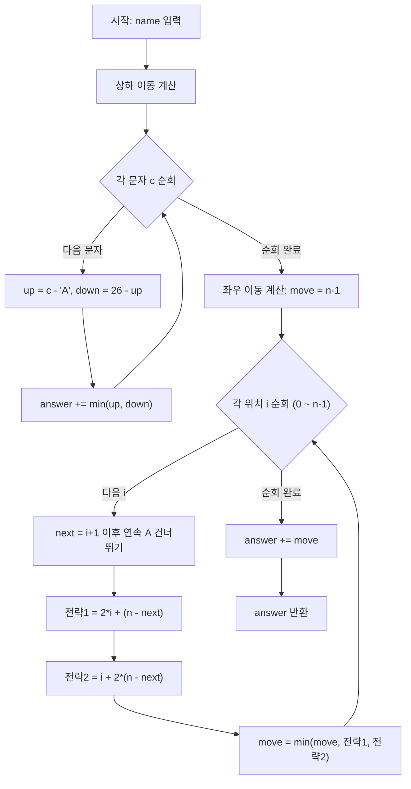

## 문제 분석

이 문제는 두 가지 독립적인 최솟값 계산으로 분리할 수 있습니다.

```
총 조작 횟수 = 상하 이동 (알파벳 변경) + 좌우 이동 (커서 이동)
```

---

## 핵심 아이디어

### ① 상하 이동 (알파벳 변경) — 단순 Greedy

각 문자마다 `위로 올리기` vs `아래로 내리기` 중 최솟값 선택

```
문자 C의 인덱스 = C - 'A'  (A=0, B=1, ..., Z=25)

위로 이동 횟수 = index
아래로 이동 횟수 = 26 - index
최솟값 = Math.min(위, 아래)
```

| 문자 | 위 | 아래 | 선택 |
|:---:|:---:|:---:|:---:|
| J | 9 | 17 | **9** |
| A | 0 | 26 | **0** |
| Z | 25 | 1 | **1** |

---

### ② 좌우 이동 (커서 이동) — 핵심 난이도

**단순히 오른쪽으로만 이동하면 최적이 아닐 수 있습니다!**

연속된 `A`가 있는 경우, 중간을 건너뛰는 게 더 유리합니다.

```
예) name = "BAAAAAAAC"  (n=9)
    단순히 오른쪽 끝까지: 8번 이동
    오른쪽 1칸(B) → 왼쪽으로 감기: 1 + (9-8) = 2번 이동  ← 훨씬 유리!
```

**세 가지 전략 비교:**

```
전략 0: 무조건 오른쪽     → n-1번
전략 1: 오른쪽 i까지 갔다가 왼쪽으로 되돌아와 역방향으로 감기
         → 2*i + (n - next)
전략 2: 왼쪽 먼저 역방향으로 갔다가 다시 오른쪽 i까지
         → i + 2*(n - next)
```

```
전략 1 시각화 (i=1, next=8인 경우):
                     ← 왼쪽 감기 시작
[0]→[1] 오른쪽 i 이동
[1]→[0] 되돌아오기
[0]←[8] 왼쪽으로 감기 (n-next = 1칸)

전략 2 시각화:
[0]←[8] 왼쪽 먼저 감기 (n-next = 1칸)
[8]→[0] 되돌아오기
[0]→[1] 오른쪽으로 i 이동
```

**`next`란?** 위치 `i` 다음에 오는 연속된 A 블록을 건너뛴, **첫 번째 비-A 위치**

---

## Java 풀이

```java
class Solution {
    public int solution(String name) {
        int n = name.length();
        int answer = 0;

        // ① 상하 이동 계산: 각 문자에 대해 최소 알파벳 조작 횟수 합산
        for (char c : name.toCharArray()) {
            int upMove = c - 'A';        // 위로 올리는 횟수 (A→C = 2번)
            int downMove = 26 - upMove;  // 아래로 내리는 횟수 (A→Z = 1번)
            answer += Math.min(upMove, downMove);
        }

        // ② 좌우 이동 계산: 커서 이동 최솟값 탐색
        // 기본값: 오른쪽 끝까지 쭉 이동 (n-1)
        int move = n - 1;

        for (int i = 0; i < n; i++) {
            // i 위치 이후에 연속된 A 블록의 끝 다음 위치(next) 탐색
            int next = i + 1;
            while (next < n && name.charAt(next) == 'A') {
                next++;
            }
            // 전략 1: 오른쪽 i까지 → 되돌아오기 → 왼쪽 감기로 나머지 처리
            // (오른쪽 i번) + (다시 왼쪽 i번) + (역방향 n-next번)
            move = Math.min(move, 2 * i + (n - next));

            // 전략 2: 왼쪽 감기로 역방향 먼저 → 되돌아오기 → 오른쪽 i까지
            // (역방향 n-next번) + (다시 오른쪽 n-next번) + (오른쪽 i번)
            move = Math.min(move, i + 2 * (n - next));
        }

        answer += move;
        return answer;
    }
}
```

### JavaScript

```javascript
function solution(name) {
    const n = name.length;
    let answer = 0;

    // ① 상하 이동 계산: 각 문자에 대해 최소 알파벳 조작 횟수 합산
    for (let i = 0; i < n; i++) {
        const upMove = name.charCodeAt(i) - 65;   // 'A'의 코드 = 65
        const downMove = 26 - upMove;
        answer += Math.min(upMove, downMove);
    }

    // ② 좌우 이동 계산: 커서 이동 최솟값 탐색
    let move = n - 1; // 기본값: 오른쪽 끝까지

    for (let i = 0; i < n; i++) {
        // i 위치 이후에 연속된 A 블록의 끝 다음 위치(next) 탐색
        let next = i + 1;
        while (next < n && name[next] === 'A') {
            next++;
        }
        // 전략 1: 오른쪽 i까지 → 되돌아오기 → 왼쪽 감기
        move = Math.min(move, 2 * i + (n - next));
        // 전략 2: 왼쪽 감기 먼저 → 되돌아오기 → 오른쪽 i까지
        move = Math.min(move, i + 2 * (n - next));
    }

    answer += move;
    return answer;
}
```

### C++

```cpp
#include <string>
#include <algorithm>

using namespace std;

int solution(string name) {
    int n = name.length();
    int answer = 0;

    // ① 상하 이동 계산: 각 문자에 대해 최소 알파벳 조작 횟수 합산
    for (char c : name) {
        int upMove = c - 'A';
        int downMove = 26 - upMove;
        answer += min(upMove, downMove);
    }

    // ② 좌우 이동 계산: 커서 이동 최솟값 탐색
    int move = n - 1; // 기본값: 오른쪽 끝까지

    for (int i = 0; i < n; i++) {
        // i 위치 이후에 연속된 A 블록의 끝 다음 위치(next) 탐색
        int next = i + 1;
        while (next < n && name[next] == 'A') {
            next++;
        }
        // 전략 1: 오른쪽 i까지 → 되돌아오기 → 왼쪽 감기
        move = min(move, 2 * i + (n - next));
        // 전략 2: 왼쪽 감기 먼저 → 되돌아오기 → 오른쪽 i까지
        move = min(move, i + 2 * (n - next));
    }

    answer += move;
    return answer;
}
```

### Rust

```rust
fn solution(name: &str) -> i32 {
    let n = name.len() as i32;
    let chars: Vec<u8> = name.bytes().collect();
    let mut answer = 0;

    // ① 상하 이동 계산: 각 문자에 대해 최소 알파벳 조작 횟수 합산
    for &c in &chars {
        let up_move = (c - b'A') as i32;
        let down_move = 26 - up_move;
        answer += up_move.min(down_move);
    }

    // ② 좌우 이동 계산: 커서 이동 최솟값 탐색
    let mut mov = n - 1; // 기본값: 오른쪽 끝까지

    for i in 0..n {
        // i 위치 이후에 연속된 A 블록의 끝 다음 위치(next) 탐색
        let mut next = i + 1;
        while next < n && chars[next as usize] == b'A' {
            next += 1;
        }
        // 전략 1: 오른쪽 i까지 → 되돌아오기 → 왼쪽 감기
        mov = mov.min(2 * i + (n - next));
        // 전략 2: 왼쪽 감기 먼저 → 되돌아오기 → 오른쪽 i까지
        mov = mov.min(i + 2 * (n - next));
    }

    answer += mov;
    answer
}
```

### Go

```go
package main

func solution(name string) int {
	n := len(name)
	answer := 0

	// ① 상하 이동 계산: 각 문자에 대해 최소 알파벳 조작 횟수 합산
	for _, c := range name {
		upMove := int(c - 'A')
		downMove := 26 - upMove
		if downMove < upMove {
			answer += downMove
		} else {
			answer += upMove
		}
	}

	// ② 좌우 이동 계산: 커서 이동 최솟값 탐색
	move := n - 1 // 기본값: 오른쪽 끝까지

	for i := 0; i < n; i++ {
		// i 위치 이후에 연속된 A 블록의 끝 다음 위치(next) 탐색
		next := i + 1
		for next < n && name[next] == 'A' {
			next++
		}
		// 전략 1: 오른쪽 i까지 → 되돌아오기 → 왼쪽 감기
		if s1 := 2*i + (n - next); s1 < move {
			move = s1
		}
		// 전략 2: 왼쪽 감기 먼저 → 되돌아오기 → 오른쪽 i까지
		if s2 := i + 2*(n-next); s2 < move {
			move = s2
		}
	}

	answer += move
	return answer
}
```

## Mermaid 다이어그램



## 엣지 케이스 분석

| 관점 | 케이스 | 처리 방법 |
|---|---|---|
| 모두 A | name = "AAAA" | 상하 0, 좌우 min(3, ...) 이지만 어디도 안 가도 됨 → 0 |
| A가 없음 | name = "JEROEN" | 좌우는 n-1 (단순 오른쪽 이동), 건너뛸 A 블록 없음 |
| 끝에 A 블록 | name = "BAAAA" | 오른쪽으로 안 가고 0번 위치만 처리, move = 0 |
| 중간에 A 블록 | name = "BAAAAC" | 전략 1 또는 2로 A 블록 건너뛰기 |
| 한 글자 | name = "B" | 상하 1, 좌우 0, 총 1 |

---

## 단계별 실행 추적 — "JAZ" 예시

### ① 상하 이동

| 인덱스 | 문자 | up | down | 선택 |
|:---:|:---:|:---:|:---:|:---:|
| 0 | J | 9 | 17 | 9 |
| 1 | A | 0 | 26 | 0 |
| 2 | Z | 25 | 1 | 1 |

**상하 합계 = 10**

### ② 좌우 이동 (n=3, 초기 move=2)

```
i=0: name[1]='A' → next=2 (name[2]='Z', stop)
     전략1: 2*0 + (3-2) = 1  ✅ move=1
     전략2: 0 + 2*(3-2) = 2

i=1: next=2 (name[2]='Z', stop immediately)
     전략1: 2*1 + (3-2) = 3
     전략2: 1 + 2*(3-2) = 3  → move=1 유지

i=2: next=3 (범위 초과, A블록 없음)
     전략1: 2*2 + (3-3) = 4
     전략2: 2 + 2*(3-3) = 2  → move=1 유지
```

**좌우 최솟값 = 1**

```
이동 경로: [J] →← [Z]
           시작(J) → 왼쪽으로 감기(Z) 단 1번!
```

**총합 = 10 + 1 = 11 ✅**

---

## 검증 — "JAN" = 23

```
상하: J(9) + A(0) + N(13) = 22

좌우: n=3, 초기 move=2
  i=0: name[1]='A' → next=2 (name[2]='N')
       전략1: 0 + 1 = 1  ✅ move=1

최종: 22 + 1 = 23 ✅
```

---

## 복잡도 분석

| 구분 | 복잡도 | 이유 |
|:---:|:---:|:---|
| 시간 복잡도 | **O(N)** | 상하 순회 O(N), 좌우 탐색은 `next` 포인터가 전체 배열을 최대 1회 순회 |
| 공간 복잡도 | **O(1)** | 추가 자료구조 없이 변수만 사용 |

| 풀이 | 시간 복잡도 | 공간 복잡도 | 비고 |
|---|---|---|---|
| Greedy (상하+좌우) | O(N) | O(1) | 상하 O(N) + 좌우 O(N), 추가 자료구조 없음 |

---

## 왜 Greedy인가?

이 문제에서 Greedy 전략이 적용되는 두 지점은 다음과 같습니다.

```
1. 상하 이동 → 각 문자마다 독립적으로 최솟값 선택 (국소 최적 = 전역 최적)

2. 좌우 이동 → "A 블록을 건너뛰는 전환점 i"를 모두 시도해서 최솟값 선택
               (완전탐색처럼 보이지만, 각 전환점 선택이 탐욕적 판단)
```

> 좌우 이동 부분은 순수 Greedy라기보다 **Greedy + 완전탐색(O(N) 순회)** 의 결합으로 보는 것이 더 정확합니다. A 블록의 위치에 따라 최적 전환점이 달라지므로 모든 후보를 검토합니다.

---