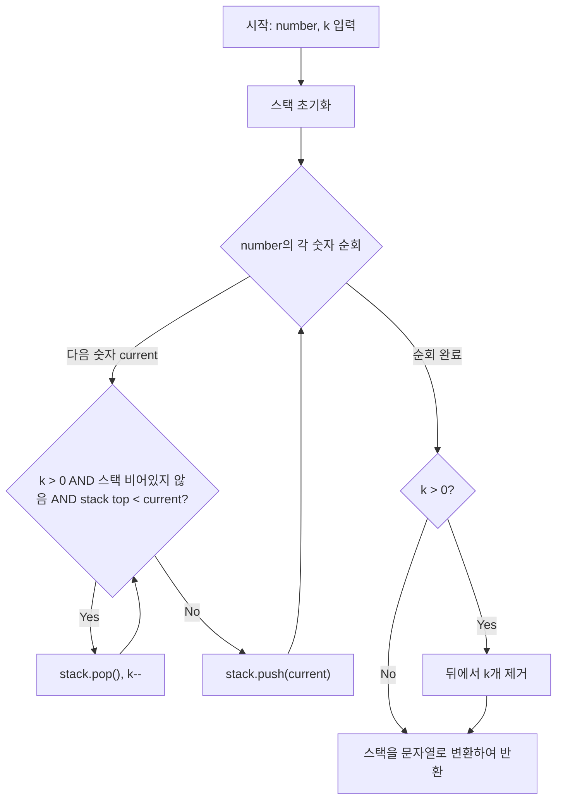

## 문제 분석

---

### 핵심 아이디어

```
가장 큰 숫자를 만들려면?
→ 앞자리에 큰 숫자가 와야 합니다!

"1924" 에서 2개 제거
→ 앞에서부터 보면서 "뒤에 더 큰 숫자가 오면 현재 숫자를 제거"
```

```
예시: "1924", k=2

1 → 스택: [1]
9 → 9 > 1 이므로 1 제거 (k=1)  스택: [9]
2 → 2 < 9 이므로 유지            스택: [9, 2]
4 → 4 > 2 이므로 2 제거 (k=0)  스택: [9, 4]

결과: "94" ✅
```

---

### 왜 Stack(스택)인가?

```
항상 "가장 최근에 추가한 숫자"와 비교해야 하기 때문!

뒤에서 더 큰 숫자가 오면 → 앞 숫자는 버리는 게 이득
이 "직전 숫자와 비교" 구조가 스택과 완벽히 일치합니다.

[1] [9] [2] [4]
         ↑
         현재 숫자(4)가 직전 숫자(2)보다 크면
         직전 숫자(2) 제거!
```

---

### 전체 알고리즘 흐름

```
┌──────────────────────────────────────────────────────┐
│ number의 각 숫자를 순서대로 확인                     │
│                                                      │
│ 현재 숫자 > 스택 top  AND  k > 0                    │
│   → 스택에서 pop (제거 횟수 k--)                    │
│   → 위 조건이 false 될 때까지 반복                  │
│                                                      │
│ 현재 숫자를 스택에 push                             │
│                                                      │
│ 순회 후 k > 0 이면?                                 │
│   → 스택 뒤에서 k개 제거 (뒤 숫자가 더 작으므로)   │
└──────────────────────────────────────────────────────┘
```

---

## Java 풀이

```java
import java.util.*;

class Solution {
    public String solution(String number, int k) {
        // 스택: 결과로 남길 숫자들을 순서대로 보관
        Stack<Character> stack = new Stack<>();

        for (int i = 0; i < number.length(); i++) {
            char current = number.charAt(i);

            // 현재 숫자가 스택 top보다 크고, 아직 제거 가능하면
            // 스택 top을 제거 (더 큰 숫자를 앞에 두기 위해)
            while (k > 0 && !stack.isEmpty() && stack.peek() < current) {
                stack.pop();
                k--;
            }

            stack.push(current);
        }

        // 순회 후에도 k가 남아있으면 뒤에서 k개 제거
        // 예) "12345", k=2 → 끝까지 pop 안 됐으므로 뒤 2개 제거 → "123"
        while (k > 0) {
            stack.pop();
            k--;
        }

        // 스택을 문자열로 변환
        StringBuilder sb = new StringBuilder();
        for (char c : stack) {
            sb.append(c);
        }

        return sb.toString();
    }
}
```

### JavaScript

```javascript
function solution(number, k) {
    const stack = [];

    for (let i = 0; i < number.length; i++) {
        const current = number[i];

        // 현재 숫자가 스택 top보다 크고, 아직 제거 가능하면
        // 스택 top을 제거 (더 큰 숫자를 앞에 두기 위해)
        while (k > 0 && stack.length > 0 && stack[stack.length - 1] < current) {
            stack.pop();
            k--;
        }

        stack.push(current);
    }

    // 순회 후에도 k가 남아있으면 뒤에서 k개 제거
    while (k > 0) {
        stack.pop();
        k--;
    }

    return stack.join('');
}
```

### C++

```cpp
#include <string>
#include <vector>

using namespace std;

string solution(string number, int k) {
    vector<char> stack;

    for (int i = 0; i < number.length(); i++) {
        char current = number[i];

        // 현재 숫자가 스택 top보다 크고, 아직 제거 가능하면
        // 스택 top을 제거 (더 큰 숫자를 앞에 두기 위해)
        while (k > 0 && !stack.empty() && stack.back() < current) {
            stack.pop_back();
            k--;
        }

        stack.push_back(current);
    }

    // 순회 후에도 k가 남아있으면 뒤에서 k개 제거
    while (k > 0) {
        stack.pop_back();
        k--;
    }

    return string(stack.begin(), stack.end());
}
```

### Rust

```rust
fn solution(number: &str, k: i32) -> String {
    let mut k = k;
    let mut stack: Vec<char> = Vec::new();

    for current in number.chars() {
        // 현재 숫자가 스택 top보다 크고, 아직 제거 가능하면
        // 스택 top을 제거 (더 큰 숫자를 앞에 두기 위해)
        while k > 0 && !stack.is_empty() && *stack.last().unwrap() < current {
            stack.pop();
            k -= 1;
        }

        stack.push(current);
    }

    // 순회 후에도 k가 남아있으면 뒤에서 k개 제거
    while k > 0 {
        stack.pop();
        k -= 1;
    }

    stack.iter().collect()
}
```

### Go

```go
package main

func solution(number string, k int) string {
	stack := []byte{}

	for i := 0; i < len(number); i++ {
		current := number[i]

		// 현재 숫자가 스택 top보다 크고, 아직 제거 가능하면
		// 스택 top을 제거 (더 큰 숫자를 앞에 두기 위해)
		for k > 0 && len(stack) > 0 && stack[len(stack)-1] < current {
			stack = stack[:len(stack)-1]
			k--
		}

		stack = append(stack, current)
	}

	// 순회 후에도 k가 남아있으면 뒤에서 k개 제거
	if k > 0 {
		stack = stack[:len(stack)-k]
	}

	return string(stack)
}
```

## Mermaid 다이어그램



## 엣지 케이스 분석

| 관점 | 케이스 | 처리 방법 |
|---|---|---|
| 내림차순 숫자 | number = "54321", k=2 | 순회 중 pop 없음, 순회 후 뒤에서 2개 제거 → "543" |
| 오름차순 숫자 | number = "12345", k=2 | 앞에서부터 계속 pop → "345" |
| 모두 같은 숫자 | number = "9999", k=2 | pop 조건 불성립, 뒤에서 2개 제거 → "99" |
| k = 0 | number = "1234", k=0 | 아무것도 제거하지 않음 → "1234" |
| 거의 다 제거 | number = "4321", k=3 | 1개만 남김 → "4" |

---

## 단계별 실행 추적

### "1924", k=2

```
초기 스택: []

Step 1: current = '1'
  스택 비어있음 → 바로 push
  스택: [1]  k=2

Step 2: current = '9'
  9 > 1 (top) AND k=2 > 0
  → 1 pop!  k=1
  스택 비어있음 → while 탈출
  → 9 push
  스택: [9]  k=1

Step 3: current = '2'
  2 < 9 (top) → while 조건 false, 바로 push
  스택: [9, 2]  k=1

Step 4: current = '4'
  4 > 2 (top) AND k=1 > 0
  → 2 pop!  k=0
  4 < 9 (top) → while 조건 false
  → 4 push
  스택: [9, 4]  k=0

k=0 이므로 뒤에서 제거 없음

결과: "94" ✅
```

---

### "1231234", k=3

```
초기 스택: []

current='1': 스택: [1]           k=3
current='2': 2>1 → pop(k=2)     스택: [2]
current='3': 3>2 → pop(k=1)     스택: [3]
current='1': 1<3 → push          스택: [3,1]
current='2': 2>1 → pop(k=0)     스택: [3,2]
current='3': k=0 → push          스택: [3,2,3]
current='4': k=0 → push          스택: [3,2,3,4]

k=0 이므로 뒤에서 제거 없음

결과: "3234" ✅
```

---

### "4177252841", k=4 (순회 후 k 남는 케이스)

```
current='4':                      스택: [4]           k=4
current='1': 1<4 → push           스택: [4,1]         k=4
current='7': 7>1→pop, 7>4→pop    스택: [7]           k=2
current='7': 7=7 → push           스택: [7,7]         k=2
current='2': 2<7 → push           스택: [7,7,2]       k=2
current='5': 5>2→pop              스택: [7,7,5]       k=1
current='2': 2<5 → push           스택: [7,7,5,2]     k=1
current='8': 8>2→pop, 8>5→pop    스택: [7,7,8]       k=0  ✅ k 소진!
current='4': k=0 → push           스택: [7,7,8,4]
current='1': k=0 → push           스택: [7,7,8,4,1]

k=0 이므로 뒤에서 제거 없음

결과: "77841" ❌ → 잠깐, "775841"이 되어야 하는데?
```

```
다시 추적:

current='4':                      스택: [4]           k=4
current='1': 1<4 → push           스택: [4,1]         k=4
current='7': 7>1→pop(k=3)
             7>4→pop(k=2)         스택: [7]           k=2
current='7': 7=7 → push           스택: [7,7]         k=2
current='2': 2<7 → push           스택: [7,7,2]       k=2
current='5': 5>2→pop(k=1)         스택: [7,7,5]       k=1
current='2': 2<5 → push           스택: [7,7,5,2]     k=1
current='8': 8>2→pop(k=0)         스택: [7,7,5,8] 
             k=0 → while 탈출
             → 8 push             스택: [7,7,5,8]     k=0
current='4': k=0 → push           스택: [7,7,5,8,4]
current='1': k=0 → push           스택: [7,7,5,8,4,1]

결과: "775841" ✅
```

---

### 순회 후 k가 남는 케이스: "12345", k=2

```
current='1':                      스택: [1]  k=2
current='2': 2>1→pop(k=1)         스택: [2]  k=1
current='3': 3>2→pop(k=0)         스택: [3]  k=0
current='4': k=0 → push           스택: [3,4]
current='5': k=0 → push           스택: [3,4,5]

k=0 이므로 뒤에서 제거 없음

결과: "345" ✅ (가장 큰 3자리)
```

```
반대로 "54321", k=2 이면?

current='5':                      스택: [5]  k=2
current='4': 4<5 → push           스택: [5,4]
current='3': 3<4 → push           스택: [5,4,3]
current='2': 2<3 → push           스택: [5,4,3,2]
current='1': 1<2 → push           스택: [5,4,3,2,1]

순회 후 k=2 남음!
→ 뒤에서 2개 제거: [5,4,3,2,1] → [5,4,3]

결과: "543" ✅
```

---

## 복잡도 분석

```
┌──────────┬──────────┬───────────────────────────────────┐
│          │ 복잡도   │ 이유                              │
├──────────┼──────────┼───────────────────────────────────┤
│ 시간     │ O(N)     │ 각 숫자는 push 1번, pop 최대 1번  │
│ 공간     │ O(N)     │ 스택에 최대 N개 저장              │
└──────────┴──────────┴───────────────────────────────────┘
```

| 풀이 | 시간 복잡도 | 공간 복잡도 | 비고 |
|---|---|---|---|
| 스택 Greedy | O(N) | O(N) | 각 숫자는 push 1번, pop 최대 1번. 스택에 최대 N개 저장 |

---

## 왜 Greedy인가?

```
┌─────────────────────────────────────────────────────────┐
│ "현재 시점에서 가장 큰 숫자를 앞에 두는 것"이           │
│  전체적으로도 가장 큰 숫자를 만든다는 보장이 있습니다   │
│                                                         │
│ 앞자리 숫자가 클수록 전체 수가 크기 때문에              │
│ 매 순간 국소 최적 선택 = 전체 최적 보장!               │
└─────────────────────────────────────────────────────────┘
```