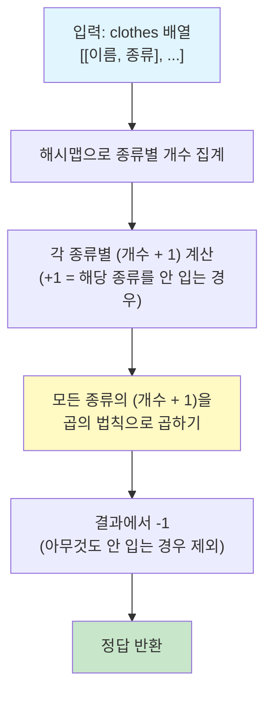

## 1. 수학적 원리: 경우의 수와 곱의 법칙

이 문제의 핵심은 **"각 의상 종류별로 하나를 선택하거나, 선택하지 않을 수 있다"**는 점입니다.

### 왜 `(count + 1)`인가요?

특정 종류의 의상이 개 있다고 가정해 봅시다. (예: 안경이 2개)
우리가 이 종류에서 할 수 있는 선택은 다음과 같습니다:

1. 1번 안경을 쓴다.
2. 2번 안경을 쓴다.
3. **안경을 아예 쓰지 않는다.**

즉, 의상의 개수가 개일 때, 해당 종류에서 선택할 수 있는 경우의 수는 ****이 됩니다. 여기서 `+1`은 **'해당 종류의 의상을 입지 않는 경우'**를 포함시킨 것입니다.

### 왜 모든 값을 곱하나요? (곱의 법칙)

각 의상 종류(머리, 상의, 하의 등)는 서로 독립적입니다. 안경을 무엇을 쓰느냐가 상의를 무엇을 입느냐에 영향을 주지 않죠. 이렇게 독립적인 사건들이 동시에 일어나는 경우의 수는 각 사건의 경우의 수를 모두 **곱하여** 구합니다.

### 왜 마지막에 `- 1`을 하나요?

위의 식에는 모든 종류에서 '입지 않음'을 선택한 경우가 딱 **1가지** 포함되어 있습니다. 하지만 문제 조건에서 **"코니는 하루에 최소 한 개의 의상은 입습니다"**라고 명시되어 있죠. 따라서 아무것도 입지 않은 '알몸' 상태인 경우의 수 1개를 빼주는 것입니다.

$$최종\ 정답 = \left( \prod_{i=1}^{k} (n_i + 1) \right) - 1$$

---

## 2. 시각적 예시 (입출력 예제 #1)

`[["yellow_hat", "headgear"], ["blue_sunglasses", "eyewear"], ["green_turban", "headgear"]]`

| 의상 종류 (Category) | 의상 목록 (Items) | 선택 가능한 경우의 수 () |
| --- | --- | --- |
| **headgear** | yellow_hat, green_turban | 3 (hat, turban, **안 입음**) |
| **eyewear** | blue_sunglasses | 2 (sunglasses, **안 입음**) |

* **전체 조합**:
* **공집합 제외**:

---

## 3. 다국어 솔루션 코드

사용자님이 작성하신 Java 코드 외에도, 다른 언어에서는 이 로직을 어떻게 깔끔하게 구현하는지 확인해 보세요.

### **JavaScript**

```javascript
function solution(clothes) {
    // 1. 의상 종류별로 개수를 저장할 Map 객체 생성
    const clothesMap = new Map();
    
    for (const [name, type] of clothes) {
        clothesMap.set(type, (clothesMap.get(type) || 0) + 1);
    }
    
    // 2. 각 종류별 (개수 + 1)을 모두 곱함
    let answer = 1;
    for (let count of clothesMap.values()) {
        answer *= (count + 1);
    }
    
    // 3. 아무것도 입지 않은 경우 1을 뺌
    return answer - 1;
}

```

### **C++**

```cpp
#include <string>
#include <vector>
#include <unordered_map>

using namespace std;

int solution(vector<vector<string>> clothes) {
    unordered_map<string, int> m;
    
    // 1. 종류별 의상 개수 카운트
    for(auto cloth : clothes) {
        m[cloth[1]]++;
    }
    
    // 2. 곱의 법칙 적용
    int answer = 1;
    for(auto it = m.begin(); it != m.end(); it++) {
        answer *= (it->second + 1);
    }
    
    // 3. 최소 하나는 입어야 하므로 -1
    return answer - 1;
}

```

### **Java (Stream API 활용 - 사용자님의 solution1 기반 최적화)**

```java
import java.util.*;
import static java.util.stream.Collectors.*;

class Solution {
    public int solution(String[][] clothes) {
        return Arrays.stream(clothes)
            // 1. 종류별(c[1])로 그룹화하여 개수 counting
            .collect(groupingBy(c -> c[1], counting()))
            .values()
            .stream()
            // 2. (개수 + 1)을 모두 곱함
            .reduce(1L, (acc, count) -> acc * (count + 1))
            // 3. 결과에서 1을 빼고 int로 변환
            .intValue() - 1;
    }
}

```

---

## 4. 복잡도 분석

* **시간 복잡도**:
* 의상의 총 개수 만큼 배열을 순회하며 해시 맵을 만듭니다. 이후 의상의 종류 수(최대 )만큼 순회하므로 전체 시간 복잡도는 $O(N)$입니다.

* **공간 복잡도**:
* 의상의 종류별 이름을 해시 맵의 키로 저장해야 하므로 최악의 경우 $O(N)$의 공간이 필요합니다.

이 수학적 접근법은 단순히 모든 조합을 실제로 구해보는 것(Brute-force)보다 훨씬 빠르고 효율적입니다. 만약 이 커진다면 이 방식이 유일한 정답이 될 거예요.

---

## Mermaid 다이어그램



---

## 엣지 케이스 분석

| 관점 | 케이스 | 처리 방법 |
|---|---|---|
| 의상이 1개뿐 | 종류 1개, 개수 1개 → (1+1) - 1 = 1 | 그 의상을 입는 경우 1가지 |
| 모든 의상이 같은 종류 | 종류 1개, 개수 n → (n+1) - 1 = n | 각 의상을 하나씩 입는 n가지 |
| 모든 의상이 다른 종류 | 종류 n개, 각 1개 → 2^n - 1 | 부분집합의 수에서 공집합 제외 |
| 의상 개수가 최대 (30개) | 최악: 30종류 각 1개 → 2^30 - 1 ≈ 10억 | int 범위 내 (약 21억) 처리 가능 |
| 같은 종류에 같은 이름의 의상 (문제 조건상 불가) | 의상 이름이 고유함이 보장 | 종류별 개수만 세면 됨 |

---

## 시간·공간 복잡도

| 풀이 | 시간 복잡도 | 공간 복잡도 | 비고 |
|---|---|---|---|
| 해시맵 + 곱의 법칙 | O(N) | O(N) | N = 의상의 총 개수. 해시맵 구성 O(N) + 종류 수만큼 곱셈 |

---

## 다국어 솔루션 (추가)

### Rust

```rust
use std::collections::HashMap;

fn solution(clothes: Vec<Vec<String>>) -> i32 {
    // 종류별 의상 개수 집계
    let mut map: HashMap<&str, i32> = HashMap::new();
    for cloth in &clothes {
        *map.entry(cloth[1].as_str()).or_insert(0) += 1;
    }

    // 각 종류별 (개수 + 1)을 곱한 뒤 -1
    let mut answer: i32 = 1;
    for &count in map.values() {
        answer *= count + 1;
    }
    answer - 1
}
```

### Go

```go
func solution(clothes [][]string) int {
    // 종류별 의상 개수 집계
    m := make(map[string]int)
    for _, cloth := range clothes {
        m[cloth[1]]++
    }

    // 각 종류별 (개수 + 1)을 곱한 뒤 -1
    answer := 1
    for _, count := range m {
        answer *= count + 1
    }
    return answer - 1
}