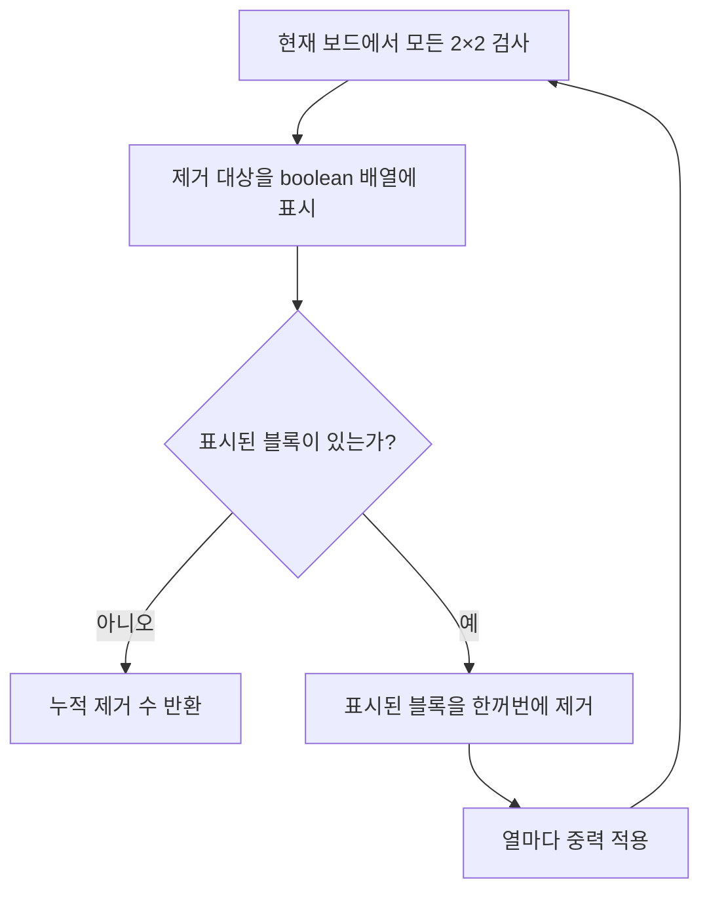

# 프렌즈4블록

- 문제: [프로그래머스 17679. 프렌즈4블록](https://school.programmers.co.kr/learn/courses/30/lessons/17679)
- 공식 해설: [카카오 신입 공채 1차 코딩 테스트 문제 해설](https://tech.kakao.com/posts/344)
- 핵심 유형: 2차원 배열 시뮬레이션
- 핵심 패턴: **탐색과 변경을 분리한 뒤 상태가 안정될 때까지 반복한다.**

---

## 1. 문제 핵심

같은 블록이 `2×2` 모양으로 붙어 있으면 네 블록을 제거한다. 여러 `2×2`가 겹칠 수 있으며 한 라운드에서 제거 조건을 만족하는 모든 블록은 동시에 제거한다.

제거 후 위에 있던 블록은 아래로 떨어진다. 낙하 결과 새로운 `2×2`가 생기면 같은 과정을 반복한다.

```text
2×2 탐색
→ 제거 대상 동시 삭제
→ 중력 적용
→ 다시 탐색
```

최종적으로 제거된 서로 다른 칸의 총개수를 반환한다.

---

## 2. 처음 문제를 풀 때의 사고 과정

### 2.1 어떤 유형인가?

최단거리나 최적화 문제가 아니라 게임 규칙에 따라 보드 상태를 계속 바꾸는 시뮬레이션 문제다.

먼저 한 라운드를 독립적인 단계로 나눈다.

```text
1. 제거 가능한 2×2 찾기
2. 해당 칸 표시하기
3. 표시된 칸을 한꺼번에 제거하기
4. 블록을 아래로 떨어뜨리기
```

### 2.2 찾자마자 지워도 될까?

안 된다. 한 라운드의 모든 제거 판정은 라운드 시작 상태를 기준으로 해야 한다.

```text
AAA
AAA
```

왼쪽 `2×2`와 오른쪽 `2×2`가 겹친다. 왼쪽을 발견하자마자 지우면 오른쪽 `2×2`를 더 이상 발견할 수 없다.

따라서 탐색과 변경을 분리한다.

```text
탐색 단계: 원본 보드를 읽고 제거 위치만 표시
변경 단계: 탐색이 끝난 뒤 표시된 칸을 제거
```

### 2.3 겹치는 블록은 어떻게 한 번만 셀까?

```java
boolean[][] marked = new boolean[m][n];
```

하나의 칸이 여러 `2×2`에 포함되어도 `true`는 한 번만 센다. 위의 `2×3` 보드는 `2×2`가 두 개지만 실제 제거되는 블록은 6개다.

### 2.4 중력은 어떻게 구현할까?

중력은 각 열을 서로 독립적으로 처리할 수 있다. 아래에서 위로 살아 있는 블록을 읽고, `writeRow`가 가리키는 아래쪽 위치에 차례대로 쓴다.

```text
읽기: 아래 → 위
쓰기: 아래 → 위
```

모든 블록을 옮긴 뒤 `writeRow` 위쪽을 빈칸으로 채운다.

---

## 3. 전체 알고리즘



---

## 4. Java 풀이

```java
class Solution {
    private static final char EMPTY = '.';

    public int solution(int m, int n, String[] board) {
        char[][] map = new char[m][n];

        for (int row = 0; row < m; row++) {
            map[row] = board[row].toCharArray();
        }

        int totalRemovedCount = 0;

        while (true) {
            boolean[][] marked = new boolean[m][n];
            boolean found = markRemovableBlocks(map, marked, m, n);

            if (!found) {
                break;
            }

            totalRemovedCount += removeMarkedBlocks(map, marked, m, n);
            applyGravity(map, m, n);
        }

        return totalRemovedCount;
    }

    private boolean markRemovableBlocks(
            char[][] map,
            boolean[][] marked,
            int rowCount,
            int colCount
    ) {
        boolean found = false;

        for (int row = 0; row < rowCount - 1; row++) {
            for (int col = 0; col < colCount - 1; col++) {
                char block = map[row][col];

                if (block == EMPTY) {
                    continue;
                }

                if (map[row][col + 1] == block
                        && map[row + 1][col] == block
                        && map[row + 1][col + 1] == block) {
                    marked[row][col] = true;
                    marked[row][col + 1] = true;
                    marked[row + 1][col] = true;
                    marked[row + 1][col + 1] = true;
                    found = true;
                }
            }
        }

        return found;
    }

    private int removeMarkedBlocks(
            char[][] map,
            boolean[][] marked,
            int rowCount,
            int colCount
    ) {
        int removedCount = 0;

        for (int row = 0; row < rowCount; row++) {
            for (int col = 0; col < colCount; col++) {
                if (marked[row][col]) {
                    map[row][col] = EMPTY;
                    removedCount++;
                }
            }
        }

        return removedCount;
    }

    private void applyGravity(char[][] map, int rowCount, int colCount) {
        for (int col = 0; col < colCount; col++) {
            int writeRow = rowCount - 1;

            for (int readRow = rowCount - 1; readRow >= 0; readRow--) {
                if (map[readRow][col] == EMPTY) {
                    continue;
                }

                map[writeRow][col] = map[readRow][col];
                writeRow--;
            }

            while (writeRow >= 0) {
                map[writeRow][col] = EMPTY;
                writeRow--;
            }
        }
    }
}
```

---

## 5. 단계별 코드 설명

### 5.1 검사 범위가 `m-1`, `n-1`인 이유

현재 좌표를 `2×2`의 왼쪽 위로 사용한다.

```text
(row, col)       (row, col+1)
(row+1, col)     (row+1, col+1)
```

마지막 행과 마지막 열에서는 오른쪽 아래 칸을 만들 수 없으므로 시작 좌표에서 제외한다.

```java
for (int row = 0; row < rowCount - 1; row++)
for (int col = 0; col < colCount - 1; col++)
```

### 5.2 빈칸을 검사 대상에서 제외

빈칸 네 개도 문자만 비교하면 모두 같다고 판단될 수 있다.

```java
if (block == EMPTY) {
    continue;
}
```

### 5.3 제거 대상 표시

```java
marked[row][col] = true;
marked[row][col + 1] = true;
marked[row + 1][col] = true;
marked[row + 1][col + 1] = true;
```

중복 위치를 여러 번 `true`로 바꾸더라도 제거 단계에서는 한 번만 센다.

### 5.4 `writeRow` 중력

```java
int writeRow = rowCount - 1;
```

각 열의 맨 아래부터 블록을 채운다.

```java
for (int readRow = rowCount - 1; readRow >= 0; readRow--) {
    if (map[readRow][col] != EMPTY) {
        map[writeRow][col] = map[readRow][col];
        writeRow--;
    }
}
```

읽기 포인터보다 쓰기 포인터는 항상 같거나 아래에 있으므로 아직 읽지 않은 위쪽 블록을 덮어쓰지 않는다.

마지막에는 블록이 채워지지 않은 위쪽을 빈칸으로 만든다.

```java
while (writeRow >= 0) {
    map[writeRow][col] = EMPTY;
    writeRow--;
}
```

---

## 6. 카카오 공식 해설과 같은 풀이인가?

결론은 **같은 알고리즘**이다. 카카오 공식 해설과 이 풀이는 모두 게임 규칙을 그대로 반복하는 시뮬레이션이다.

| 처리 단계 | 카카오 공식 해설 | 이 Java 풀이 |
|---|---|---|
| 보드 탐색 | 인접 블록 스캔 | 모든 좌표를 `2×2`의 왼쪽 위로 검사 |
| 제거 판정 | 같은 블록 네 개 확인 | 네 문자가 같은지 비교 |
| 동시 제거 | 조건을 만족한 블록 제거 | `boolean[][] marked`에 표시 후 제거 |
| 블록 낙하 | 위 블록이 빈칸을 채움 | 열별 `writeRow` 압축 |
| 반복 | 다시 블록이 만들어지면 반복 | 제거 대상이 없을 때까지 `while` |

```text
카카오 공식 해설
└─ 탐색 → 제거 → 낙하 → 반복

이 Java 구현
└─ 같은 흐름을 boolean 표시와 writeRow로 구체화
```

차이는 알고리즘이 아니라 구현 자료구조다.

### 제거 대상을 기록하는 다른 방법

```text
- boolean[][] 표시 배열
- Set<Position>
- 제거할 2×2의 왼쪽 위 좌표 목록
```

### 중력을 구현하는 다른 방법

```text
- writeRow 포인터로 열 압축
- 열마다 Stack<Character> 사용
- 빈칸과 위 블록을 반복 교환
- 빈칸을 제외한 열 리스트를 다시 채우기
```

모두 같은 시뮬레이션의 구현 변형이다. `boolean[][]`과 `writeRow` 방식은 중복 제거와 낙하를 각각 보드 한 번의 순회로 처리해 구현이 명확하다.

---

## 7. 정확성의 핵심

한 라운드가 시작될 때의 보드를 기준으로 제거 가능한 모든 `2×2`를 표시한다. 표시 단계에서는 보드를 바꾸지 않으므로 뒤에서 검사하는 `2×2`도 같은 라운드의 원본 상태를 본다.

표시가 끝난 뒤 `true`인 칸을 정확히 한 번씩 제거하므로 겹치는 `2×2`도 중복 집계하지 않는다. 중력 단계는 각 열의 기존 블록 순서를 유지하면서 모든 빈칸을 위쪽으로 모은다.

이 과정을 제거 가능한 `2×2`가 없을 때까지 반복하므로 게임 규칙과 같은 최종 상태에 도달한다.

---

## 8. 복잡도

보드 크기를 `M×N`, 성공적으로 제거가 발생한 라운드 수를 `R`이라고 하자.

```text
한 라운드 탐색: O(MN)
제거: O(MN)
중력: O(MN)

전체 시간: O(RMN)
공간: O(MN)
```

성공한 라운드마다 최소 네 칸이 제거되므로 `R ≤ MN/4`다. 느슨한 최악 상한은 `O((MN)²)`이지만 문제의 `M,N ≤ 30` 조건에서는 충분하다.

---

## 9. 엣지 케이스

| 경우 | 확인할 내용 |
|---|---|
| 제거 가능한 블록 없음 | 첫 탐색 후 즉시 0 반환 |
| 여러 `2×2`가 겹침 | `boolean[][]`로 한 번만 집계 |
| 빈칸으로 이루어진 `2×2` | `EMPTY` 검사로 제외 |
| 한 열에 빈칸이 여러 개 | 블록 상대 순서를 유지하며 아래로 압축 |
| 연쇄 제거 | 중력 후 탐색을 다시 수행 |
| 보드 전체가 같은 문자 | 모든 칸을 한 번씩 제거 |

---

## 10. 제출 전 확인

```text
- 제거 대상을 찾자마자 보드에서 지우지 않는가?
- 빈칸 문자를 같은 블록으로 판정하지 않는가?
- 겹치는 블록을 제거 수에 중복 집계하지 않는가?
- 2×2 시작 좌표 범위를 m-1, n-1로 제한했는가?
- 중력 적용 후 위쪽 남은 칸을 빈칸으로 채웠는가?
- 제거 대상이 없을 때 반복을 종료하는가?
```
