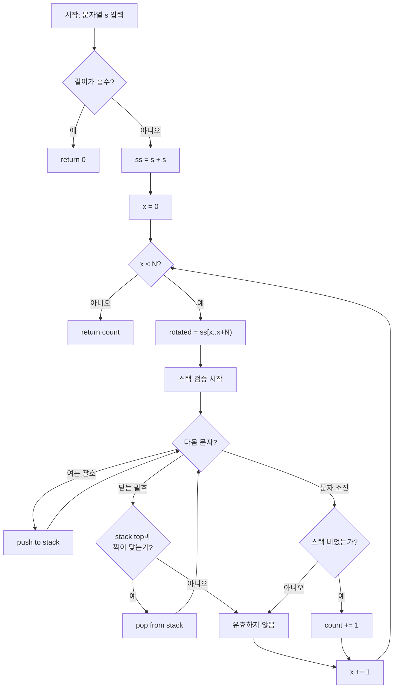

# 프로그래머스 76502 — 괄호 회전하기

> **난이도**: Level 2  
> **분류**: 스택(Stack), 문자열  
> **출처**: [프로그래머스 76502](https://school.programmers.co.kr/learn/courses/30/lessons/76502)

---

## 1. 문제 분석

### 문제 요약

`()`, `[]`, `{}`로 이루어진 문자열 `s`가 주어진다. 이 문자열을 왼쪽으로 `x`칸 (0 ≤ x < |s|) 회전시켰을 때, **올바른 괄호 문자열**이 되는 `x`의 개수를 구한다.

올바른 괄호 문자열의 정의:

- `()`, `[]`, `{}`는 올바른 괄호 문자열이다.
- `A`가 올바른 괄호 문자열이면, `(A)`, `[A]`, `{A}`도 올바르다.
- `A`, `B`가 각각 올바른 괄호 문자열이면, `AB`도 올바르다.

### 제약 조건

- 1 ≤ |s| ≤ 1,000
- s는 `(`, `)`, `[`, `]`, `{`, `}` 로만 구성

### 시간 복잡도 상한

N ≤ 1,000이므로 O(N²) = 10⁶으로 충분히 허용된다.

---

## 2. 풀이 전략

### 핵심 아이디어: 이중 연결(s+s) + 스택 검증

**하위 문제 ①: 회전 구현**

문자열을 실제로 옮기는 대신 `ss = s + s`로 이중 연결한 뒤, `ss[x .. x+N)` 구간을 읽으면 왼쪽으로 x칸 회전된 결과를 O(1)로 얻는다. 원형 배열을 선형으로 펼치는 관용 기법이다.

예시: `s = "abc"` → `ss = "abcabc"`

| x | ss[x..x+3) | 의미 |
|---|---|---|
| 0 | `abc` | 원본 |
| 1 | `bca` | 왼쪽 1칸 회전 |
| 2 | `cab` | 왼쪽 2칸 회전 |

**하위 문제 ②: 올바른 괄호 검증**

전형적인 스택 기반 괄호 검증:

- 여는 괄호(`(`, `[`, `{`) → 스택에 push
- 닫는 괄호(`)`, `]`, `}`) → 스택 top과 짝 확인
  - 짝 맞으면 pop
  - 짝 불일치 또는 스택 비어 있으면 즉시 실패
- 문자열 끝까지 순회 후 스택이 비어 있으면 유효

**왜 스택인가?** 괄호의 올바름은 가장 최근에 열린 괄호가 가장 먼저 닫혀야 하는 LIFO 성질이므로 스택이 자연스럽게 대응한다.

**조기 종료 최적화**: 길이가 홀수이면 즉시 0 반환.

### 전체 알고리즘

```
1. N = len(s)
2. N이 홀수이면 return 0
3. ss = s + s
4. count = 0
5. x = 0부터 N-1까지:
     a. isValid(ss, x, N)으로 검증
     b. 유효하면 count += 1
6. return count
```

---

## 3. Mermaid 다이어그램



---

## 4. 솔루션 코드 (Java)

```java
import java.util.Map;
import java.util.Stack;

class Solution {
    private static final Map<Character, Character> MATCH = Map.of(
        ')', '(',
        ']', '[',
        '}', '{'
    );

    private boolean isValid(String ss, int start, int len) {
        Stack<Character> stack = new Stack<>();
        for (int i = 0; i < len; i++) {
            char ch = ss.charAt(start + i);
            if (ch == '(' || ch == '[' || ch == '{') {
                stack.push(ch);
            } else {
                if (stack.isEmpty() || !stack.peek().equals(MATCH.get(ch))) {
                    return false;
                }
                stack.pop();
            }
        }
        return stack.isEmpty();
    }

    public int solution(String s) {
        int n = s.length();
        if (n % 2 != 0) return 0;

        String ss = s + s;
        int count = 0;

        for (int x = 0; x < n; x++) {
            if (isValid(ss, x, n)) count++;
        }

        return count;
    }
}
```

---

## 5. 단계별 코드 해설

입력 예시: `s = "[](){}"`

### 단계 1: 사전 검사

길이 6 (짝수) → 진행

### 단계 2: 이중 연결

`ss = "[](){}[](){}"` (길이 12)

### 단계 3: 각 회전에 대한 스택 검증

| x | rotated | 결과 |
|---|---|---|
| 0 | `[](){}` | ✅ 유효 |
| 1 | `](){ }[` | ❌ (스택 비어있는데 `]` 등장) |
| 2 | `(){}[]` | ✅ 유효 |
| 3 | `){}[](` | ❌ (스택 비어있는데 `)` 등장) |
| 4 | `{}[]()` | ✅ 유효 |
| 5 | `}[](){` | ❌ (스택 비어있는데 `}` 등장) |

**결과: count = 3**

### 스택 추적 상세 (x=0, `[](){}`)

| 단계 | 읽은 문자 | 동작 | 스택 상태 |
|---|---|---|---|
| 1 | `[` | push | `[` |
| 2 | `]` | top=`[`, 짝 맞음 → pop | (비어있음) |
| 3 | `(` | push | `(` |
| 4 | `)` | top=`(`, 짝 맞음 → pop | (비어있음) |
| 5 | `{` | push | `{` |
| 6 | `}` | top=`{`, 짝 맞음 → pop | (비어있음) |

최종 스택이 비어 있으므로 → **유효**

---

## 6. 엣지 케이스 분석

| 관점 | 케이스 | 처리 |
|---|---|---|
| 홀수 길이 | `s = "("` | N%2 != 0 → 즉시 0 반환 |
| 단일 쌍 | `s = "()"` | x=0: 유효, x=1: 무효 → 1 반환 |
| 교차 괄호 | `s = "([)]"` | 모든 회전에서 교차 발생 → 0 반환 |
| 어떤 회전도 불가 | `s = "(("` | 스택에 잔여 괄호 → 0 반환 |
| 최대 길이 | N=1,000 | O(N²) = 10⁶으로 통과 |

---

## 7. 복잡도 분석

| 항목 | 복잡도 | 비고 |
|---|---|---|
| 시간 | **O(N²)** | N번 회전 × 각 회전마다 N개 문자 스캔 |
| 공간 | O(N) | 이중 연결 문자열 O(N) + 스택 최대 O(N) |

---

## 8. 핵심 원리 요약

**왜 "이중 연결(s+s)"이 작동하는가?**  
원형 구조를 선형으로 표현하는 고전 기법이다. 길이 N인 문자열을 원형으로 보면 시작점 `x`에서 N개를 읽는 것이 곧 "x칸 왼쪽 회전"이다. `s+s`를 만들면 `ss[x..x+N)`이 모든 회전을 인덱스만으로 표현한다.

**왜 스택이 괄호 검증의 정답인가?**  
괄호 매칭의 본질은 중첩(nesting) 구조다. 가장 안쪽에 열린 괄호가 가장 먼저 닫혀야 하는 LIFO 성질을 스택이 자연스럽게 관리한다.