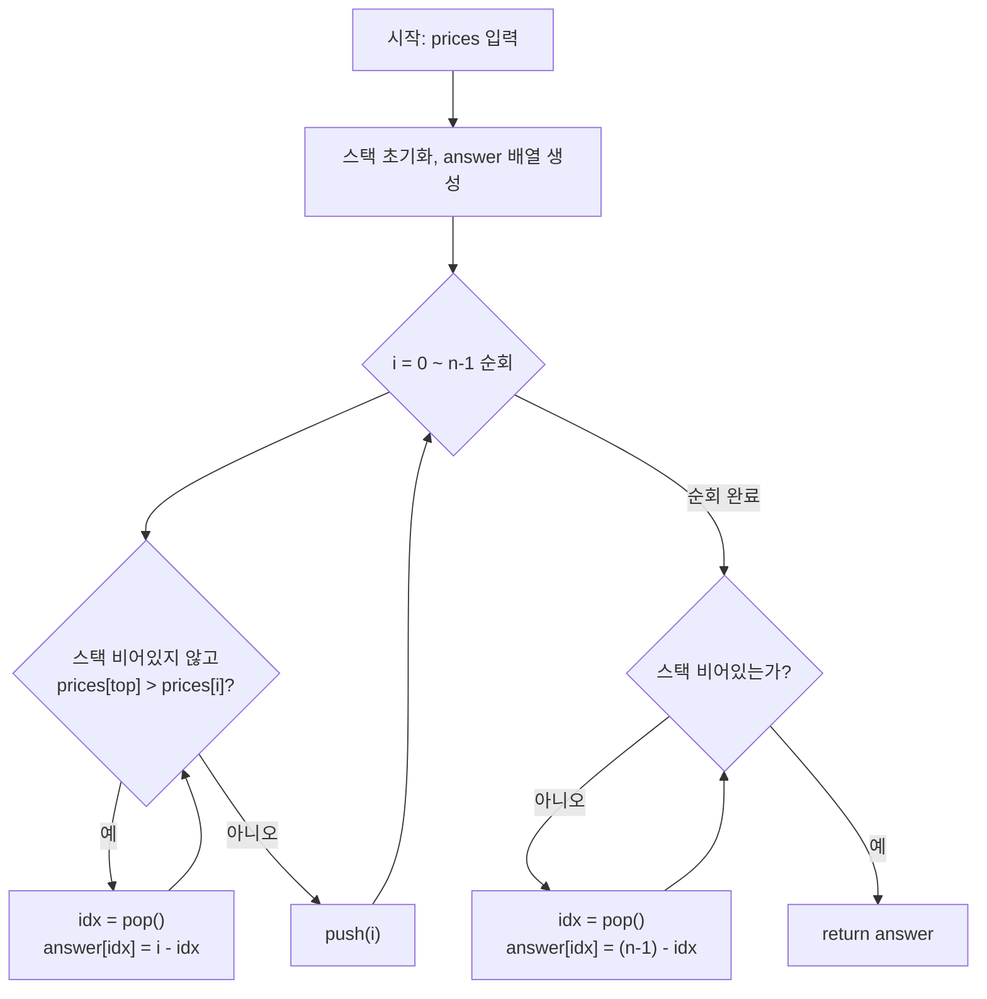

# 프로그래머스 42584 — 주식가격

> **난이도**: Level 2  
> **분류**: 스택(Stack), 큐(Queue)  
> **출처**: [프로그래머스 42584](https://school.programmers.co.kr/learn/courses/30/lessons/42584)

---

## 1. 문제 분석

### 문제 요약

초 단위로 기록된 주식 가격 배열 `prices`가 주어진다. 각 초의 가격이 **떨어지지 않은 기간(초)**를 구해서 배열로 반환한다.

예: `prices = [1, 2, 3, 2, 3]` → `[4, 3, 1, 1, 0]`

- `prices[0] = 1`: 이후 1→2→3→2→3으로 끝까지 안 떨어짐 → **4초**
- `prices[2] = 3`: 다음 초에 바로 2로 떨어짐 → **1초** (떨어지는 순간도 1초로 카운트)

### 제약 조건

- 1 ≤ prices.length ≤ 100,000
- 1 ≤ prices[i] ≤ 10,000

### 시간 복잡도 상한

N ≤ 100,000이므로 O(N²) = 10^10으로 **시간 초과**. O(N) 이하가 필요하다.

---

## 2. 풀이 전략

### 핵심 아이디어: 모노토닉 스택 (단조 스택)

스택에 **인덱스**를 저장하며, 스택 안의 가격이 단조 증가 상태를 유지한다.

- 현재 가격 `prices[i]`가 스택 top의 가격보다 **낮으면** → 가격이 떨어진 시점이므로 pop하고 기간을 계산한다.
- 현재 가격이 top보다 **크거나 같으면** → 아직 떨어지지 않았으므로 push한다.
- 루프 종료 후 스택에 남은 인덱스들은 **끝까지 가격이 떨어지지 않은 것**이므로 `(n-1) - idx`가 기간이 된다.

### 왜 스택으로 충분한가

각 인덱스는 최대 1번 push, 1번 pop되므로 전체 O(N). `while` 루프가 있지만 총 pop 횟수가 N을 넘지 않는다 (amortized O(1)).

"가격이 떨어지는 순간을 가장 빠르게 감지하려면 현재 가격보다 높았던 최근 시점들만 확인하면 된다" → 이것이 모노토닉 스택의 본질이다.

---

## 3. Mermaid 다이어그램



---

## 4. 솔루션 코드 (Java)

```java
import java.util.ArrayDeque;
import java.util.Deque;

class Solution {
    public int[] solution(int[] prices) {
        int n = prices.length;
        int[] answer = new int[n];
        // 스택에는 '아직 가격이 떨어지지 않은' 시점의 인덱스를 저장
        Deque<Integer> stack = new ArrayDeque<>();

        for (int i = 0; i < n; i++) {
            // 현재 가격이 스택 top 시점의 가격보다 낮으면 → 가격이 떨어진 시점
            while (!stack.isEmpty() && prices[stack.peek()] > prices[i]) {
                int idx = stack.pop();
                answer[idx] = i - idx;  // 가격이 유지된 기간
            }
            stack.push(i);
        }

        // 스택에 남은 인덱스는 끝까지 가격이 떨어지지 않은 것
        while (!stack.isEmpty()) {
            int idx = stack.pop();
            answer[idx] = (n - 1) - idx;
        }

        return answer;
    }
}
```

---

## 5. 단계별 코드 해설

### 동작 흐름 — 입력 `[1, 2, 3, 2, 3]`

| i | prices[i] | 비교 (top) | 동작 | 스택 (인덱스) | answer |
|---|---|---|---|---|---|
| 0 | 1 | (empty) | push 0 | [0] | [0,0,0,0,0] |
| 1 | 2 | prices[0]=1 ≤ 2 | push 1 | [0,1] | [0,0,0,0,0] |
| 2 | 3 | prices[1]=2 ≤ 3 | push 2 | [0,1,2] | [0,0,0,0,0] |
| 3 | 2 | prices[2]=3 > 2 | **pop 2**, answer[2]=3-2=**1** | [0,1] | [0,0,1,0,0] |
|   |   | prices[1]=2 ≤ 2 | push 3 | [0,1,3] | |
| 4 | 3 | prices[3]=2 ≤ 3 | push 4 | [0,1,3,4] | [0,0,1,0,0] |

루프 종료 후 스택 처리 (역순 pop):

| pop | idx | answer[idx] = (5-1) - idx |
|---|---|---|
| 4 | 4 | 4-4 = **0** |
| 3 | 3 | 4-3 = **1** |
| 1 | 1 | 4-1 = **3** |
| 0 | 0 | 4-0 = **4** |

최종 결과: `[4, 3, 1, 1, 0]` ✓

---

## 6. 엣지 케이스 분석

| 관점 | 케이스 | 처리 |
|---|---|---|
| 단조 증가 | `[1, 2, 3, 4]` | 스택에 pop이 한 번도 안 일어남, 후처리에서 모두 계산 → `[3, 2, 1, 0]` |
| 단조 감소 | `[4, 3, 2, 1]` | 매 step마다 즉시 pop → `[1, 1, 1, 0]` |
| 모든 값 동일 | `[2, 2, 2]` | 가격이 "떨어지지" 않으므로 후처리 → `[2, 1, 0]` |
| 마지막 원소 | 항상 answer=0 | 이후 시점이 없으므로 0초, 후처리에서 `(n-1)-(n-1)=0` |
| 최대 길이 | N=100,000 | O(N) amortized, 문제없음 |

> **주의**: 가격이 "떨어지는 순간"도 기간에 포함된다. `prices[2]=3 → prices[3]=2`처럼 바로 다음 초에 떨어져도 1초로 카운트.

---

## 7. 복잡도 분석

| 풀이 | 시간 복잡도 | 공간 복잡도 | 비고 |
|---|---|---|---|
| 모노토닉 스택 (본 풀이) | O(N) | O(N) | 각 인덱스 최대 1 push, 1 pop |
| 완전 탐색 | O(N²) | O(1) | N=100,000에서 시간 초과 |

### Amortized O(N) 증명
`while` 루프 내부의 pop 연산이 반복문처럼 보여 O(N²)으로 오해할 수 있다. 하지만 인덱스 하나는 **정확히 1번 push, 최대 1번 pop**되므로 전체 push+pop 횟수는 2N을 넘지 않는다 → amortized O(1)/step → O(N) total.

---

## 8. 대안 풀이 — 완전 탐색 O(N²)

N ≤ 100,000이므로 프로덕션에서는 시간 초과지만, 로직 이해용으로 참고.

```java
class Solution {
    public int[] solution(int[] prices) {
        int n = prices.length;
        int[] answer = new int[n];
        for (int i = 0; i < n; i++) {
            for (int j = i + 1; j < n; j++) {
                answer[i]++;
                if (prices[i] > prices[j]) break;  // 떨어지는 순간 포함 후 종료
            }
        }
        return answer;
    }
}
```

| 풀이 | 시간 복잡도 | 공간 복잡도 | 비고 |
|---|---|---|---|
| 완전 탐색 | O(N²) | O(1) | 소규모 테스트에서만 가능 |
