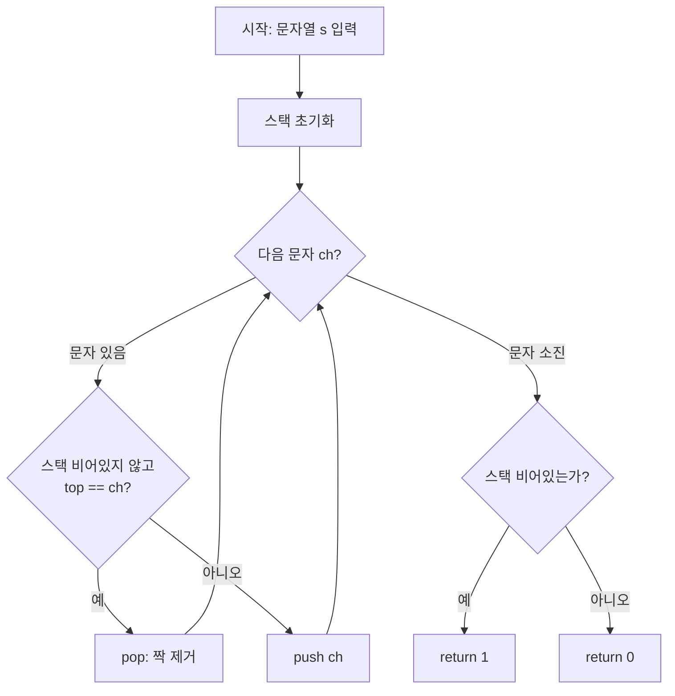

# 프로그래머스 12973 — 짝지어 제거하기

> **난이도**: Level 1  
> **분류**: 스택(Stack), 문자열  
> **출처**: [프로그래머스 12973](https://school.programmers.co.kr/learn/courses/30/lessons/12973)

---

## 1. 문제 분석

### 문제 요약

알파벳 소문자로 된 문자열 `s`에서 **인접한 같은 두 문자**를 찾아 제거하는 과정을 반복한다. 문자열이 모두 제거되면 성공(1), 아니면 실패(0)를 반환한다.

### 제약 조건

- 1 ≤ |s| ≤ 1,000,000

### 시간 복잡도 상한

입력 길이가 최대 10^6이므로 **O(N)** 풀이가 필요하다. 매번 문자열을 잘라 이어붙이는 O(N²) 시뮬레이션은 시간 초과.

---

## 2. 풀이 전략

### 핵심 아이디어: 스택

문자를 왼쪽부터 하나씩 보면서 스택에 쌓는데, **새로 넣으려는 문자가 스택 top과 같으면 top을 pop**한다. 이 과정을 끝까지 반복한 뒤 스택이 비어 있으면 모두 짝지어 제거된 것이다.

### 왜 스택으로 충분한가 (원리)

"짝지어 제거"는 어느 위치부터 제거하든 **최종 결과가 동일**하다. 이유는 다음과 같다:

- 인접한 쌍 `XX`를 제거하면, 그 좌우 문자가 새로 인접하게 된다. 즉 제거는 순전히 **로컬 연산**이고, 멀리 떨어진 다른 쌍의 제거 가능성에 영향을 주지 않는다.
- 따라서 "왼쪽부터 가능한 즉시 제거"하는 그리디 전략이 최적이고, 이는 곧 **현재까지 살아남은 접두사의 마지막 글자만 기억하면 된다**는 뜻 → 스택 top 한 개만 비교하면 충분.

이것이 이 문제가 스택 문제인 근본 이유다. "현재까지 남아있는 문자열의 끝"을 O(1)로 관리할 수 있는 자료구조가 곧 스택이다.

---

## 3. Mermaid 다이어그램



---

## 4. 솔루션 코드 (Java)

```java
import java.util.ArrayDeque;
import java.util.Deque;

class Solution {
    public int solution(String s) {
        // ArrayDeque를 스택 용도로 사용 (Stack 클래스보다 빠름)
        Deque<Character> stack = new ArrayDeque<>();
        for (int i = 0; i < s.length(); i++) {
            char ch = s.charAt(i);
            // top이 현재 문자와 같으면 pop (짝 제거)
            if (!stack.isEmpty() && stack.peek() == ch) {
                stack.pop();
            } else {
                // 다르면 push
                stack.push(ch);
            }
        }
        // 최종적으로 비어있으면 성공
        return stack.isEmpty() ? 1 : 0;
    }
}
```

---

## 5. 단계별 코드 해설

### 동작 흐름 — 입력 `"baabaa"`

| step | 읽은 문자 | 비교 | 동작 | 스택 |
|---|---|---|---|---|
| 1 | b | (empty) | push | [b] |
| 2 | a | top=b ≠ a | push | [b, a] |
| 3 | a | top=a = a | **pop** | [b] |
| 4 | b | top=b = b | **pop** | [ ] |
| 5 | a | (empty) | push | [a] |
| 6 | a | top=a = a | **pop** | [ ] |

최종 스택이 비어있음 → `return 1` (성공)

1. **빈 스택 준비**: 지금까지 "짝을 만나지 못하고 살아남은" 문자들을 보관.
2. **한 글자씩 순회**: 왼쪽부터 오른쪽으로 현재 문자 `ch`를 본다.
3. **비교 분기**:
   - 스택이 비어있지 않고 top이 `ch`와 같다면 → 방금 본 문자와 스택의 top이 **인접한 같은 쌍**을 이루므로 pop한다 (둘 다 제거됨).
   - 그렇지 않다면 → 현재 문자를 push하여 "다음 짝 후보"로 남긴다.
4. **종료 판정**: 순회가 끝나고 스택이 비어있다면 모든 문자가 짝지어 사라진 것이므로 `1`, 아니면 `0`.

---

## 6. 엣지 케이스 분석

| 관점 | 케이스 | 솔루션 처리 |
|---|---|---|
| 최솟값 경계 | `|s| = 1` (예: `"a"`) | push만 되고 스택 크기 1 → `0` 반환. 홀수 길이는 항상 실패하므로 올바름. |
| 최댓값 경계 | `|s| = 10^6` | O(N) 단일 패스, 스택 push/pop 각 O(1)이므로 문제없음. |
| 모든 문자 동일 | `"aaaa"` | a push → a와 같아 pop → a push → pop → 빈 스택 → `1`. |
| 홀수 길이 | `"aba"` | 전체 길이가 홀수면 절대 모두 제거 불가 → 스택에 최소 1개 남음 → `0`. |
| 짝이 아예 없음 | `"abcd"` | 모두 push, 스택 크기 4 → `0`. |
| 중첩 쌍 | `"abba"` | a,b push → b pop → a pop → 빈 스택 → `1`. **스택이기 때문에 자연스럽게 안쪽부터 제거된다**는 점이 핵심. |
| 실패 케이스 | `"cdcd"` | c,d,c,d 모두 push → 스택 크기 4 → `0`. |

---

## 7. 복잡도 분석

| 풀이 | 시간 복잡도 | 공간 복잡도 | 비고 |
|---|---|---|---|
| 스택 (본 풀이) | O(N) | O(N) | 각 문자는 최대 1회 push, 1회 pop. 최적. |
| 문자열 반복 치환 | O(N²) 이상 | O(N) | `s.replace("aa","")` 반복 — 10^6에서 시간 초과. |

---

## 8. 대안 풀이 — 포인터 + 인플레이스 배열

스택을 **새로 할당하지 않고** 입력 배열 자체를 스택으로 재활용하는 기법. 본질은 동일하지만 메모리 할당/캐시 효율이 조금 더 좋다.

**원리**: 인덱스 `top`을 스택의 크기로 본다. `arr[top-1]`이 현재 top이고, 같으면 `top--`, 다르면 `arr[top++] = ch`. 입력 배열의 앞쪽이 곧 스택이 되고, 뒤쪽은 아직 읽지 않은 영역이므로 충돌하지 않는다 (`top ≤ i`는 루프 불변식으로 항상 성립).

```java
class Solution {
    public int solution(String s) {
        char[] arr = s.toCharArray();
        int top = 0;  // 스택의 유효 크기 (arr[0..top-1]이 스택 내용)
        for (int i = 0; i < arr.length; i++) {
            // top이 현재 문자와 같으면 pop (top 감소)
            if (top > 0 && arr[top - 1] == arr[i]) {
                top--;
            } else {
                // 다르면 arr[top]에 덮어쓰고 top 증가
                arr[top++] = arr[i];
            }
        }
        return top == 0 ? 1 : 0;
    }
}
```

| 풀이 | 시간 복잡도 | 공간 복잡도 | 비고 |
|---|---|---|---|
| 인플레이스 포인터 | O(N) | O(N) (입력 배열 변환분만) | 별도 스택 객체 없음, 상수 계수 우수 |
