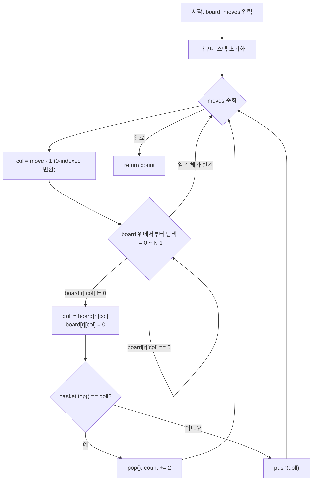

# 프로그래머스 64061 — 크레인 인형뽑기 게임

> **난이도**: Level 1  
> **분류**: 스택(Stack)  
> **출처**: [프로그래머스 64061](https://school.programmers.co.kr/learn/courses/30/lessons/64061)

---

## 1. 문제 분석

### 문제 요약

N×N 격자 `board`에 인형들이 채워져 있다 (0은 빈칸). `moves` 배열의 각 값은 크레인이 인형을 뽑을 열(1-indexed)을 나타낸다.

- 크레인은 해당 열에서 **가장 위에 있는 인형** 하나를 뽑아 바구니에 넣는다.
- 바구니에 **같은 인형이 연속으로 2개 쌓이면 터뜨려 제거**한다.
- 제거된 인형의 총 개수를 반환한다.

예:
```
board = [[0,0,0,0,0],
         [0,0,1,0,3],
         [0,2,5,0,1],
         [4,2,4,4,2],
         [3,5,1,3,1]]
moves = [1,5,3,5,1,2,1,4]  →  4
```

### 제약 조건

- 1 ≤ board.length ≤ 30, board는 N×N
- 1 ≤ moves.length ≤ 1,000
- board[i][j]: 0 이상 100 이하

### 시간 복잡도 상한

moves 길이 M, 보드 크기 N이면 O(M × N). 최대 1,000 × 30 = 30,000으로 여유롭다.

---

## 2. 풀이 전략

### 핵심 아이디어: 스택 (짝지어 제거)

바구니를 **스택**으로 관리한다. 인형을 뽑아 스택에 push할 때 top과 같은 인형이면 pop(제거)한다.

이 구조는 "짝지어 제거하기(12973)" 문제와 본질이 동일하다:

| | 짝지어 제거하기 | 크레인 인형뽑기 |
|---|---|---|
| 스택 push 대상 | 문자열의 각 문자 | 크레인으로 뽑은 인형 |
| pop 조건 | top == 현재 문자 | top == 현재 인형 |
| 정답 | 스택 비어있는지 여부 | 제거된 인형 총 개수 |

### 알고리즘 요약

```
1. 각 move에 대해:
   a. 해당 열(col-1)에서 위에서부터 첫 번째 비어있지 않은 셀 탐색
   b. 인형 뽑기 (board[r][c] = 0으로 마킹)
   c. 바구니 스택 top과 같으면 pop, count += 2
      다르면 push
2. count 반환
```

---

## 3. Mermaid 다이어그램



---

## 4. 솔루션 코드 (Java)

```java
import java.util.ArrayDeque;
import java.util.Deque;

class Solution {
    public int solution(int[][] board, int[] moves) {
        int n = board.length;
        int count = 0;
        // 바구니: 뽑아서 쌓이는 인형들
        Deque<Integer> basket = new ArrayDeque<>();

        for (int col : moves) {
            int c = col - 1; // 1-indexed → 0-indexed 변환
            // 해당 열의 가장 위에 있는 인형 탐색
            for (int r = 0; r < n; r++) {
                if (board[r][c] != 0) {
                    int doll = board[r][c];
                    board[r][c] = 0; // 인형 뽑기
                    // 바구니 top과 같은 인형이면 짝 제거
                    if (!basket.isEmpty() && basket.peek() == doll) {
                        basket.pop();
                        count += 2;
                    } else {
                        basket.push(doll);
                    }
                    break; // 하나만 뽑고 다음 move로
                }
            }
        }

        return count;
    }
}
```

---

## 5. 단계별 코드 해설

### 동작 흐름 — 예제 트레이스

`moves = [1, 5, 3, 5, 1, 2, 1, 4]`

| move | 열(0-idx) | 뽑은 인형 | basket top | 동작 | basket | count |
|---|---|---|---|---|---|---|
| 1 | 0 | 4 | (empty) | push | [4] | 0 |
| 5 | 4 | 3 | 4 | push | [4, 3] | 0 |
| 3 | 2 | 1 | 3 | push | [4, 3, 1] | 0 |
| 5 | 4 | 1 | 1 | **pop** | [4, 3] | 2 |
| 1 | 0 | 3 | 3 | **pop** | [4] | 4 |
| 2 | 1 | 2 | 4 | push | [4, 2] | 4 |
| 1 | 0 | (빈칸) | — | skip | [4, 2] | 4 |
| 4 | 3 | 4 | 2 | push | [4, 2, 4] | 4 |

최종 count = **4** ✓

---

## 6. 엣지 케이스 분석

| 관점 | 케이스 | 처리 |
|---|---|---|
| 빈 열 뽑기 | 해당 열이 모두 0 | for 루프가 끝까지 돌아도 break 없이 종료, 아무 동작 안 함 |
| 연쇄 제거 | `[1,1,2,2]` 순서로 push 시 | 1,1 제거 → 스택 비어있어도 2,2가 이어서 제거 가능. 스택 구조상 자동 처리 |
| 모든 인형 동일 | 짝수 번 뽑으면 전부 제거 | top 비교 로직으로 자연스럽게 처리 |
| moves 모두 빈 열 | count = 0 | 인형을 뽑지 못하므로 항상 0 반환 |

---

## 7. 복잡도 분석

| 항목 | 복잡도 | 비고 |
|---|---|---|
| 시간 | O(M × N) | M=moves 길이, N=보드 크기. 최대 30,000 |
| 공간 | O(N²) | board 입력 그대로 사용 (별도 복사 없음). 바구니 스택 최대 M |

> board를 직접 수정(`board[r][c] = 0`)하므로 열 탐색이 자동으로 다음 인형을 가리키게 된다. 별도의 "현재 높이" 배열이 필요 없다.

---

## 8. 대안 풀이 — 열별 스택 사전 구축 방식

### 아이디어

move마다 board를 위에서부터 선형 탐색하는 대신, **처음에 각 열(lane)을 스택으로 변환**해두고 이후 시뮬레이션은 O(1) pop으로 처리한다.

```
전처리: 각 열을 아래→위 순으로 스캔하여 Stack에 push
        → pop하면 위쪽(가장 먼저 뽑힐) 인형이 나옴
시뮬레이션: lanes[move-1].pop() → 바구니 짝 비교
```

### `new Stack[board[0].length]`가 맞는 이유

- `board[0].length` = 열의 수(columns) = lanes 배열이 필요한 크기
- board는 N×N이므로 `board.length`와 값은 같지만, **의미상 "열의 개수"를 나타낼 때는 `board[0].length`가 더 명확**하다.

### 주의: `break`의 전제 조건

lanes 구축 시 0(빈칸)을 만나면 바로 `break`한다. 이는 **빈칸이 항상 열의 위쪽에 몰려 있다는 전제**가 있어야 안전하다. 이 문제의 테스트케이스는 인형이 아래부터 채워져 있으므로 문제없다. 중간에 빈칸이 있는 열은 위쪽 인형을 놓치게 된다.

### 솔루션 코드 (Java)

```java
import java.util.Stack;

class SolutionV2 {
    public int solution(int[][] board, int[] moves) {
        Stack<Integer>[] lanes = new Stack[board[0].length];
        for (int i = 0; i < lanes.length; i++) {
            lanes[i] = new Stack<>();
        }

        for (int j = 0; j < board[0].length; j++) {
            for (int i = board.length - 1; i >= 0; i--) {
                if (board[i][j] > 0) {
                    lanes[j].push(board[i][j]);
                } else {
                    break;
                }
            }
        }

        Stack<Integer> bucket = new Stack<>();
        int answer = 0;

        for (int move : moves) {
            if (!lanes[move - 1].isEmpty()) {
                int doll = lanes[move - 1].pop();
                if (!bucket.isEmpty() && bucket.peek() == doll) {
                    bucket.pop();
                    answer += 2;
                } else {
                    bucket.push(doll);
                }
            }
        }

        return answer;
    }
}
```

### 두 방식 비교

| | 기존 방식 (board 직접 탐색) | lanes 사전 구축 방식 |
|---|---|---|
| 전처리 | O(1) | O(N²) |
| 각 move 처리 | O(N) — board 위에서 탐색 | O(1) — stack pop |
| 전체 시간 | O(M × N) | O(N² + M) |
| 공간 | O(M) — basket만 | O(N²) — 모든 lanes 스택 |
| board 수정 여부 | 수정함 (`board[r][c] = 0`) | 수정 안 함 |

> N ≤ 30, M ≤ 1,000 제약에서는 두 방식 모두 충분히 빠르다. lanes 방식은 board를 보존해야 할 때 유리하다.
