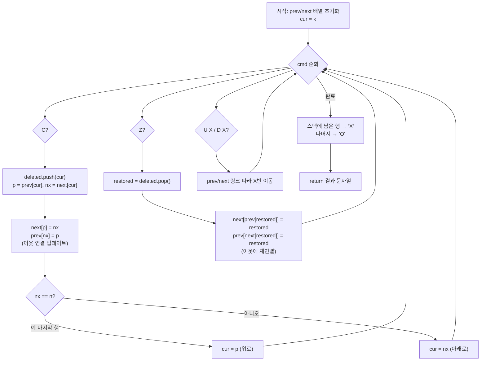

# 프로그래머스 81303 — 표 편집

> **난이도**: Level 3
> **분류**: 스택(Stack) + 이중 연결 리스트
> **출처**: [프로그래머스 81303](https://school.programmers.co.kr/learn/courses/30/lessons/81303)

---

## 1. 문제 분석

### 문제 요약

N개의 행으로 구성된 표에서 커서가 k번 행에 있을 때, 명령어를 순서대로 실행한다.

| 명령 | 동작 |
|---|---|
| `U X` | 커서를 위로 X칸 이동 |
| `D X` | 커서를 아래로 X칸 이동 |
| `C` | 현재 행 삭제. 아래 행이 있으면 아래로, 없으면 위로 커서 이동 |
| `Z` | 가장 최근 삭제한 행을 원래 위치에 복원 (커서 불변) |

모든 명령 실행 후, 각 행의 존재 여부를 `'O'`/`'X'` 문자열로 반환한다.

### 제약 조건

- 5 ≤ N ≤ 1,000,000
- 0 ≤ k < N
- 1 ≤ cmd.length ≤ 200,000
- **모든 X 값의 합 ≤ 1,000,000** (커서 총 이동량 보장)

### 왜 단순 배열로 풀면 안 되나?

`C` 실행 시 배열에서 행을 지우면 나머지를 한 칸씩 당겨야 하고, `Z` 실행 시 다시 삽입하면 한 칸씩 밀어야 한다 → **O(N) per 연산**. N과 cmd 수가 크면 시간 초과.

---

## 2. 풀이 전략

### 핵심 자료구조: 이중 연결 리스트 + 스택

**이중 연결 리스트** (`prev[]`, `next[]` 배열)로 행 간 연결을 관리한다.

- `prev[i]` = i번 행의 바로 위 행 번호 (`-1`이면 맨 위)
- `next[i]` = i번 행의 바로 아래 행 번호 (`n`이면 맨 아래)

행을 삭제해도 실제 배열에서 지우지 않고, 이웃 노드의 포인터만 업데이트한다 → **C, Z 모두 O(1)**.

**스택**에 삭제된 행 번호를 쌓는다. `Z`는 스택 top을 꺼내 복원한다.

### 알고리즘 요약

```
1. prev[i] = i-1, next[i] = i+1 으로 초기화
2. 각 명령어 처리:
   - U X / D X: prev/next 링크를 따라 X번 이동
   - C: 현재 행을 스택에 push, 이웃 연결 업데이트, 커서 이동
   - Z: 스택에서 pop, 저장된 prev/next로 이웃에 재연결
3. 최종 스택에 남은 행 번호 = 삭제 상태 → 'X', 나머지 → 'O'
```

---

## 3. Mermaid 다이어그램



---

## 4. 솔루션 코드 (Java)

```java
import java.util.Stack;

class Solution {
    public String solution(int n, int k, String[] cmd) {
        // 이중 연결 리스트: prev[i] = 위쪽 행, next[i] = 아래쪽 행
        // -1 = 이전 행 없음(경계), n = 다음 행 없음(경계)
        int[] prev = new int[n];
        int[] next = new int[n];
        for (int i = 0; i < n; i++) {
            prev[i] = i - 1;
            next[i] = i + 1;
        }

        int cur = k;
        Stack<Integer> deleted = new Stack<>();

        for (String c : cmd) {
            if (c.equals("C")) {
                deleted.push(cur);
                int p = prev[cur], nx = next[cur];
                if (p != -1) next[p] = nx;     // 위쪽 이웃의 next를 아래쪽 이웃으로
                if (nx != n) prev[nx] = p;      // 아래쪽 이웃의 prev를 위쪽 이웃으로
                cur = (nx == n) ? p : nx;       // 마지막 행이었으면 위로, 아니면 아래로
            } else if (c.equals("Z")) {
                int restored = deleted.pop();
                int p = prev[restored], nx = next[restored];
                if (p != -1) next[p] = restored;  // 위쪽 이웃의 next 복원
                if (nx != n) prev[nx] = restored; // 아래쪽 이웃의 prev 복원
            } else {
                char dir = c.charAt(0);
                int x = Integer.parseInt(c.substring(2));
                if (dir == 'U') {
                    for (int i = 0; i < x; i++) cur = prev[cur];
                } else {
                    for (int i = 0; i < x; i++) cur = next[cur];
                }
            }
        }

        // 스택에 남은 행 = 최종 삭제 상태인 행
        boolean[] isDeleted = new boolean[n];
        while (!deleted.isEmpty()) isDeleted[deleted.pop()] = true;

        StringBuilder sb = new StringBuilder();
        for (int i = 0; i < n; i++) sb.append(isDeleted[i] ? 'X' : 'O');
        return sb.toString();
    }
}
```

---

## 5. 단계별 코드 해설

### C 연산 — 삭제

```
삭제 전:  ... ← [p] ↔ [cur] ↔ [nx] → ...
삭제 후:  ... ← [p] ↔ [nx] → ...
           cur는 스택에 저장, 실제 데이터는 유지
```

- `next[p] = nx`: p의 아래를 cur 건너뛰어 nx로
- `prev[nx] = p`: nx의 위를 cur 건너뛰어 p로
- cur 자신의 prev/next는 건드리지 않음 → Z에서 복원 시 그대로 사용

### Z 연산 — 복원

```
복원 전:  ... ← [p] ↔ [nx] → ...
복원 후:  ... ← [p] ↔ [restored] ↔ [nx] → ...
```

- restored의 prev/next는 삭제 시 그대로 남아있으므로 p, nx 바로 읽을 수 있음
- `next[p] = restored`, `prev[nx] = restored`로 재삽입

### 예제 트레이스 (n=8, k=2)

`cmd = ["D 2","C","U 3","C","D 4","C","U 2","Z","Z"]`

| 명령 | cur | 표 (존재하는 행) | deleted 스택 |
|---|---|---|---|
| 초기 | 2 | 0 1 2 3 4 5 6 7 | [] |
| D 2 | 4 | 0 1 2 3 4 5 6 7 | [] |
| C | 5 | 0 1 2 3 **~~4~~** 5 6 7 | [4] |
| U 3 | 1 | 0 1 2 3 5 6 7 | [4] |
| C | 2 | 0 **~~1~~** 2 3 5 6 7 | [4, 1] |
| D 4 | 7 | 0 2 3 5 6 7 | [4, 1] |
| C | 6 | 0 2 3 5 6 **~~7~~** | [4, 1, 7] |
| U 2 | 3 | 0 2 3 5 6 | [4, 1, 7] |
| Z | 3 | 0 2 3 5 6 7 (복원) | [4, 1] |
| Z | 3 | 0 1 2 3 5 6 7 (복원) | [4] |

최종 삭제: 4번 행만 → `OOOOXOOO` ✓

---

## 6. 엣지 케이스 분석

| 관점 | 케이스 | 처리 |
|---|---|---|
| 마지막 행 삭제 | next[cur] == n | cur = prev[cur] (위로 이동) |
| 첫 번째 행 삭제 | prev[cur] == -1 | next[p] 조건부로 skip |
| C 직후 Z | 바로 복원 | 스택 top이 방금 삭제한 행, 정상 복원 |
| 연속 Z | 여러 번 복원 | 스택 LIFO 순서로 역순 복원, 올바른 순서 보장 |

---

## 7. 복잡도 분석

| 항목 | 복잡도 | 비고 |
|---|---|---|
| 시간 | O(N + sum(X) + \|cmd\|) | sum(X) ≤ 1,000,000 보장, C/Z는 O(1) |
| 공간 | O(N) | prev[], next[], isDeleted[] 각 N |

> 이중 연결 리스트의 핵심 이점: 삭제/복원 시 실제 데이터를 이동하지 않고 포인터(prev/next)만 수정하므로 O(1). 삭제한 노드의 prev/next를 그대로 유지하기 때문에 Z 복원도 별도 정보 없이 바로 처리 가능.
